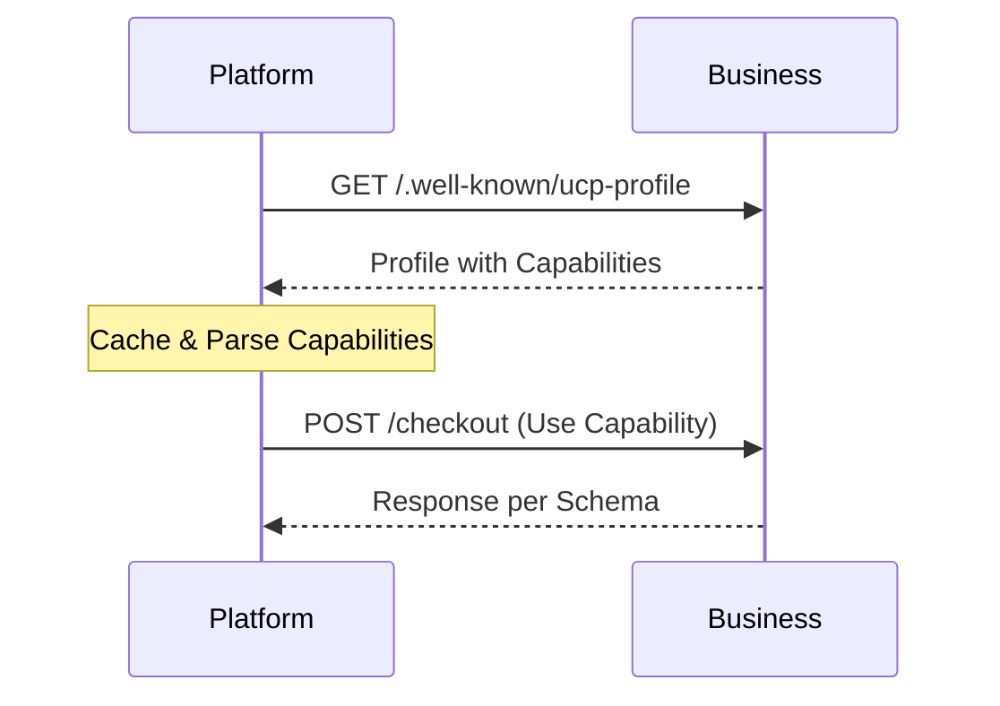
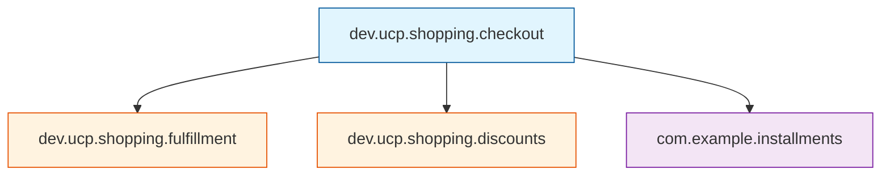
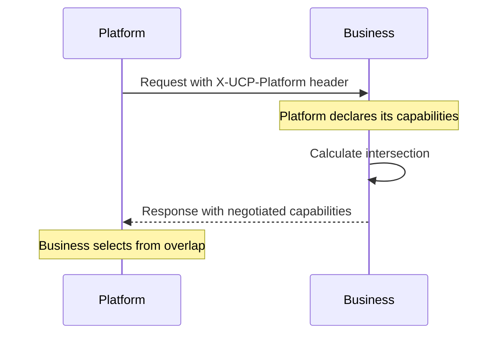

# Core Concepts

UCP is built on a **composable architecture** with three foundational elements:

1. **Profiles** - Business/Platform capability declarations
2. **Capabilities** - Modular commerce features
3. **Extensions** - Optional enhancements to capabilities


---

## 1. Business Profiles

A **Profile** is a standardized declaration of what a business supports. It's hosted at a well-known URL for discovery.

### Profile Discovery

Platforms discover business capabilities by fetching:

```
GET https://example.com/.well-known/ucp-profile
```

### Profile Structure

```json
{
    "name": "Example Store",
    "version": "2026-01-11",
    "services": [
        {
            "namespace": "dev.ucp.shopping",
            "capabilities": [
                {
                    "name": "dev.ucp.shopping.checkout",
                    "version": "2026-01-11",
                    "spec": "https://ucp.dev/specification/checkout",
                    "schema": "https://ucp.dev/schemas/shopping/checkout.json",
                    "endpoint": "https://api.example.com/ucp/checkout"
                },
                {
                    "name": "dev.ucp.shopping.order",
                    "version": "2026-01-11",
                    "spec": "https://ucp.dev/specification/order",
                    "endpoint": "https://api.example.com/ucp/order"
                }
            ],
            "extensions": [
                {
                    "name": "dev.ucp.shopping.fulfillment",
                    "extends": "dev.ucp.shopping.checkout",
                    "version": "2026-01-11"
                }
            ]
        }
    ],
    "transports": ["rest", "mcp"],
    "authentication": {
        "oauth2": {
            "authorization_endpoint": "https://example.com/oauth/authorize",
            "token_endpoint": "https://example.com/oauth/token"
        }
    }
}
```

### Key Profile Properties

| Property | Description |
|----------|-------------|
| `name` | Business display name |
| `version` | Profile version (date format) |
| `services` | List of service namespaces |
| `capabilities` | Features within each service |
| `extensions` | Optional capability enhancements |
| `transports` | Supported communication methods |
| `authentication` | OAuth 2.0 endpoints |

---

## 2. Capabilities

A **Capability** is a modular feature that businesses implement. Each capability:

- Has a unique **name** (reverse-DNS format)
- Declares its **endpoint** and **schema**
- Is **independently versioned**

### Standard Capabilities

| Capability | Namespace | Purpose |
|------------|-----------|---------|
| **Checkout** | `dev.ucp.shopping.checkout` | Cart, tax, session management |
| **Identity Linking** | `dev.ucp.identity.linking` | OAuth 2.0 user authorization |
| **Order** | `dev.ucp.shopping.order` | Order lifecycle webhooks |
| **Payment Token** | `dev.ucp.payment.token` | Secure credential exchange |

### Capability Definition

```json
{
    "name": "dev.ucp.shopping.checkout",
    "version": "2026-01-11",
    "spec": "https://ucp.dev/specification/checkout",
    "schema": "https://ucp.dev/schemas/shopping/checkout.json",
    "endpoint": "https://api.example.com/ucp/checkout"
}
```

### Capability Lifecycle



---

## 3. Extensions

**Extensions** are optional modules that augment a parent capability without changing its core schema.

### Extension Structure

```json
{
    "name": "dev.ucp.shopping.fulfillment",
    "version": "2026-01-11",
    "spec": "https://ucp.dev/specification/fulfillment",
    "schema": "https://ucp.dev/schemas/shopping/fulfillment.json",
    "extends": "dev.ucp.shopping.checkout"
}
```

### Extension Types

| Type | Example | Description |
|------|---------|-------------|
| **Official** | `dev.ucp.shopping.fulfillment` | Standard UCP extensions |
| **Vendor** | `com.shopify.subscriptions` | Platform-specific features |
| **Custom** | `org.example.loyalty` | Business-specific modules |

### Extension Inheritance



---

## 4. Discovery & Negotiation

UCP uses a **server-selects** architecture where the business chooses from the intersection of both parties' capabilities.

### Negotiation Flow



### Platform Advertisement

Platforms advertise capabilities via HTTP header:

```http
POST /checkout HTTP/1.1
Host: api.example.com
X-UCP-Platform: {"capabilities":["checkout","fulfillment"],"version":"2026-01-11"}
```

### Caching

Both profiles can be cached:

- **Platform caches**: Business profile for discovery
- **Business caches**: Platform capabilities for negotiation

---

## 5. Schema Composition

UCP uses JSON Schema with composition for flexibility.

### Base + Extension Pattern

```json
{
    "allOf": [
        { "$ref": "https://ucp.dev/schemas/shopping/checkout.json" },
        { "$ref": "https://ucp.dev/schemas/shopping/fulfillment.json" }
    ]
}
```

### Versioning

- **Date-based versions**: `2026-01-11`
- **Independent versioning**: Each capability/extension has its own version
- **Backwards compatible**: Minor changes don't break clients

---

## Summary

| Concept | Purpose | Example |
|---------|---------|---------|
| **Profile** | Declare capabilities | `/.well-known/ucp-profile` |
| **Capability** | Core feature | `dev.ucp.shopping.checkout` |
| **Extension** | Optional enhancement | `dev.ucp.shopping.fulfillment` |
| **Negotiation** | Agree on features | Server-selects from intersection |

> [!TIP]
> Start with implementing the **Checkout** capability. It's the most common and provides the foundation for commerce flows.
