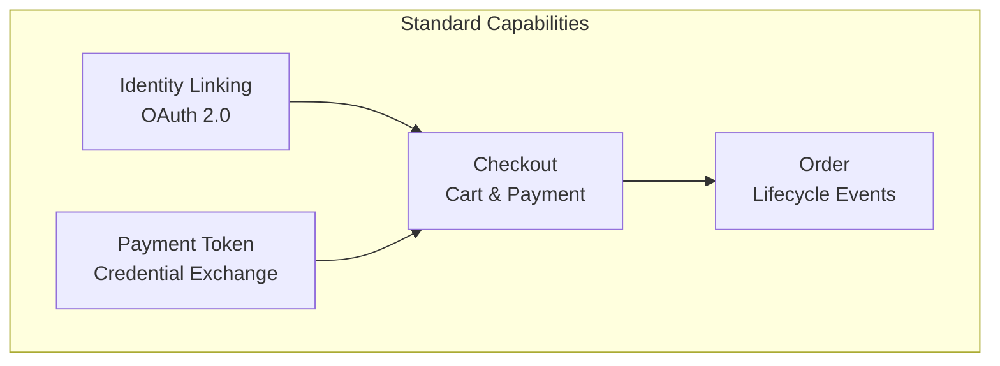
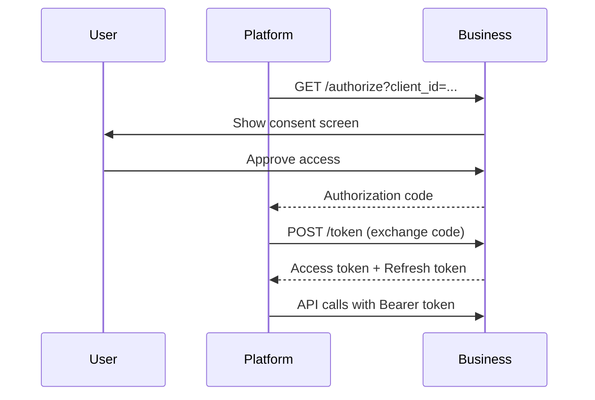
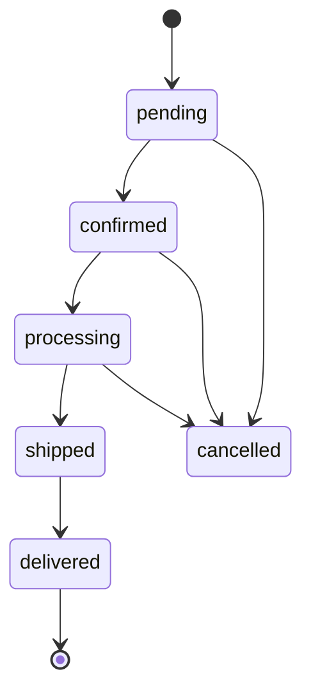
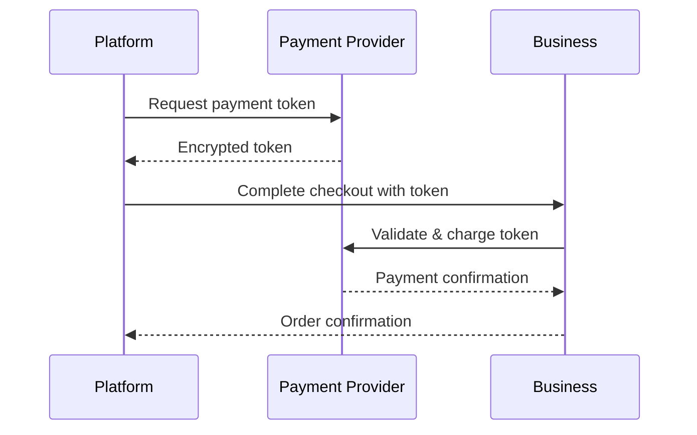

# Standard Capabilities

UCP defines a set of standard capabilities for common commerce operations. Each capability is a self-contained module with its own schema, endpoints, and lifecycle.

## Overview



---

## 1. Checkout Capability

The **Checkout** capability is the core of UCP, handling cart management, tax calculation, and payment processing.

### Namespace

```
dev.ucp.shopping.checkout
```

### Endpoints

| Method | Endpoint | Description |
|--------|----------|-------------|
| `POST` | `/checkout` | Create checkout session |
| `GET` | `/checkout/{id}` | Get session details |
| `POST` | `/checkout/{id}/items` | Add/update items |
| `DELETE` | `/checkout/{id}/items/{itemId}` | Remove item |
| `POST` | `/checkout/{id}/calculate` | Calculate totals |
| `POST` | `/checkout/{id}/complete` | Complete purchase |

### Create Checkout Session

**Request:**

```json
{
    "currency": "USD",
    "locale": "en-US",
    "metadata": {
        "source": "ai-agent",
        "session_id": "agent-123"
    }
}
```

**Response:**

```json
{
    "id": "checkout_abc123",
    "status": "open",
    "currency": "USD",
    "items": [],
    "subtotal": 0,
    "total": 0,
    "created_at": "2026-01-13T00:00:00Z",
    "expires_at": "2026-01-13T01:00:00Z"
}
```

### Add Items

**Request:**

```json
{
    "items": [
        {
            "product_id": "prod_123",
            "variant_id": "var_456",
            "quantity": 2,
            "price": 2999
        }
    ]
}
```

**Response:**

```json
{
    "id": "checkout_abc123",
    "items": [
        {
            "id": "item_789",
            "product_id": "prod_123",
            "name": "Running Shoes",
            "quantity": 2,
            "unit_price": 2999,
            "total": 5998
        }
    ],
    "subtotal": 5998
}
```

### Calculate Totals

**Request:**

```json
{
    "shipping_address": {
        "country": "US",
        "postal_code": "94105",
        "state": "CA"
    }
}
```

**Response:**

```json
{
    "id": "checkout_abc123",
    "subtotal": 5998,
    "tax": 524,
    "shipping": 500,
    "total": 7022,
    "tax_breakdown": [
        {"name": "CA State Tax", "rate": 0.0725, "amount": 435},
        {"name": "SF Local Tax", "rate": 0.015, "amount": 89}
    ]
}
```

### Complete Checkout

**Request:**

```json
{
    "payment_token": "tok_visa_abc123",
    "billing_address": {
        "name": "John Doe",
        "line1": "123 Main St",
        "city": "San Francisco",
        "state": "CA",
        "postal_code": "94105",
        "country": "US"
    },
    "shipping_address": {
        "name": "John Doe",
        "line1": "123 Main St",
        "city": "San Francisco",
        "state": "CA",
        "postal_code": "94105",
        "country": "US"
    }
}
```

**Response:**

```json
{
    "id": "checkout_abc123",
    "status": "completed",
    "order_id": "order_xyz789",
    "total": 7022,
    "confirmation_number": "ORD-2026-001234"
}
```

---

## 2. Identity Linking Capability

**Identity Linking** enables platforms to obtain authorization to perform actions on behalf of users via OAuth 2.0.

### Namespace

```
dev.ucp.identity.linking
```

### OAuth 2.0 Flow



### Authorization Request

```
GET /oauth/authorize?
    client_id=platform_123&
    redirect_uri=https://platform.com/callback&
    scope=checkout.read checkout.write order.read&
    state=random_state_value&
    code_challenge=S256_challenge&
    code_challenge_method=S256
```

### Token Exchange

**Request:**

```json
{
    "grant_type": "authorization_code",
    "code": "auth_code_abc",
    "redirect_uri": "https://platform.com/callback",
    "client_id": "platform_123",
    "code_verifier": "original_verifier"
}
```

**Response:**

```json
{
    "access_token": "eyJ...",
    "token_type": "Bearer",
    "expires_in": 3600,
    "refresh_token": "ref_xyz",
    "scope": "checkout.read checkout.write order.read"
}
```

### Scopes

| Scope | Permission |
|-------|------------|
| `checkout.read` | View checkout sessions |
| `checkout.write` | Create/modify checkouts |
| `order.read` | View order history |
| `order.write` | Modify orders |
| `profile.read` | Access user profile |

---

## 3. Order Capability

The **Order** capability provides webhook-based updates for order lifecycle events.

### Namespace

```
dev.ucp.shopping.order
```

### Order States



### Webhook Events

| Event | Description |
|-------|-------------|
| `order.confirmed` | Order accepted by business |
| `order.processing` | Order being prepared |
| `order.shipped` | Order in transit |
| `order.delivered` | Order received |
| `order.cancelled` | Order cancelled |
| `order.refunded` | Refund processed |

### Webhook Payload

```json
{
    "event": "order.shipped",
    "timestamp": "2026-01-13T12:00:00Z",
    "order": {
        "id": "order_xyz789",
        "status": "shipped",
        "tracking": {
            "carrier": "UPS",
            "tracking_number": "1Z999AA10123456784",
            "url": "https://ups.com/track?num=..."
        },
        "estimated_delivery": "2026-01-15"
    }
}
```

### Register Webhook

**Request:**

```json
{
    "url": "https://platform.com/webhooks/ucp",
    "events": ["order.shipped", "order.delivered"],
    "secret": "whsec_abc123"
}
```

---

## 4. Payment Token Exchange

Secure exchange of payment credentials between platforms and PSPs.

### Namespace

```
dev.ucp.payment.token
```

### Token Flow



### Token Request

```json
{
    "amount": 7022,
    "currency": "USD",
    "payment_method": {
        "type": "card",
        "card_id": "pm_visa_123"
    },
    "merchant_id": "merchant_abc"
}
```

### Token Response

```json
{
    "token": "tok_visa_abc123",
    "expires_at": "2026-01-13T01:00:00Z",
    "fingerprint": "fp_abc123",
    "last_four": "4242",
    "brand": "visa"
}
```

---

## Capability Extensions

### Fulfillment Extension

Extends Checkout with shipping options:

```json
{
    "name": "dev.ucp.shopping.fulfillment",
    "extends": "dev.ucp.shopping.checkout",
    "shipping_options": [
        {"id": "standard", "name": "Standard (5-7 days)", "price": 500},
        {"id": "express", "name": "Express (2-3 days)", "price": 1500}
    ]
}
```

### Discounts Extension

Extends Checkout with promo codes:

```json
{
    "name": "dev.ucp.shopping.discounts",
    "extends": "dev.ucp.shopping.checkout",
    "discount_code": "SAVE20",
    "discount_amount": 1200,
    "discount_type": "fixed"
}
```

---

## Summary

| Capability | Purpose | Key Operations |
|------------|---------|----------------|
| **Checkout** | Cart & payment | create, add items, calculate, complete |
| **Identity** | User auth | OAuth 2.0 flow |
| **Order** | Lifecycle | Webhooks for status updates |
| **Payment** | Credentials | Token exchange with PSPs |
