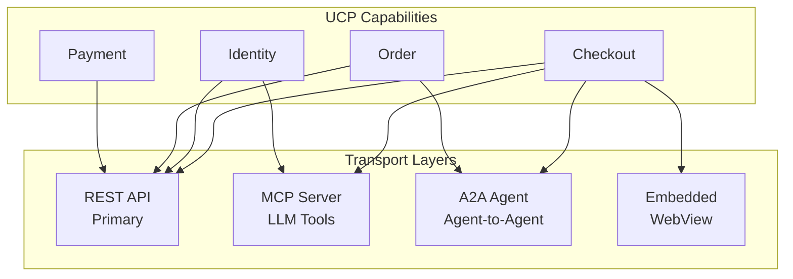
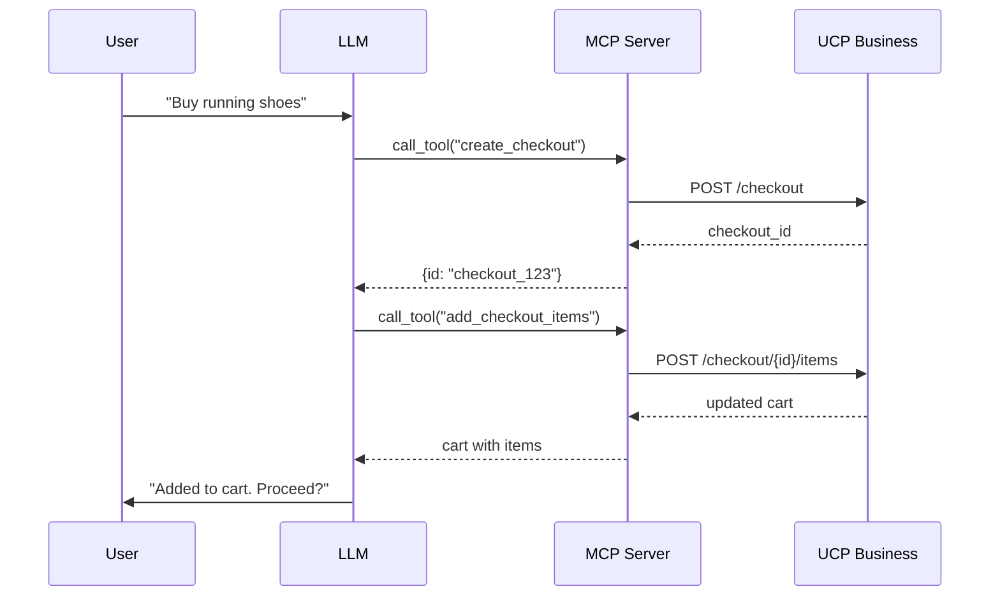
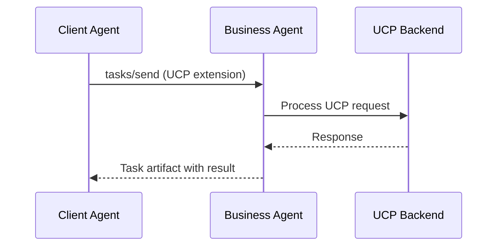
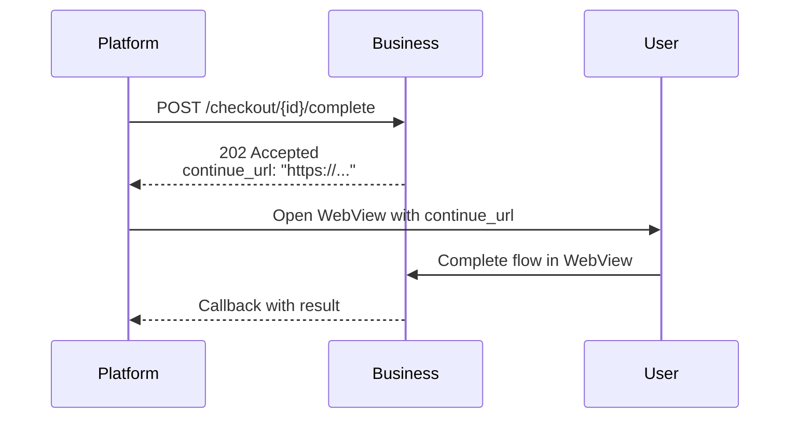

# Transport Layers

UCP is **transport-agnostic** — businesses can expose capabilities via multiple communication methods. This enables integration with traditional APIs, AI agents, and embedded experiences.

## Overview



---

## 1. REST Transport (Primary)

The **primary transport** for UCP is HTTP/1.1+ using RESTful patterns.

### Requirements

| Requirement | Value |
|-------------|-------|
| Content-Type | `application/json` |
| HTTP Version | 1.1 or higher |
| TLS | Required (HTTPS) |
| Methods | Standard verbs (GET, POST, PUT, DELETE) |

### Example: Create Checkout

```http
POST /ucp/checkout HTTP/1.1
Host: api.example.com
Content-Type: application/json
Authorization: Bearer eyJ...
X-UCP-Platform: {"capabilities":["checkout"],"version":"2026-01-11"}

{
    "currency": "USD",
    "locale": "en-US"
}
```

**Response:**

```http
HTTP/1.1 201 Created
Content-Type: application/json

{
    "id": "checkout_abc123",
    "status": "open",
    "currency": "USD"
}
```

### Error Handling

```json
{
    "error": {
        "code": "invalid_request",
        "message": "Missing required field: currency",
        "field": "currency"
    }
}
```

| Status Code | Meaning |
|-------------|---------|
| 200 | Success |
| 201 | Created |
| 400 | Bad Request |
| 401 | Unauthorized |
| 404 | Not Found |
| 500 | Server Error |

---

## 2. Model Context Protocol (MCP)

UCP capabilities map **1:1 to MCP tools**, enabling LLMs to call commerce operations directly.

### MCP Tool Mapping

| UCP Capability | MCP Tool |
|----------------|----------|
| Create Checkout | `create_checkout` |
| Add Items | `add_checkout_items` |
| Calculate | `calculate_checkout` |
| Complete | `complete_checkout` |
| Get Order | `get_order` |

### MCP Server Example

```python
from mcp.server import Server
from mcp.server.models import Tool

app = Server("ucp-commerce")

@app.list_tools()
async def list_tools():
    return [
        Tool(
            name="create_checkout",
            description="Create a new checkout session",
            inputSchema={
                "type": "object",
                "properties": {
                    "currency": {"type": "string"},
                    "locale": {"type": "string"}
                },
                "required": ["currency"]
            }
        ),
        Tool(
            name="add_checkout_items",
            description="Add items to a checkout session",
            inputSchema={
                "type": "object",
                "properties": {
                    "checkout_id": {"type": "string"},
                    "items": {
                        "type": "array",
                        "items": {
                            "type": "object",
                            "properties": {
                                "product_id": {"type": "string"},
                                "quantity": {"type": "integer"}
                            }
                        }
                    }
                },
                "required": ["checkout_id", "items"]
            }
        )
    ]

@app.call_tool()
async def call_tool(name: str, arguments: dict):
    if name == "create_checkout":
        return await ucp_client.create_checkout(
            currency=arguments["currency"],
            locale=arguments.get("locale", "en-US")
        )
    elif name == "add_checkout_items":
        return await ucp_client.add_items(
            checkout_id=arguments["checkout_id"],
            items=arguments["items"]
        )
```

### LLM Usage

```
User: "I want to buy running shoes from Nike"

LLM: <calls create_checkout tool>
     <calls add_checkout_items with product>
     <calls calculate_checkout with shipping>
     
LLM: "I've added Nike Air Max to your cart. 
      Total is $129.99 including shipping. 
      Ready to complete the purchase?"
```

### Mermaid: MCP Flow



---

## 3. Agent-to-Agent Protocol (A2A)

Businesses can expose UCP as an **A2A Extension**, enabling structured agent communication.

### A2A Agent Card

```json
{
    "name": "Example Store Agent",
    "description": "Shop with AI assistance",
    "url": "https://api.example.com/a2a",
    "capabilities": {
        "streaming": true,
        "pushNotifications": false
    },
    "extensions": [
        {
            "uri": "extension://ucp/shopping",
            "name": "UCP Shopping",
            "description": "Universal Commerce Protocol support"
        }
    ],
    "skills": [
        {
            "id": "checkout",
            "name": "Checkout",
            "description": "Create and manage checkout sessions"
        }
    ]
}
```

### A2A Task with UCP

```json
{
    "jsonrpc": "2.0",
    "method": "tasks/send",
    "params": {
        "id": "task_abc123",
        "message": {
            "role": "user",
            "parts": [
                {
                    "data": {
                        "type": "ucp/checkout",
                        "action": "create",
                        "currency": "USD",
                        "items": [
                            {"product_id": "prod_123", "quantity": 1}
                        ]
                    }
                }
            ]
        }
    }
}
```

### Mermaid: A2A Flow



---

## 4. Embedded Protocol (EP)

For complex flows (e.g., 3D Secure, custom UI), businesses can return a `continue_url` to embed an interface.

### Flow



### Response with Continue URL

```json
{
    "status": "pending",
    "continue_url": "https://checkout.example.com/3ds?session=abc123",
    "callback_url": "https://platform.com/callback"
}
```

### Use Cases

| Scenario | Reason for Embedded |
|----------|---------------------|
| 3D Secure | Bank verification flow |
| Complex Address | Street-level validation UI |
| PayPal | External payment provider |
| Custom Shipping | Interactive map selection |

---

## Transport Selection

### Decision Matrix

| Use Case | Recommended Transport |
|----------|----------------------|
| Standard integration | REST |
| LLM agents | MCP |
| Agent-to-agent | A2A |
| Complex UI flows | Embedded |

### Multi-Transport Profile

Businesses declare supported transports in their profile:

```json
{
    "transports": ["rest", "mcp", "a2a"],
    "endpoints": {
        "rest": "https://api.example.com/ucp",
        "mcp": "https://mcp.example.com",
        "a2a": "https://a2a.example.com"
    }
}
```

---

## Summary

| Transport | Best For | Key Feature |
|-----------|----------|-------------|
| **REST** | Traditional APIs | Wide compatibility |
| **MCP** | LLM integration | Tool calling |
| **A2A** | Agent networks | Structured tasks |
| **Embedded** | Complex flows | User interaction |

> [!TIP]
> Start with REST, then add MCP for LLM support. A2A and Embedded are optional for advanced scenarios.
