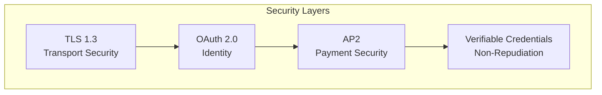
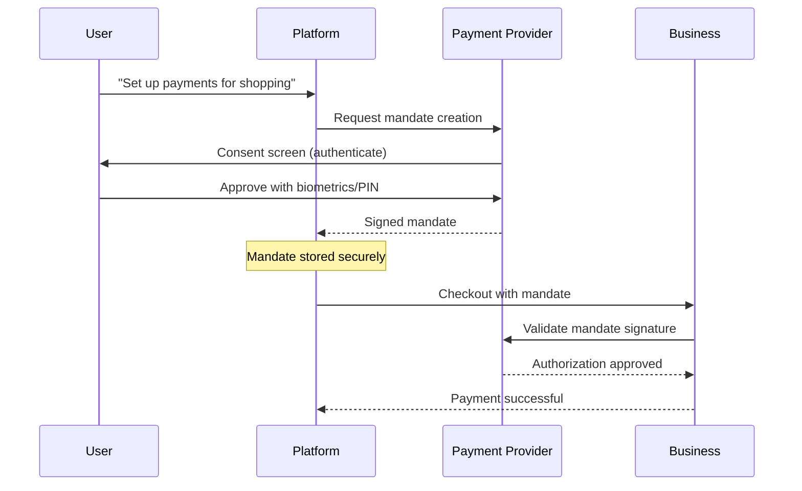
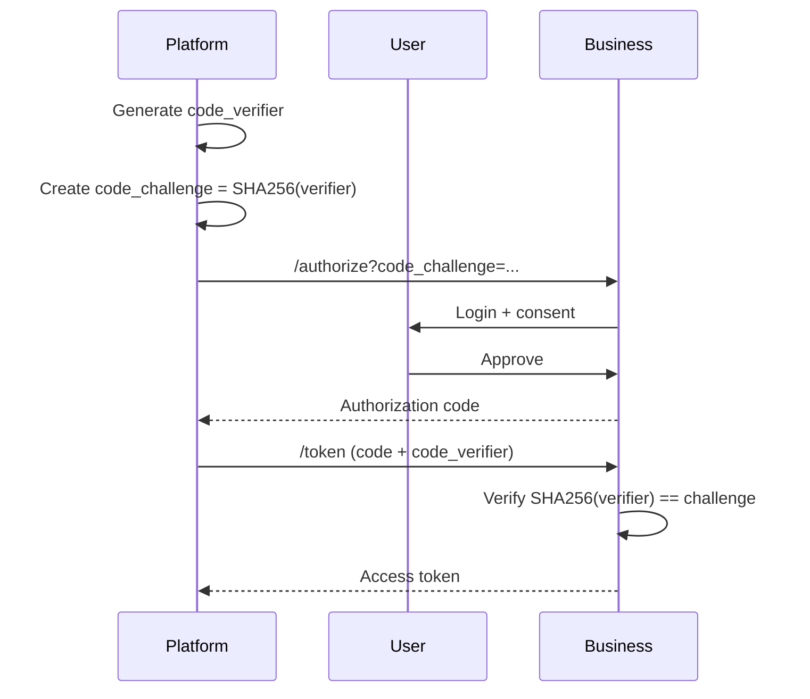
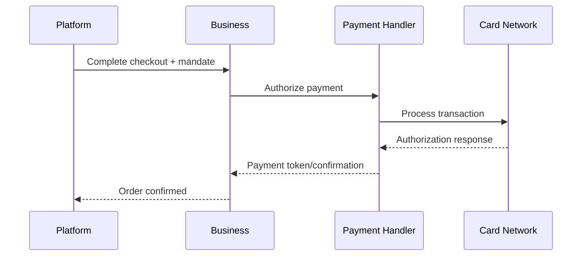
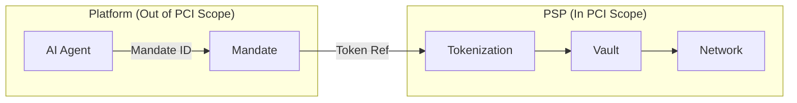

# Payment & Security

UCP implements robust security patterns for payments, authentication, and data privacy using industry standards.

## Security Architecture



---

## 1. AP2 (Agent Payments Protocol)

**AP2** is UCP's payment security layer, providing cryptographic authorization for AI-initiated transactions.

### Why AP2?

| Problem | AP2 Solution |
|---------|--------------|
| AI agents shouldn't store card numbers | Token-based payments |
| Unauthorized purchases | User consent mandates |
| Payment disputes | Cryptographic proof |

### Payment Mandates

A **mandate** is a cryptographically signed authorization allowing an agent to charge a payment method.

```json
{
    "mandate": {
        "id": "mandate_abc123",
        "user_id": "user_xyz",
        "payment_method_id": "pm_visa_123",
        "constraints": {
            "max_amount": 50000,
            "currency": "USD",
            "expiry": "2026-02-13T00:00:00Z",
            "merchant_categories": ["retail", "electronics"]
        },
        "signature": "eyJhbGciOiJFUzI1NiJ9..."
    }
}
```

### Mandate Flow



### Mandate Constraints

| Constraint | Description |
|------------|-------------|
| `max_amount` | Maximum single transaction |
| `currency` | Allowed currency |
| `expiry` | Mandate expiration |
| `merchant_categories` | Allowed merchant types |
| `velocity` | Transactions per time period |

---

## 2. OAuth 2.0 Identity

UCP uses **OAuth 2.0 with PKCE** for user identity and authorization.

### Scopes

| Scope | Permission |
|-------|------------|
| `checkout.read` | View checkout sessions |
| `checkout.write` | Create/modify checkouts |
| `order.read` | View order history |
| `payment.mandate` | Create payment mandates |
| `profile.read` | Access user profile |

### Authorization Flow (PKCE)



### Token Request

```json
{
    "grant_type": "authorization_code",
    "code": "auth_abc123",
    "redirect_uri": "https://platform.com/callback",
    "client_id": "platform_123",
    "code_verifier": "dBjftJeZ4CVP-mB92K27uhbUJU1p1r_wW1gFWFOEjXk"
}
```

---

## 3. Payment Handlers

**Payment Handlers** are PSP implementations that process AP2 mandates.

### Handler Registration

```json
{
    "handler": {
        "id": "handler_visa",
        "name": "Visa Direct",
        "supported_methods": ["card"],
        "supported_networks": ["visa", "mastercard"],
        "endpoint": "https://api.visa.com/ap2"
    }
}
```

### Payment Flow



### Handler Response

```json
{
    "authorization": {
        "id": "auth_xyz789",
        "status": "approved",
        "amount": 7022,
        "currency": "USD",
        "network_response": {
            "approval_code": "123456",
            "avs_result": "Y",
            "cvv_result": "M"
        }
    }
}
```

---

## 4. PCI-DSS Compliance

UCP is designed so **platforms never handle raw card data**.

### PCI Scope Management



| Actor | PCI Scope | Handles |
|-------|-----------|---------|
| Platform | OUT | Mandate IDs, tokens |
| Business | OUT | Token references |
| PSP | IN | Card numbers, CVV |

---

## 5. Risk Signals

Businesses and PSPs can exchange **risk signals** for fraud prevention.

### Risk Signal Types

| Signal | Description |
|--------|-------------|
| `device_fingerprint` | Browser/device identifier |
| `ip_address` | Request origin |
| `session_age` | Time since authentication |
| `velocity` | Recent transaction count |
| `behavioral` | Interaction patterns |

### Risk Request

```json
{
    "risk_signals": {
        "device_fingerprint": "fp_abc123",
        "ip_address": "203.0.113.42",
        "session_age_seconds": 300,
        "user_agent": "Mozilla/5.0...",
        "velocity_24h": 2
    }
}
```

### Risk Response

```json
{
    "risk_assessment": {
        "score": 15,
        "recommendation": "approve",
        "flags": [],
        "requires_3ds": false
    }
}
```

---

## 6. Transaction Integrity

UCP ensures **non-repudiation** through verifiable credentials.

### Transaction Receipt

```json
{
    "receipt": {
        "transaction_id": "txn_abc123",
        "timestamp": "2026-01-13T12:00:00Z",
        "amount": 7022,
        "currency": "USD",
        "merchant": "Example Store",
        "items_hash": "sha256:abc123...",
        "signature": {
            "algorithm": "ES256",
            "value": "eyJhbGciOiJFUzI1NiJ9...",
            "public_key": "https://example.com/.well-known/jwks.json"
        }
    }
}
```

### Verification

```python
import jwt

receipt = get_transaction_receipt(txn_id)
public_key = fetch_jwks(receipt["signature"]["public_key"])

try:
    jwt.decode(
        receipt["signature"]["value"],
        public_key,
        algorithms=["ES256"]
    )
    print("Receipt verified!")
except jwt.InvalidSignatureError:
    print("Invalid signature!")
```

---

## Security Best Practices

### For Platforms

- ✅ Use PKCE for OAuth
- ✅ Store mandates encrypted
- ✅ Validate TLS certificates
- ✅ Log all transactions
- ❌ Never store card numbers

### For Businesses

- ✅ Validate mandate signatures
- ✅ Check mandate constraints
- ✅ Implement rate limiting
- ✅ Return proper error codes
- ❌ Never trust unverified tokens

---

## Summary

| Layer | Standard | Purpose |
|-------|----------|---------|
| **Transport** | TLS 1.3 | Encryption in transit |
| **Identity** | OAuth 2.0 + PKCE | User authentication |
| **Payment** | AP2 | Secure agent payments |
| **Integrity** | Verifiable Credentials | Non-repudiation |

> [!IMPORTANT]
> AP2 mandates ensure that AI agents can only spend money with explicit, cryptographically verified user consent.
