# UCP: Pros and Cons

A balanced analysis of UCP's strengths, limitations, and when to use it.

## At a Glance

```mermaid
graph LR
    subgraph "Strengths"
        A[🌐 Open Standard]
        B[🔒 Secure Payments]
        C[🤖 AI-Native]
        D[🔌 MCP/A2A Compatible]
    end
    
    subgraph "Challenges"
        E[🆕 Early Stage]
        F[🛒 Commerce-Only]
        G[🧩 Integration Work]
        H[📚 Learning Curve]
    end
```



---

## ✅ Pros (Advantages)

### 🌐 1. Open & Industry-Backed

UCP is an **Apache 2.0 licensed** open standard with major industry support.

| Category | Supporters |
|----------|------------|
| **Retailers** | Shopify, Etsy, Wayfair, Target, Walmart |
| **Payments** | Visa, Mastercard |
| **Tech** | Google |

**Why it matters:** No vendor lock-in. Community-driven evolution.

---

### 🔒 2. Secure Payment Model

AP2 mandates ensure **cryptographic proof of user consent** for every transaction.


| Security Feature | Benefit |
|------------------|---------|
| Mandates | User must approve spending limits |
| Tokenization | Platforms never see card numbers |
| Signatures | Transactions are provable |

---

### 🤖 3. AI-Native Design

UCP was built from the ground up for **agentic commerce**.

- Structured JSON schemas (LLM-friendly)
- Stateless operations (no session management)
- Explicit capabilities (agents know what's possible)

| Traditional | UCP |
|-------------|-----|
| HTML scraping | Structured API |
| Session cookies | Stateless tokens |
| Unknown capabilities | Declared in profile |

---

### 🔌 4. Protocol Compatibility

UCP integrates with the broader AI agent ecosystem.


| Protocol | Integration |
|----------|-------------|
| **MCP** | 1:1 tool mapping |
| **A2A** | UCP as extension |
| **A2UI** | Render checkout UI |

---

### 📦 5. Composable Architecture

Capabilities and Extensions allow **modular implementation**.

- Implement only what you need
- Add features incrementally
- Vendor extensions don't break core

```
Core: Checkout → Extension: Fulfillment → Extension: Loyalty
```

---

### 🔍 6. Automatic Discovery

Platforms can **auto-discover** business capabilities.

```
GET /.well-known/ucp-profile
→ "This business supports checkout, fulfillment, discounts"
```

No manual configuration. No hardcoded integrations.

---

## ❌ Cons (Disadvantages)

### 🆕 1. Early Stage

UCP is a **new standard** (v1.0, January 2026).

| Challenge | Impact |
|-----------|--------|
| Limited tooling | Fewer SDKs, libraries |
| Evolving spec | Breaking changes possible |
| Small community | Fewer resources, examples |

**Mitigation:** Start with core Checkout capability, expand as ecosystem matures.

---

### 🛒 2. Commerce-Focused Scope

UCP is **specifically for commerce** — not a general-purpose protocol.

| ✅ UCP Handles | ❌ Not UCP's Domain |
|----------------|---------------------|
| Shopping checkout | Calendar scheduling |
| Payment processing | Email composition |
| Order tracking | Document editing |

**Mitigation:** Use MCP for general tool calling, UCP for commerce.

---

### 🧩 3. Integration Work Required

Businesses must implement UCP endpoints and schemas.

| Component | Effort |
|-----------|--------|
| Profile endpoint | Low |
| Checkout capability | Medium |
| All capabilities + extensions | High |

**Mitigation:** Use official SDKs. Start with REST transport only.

---

### 📚 4. Learning Curve

UCP introduces new concepts: capabilities, extensions, AP2, mandates.

| Concept | Complexity |
|---------|------------|
| Basic profile | Low |
| Checkout flow | Medium |
| AP2 payment mandates | High |
| Multi-transport (MCP + A2A) | High |

**Mitigation:** Follow tutorials. Implement incrementally.

---

### 💳 5. PSP Integration

Full AP2 support requires **payment provider integration**.


- Not all PSPs support AP2 yet
- May require PSP migration or dual-processing

**Mitigation:** Use tokenization-based PSPs (Stripe, Adyen support tokens).

---

### 🌍 6. Regional Variations

Global commerce has regional requirements.

| Region | Consideration |
|--------|---------------|
| EU | GDPR, PSD2 SCA |
| India | UPI, local payment methods |
| Brazil | PIX, CPF requirements |

**Mitigation:** Use extensions for regional requirements.

---

## Decision Matrix

| Scenario | Recommendation |
|----------|----------------|
| Building AI shopping assistant | ✅ Use UCP |
| Multi-retailer checkout | ✅ Use UCP |
| Adding agent payments | ✅ Use UCP + AP2 |
| Simple product catalog | ⚠️ Maybe (REST API may suffice) |
| Non-commerce AI agent | ❌ Use MCP instead |
| Legacy POS integration | ❌ Too much overhead |

---

## Comparison with Alternatives

| Approach | Pros | Cons |
|----------|------|------|
| **UCP** | Standardized, secure, AI-native | New, commerce-only |
| **Custom APIs** | Full control | N×M problem, no standard |
| **Screen scraping** | Works today | Fragile, TOS violations |
| **Shopify/Stripe APIs** | Mature | Vendor-specific |

---

## Adoption Strategy


| Phase | Effort | Capability |
|-------|--------|------------|
| 1 | 1-2 weeks | Basic checkout via REST |
| 2 | 1 week | LLM tool integration |
| 3 | 2 weeks | Full commerce flow |
| 4 | 3+ weeks | Secure agent payments |

---

## Summary

| Aspect | Assessment |
|--------|------------|
| **Maturity** | Early but promising |
| **Security** | Excellent (AP2) |
| **AI-Ready** | Yes |
| **Adoption** | Growing (major retailers) |
| **Complexity** | Medium |
| **Recommendation** | Use for AI commerce projects |

> [!TIP]
> If you're building AI agents that need to complete purchases, UCP is the emerging standard. Start implementing now to be ahead of the curve.
