# IAM & Security

AWS Identity and Access Management (IAM) is the cornerstone of AWS security, controlling **who** can access **what** resources.

---

## IAM Core Concepts

```mermaid
graph TB
    subgraph "IAM Entities"
        User["👤 Users"]
        Group["👥 Groups"]
        Role["🎭 Roles"]
    end
    
    subgraph "Permissions"
        Policy["📜 Policies"]
        Permission["✓ Permissions"]
    end
    
    subgraph "Resources"
        EC2["EC2"]
        S3["S3"]
        RDS["RDS"]
    end
    
    User --> Group
    Group --> Policy
    User --> Policy
    Role --> Policy
    Policy --> Permission
    Permission --> EC2
    Permission --> S3
    Permission --> RDS
```



### Identity Types

| Entity | Description | Use Case |
|--------|-------------|----------|
| **Root User** | Account owner with full access | Initial setup only, then lock away |
| **IAM User** | Person or application | Individual developers, service accounts |
| **IAM Group** | Collection of users | Teams (developers, admins) |
| **IAM Role** | Temporary credentials | EC2 instances, Lambda, cross-account |

---

## IAM Users

### Creating Users

```bash
# Create a user
aws iam create-user --user-name john.doe

# Add to group
aws iam add-user-to-group --user-name john.doe --group-name Developers

# Create access keys (for programmatic access)
aws iam create-access-key --user-name john.doe

# Enable console access
aws iam create-login-profile \
    --user-name john.doe \
    --password "TempPassword123!" \
    --password-reset-required
```

### Best Practices

> [!IMPORTANT]
> Never share IAM users. Create individual users for each person.

1. **One user per person** - Enable accountability
2. **Use groups** - Don't attach policies directly to users
3. **Enforce MFA** - Require for console access
4. **Rotate credentials** - Regular key rotation

---

## IAM Groups

Groups simplify permission management by applying policies to multiple users at once.

```bash
# Create a group
aws iam create-group --group-name Developers

# Attach policy to group
aws iam attach-group-policy \
    --group-name Developers \
    --policy-arn arn:aws:iam::aws:policy/PowerUserAccess

# List group members
aws iam get-group --group-name Developers
```

### Common Group Patterns

| Group | Policies | Members |
|-------|----------|---------|
| **Admins** | AdministratorAccess | Platform team |
| **Developers** | PowerUserAccess | Engineering |
| **ReadOnly** | ViewOnlyAccess | Auditors, analysts |
| **Billing** | Billing | Finance team |

---

## IAM Roles

Roles provide **temporary credentials** and are the preferred method for granting access to AWS services.


### Creating an EC2 Instance Role

```bash
# Create trust policy
cat > trust-policy.json << 'EOF'
{
  "Version": "2012-10-17",
  "Statement": [
    {
      "Effect": "Allow",
      "Principal": {
        "Service": "ec2.amazonaws.com"
      },
      "Action": "sts:AssumeRole"
    }
  ]
}
EOF

# Create role
aws iam create-role \
    --role-name EC2-S3-Access \
    --assume-role-policy-document file://trust-policy.json

# Attach policy
aws iam attach-role-policy \
    --role-name EC2-S3-Access \
    --policy-arn arn:aws:iam::aws:policy/AmazonS3ReadOnlyAccess

# Create instance profile (required for EC2)
aws iam create-instance-profile --instance-profile-name EC2-S3-Access
aws iam add-role-to-instance-profile \
    --instance-profile-name EC2-S3-Access \
    --role-name EC2-S3-Access
```

### Cross-Account Role

```json
{
  "Version": "2012-10-17",
  "Statement": [
    {
      "Effect": "Allow",
      "Principal": {
        "AWS": "arn:aws:iam::123456789012:root"
      },
      "Action": "sts:AssumeRole",
      "Condition": {
        "StringEquals": {
          "sts:ExternalId": "unique-external-id"
        }
      }
    }
  ]
}
```

```bash
# Assume role from another account
aws sts assume-role \
    --role-arn arn:aws:iam::987654321098:role/CrossAccountRole \
    --role-session-name MySession \
    --external-id unique-external-id
```

---

## IAM Policies

Policies are JSON documents that define permissions.

### Policy Structure

```json
{
  "Version": "2012-10-17",
  "Statement": [
    {
      "Sid": "AllowS3Read",
      "Effect": "Allow",
      "Action": [
        "s3:GetObject",
        "s3:ListBucket"
      ],
      "Resource": [
        "arn:aws:s3:::my-bucket",
        "arn:aws:s3:::my-bucket/*"
      ],
      "Condition": {
        "IpAddress": {
          "aws:SourceIp": "192.168.1.0/24"
        }
      }
    }
  ]
}
```

### Policy Elements

| Element | Required | Description |
|---------|----------|-------------|
| **Version** | Yes | Always use `2012-10-17` |
| **Statement** | Yes | Array of permission statements |
| **Sid** | No | Statement identifier |
| **Effect** | Yes | `Allow` or `Deny` |
| **Action** | Yes | API actions (e.g., `s3:GetObject`) |
| **Resource** | Yes* | ARN of affected resources |
| **Condition** | No | When policy applies |

### Policy Types

| Type | Scope | Use Case |
|------|-------|----------|
| **AWS Managed** | AWS-maintained | Common use cases |
| **Customer Managed** | Your account | Custom requirements |
| **Inline** | Attached to single entity | Strict one-to-one |

### Common Conditions

```json
{
  "Condition": {
    "StringEquals": {
      "aws:RequestedRegion": "us-east-1"
    },
    "Bool": {
      "aws:MultiFactorAuthPresent": "true"
    },
    "IpAddress": {
      "aws:SourceIp": ["192.168.1.0/24", "10.0.0.0/8"]
    },
    "DateGreaterThan": {
      "aws:CurrentTime": "2024-01-01T00:00:00Z"
    }
  }
}
```

---

## Policy Examples

### Read-Only S3 Access

```json
{
  "Version": "2012-10-17",
  "Statement": [
    {
      "Effect": "Allow",
      "Action": [
        "s3:GetObject",
        "s3:GetObjectVersion",
        "s3:ListBucket"
      ],
      "Resource": [
        "arn:aws:s3:::my-bucket",
        "arn:aws:s3:::my-bucket/*"
      ]
    }
  ]
}
```

### EC2 Start/Stop in Specific Region

```json
{
  "Version": "2012-10-17",
  "Statement": [
    {
      "Effect": "Allow",
      "Action": [
        "ec2:StartInstances",
        "ec2:StopInstances"
      ],
      "Resource": "*",
      "Condition": {
        "StringEquals": {
          "aws:RequestedRegion": "us-east-1"
        }
      }
    }
  ]
}
```

### Require MFA for Sensitive Actions

```json
{
  "Version": "2012-10-17",
  "Statement": [
    {
      "Effect": "Allow",
      "Action": [
        "iam:DeleteUser",
        "iam:DeleteRole"
      ],
      "Resource": "*",
      "Condition": {
        "Bool": {
          "aws:MultiFactorAuthPresent": "true"
        }
      }
    }
  ]
}
```

---

## Permission Boundaries

Permission boundaries set the **maximum permissions** an entity can have.


```bash
# Set permission boundary
aws iam put-user-permissions-boundary \
    --user-name john.doe \
    --permissions-boundary arn:aws:iam::123456789012:policy/DeveloperBoundary
```

---

## AWS Organizations & SCPs

Service Control Policies (SCPs) set permission guardrails across accounts.


### Example SCP: Deny Region Access

```json
{
  "Version": "2012-10-17",
  "Statement": [
    {
      "Sid": "DenyNonApprovedRegions",
      "Effect": "Deny",
      "Action": "*",
      "Resource": "*",
      "Condition": {
        "StringNotEquals": {
          "aws:RequestedRegion": [
            "us-east-1",
            "us-west-2",
            "eu-west-1"
          ]
        }
      }
    }
  ]
}
```

---

## Identity Federation

Connect external identity providers to AWS.

### SAML 2.0 (Enterprise SSO)


### Web Identity Federation (Social Login)

```bash
# Assume role with web identity (Cognito, Google, Facebook)
aws sts assume-role-with-web-identity \
    --role-arn arn:aws:iam::123456789012:role/WebIdentityRole \
    --role-session-name app-session \
    --web-identity-token $TOKEN
```

### AWS IAM Identity Center (SSO)

```bash
# Configure SSO
aws configure sso

# Login
aws sso login --profile my-sso-profile

# List accounts
aws sso list-accounts --access-token $TOKEN
```

---

## Security Best Practices

### Root Account Protection

> [!CAUTION]
> The root account has unrestricted access. Protect it!

1. **Enable MFA** immediately
2. **Delete root access keys**
3. **Use for billing only**
4. **Store credentials securely**

```bash
# Check for root access keys (should be empty)
aws iam list-access-keys --user-name root

# Enable MFA (Console only)
# Security Credentials → MFA → Activate MFA
```

### Credential Rotation

```bash
# List access keys and their age
aws iam list-access-keys --user-name john.doe

# Create new key
aws iam create-access-key --user-name john.doe

# Update applications, then delete old key
aws iam delete-access-key \
    --user-name john.doe \
    --access-key-id AKIAOLDKEYEXAMPLE
```

### Audit & Compliance

```bash
# Generate credential report
aws iam generate-credential-report
aws iam get-credential-report --output text --query Content | base64 -d

# Get account summary
aws iam get-account-summary

# List policies attached to a user
aws iam list-attached-user-policies --user-name john.doe
```

---

## IAM Access Analyzer

Identify resources shared outside your account.

```bash
# Create analyzer
aws accessanalyzer create-analyzer \
    --analyzer-name MyAnalyzer \
    --type ACCOUNT

# List findings
aws accessanalyzer list-findings --analyzer-arn $ANALYZER_ARN

# Get finding details
aws accessanalyzer get-finding \
    --analyzer-arn $ANALYZER_ARN \
    --id $FINDING_ID
```

---

## Common IAM Errors

### Access Denied

```
An error occurred (AccessDenied) when calling the X operation:
User: arn:aws:iam::123456789012:user/john is not authorized to perform: s3:GetObject
```

**Troubleshooting:**

1. Check user policies: `aws iam list-user-policies --user-name john`
2. Check group policies: `aws iam list-groups-for-user --user-name john`
3. Check resource policies (S3 bucket policy, etc.)
4. Check permission boundaries
5. Check SCPs (if using Organizations)

### MFA Required

```bash
# Get session token with MFA
aws sts get-session-token \
    --serial-number arn:aws:iam::123456789012:mfa/john.doe \
    --token-code 123456
```

---

## Quick Reference

### AWS Managed Policies

| Policy | Description |
|--------|-------------|
| `AdministratorAccess` | Full access |
| `PowerUserAccess` | Full access except IAM |
| `ViewOnlyAccess` | Read-only |
| `AmazonS3FullAccess` | Full S3 access |
| `AmazonEC2FullAccess` | Full EC2 access |

### CLI Commands

```bash
# Users
aws iam list-users
aws iam get-user --user-name NAME

# Groups
aws iam list-groups
aws iam get-group --group-name NAME

# Roles
aws iam list-roles
aws iam get-role --role-name NAME

# Policies
aws iam list-policies --scope Local
aws iam get-policy --policy-arn ARN
aws iam get-policy-version --policy-arn ARN --version-id v1
```

---

## Next Steps

- **[Networking Fundamentals](02_networking_fundamentals.md)** - VPC architecture and core concepts
