# Networking Fundamentals

Amazon Virtual Private Cloud (VPC) is the foundation of AWS networking, providing isolated network environments for your resources.

---

## VPC Architecture Overview


---

## VPC Core Components

| Component | Description | Limit |
|-----------|-------------|-------|
| **VPC** | Isolated virtual network | 5 per region (adjustable) |
| **Subnet** | Range of IP addresses in an AZ | 200 per VPC |
| **Route Table** | Rules for traffic routing | 200 per VPC |
| **Internet Gateway** | Connect VPC to internet | 1 per VPC |
| **NAT Gateway** | Allow private subnet internet access | 5 per AZ |
| **Security Group** | Instance-level firewall | 2,500 per VPC |
| **NACL** | Subnet-level firewall | 200 per VPC |

---

## CIDR Planning

### Understanding CIDR Notation

```
10.0.0.0/16
│  │ │ │  │
│  │ │ │  └── Prefix length (16 bits = 65,536 addresses)
│  │ │ └───── Fourth octet
│  │ └─────── Third octet
│  └───────── Second octet
└──────────── First octet
```

### Common CIDR Sizes

| CIDR | IP Addresses | AWS Usable* | Use Case |
|------|--------------|-------------|----------|
| `/16` | 65,536 | 65,531 | Large VPC |
| `/17` | 32,768 | 32,763 | Medium VPC |
| `/18` | 16,384 | 16,379 | Small VPC |
| `/20` | 4,096 | 4,091 | Large subnet |
| `/24` | 256 | 251 | Standard subnet |
| `/28` | 16 | 11 | Minimum subnet |

> *AWS reserves 5 IPs per subnet: network, VPC router, DNS, future use, broadcast

### VPC CIDR Best Practices

> [!IMPORTANT]
> Plan your CIDR ranges carefully! You cannot change the primary CIDR after creation.

```
AVOID overlapping with:
├── Other VPCs (if peering planned)
├── On-premises networks (if hybrid planned)
├── Common ranges (10.0.0.0/8, 172.16.0.0/12, 192.168.0.0/16)
└── Partner/customer networks

RECOMMENDED pattern:
├── Production:  10.0.0.0/16
├── Staging:     10.1.0.0/16
├── Development: 10.2.0.0/16
└── (Leave gaps for growth)
```

---

## Creating a VPC

### AWS CLI

```bash
# Create VPC
aws ec2 create-vpc \
    --cidr-block 10.0.0.0/16 \
    --tag-specifications 'ResourceType=vpc,Tags=[{Key=Name,Value=MyVPC}]'

# Enable DNS hostnames
aws ec2 modify-vpc-attribute \
    --vpc-id vpc-12345678 \
    --enable-dns-hostnames '{"Value": true}'

# Enable DNS resolution
aws ec2 modify-vpc-attribute \
    --vpc-id vpc-12345678 \
    --enable-dns-support '{"Value": true}'
```

### Describe VPC

```bash
# List all VPCs
aws ec2 describe-vpcs --query 'Vpcs[*].[VpcId,CidrBlock,Tags[?Key==`Name`].Value|[0]]' --output table

# Get specific VPC details
aws ec2 describe-vpcs --vpc-ids vpc-12345678
```

---

## Subnets

### Public vs Private Subnets

```mermaid
graph LR
    subgraph "Public Subnet"
        direction TB
        Web["Web Server<br/>Public IP: 54.x.x.x<br/>Private IP: 10.0.1.10"]
        RT1["Route Table"]
        Web --> RT1
        RT1 --> |"0.0.0.0/0"| IGW["Internet Gateway"]
    end
    
    subgraph "Private Subnet"
        direction TB
        App["App Server<br/>Private IP: 10.0.10.10"]
        RT2["Route Table"]
        App --> RT2
        RT2 --> |"0.0.0.0/0"| NAT["NAT Gateway"]
    end
    
    IGW --> Internet["🌐 Internet"]
    NAT --> IGW
```



| Characteristic | Public Subnet | Private Subnet |
|----------------|---------------|----------------|
| **Internet Access** | Direct (via IGW) | Via NAT Gateway |
| **Public IP** | Auto-assign available | No public IP |
| **Route to IGW** | Yes (0.0.0.0/0 → IGW) | No |
| **Inbound from Internet** | Allowed | Not allowed |
| **Use Cases** | Load balancers, bastion hosts | App servers, databases |

### Creating Subnets

```bash
# Create public subnet
aws ec2 create-subnet \
    --vpc-id vpc-12345678 \
    --cidr-block 10.0.1.0/24 \
    --availability-zone us-east-1a \
    --tag-specifications 'ResourceType=subnet,Tags=[{Key=Name,Value=Public-1a}]'

# Enable auto-assign public IP (for public subnet)
aws ec2 modify-subnet-attribute \
    --subnet-id subnet-abc123 \
    --map-public-ip-on-launch

# Create private subnet
aws ec2 create-subnet \
    --vpc-id vpc-12345678 \
    --cidr-block 10.0.10.0/24 \
    --availability-zone us-east-1a \
    --tag-specifications 'ResourceType=subnet,Tags=[{Key=Name,Value=Private-1a}]'
```

### Subnet Design Pattern

```
VPC: 10.0.0.0/16

Public Subnets (web tier):
├── 10.0.1.0/24  → us-east-1a
├── 10.0.2.0/24  → us-east-1b
└── 10.0.3.0/24  → us-east-1c

Private Subnets (app tier):
├── 10.0.10.0/24 → us-east-1a
├── 10.0.20.0/24 → us-east-1b
└── 10.0.30.0/24 → us-east-1c

Database Subnets (data tier):
├── 10.0.100.0/24 → us-east-1a
├── 10.0.110.0/24 → us-east-1b
└── 10.0.120.0/24 → us-east-1c
```

---

## Internet Gateway

The Internet Gateway enables communication between your VPC and the internet.

```bash
# Create Internet Gateway
aws ec2 create-internet-gateway \
    --tag-specifications 'ResourceType=internet-gateway,Tags=[{Key=Name,Value=MyIGW}]'

# Attach to VPC
aws ec2 attach-internet-gateway \
    --internet-gateway-id igw-12345678 \
    --vpc-id vpc-12345678
```

### Key Points

- **One per VPC** - Only one IGW can be attached to a VPC
- **Horizontally scaled** - No bandwidth constraints
- **Highly available** - No single point of failure
- **No security** - Use security groups and NACLs for access control

---

## NAT Gateway

NAT Gateways allow instances in private subnets to access the internet while remaining unreachable from outside.


### Creating NAT Gateway

```bash
# Allocate Elastic IP
aws ec2 allocate-address --domain vpc

# Create NAT Gateway in public subnet
aws ec2 create-nat-gateway \
    --subnet-id subnet-public-1a \
    --allocation-id eipalloc-12345678 \
    --tag-specifications 'ResourceType=natgateway,Tags=[{Key=Name,Value=NAT-1a}]'

# Wait for NAT Gateway to become available
aws ec2 wait nat-gateway-available --nat-gateway-ids nat-12345678
```

### NAT Gateway vs NAT Instance

| Feature | NAT Gateway | NAT Instance |
|---------|-------------|--------------|
| **Managed** | AWS managed | You manage |
| **Availability** | Highly available in AZ | Depends on instance |
| **Bandwidth** | Up to 45 Gbps | Instance dependent |
| **Cost** | $0.045/hr + data | Instance cost |
| **Security Groups** | Not supported | Supported |
| **Bastion** | Cannot be used | Can be used |

### High Availability Pattern

```bash
# Create NAT Gateway in each AZ
# AZ 1
aws ec2 create-nat-gateway --subnet-id subnet-public-1a --allocation-id eipalloc-1

# AZ 2  
aws ec2 create-nat-gateway --subnet-id subnet-public-1b --allocation-id eipalloc-2

# Update route tables for each AZ to use local NAT Gateway
```

---

## Route Tables

Route tables contain rules (routes) that determine where network traffic is directed.

### Route Table Structure

| Destination | Target | Status | Notes |
|-------------|--------|--------|-------|
| 10.0.0.0/16 | local | Active | VPC internal traffic |
| 0.0.0.0/0 | igw-xxx | Active | Internet traffic |

### Creating and Configuring Route Tables

```bash
# Create route table
aws ec2 create-route-table \
    --vpc-id vpc-12345678 \
    --tag-specifications 'ResourceType=route-table,Tags=[{Key=Name,Value=Public-RT}]'

# Add route to Internet Gateway (public subnet)
aws ec2 create-route \
    --route-table-id rtb-12345678 \
    --destination-cidr-block 0.0.0.0/0 \
    --gateway-id igw-12345678

# Add route to NAT Gateway (private subnet)
aws ec2 create-route \
    --route-table-id rtb-87654321 \
    --destination-cidr-block 0.0.0.0/0 \
    --nat-gateway-id nat-12345678

# Associate route table with subnet
aws ec2 associate-route-table \
    --route-table-id rtb-12345678 \
    --subnet-id subnet-abc123
```

### Route Priority

Routes are evaluated by **most specific match** (longest prefix wins):

```
Destination     Target
10.0.1.0/24     local          ← Matches first for 10.0.1.x
10.0.0.0/16     local          ← Matches for other 10.0.x.x
0.0.0.0/0       igw-xxx        ← Default route
```

---

## Security Groups

Security groups act as **virtual firewalls** at the instance level.

```mermaid
graph TB
    subgraph "Security Group: web-sg"
        direction TB
        Ingress["Inbound Rules<br/>• Port 80 from 0.0.0.0/0<br/>• Port 443 from 0.0.0.0/0"]
        Egress["Outbound Rules<br/>• All traffic to 0.0.0.0/0"]
    end
    
    Internet["Internet"] --> Ingress
    Egress --> Internet
    
    Ingress --> EC2["EC2 Instance"]
    EC2 --> Egress
```



### Security Group Characteristics

| Feature | Security Group |
|---------|----------------|
| **Level** | Instance (ENI) |
| **State** | Stateful (return traffic allowed) |
| **Rules** | Allow only (implicit deny) |
| **Default** | Deny all inbound, allow all outbound |
| **Evaluation** | All rules evaluated |
| **Changes** | Applied immediately |

### Creating Security Groups

```bash
# Create security group
aws ec2 create-security-group \
    --group-name web-sg \
    --description "Security group for web servers" \
    --vpc-id vpc-12345678

# Add inbound rules
aws ec2 authorize-security-group-ingress \
    --group-id sg-12345678 \
    --protocol tcp \
    --port 80 \
    --cidr 0.0.0.0/0

aws ec2 authorize-security-group-ingress \
    --group-id sg-12345678 \
    --protocol tcp \
    --port 443 \
    --cidr 0.0.0.0/0

# Allow SSH from specific IP
aws ec2 authorize-security-group-ingress \
    --group-id sg-12345678 \
    --protocol tcp \
    --port 22 \
    --cidr 203.0.113.0/32

# Allow traffic from another security group
aws ec2 authorize-security-group-ingress \
    --group-id sg-app-servers \
    --protocol tcp \
    --port 8080 \
    --source-group sg-web-servers
```

### Common Security Group Patterns

```bash
# Web tier
Inbound:
  - 80/tcp from 0.0.0.0/0 (HTTP)
  - 443/tcp from 0.0.0.0/0 (HTTPS)
Outbound:
  - All to 0.0.0.0/0

# App tier
Inbound:
  - 8080/tcp from sg-web-tier (App port)
Outbound:
  - 5432/tcp to sg-database (PostgreSQL)
  - 443/tcp to 0.0.0.0/0 (External APIs)

# Database tier
Inbound:
  - 5432/tcp from sg-app-tier (PostgreSQL)
Outbound:
  - None (or minimal)
```

---

## Network ACLs (NACLs)

Network ACLs are **subnet-level firewalls** that provide an additional layer of security.

### Security Group vs NACL

| Feature | Security Group | NACL |
|---------|----------------|------|
| **Level** | Instance | Subnet |
| **State** | Stateful | Stateless |
| **Rules** | Allow only | Allow and Deny |
| **Evaluation** | All rules | Numbered order |
| **Default** | Deny in, allow out | Allow all |

### Creating NACLs

```bash
# Create NACL
aws ec2 create-network-acl \
    --vpc-id vpc-12345678 \
    --tag-specifications 'ResourceType=network-acl,Tags=[{Key=Name,Value=Public-NACL}]'

# Add inbound rule (allow HTTP)
aws ec2 create-network-acl-entry \
    --network-acl-id acl-12345678 \
    --rule-number 100 \
    --protocol tcp \
    --port-range From=80,To=80 \
    --cidr-block 0.0.0.0/0 \
    --rule-action allow \
    --ingress

# Add outbound rule (allow ephemeral ports for responses)
aws ec2 create-network-acl-entry \
    --network-acl-id acl-12345678 \
    --rule-number 100 \
    --protocol tcp \
    --port-range From=1024,To=65535 \
    --cidr-block 0.0.0.0/0 \
    --rule-action allow \
    --egress

# Associate with subnet
aws ec2 replace-network-acl-association \
    --association-id aclassoc-12345678 \
    --network-acl-id acl-12345678
```

> [!WARNING]
> NACLs are stateless! You must explicitly allow return traffic (ephemeral ports 1024-65535).

---

## Elastic Network Interfaces (ENI)

ENIs are virtual network cards that you can attach to instances.

```bash
# Create ENI
aws ec2 create-network-interface \
    --subnet-id subnet-12345678 \
    --groups sg-12345678 \
    --description "Secondary ENI"

# Attach to instance
aws ec2 attach-network-interface \
    --network-interface-id eni-12345678 \
    --instance-id i-12345678 \
    --device-index 1
```

### Use Cases

- **Multiple IPs** - Assign multiple private IPs
- **Failover** - Move ENI between instances
- **Dual-homed** - Connect to multiple subnets
- **MAC address** - Consistent MAC for licensing

---

## Elastic IPs

Elastic IPs are static public IPv4 addresses.

```bash
# Allocate Elastic IP
aws ec2 allocate-address --domain vpc

# Associate with instance
aws ec2 associate-address \
    --instance-id i-12345678 \
    --allocation-id eipalloc-12345678

# Associate with ENI
aws ec2 associate-address \
    --network-interface-id eni-12345678 \
    --allocation-id eipalloc-12345678

# Release (after disassociating)
aws ec2 release-address --allocation-id eipalloc-12345678
```

> [!NOTE]
> You're charged for Elastic IPs when they're **not** associated with a running instance.

---

## VPC Flow Logs

Monitor network traffic with VPC Flow Logs.

```bash
# Create flow log to CloudWatch Logs
aws ec2 create-flow-logs \
    --resource-type VPC \
    --resource-ids vpc-12345678 \
    --traffic-type ALL \
    --log-destination-type cloud-watch-logs \
    --log-group-name /aws/vpc/flowlogs \
    --deliver-logs-permission-arn arn:aws:iam::123456789012:role/flowlogsRole

# Create flow log to S3
aws ec2 create-flow-logs \
    --resource-type VPC \
    --resource-ids vpc-12345678 \
    --traffic-type ALL \
    --log-destination-type s3 \
    --log-destination arn:aws:s3:::my-flowlogs-bucket
```

### Flow Log Record Format

```
version account-id interface-id srcaddr dstaddr srcport dstport protocol packets bytes start end action log-status

Example:
2 123456789012 eni-abc123 10.0.1.10 52.94.76.10 443 49152 6 10 840 1620140761 1620140821 ACCEPT OK
```

---

## Complete VPC Setup Script

```bash
#!/bin/bash
# Create a production-ready VPC

# Variables
VPC_CIDR="10.0.0.0/16"
REGION="us-east-1"
AZS=("us-east-1a" "us-east-1b")

# Create VPC
VPC_ID=$(aws ec2 create-vpc \
    --cidr-block $VPC_CIDR \
    --query 'Vpc.VpcId' \
    --output text)

aws ec2 modify-vpc-attribute --vpc-id $VPC_ID --enable-dns-hostnames
aws ec2 modify-vpc-attribute --vpc-id $VPC_ID --enable-dns-support
aws ec2 create-tags --resources $VPC_ID --tags Key=Name,Value=Production-VPC

# Create Internet Gateway
IGW_ID=$(aws ec2 create-internet-gateway --query 'InternetGateway.InternetGatewayId' --output text)
aws ec2 attach-internet-gateway --internet-gateway-id $IGW_ID --vpc-id $VPC_ID
aws ec2 create-tags --resources $IGW_ID --tags Key=Name,Value=Production-IGW

# Create public subnets
for i in "${!AZS[@]}"; do
    SUBNET_ID=$(aws ec2 create-subnet \
        --vpc-id $VPC_ID \
        --cidr-block "10.0.$((i+1)).0/24" \
        --availability-zone "${AZS[$i]}" \
        --query 'Subnet.SubnetId' \
        --output text)
    aws ec2 modify-subnet-attribute --subnet-id $SUBNET_ID --map-public-ip-on-launch
    aws ec2 create-tags --resources $SUBNET_ID --tags Key=Name,Value="Public-${AZS[$i]}"
    echo "Created public subnet: $SUBNET_ID in ${AZS[$i]}"
done

# Create private subnets
for i in "${!AZS[@]}"; do
    SUBNET_ID=$(aws ec2 create-subnet \
        --vpc-id $VPC_ID \
        --cidr-block "10.0.$((i+10)).0/24" \
        --availability-zone "${AZS[$i]}" \
        --query 'Subnet.SubnetId' \
        --output text)
    aws ec2 create-tags --resources $SUBNET_ID --tags Key=Name,Value="Private-${AZS[$i]}"
    echo "Created private subnet: $SUBNET_ID in ${AZS[$i]}"
done

echo "VPC created: $VPC_ID"
```

---

## Next Steps

- **[Networking Advanced](03_networking_advanced.md)** - VPC Peering, Transit Gateway, Endpoints
