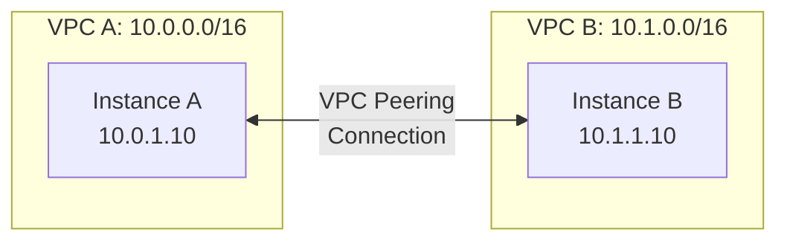
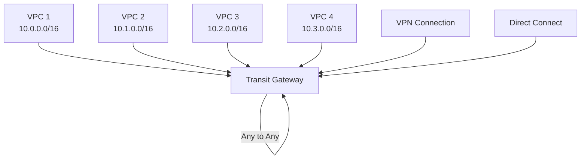
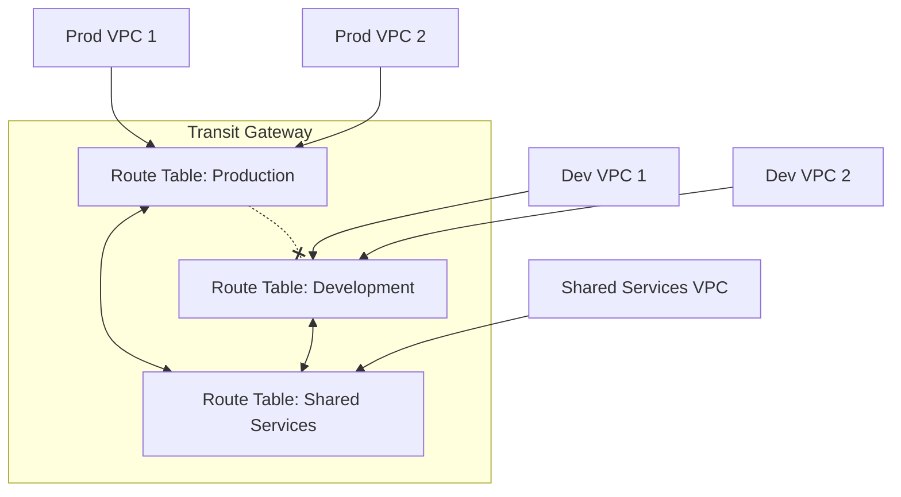
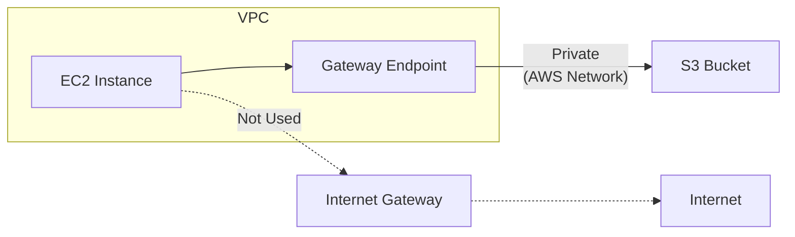
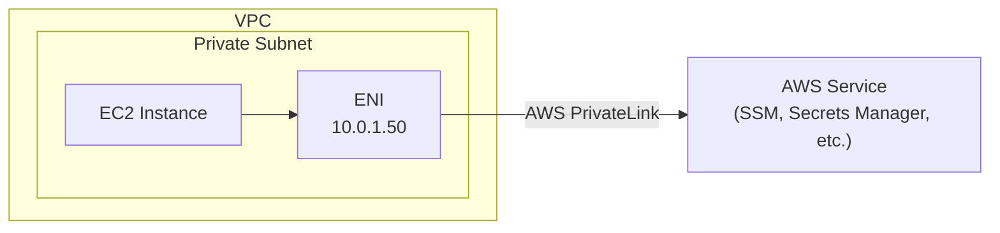
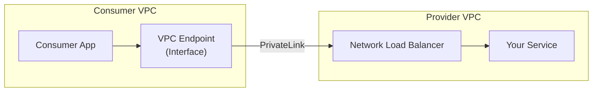
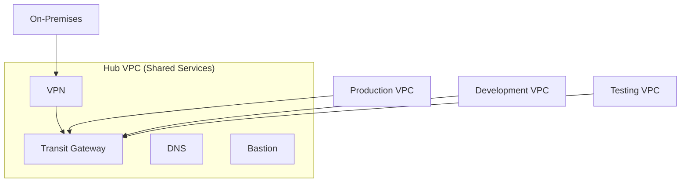
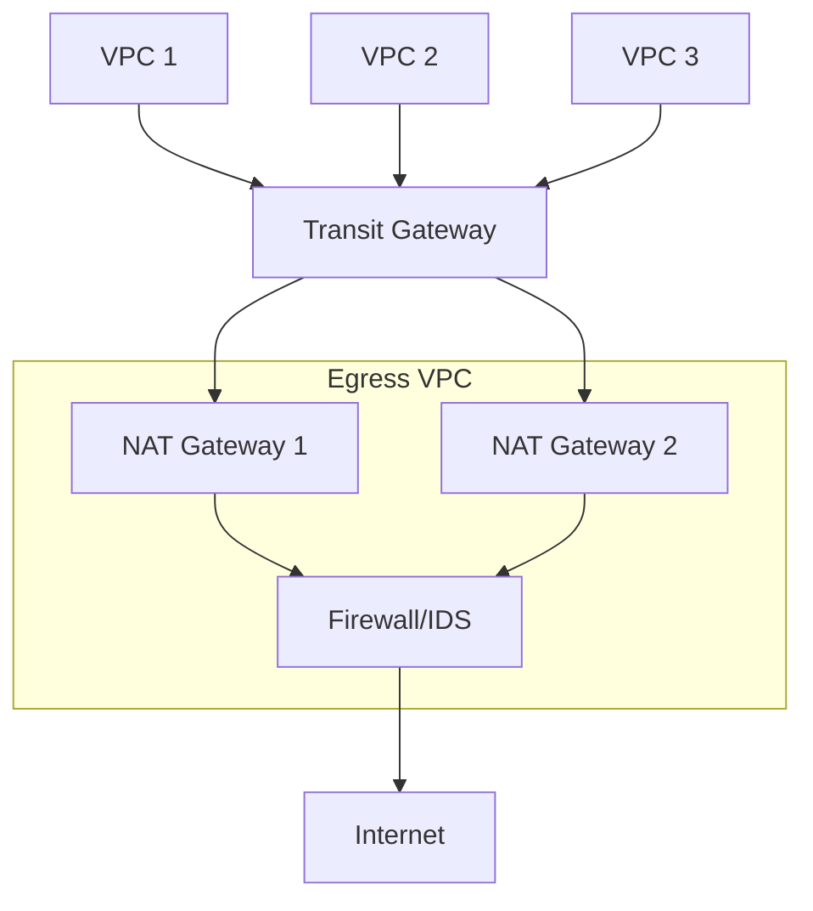

# Networking Advanced

Advanced VPC networking concepts including VPC Peering, Transit Gateway, VPC Endpoints, and PrivateLink.

---

## VPC Peering

VPC Peering connects two VPCs enabling traffic routing using private IP addresses.



### Characteristics

| Feature | VPC Peering |
|---------|-------------|
| **Scope** | Same or different regions |
| **Accounts** | Same or cross-account |
| **Transitivity** | NOT transitive |
| **Bandwidth** | No limit |
| **Cost** | Data transfer charges |

### Creating VPC Peering

```bash
# Request peering connection (from VPC A)
aws ec2 create-vpc-peering-connection \
    --vpc-id vpc-aaaaaaaa \
    --peer-vpc-id vpc-bbbbbbbb \
    --peer-region us-west-2

# Accept peering connection (from VPC B)
aws ec2 accept-vpc-peering-connection \
    --vpc-peering-connection-id pcx-12345678

# Add routes in VPC A route table
aws ec2 create-route \
    --route-table-id rtb-aaaaaaaa \
    --destination-cidr-block 10.1.0.0/16 \
    --vpc-peering-connection-id pcx-12345678

# Add routes in VPC B route table
aws ec2 create-route \
    --route-table-id rtb-bbbbbbbb \
    --destination-cidr-block 10.0.0.0/16 \
    --vpc-peering-connection-id pcx-12345678
```

### VPC Peering Limitations

> [!WARNING]
> VPC Peering is **not transitive**. If A↔B and B↔C, A cannot reach C through B.

```
VPC A ←→ VPC B ←→ VPC C

A can reach B ✓
B can reach C ✓
A can reach C ✗ (need direct peering)
```

**Other limitations:**

- CIDR blocks must not overlap
- One peering connection between any two VPCs
- No edge routing through VPCs

---

## Transit Gateway

AWS Transit Gateway is a **hub-and-spoke** network that simplifies connectivity.



### When to Use Transit Gateway

| Use Case | VPC Peering | Transit Gateway |
|----------|-------------|-----------------|
| 2-3 VPCs | ✓ Simpler | Overkill |
| 5+ VPCs | Complex mesh | ✓ Simplified |
| Transitive routing | ✗ Not supported | ✓ Supported |
| On-premises | Separate VPN per VPC | ✓ Centralized |
| Cross-region | Regional peering | ✓ TGW Peering |

### Creating Transit Gateway

```bash
# Create Transit Gateway
TGW_ID=$(aws ec2 create-transit-gateway \
    --description "Production Transit Gateway" \
    --options "AmazonSideAsn=64512,AutoAcceptSharedAttachments=enable,DefaultRouteTableAssociation=enable,DefaultRouteTablePropagation=enable,VpnEcmpSupport=enable,DnsSupport=enable" \
    --query 'TransitGateway.TransitGatewayId' \
    --output text)

# Attach VPC to Transit Gateway
aws ec2 create-transit-gateway-vpc-attachment \
    --transit-gateway-id $TGW_ID \
    --vpc-id vpc-12345678 \
    --subnet-ids subnet-aaa subnet-bbb

# Add route in VPC route table
aws ec2 create-route \
    --route-table-id rtb-12345678 \
    --destination-cidr-block 10.0.0.0/8 \
    --transit-gateway-id $TGW_ID
```

### Transit Gateway Route Tables

```bash
# Create route table (for segmentation)
aws ec2 create-transit-gateway-route-table \
    --transit-gateway-id tgw-12345678

# Add static route
aws ec2 create-transit-gateway-route \
    --transit-gateway-route-table-id tgw-rtb-12345678 \
    --destination-cidr-block 10.0.0.0/16 \
    --transit-gateway-attachment-id tgw-attach-aaaa

# Associate attachment with route table
aws ec2 associate-transit-gateway-route-table \
    --transit-gateway-route-table-id tgw-rtb-12345678 \
    --transit-gateway-attachment-id tgw-attach-aaaa
```

### Network Segmentation with TGW



---

## VPC Endpoints

VPC Endpoints enable private connectivity to AWS services without using the internet.

### Endpoint Types

| Type | Use Case | Services | Cost |
|------|----------|----------|------|
| **Gateway** | S3, DynamoDB | 2 services only | Free |
| **Interface** | Most AWS services | 100+ services | Per-hour + data |

### Gateway Endpoints



```bash
# Create S3 Gateway Endpoint
aws ec2 create-vpc-endpoint \
    --vpc-id vpc-12345678 \
    --service-name com.amazonaws.us-east-1.s3 \
    --route-table-ids rtb-12345678 rtb-87654321

# Create DynamoDB Gateway Endpoint
aws ec2 create-vpc-endpoint \
    --vpc-id vpc-12345678 \
    --service-name com.amazonaws.us-east-1.dynamodb \
    --route-table-ids rtb-12345678

# List endpoints
aws ec2 describe-vpc-endpoints --vpc-id vpc-12345678
```

### Interface Endpoints



```bash
# Create Interface Endpoint for SSM
aws ec2 create-vpc-endpoint \
    --vpc-id vpc-12345678 \
    --service-name com.amazonaws.us-east-1.ssm \
    --vpc-endpoint-type Interface \
    --subnet-ids subnet-aaa subnet-bbb \
    --security-group-ids sg-12345678 \
    --private-dns-enabled

# Create Secrets Manager Endpoint
aws ec2 create-vpc-endpoint \
    --vpc-id vpc-12345678 \
    --service-name com.amazonaws.us-east-1.secretsmanager \
    --vpc-endpoint-type Interface \
    --subnet-ids subnet-aaa subnet-bbb \
    --security-group-ids sg-12345678 \
    --private-dns-enabled
```

### Common Interface Endpoints

```bash
# For SSM (Session Manager without internet)
com.amazonaws.REGION.ssm
com.amazonaws.REGION.ssmmessages
com.amazonaws.REGION.ec2messages

# For ECR (Pull images without internet)
com.amazonaws.REGION.ecr.api
com.amazonaws.REGION.ecr.dkr
com.amazonaws.REGION.s3 (Gateway - for layers)

# For CloudWatch
com.amazonaws.REGION.logs
com.amazonaws.REGION.monitoring

# For Secrets Manager
com.amazonaws.REGION.secretsmanager
```

### Endpoint Policies

Control which resources can be accessed through the endpoint:

```json
{
  "Version": "2012-10-17",
  "Statement": [
    {
      "Sid": "AllowSpecificBucket",
      "Effect": "Allow",
      "Principal": "*",
      "Action": [
        "s3:GetObject",
        "s3:PutObject"
      ],
      "Resource": "arn:aws:s3:::my-bucket/*"
    }
  ]
}
```

```bash
# Apply endpoint policy
aws ec2 modify-vpc-endpoint \
    --vpc-endpoint-id vpce-12345678 \
    --policy-document file://endpoint-policy.json
```

---

## AWS PrivateLink

PrivateLink enables you to **expose your services** to other VPCs or AWS accounts privately.



### Creating a PrivateLink Service

```bash
# 1. Create NLB (Provider side)
aws elbv2 create-load-balancer \
    --name my-privatelink-nlb \
    --type network \
    --subnets subnet-aaa subnet-bbb

# 2. Create VPC Endpoint Service
aws ec2 create-vpc-endpoint-service-configuration \
    --network-load-balancer-arns arn:aws:elasticloadbalancing:us-east-1:123456789012:loadbalancer/net/my-nlb/1234567890 \
    --acceptance-required

# 3. Consumer creates Interface Endpoint to the service
aws ec2 create-vpc-endpoint \
    --vpc-id vpc-consumer \
    --service-name com.amazonaws.vpce.us-east-1.vpce-svc-12345678 \
    --vpc-endpoint-type Interface \
    --subnet-ids subnet-xxx
```

---

## Traffic Mirroring

Mirror network traffic for deep packet inspection and security analysis.

```bash
# Create mirror target (ENI or NLB)
aws ec2 create-traffic-mirror-target \
    --network-interface-id eni-12345678 \
    --description "Security appliance ENI"

# Create mirror filter
FILTER_ID=$(aws ec2 create-traffic-mirror-filter \
    --description "Mirror all TCP traffic" \
    --query 'TrafficMirrorFilter.TrafficMirrorFilterId' \
    --output text)

# Add filter rule (mirror all TCP)
aws ec2 create-traffic-mirror-filter-rule \
    --traffic-mirror-filter-id $FILTER_ID \
    --traffic-direction ingress \
    --rule-action accept \
    --protocol 6 \
    --rule-number 1

# Create mirror session
aws ec2 create-traffic-mirror-session \
    --network-interface-id eni-source \
    --traffic-mirror-target-id tmt-12345678 \
    --traffic-mirror-filter-id $FILTER_ID \
    --session-number 1
```

---

## VPC Flow Logs Analysis

### Enable Enhanced Flow Logs

```bash
# Create with custom format
aws ec2 create-flow-logs \
    --resource-type VPC \
    --resource-ids vpc-12345678 \
    --traffic-type ALL \
    --log-destination-type s3 \
    --log-destination arn:aws:s3:::my-flowlogs-bucket \
    --log-format '${version} ${account-id} ${interface-id} ${srcaddr} ${dstaddr} ${srcport} ${dstport} ${protocol} ${packets} ${bytes} ${start} ${end} ${action} ${log-status} ${vpc-id} ${subnet-id} ${instance-id}'
```

### Analyze with Athena

```sql
-- Create table
CREATE EXTERNAL TABLE vpc_flow_logs (
    version int,
    account string,
    interface_id string,
    srcaddr string,
    dstaddr string,
    srcport int,
    dstport int,
    protocol int,
    packets bigint,
    bytes bigint,
    start_time bigint,
    end_time bigint,
    action string,
    log_status string
)
ROW FORMAT DELIMITED
FIELDS TERMINATED BY ' '
LOCATION 's3://my-flowlogs-bucket/AWSLogs/123456789012/vpcflowlogs/';

-- Query rejected traffic
SELECT srcaddr, dstaddr, dstport, sum(packets) as total_packets
FROM vpc_flow_logs
WHERE action = 'REJECT'
GROUP BY srcaddr, dstaddr, dstport
ORDER BY total_packets DESC
LIMIT 10;
```

---

## Network Architectures

### Hub and Spoke



### Distributed Egress



---

## Best Practices

### IP Address Management

```
1. Document all CIDR ranges in a central location
2. Reserve space for future growth
3. Use consistent subnet sizing
4. Plan for multi-region from the start
```

### Security

```
1. Use Security Groups as primary control
2. Enable VPC Flow Logs for all VPCs
3. Use VPC Endpoints for AWS services
4. Encrypt data in transit with TLS
5. Use NACLs for subnet-level blocks
```

### High Availability

```
1. Deploy across multiple AZs
2. Use NAT Gateway per AZ
3. Avoid single points of failure
4. Test failover scenarios
```

---

## Next Steps

- **[Networking Connectivity](04_networking_connectivity.md)** - VPN, Direct Connect, Route 53
