# Networking Connectivity

Hybrid and multi-region connectivity options including VPN, Direct Connect, Route 53, and Global Accelerator.

---

## Connectivity Options Overview

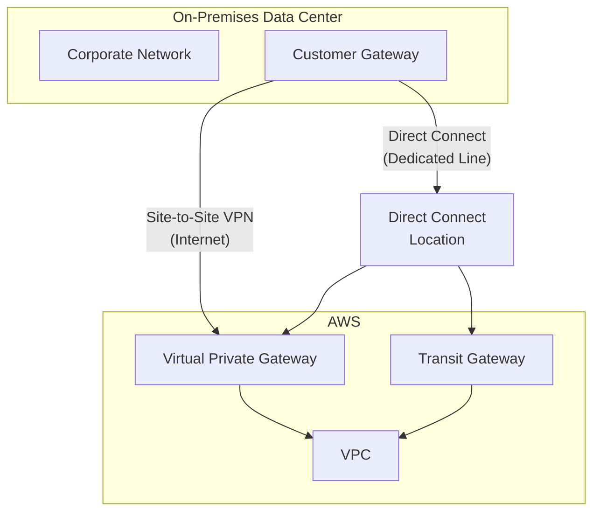

| Option | Bandwidth | Latency | Setup Time | Cost | Encryption |
|--------|-----------|---------|------------|------|------------|
| **Site-to-Site VPN** | Up to 1.25 Gbps | Variable | Minutes | $0.05/hr | Yes (IPsec) |
| **Direct Connect** | 1-100 Gbps | Consistent | Weeks-months | $$/Gbps + port | Optional |
| **Direct Connect + VPN** | 1-100 Gbps | Consistent | Weeks-months | $$$ | Yes |

---

## Site-to-Site VPN

Encrypted connection over the public internet between your network and AWS.

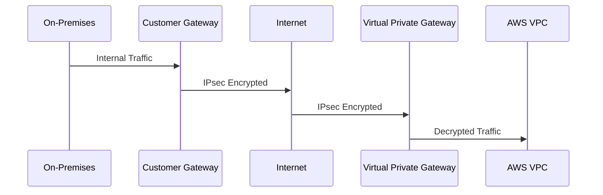

### Components

| Component | Location | Description |
|-----------|----------|-------------|
| **Customer Gateway** | AWS (logical) | Represents your on-prem device |
| **Virtual Private Gateway** | AWS | VPN concentrator on AWS side |
| **VPN Connection** | AWS | Contains 2 tunnels for HA |

### Creating Site-to-Site VPN

```bash
# 1. Create Customer Gateway (represents your router)
CGW_ID=$(aws ec2 create-customer-gateway \
    --type ipsec.1 \
    --public-ip 203.0.113.100 \
    --bgp-asn 65000 \
    --query 'CustomerGateway.CustomerGatewayId' \
    --output text)

# 2. Create Virtual Private Gateway
VGW_ID=$(aws ec2 create-vpn-gateway \
    --type ipsec.1 \
    --amazon-side-asn 64512 \
    --query 'VpnGateway.VpnGatewayId' \
    --output text)

# 3. Attach VGW to VPC
aws ec2 attach-vpn-gateway \
    --vpn-gateway-id $VGW_ID \
    --vpc-id vpc-12345678

# 4. Enable route propagation
aws ec2 enable-vgw-route-propagation \
    --route-table-id rtb-12345678 \
    --gateway-id $VGW_ID

# 5. Create VPN Connection
aws ec2 create-vpn-connection \
    --type ipsec.1 \
    --customer-gateway-id $CGW_ID \
    --vpn-gateway-id $VGW_ID \
    --options '{"StaticRoutesOnly": false}'

# 6. Download configuration for your device
aws ec2 describe-vpn-connections \
    --vpn-connection-ids vpn-12345678 \
    --query 'VpnConnections[0].CustomerGatewayConfiguration'
```

### VPN Routing Options

| Option | Use When | Pros | Cons |
|--------|----------|------|------|
| **BGP (Dynamic)** | Multiple routes, complex networks | Auto failover, route updates | Requires BGP support |
| **Static** | Simple networks, no BGP | Simple setup | Manual route management |

### Accelerated VPN

Uses AWS Global Accelerator for improved performance:

```bash
aws ec2 create-vpn-connection \
    --type ipsec.1 \
    --customer-gateway-id cgw-12345678 \
    --transit-gateway-id tgw-12345678 \
    --options '{"EnableAcceleration": true}'
```

---

## AWS Direct Connect

Dedicated private network connection between your data center and AWS.

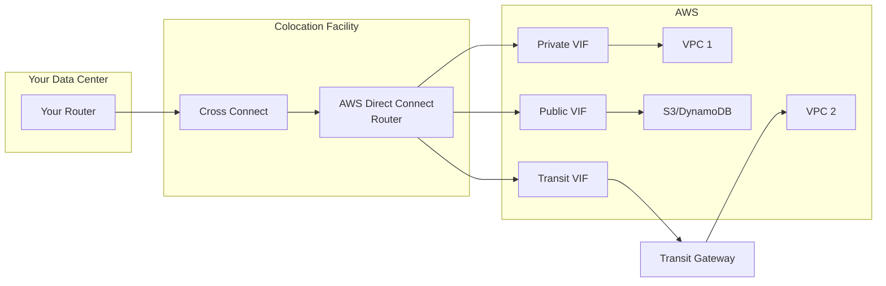

### Direct Connect Components

| Component | Description |
|-----------|-------------|
| **Connection** | Physical connection (1G, 10G, 100G) |
| **Virtual Interface (VIF)** | Logical connection over physical |
| **Private VIF** | Access VPC via private IPs |
| **Public VIF** | Access AWS public services |
| **Transit VIF** | Access Transit Gateway |
| **Direct Connect Gateway** | Connect to multiple VPCs/regions |

### Virtual Interface Types

| VIF Type | Access To | BGP Peering |
|----------|-----------|-------------|
| **Private** | Single VPC (VGW) | Private ASN |
| **Public** | All AWS public endpoints | Public ASN |
| **Transit** | Transit Gateway (many VPCs) | Private ASN |

### Connection Types

| Type | Bandwidth | Delivery | Best For |
|------|-----------|----------|----------|
| **Dedicated** | 1, 10, 100 Gbps | Weeks | High bandwidth, full control |
| **Hosted** | 50 Mbps - 10 Gbps | Days | Lower bandwidth, faster setup |

### Direct Connect Gateway

Connects Direct Connect to multiple VPCs across regions:

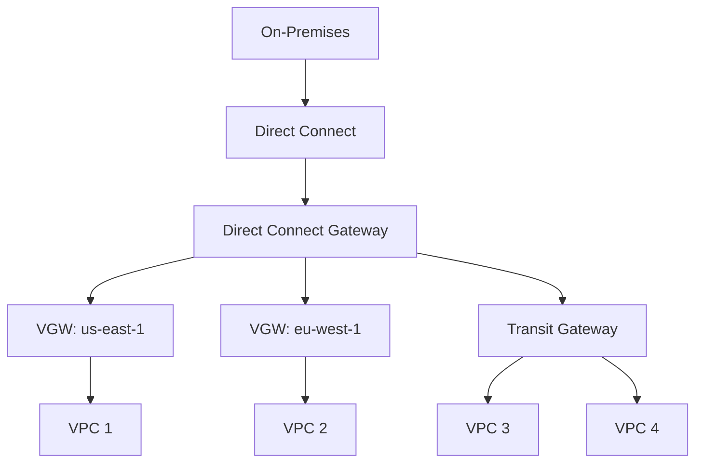

```bash
# Create Direct Connect Gateway
aws directconnect create-direct-connect-gateway \
    --direct-connect-gateway-name my-dx-gateway \
    --amazon-side-asn 64512

# Create Virtual Interface
aws directconnect create-private-virtual-interface \
    --connection-id dxcon-12345678 \
    --new-private-virtual-interface \
        "virtualInterfaceName=my-vif,vlan=101,asn=65000,amazonAddress=192.168.1.1/30,customerAddress=192.168.1.2/30,directConnectGatewayId=dxgw-12345678"
```

### High Availability

> [!IMPORTANT]
> Single Direct Connect connection = Single point of failure. Always implement redundancy for production.

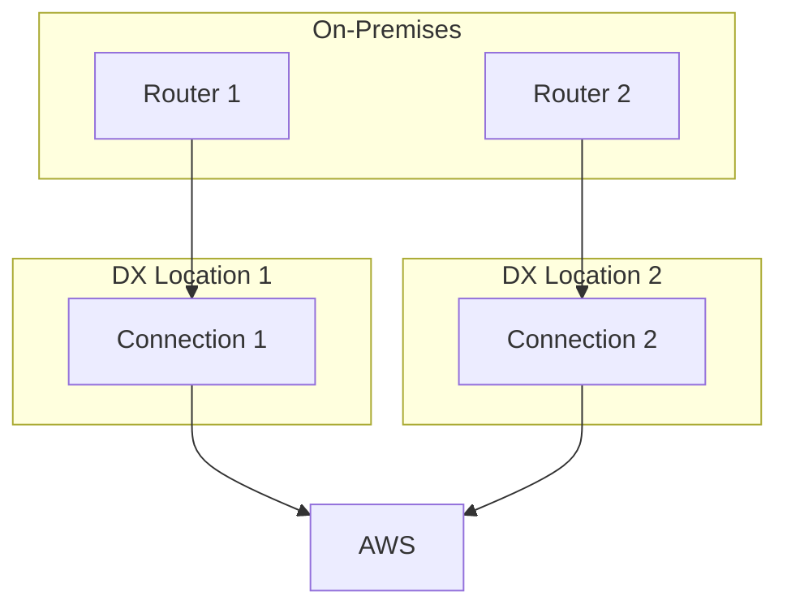

**HA Patterns:**

1. **Dual connections** - Same location (rack-level redundancy)
2. **Dual locations** - Different facilities (site-level redundancy)
3. **DX + VPN backup** - VPN failover for cost optimization

---

## Route 53

AWS DNS service with domain registration, DNS routing, and health checking.

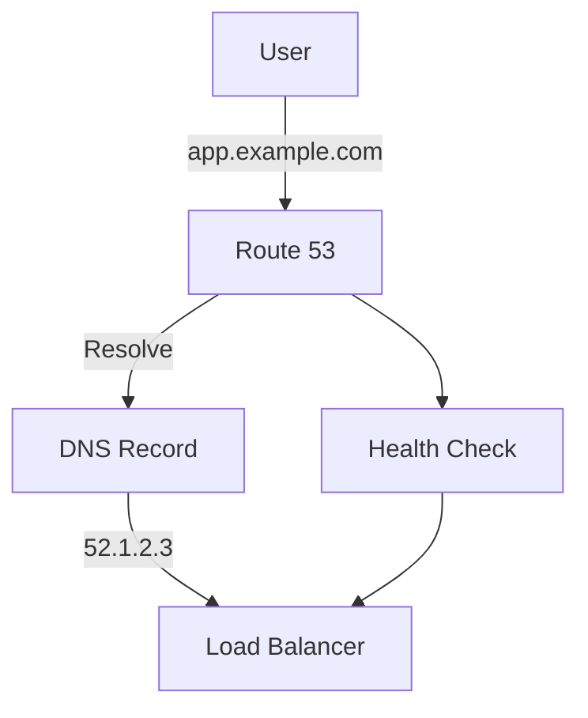

### Hosted Zones

| Type | Description | Use Case |
|------|-------------|----------|
| **Public** | Resolves from internet | Public websites, APIs |
| **Private** | Resolves within VPC(s) | Internal services |

```bash
# Create public hosted zone
aws route53 create-hosted-zone \
    --name example.com \
    --caller-reference $(date +%s)

# Create private hosted zone
aws route53 create-hosted-zone \
    --name internal.example.com \
    --caller-reference $(date +%s) \
    --vpc VPCRegion=us-east-1,VPCId=vpc-12345678 \
    --hosted-zone-config PrivateZone=true
```

### Record Types

| Type | Description | Example |
|------|-------------|---------|
| **A** | IPv4 address | `52.1.2.3` |
| **AAAA** | IPv6 address | `2001:db8::1` |
| **CNAME** | Canonical name | `www → app.example.com` |
| **ALIAS** | AWS resource | `→ d123.cloudfront.net` |
| **MX** | Mail server | `mail.example.com` |
| **TXT** | Text record | SPF, DKIM, verification |
| **NS** | Name servers | Zone delegation |

### Creating Records

```bash
# Create A record
aws route53 change-resource-record-sets \
    --hosted-zone-id Z1234567890 \
    --change-batch '{
        "Changes": [{
            "Action": "CREATE",
            "ResourceRecordSet": {
                "Name": "www.example.com",
                "Type": "A",
                "TTL": 300,
                "ResourceRecords": [{"Value": "52.1.2.3"}]
            }
        }]
    }'

# Create ALIAS record (for ALB, CloudFront, etc.)
aws route53 change-resource-record-sets \
    --hosted-zone-id Z1234567890 \
    --change-batch '{
        "Changes": [{
            "Action": "CREATE",
            "ResourceRecordSet": {
                "Name": "app.example.com",
                "Type": "A",
                "AliasTarget": {
                    "HostedZoneId": "Z35SXDOTRQ7X7K",
                    "DNSName": "my-alb-123.us-east-1.elb.amazonaws.com",
                    "EvaluateTargetHealth": true
                }
            }
        }]
    }'
```

### Routing Policies

| Policy | Description | Use Case |
|--------|-------------|----------|
| **Simple** | Single resource | Basic routing |
| **Weighted** | Distribute by percentage | A/B testing, gradual migration |
| **Latency** | Route to lowest latency region | Multi-region |
| **Failover** | Primary/secondary | Disaster recovery |
| **Geolocation** | Route by user location | Regional content |
| **Geoproximity** | Route by geographic proximity | Traffic shifting |
| **Multi-value** | Multiple healthy resources | Simple load balancing |

### Failover Routing Example

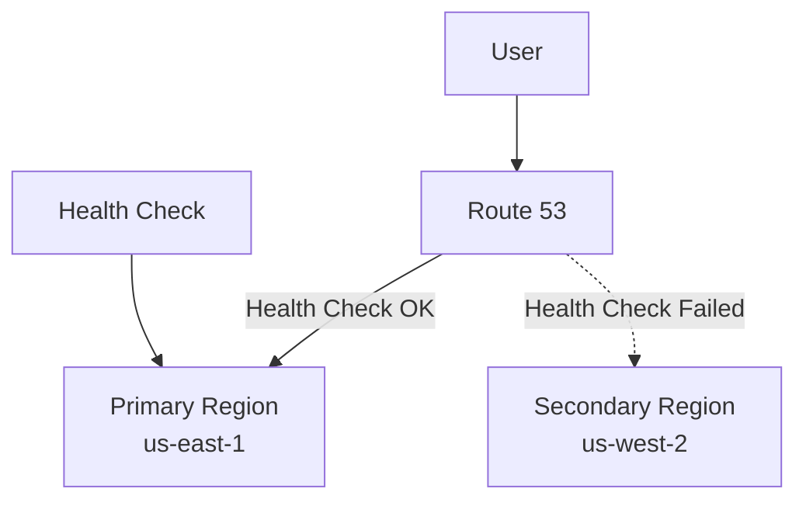

```bash
# Create health check
HC_ID=$(aws route53 create-health-check \
    --caller-reference $(date +%s) \
    --health-check-config '{
        "IPAddress": "52.1.2.3",
        "Port": 443,
        "Type": "HTTPS",
        "ResourcePath": "/health",
        "FullyQualifiedDomainName": "app.example.com",
        "RequestInterval": 30,
        "FailureThreshold": 3
    }' \
    --query 'HealthCheck.Id' \
    --output text)

# Create primary record with health check
aws route53 change-resource-record-sets \
    --hosted-zone-id Z1234567890 \
    --change-batch '{
        "Changes": [{
            "Action": "CREATE",
            "ResourceRecordSet": {
                "Name": "app.example.com",
                "Type": "A",
                "SetIdentifier": "primary",
                "Failover": "PRIMARY",
                "TTL": 60,
                "ResourceRecords": [{"Value": "52.1.2.3"}],
                "HealthCheckId": "'$HC_ID'"
            }
        }]
    }'
```

---

## CloudFront

AWS Content Delivery Network (CDN) for low-latency content delivery.

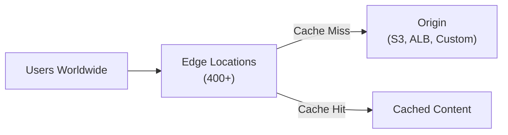

### CloudFront with Custom Origin

```bash
# Create distribution
aws cloudfront create-distribution \
    --distribution-config '{
        "CallerReference": "'$(date +%s)'",
        "Origins": {
            "Quantity": 1,
            "Items": [{
                "Id": "myOrigin",
                "DomainName": "origin.example.com",
                "CustomOriginConfig": {
                    "HTTPPort": 80,
                    "HTTPSPort": 443,
                    "OriginProtocolPolicy": "https-only"
                }
            }]
        },
        "DefaultCacheBehavior": {
            "TargetOriginId": "myOrigin",
            "ViewerProtocolPolicy": "redirect-to-https",
            "AllowedMethods": {
                "Quantity": 2,
                "Items": ["GET", "HEAD"]
            },
            "CachePolicyId": "658327ea-f89d-4fab-a63d-7e88639e58f6"
        },
        "Enabled": true
    }'
```

---

## AWS Global Accelerator

Improves availability and performance using AWS global network.

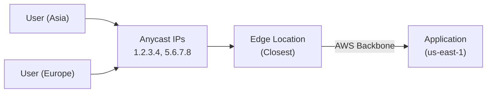

### Global Accelerator vs CloudFront

| Feature | CloudFront | Global Accelerator |
|---------|------------|-------------------|
| **Use Case** | Static/dynamic content | TCP/UDP applications |
| **Caching** | Yes | No |
| **Protocol** | HTTP/HTTPS | TCP/UDP |
| **Health Checks** | Origin-based | Endpoint-based |
| **Static IPs** | No | Yes (Anycast) |

```bash
# Create accelerator
aws globalaccelerator create-accelerator \
    --name my-accelerator \
    --ip-address-type IPV4 \
    --enabled

# Create listener
aws globalaccelerator create-listener \
    --accelerator-arn arn:aws:globalaccelerator::123456789012:accelerator/xxx \
    --port-ranges FromPort=443,ToPort=443 \
    --protocol TCP

# Create endpoint group
aws globalaccelerator create-endpoint-group \
    --listener-arn arn:aws:globalaccelerator::123456789012:accelerator/xxx/listener/yyy \
    --endpoint-group-region us-east-1 \
    --endpoint-configurations '[{"EndpointId": "arn:aws:elasticloadbalancing:..."}]'
```

---

## Multi-Region Architecture

### Active-Passive

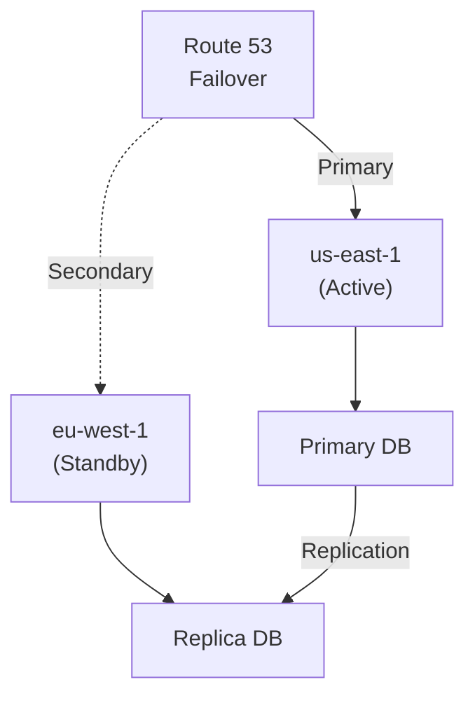

### Active-Active

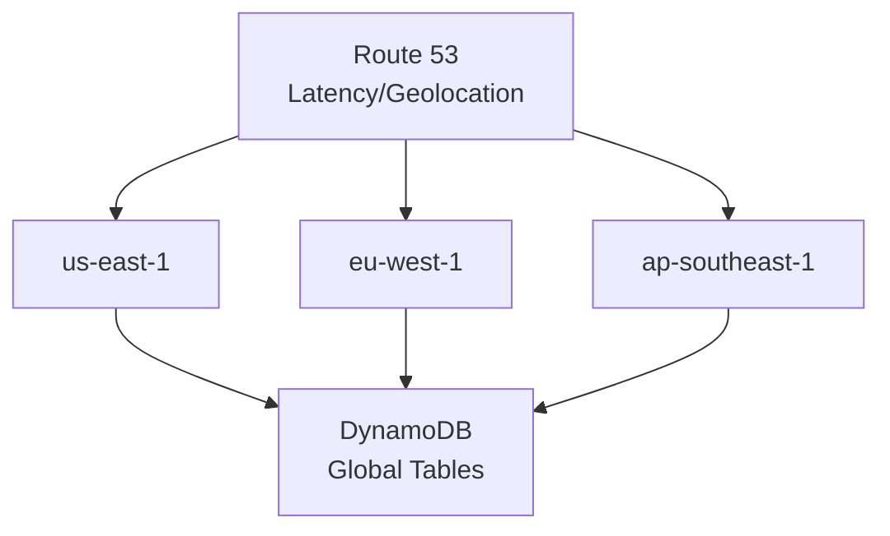

---

## Cost Comparison

| Service | Hourly | Per GB Transfer |
|---------|--------|-----------------|
| **VPN Connection** | $0.05 | $0.09 out |
| **NAT Gateway** | $0.045 | $0.045 |
| **Direct Connect (1G)** | ~$0.30 port | $0.02-0.05 |
| **Transit Gateway** | $0.05/attach | $0.02 |
| **Global Accelerator** | $0.025 | $0.015+ |
| **CloudFront** | Free | $0.01-0.085 |

---

## Next Steps

- **[Compute - EC2](05_compute_ec2.md)** - Virtual servers, instance types, Auto Scaling
