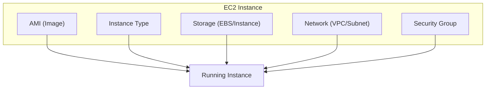
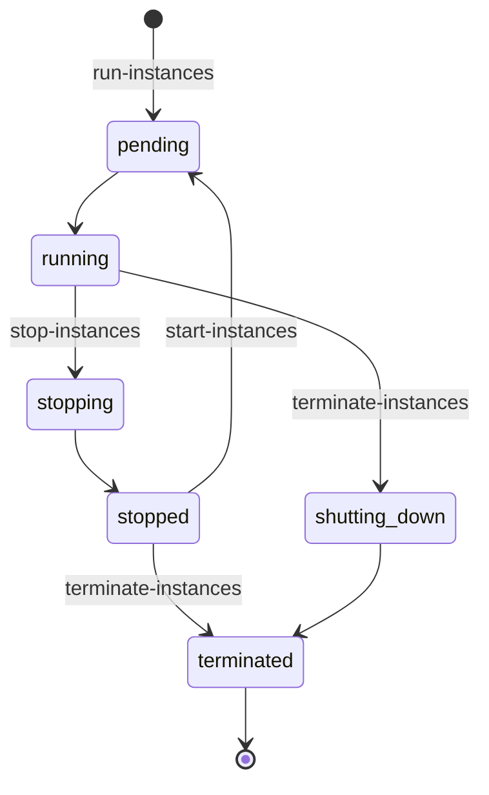
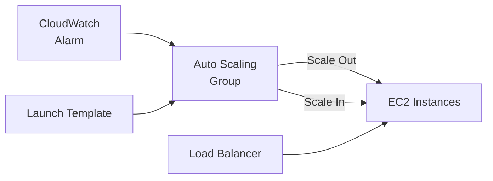

# Compute - EC2

Amazon Elastic Compute Cloud (EC2) provides scalable virtual servers in the cloud.

---

## EC2 Overview



---

## Instance Types

### Instance Type Naming

```
m5.xlarge
│ │  │
│ │  └── Size (nano, micro, small, medium, large, xlarge, 2xlarge...)
│ └───── Generation (higher = newer)
└─────── Family (m = general purpose)
```

### Instance Families

| Family | Use Case | Features |
|--------|----------|----------|
| **M** (General) | Balanced | Web servers, small databases |
| **C** (Compute) | CPU-intensive | Batch processing, gaming |
| **R** (Memory) | Memory-intensive | In-memory databases, caching |
| **T** (Burstable) | Variable workloads | Dev/test, small apps |
| **I** (Storage) | High I/O | NoSQL databases |
| **G/P** (GPU) | Graphics/ML | Machine learning, rendering |
| **X** (Memory) | Extreme memory | SAP HANA, in-memory analytics |

### Common Instance Types

| Type | vCPUs | Memory | Network | Use Case |
|------|-------|--------|---------|----------|
| `t3.micro` | 2 | 1 GB | Low | Free tier, testing |
| `t3.small` | 2 | 2 GB | Low-Mod | Small apps |
| `m5.large` | 2 | 8 GB | Up to 10 Gbps | General workloads |
| `m5.xlarge` | 4 | 16 GB | Up to 10 Gbps | Production |
| `c5.xlarge` | 4 | 8 GB | Up to 10 Gbps | Compute-heavy |
| `r5.xlarge` | 4 | 32 GB | Up to 10 Gbps | Memory-heavy |

```bash
# List available instance types
aws ec2 describe-instance-types \
    --filters "Name=current-generation,Values=true" \
    --query 'InstanceTypes[*].[InstanceType,VCpuInfo.DefaultVCpus,MemoryInfo.SizeInMiB]' \
    --output table
```

---

## Launching Instances

### Basic Launch

```bash
# Launch instance
aws ec2 run-instances \
    --image-id ami-0123456789abcdef0 \
    --instance-type t3.micro \
    --key-name my-key \
    --security-group-ids sg-12345678 \
    --subnet-id subnet-12345678 \
    --tag-specifications 'ResourceType=instance,Tags=[{Key=Name,Value=MyInstance}]'
```

### With User Data

```bash
# Launch with startup script
aws ec2 run-instances \
    --image-id ami-0123456789abcdef0 \
    --instance-type t3.micro \
    --key-name my-key \
    --security-group-ids sg-12345678 \
    --subnet-id subnet-12345678 \
    --user-data file://startup.sh
```

```bash
#!/bin/bash
# startup.sh
yum update -y
yum install -y httpd
systemctl start httpd
systemctl enable httpd
echo "Hello from $(hostname)" > /var/www/html/index.html
```

### Instance Lifecycle



```bash
# Start/Stop/Terminate
aws ec2 start-instances --instance-ids i-1234567890abcdef0
aws ec2 stop-instances --instance-ids i-1234567890abcdef0
aws ec2 terminate-instances --instance-ids i-1234567890abcdef0

# Get instance status
aws ec2 describe-instance-status --instance-ids i-1234567890abcdef0
```

---

## AMIs (Amazon Machine Images)

AMIs are templates containing OS, applications, and configuration.

### Finding AMIs

```bash
# Find Amazon Linux 2023 AMIs
aws ec2 describe-images \
    --owners amazon \
    --filters "Name=name,Values=al2023-ami-*-kernel-*-x86_64" \
    --query 'sort_by(Images, &CreationDate)[-1].[ImageId,Name]' \
    --output text

# Find Ubuntu AMIs
aws ec2 describe-images \
    --owners 099720109477 \
    --filters "Name=name,Values=ubuntu/images/hvm-ssd/ubuntu-jammy-22.04-amd64*" \
    --query 'sort_by(Images, &CreationDate)[-1].[ImageId,Name]' \
    --output text
```

### Creating Custom AMIs

```bash
# Create AMI from running instance
aws ec2 create-image \
    --instance-id i-1234567890abcdef0 \
    --name "MyApp-v1.0-$(date +%Y%m%d)" \
    --description "My application server image" \
    --no-reboot

# Copy AMI to another region
aws ec2 copy-image \
    --source-image-id ami-12345678 \
    --source-region us-east-1 \
    --region us-west-2 \
    --name "MyApp-v1.0-west"
```

---

## Launch Templates

Reusable instance configurations (replaces Launch Configurations).

```bash
# Create launch template
aws ec2 create-launch-template \
    --launch-template-name MyAppTemplate \
    --version-description "v1.0" \
    --launch-template-data '{
        "ImageId": "ami-0123456789abcdef0",
        "InstanceType": "t3.micro",
        "KeyName": "my-key",
        "SecurityGroupIds": ["sg-12345678"],
        "UserData": "'$(base64 -w0 startup.sh)'",
        "TagSpecifications": [{
            "ResourceType": "instance",
            "Tags": [{"Key": "Name", "Value": "MyApp"}]
        }],
        "MetadataOptions": {
            "HttpTokens": "required",
            "HttpEndpoint": "enabled"
        }
    }'

# Launch from template
aws ec2 run-instances \
    --launch-template LaunchTemplateName=MyAppTemplate,Version=1 \
    --subnet-id subnet-12345678

# Create new version
aws ec2 create-launch-template-version \
    --launch-template-name MyAppTemplate \
    --source-version 1 \
    --launch-template-data '{"InstanceType": "t3.small"}'
```

---

## Placement Groups

Control how instances are placed on underlying hardware.

| Type | Description | Use Case |
|------|-------------|----------|
| **Cluster** | Same rack, same AZ | HPC, low latency |
| **Spread** | Distinct hardware | Critical instances |
| **Partition** | Logical partitions | Hadoop, Cassandra |

```bash
# Create cluster placement group
aws ec2 create-placement-group \
    --group-name my-cluster \
    --strategy cluster

# Create spread placement group
aws ec2 create-placement-group \
    --group-name my-spread \
    --strategy spread

# Launch in placement group
aws ec2 run-instances \
    --placement "GroupName=my-cluster" \
    --image-id ami-12345678 \
    --instance-type c5.xlarge \
    --count 5
```

---

## Auto Scaling

Automatically adjust capacity based on demand.



### Create Auto Scaling Group

```bash
# Create ASG
aws autoscaling create-auto-scaling-group \
    --auto-scaling-group-name my-asg \
    --launch-template LaunchTemplateName=MyAppTemplate,Version='$Latest' \
    --min-size 1 \
    --max-size 4 \
    --desired-capacity 2 \
    --vpc-zone-identifier "subnet-aaaa,subnet-bbbb" \
    --target-group-arns arn:aws:elasticloadbalancing:...:targetgroup/my-tg/1234567890 \
    --health-check-type ELB \
    --health-check-grace-period 300
```

### Scaling Policies

```bash
# Target tracking (recommended)
aws autoscaling put-scaling-policy \
    --auto-scaling-group-name my-asg \
    --policy-name cpu-tracking \
    --policy-type TargetTrackingScaling \
    --target-tracking-configuration '{
        "PredefinedMetricSpecification": {
            "PredefinedMetricType": "ASGAverageCPUUtilization"
        },
        "TargetValue": 50.0
    }'

# Step scaling
aws autoscaling put-scaling-policy \
    --auto-scaling-group-name my-asg \
    --policy-name scale-out \
    --policy-type StepScaling \
    --adjustment-type ChangeInCapacity \
    --step-adjustments '[
        {"MetricIntervalLowerBound": 0, "MetricIntervalUpperBound": 20, "ScalingAdjustment": 1},
        {"MetricIntervalLowerBound": 20, "ScalingAdjustment": 2}
    ]'

# Scheduled scaling
aws autoscaling put-scheduled-update-group-action \
    --auto-scaling-group-name my-asg \
    --scheduled-action-name scale-up-morning \
    --recurrence "0 8 * * MON-FRI" \
    --desired-capacity 4

aws autoscaling put-scheduled-update-group-action \
    --auto-scaling-group-name my-asg \
    --scheduled-action-name scale-down-evening \
    --recurrence "0 18 * * MON-FRI" \
    --desired-capacity 2
```

---

## Purchasing Options

| Option | Discount | Commitment | Best For |
|--------|----------|------------|----------|
| **On-Demand** | None | None | Variable, unpredictable |
| **Reserved** | Up to 72% | 1-3 years | Steady-state workloads |
| **Savings Plans** | Up to 72% | 1-3 years | Flexible across types |
| **Spot** | Up to 90% | None | Fault-tolerant, flexible |
| **Dedicated Hosts** | Varies | 1-3 years | Compliance, licensing |

### Spot Instances

```bash
# Request Spot Instance
aws ec2 request-spot-instances \
    --instance-count 1 \
    --type "one-time" \
    --launch-specification '{
        "ImageId": "ami-12345678",
        "InstanceType": "c5.xlarge",
        "KeyName": "my-key",
        "SecurityGroupIds": ["sg-12345678"],
        "SubnetId": "subnet-12345678"
    }'

# Check current Spot prices
aws ec2 describe-spot-price-history \
    --instance-types c5.xlarge \
    --product-descriptions "Linux/UNIX" \
    --start-time $(date -u +%Y-%m-%dT%H:%M:%SZ)
```

### Spot with Auto Scaling

```bash
# Mixed instances ASG (On-Demand + Spot)
aws autoscaling create-auto-scaling-group \
    --auto-scaling-group-name my-mixed-asg \
    --mixed-instances-policy '{
        "LaunchTemplate": {
            "LaunchTemplateSpecification": {
                "LaunchTemplateName": "MyAppTemplate",
                "Version": "$Latest"
            },
            "Overrides": [
                {"InstanceType": "c5.xlarge"},
                {"InstanceType": "c5a.xlarge"},
                {"InstanceType": "c5n.xlarge"}
            ]
        },
        "InstancesDistribution": {
            "OnDemandBaseCapacity": 1,
            "OnDemandPercentageAboveBaseCapacity": 25,
            "SpotAllocationStrategy": "capacity-optimized"
        }
    }' \
    --min-size 2 \
    --max-size 10 \
    --vpc-zone-identifier "subnet-aaaa,subnet-bbbb"
```

---

## Instance Metadata Service (IMDS)

Access instance metadata from within the instance.

```bash
# IMDSv2 (recommended - requires token)
TOKEN=$(curl -X PUT "http://169.254.169.254/latest/api/token" \
    -H "X-aws-ec2-metadata-token-ttl-seconds: 21600")

curl -H "X-aws-ec2-metadata-token: $TOKEN" \
    http://169.254.169.254/latest/meta-data/instance-id

curl -H "X-aws-ec2-metadata-token: $TOKEN" \
    http://169.254.169.254/latest/meta-data/local-ipv4

curl -H "X-aws-ec2-metadata-token: $TOKEN" \
    http://169.254.169.254/latest/meta-data/iam/security-credentials/

# Get instance identity document  
curl -H "X-aws-ec2-metadata-token: $TOKEN" \
    http://169.254.169.254/latest/dynamic/instance-identity/document
```

> [!IMPORTANT]
> Always use **IMDSv2** (token-required) for security. Enforce it:
>
> ```bash
> aws ec2 modify-instance-metadata-options \
>     --instance-id i-1234567890abcdef0 \
>     --http-tokens required
> ```

---

## Elastic Load Balancing

### Load Balancer Types

| Type | Layer | Use Case | Protocols |
|------|-------|----------|-----------|
| **ALB** | 7 | HTTP/HTTPS apps | HTTP, HTTPS, gRPC |
| **NLB** | 4 | Ultra-low latency | TCP, UDP, TLS |
| **GLB** | 3 | Appliances | IP |
| **CLB** | 4/7 | Legacy | HTTP, TCP |

### Create Application Load Balancer

```bash
# Create ALB
ALB_ARN=$(aws elbv2 create-load-balancer \
    --name my-alb \
    --subnets subnet-aaaa subnet-bbbb \
    --security-groups sg-12345678 \
    --query 'LoadBalancers[0].LoadBalancerArn' \
    --output text)

# Create target group
TG_ARN=$(aws elbv2 create-target-group \
    --name my-targets \
    --protocol HTTP \
    --port 80 \
    --vpc-id vpc-12345678 \
    --health-check-path /health \
    --query 'TargetGroups[0].TargetGroupArn' \
    --output text)

# Create listener
aws elbv2 create-listener \
    --load-balancer-arn $ALB_ARN \
    --protocol HTTP \
    --port 80 \
    --default-actions Type=forward,TargetGroupArn=$TG_ARN

# Register targets
aws elbv2 register-targets \
    --target-group-arn $TG_ARN \
    --targets Id=i-1234567890abcdef0 Id=i-0987654321fedcba0
```

---

## Best Practices

### Security

1. **Use IAM roles** instead of access keys on instances
2. **Enable IMDSv2** (token-required)
3. **Use security groups** with least privilege
4. **Encrypt EBS volumes** by default

### Cost

1. **Right-size instances** using Compute Optimizer
2. **Use Spot for flexible workloads**
3. **Reserved Instances** for stable workloads
4. **Stop non-production** instances off-hours

### Availability

1. **Deploy across multiple AZs**
2. **Use Auto Scaling** for resilience
3. **Use Launch Templates** for consistency
4. **Health checks** with load balancer

---

## Next Steps

- **[Compute - Containers](06_compute_containers.md)** - ECS, EKS, Fargate
