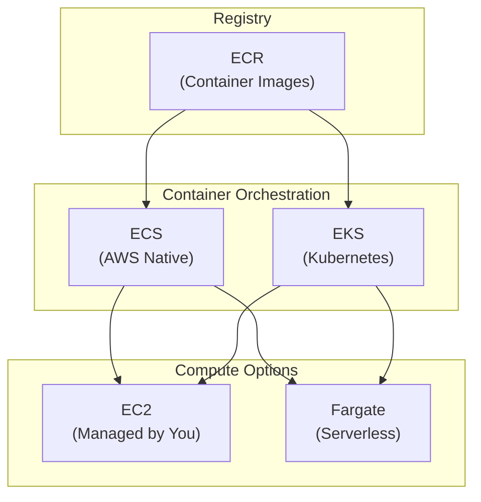
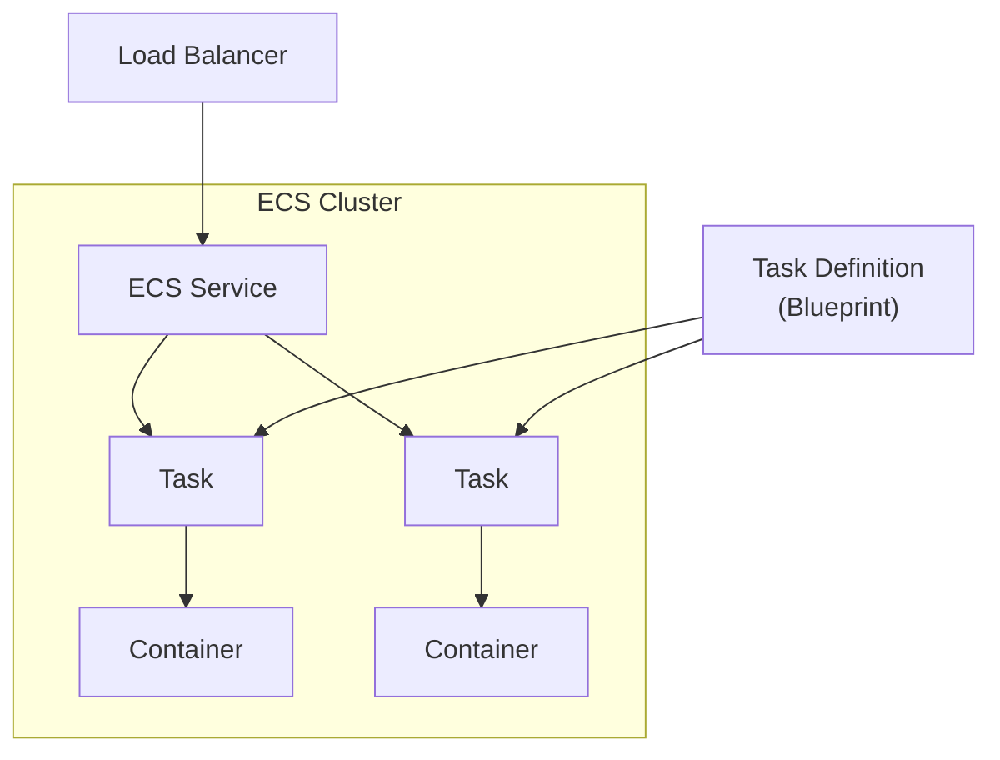
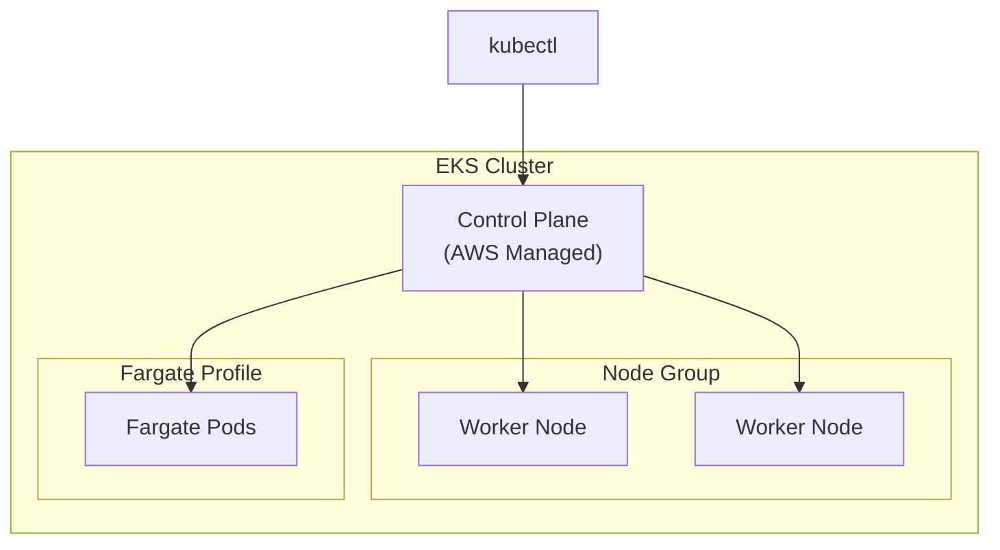

# Compute - Containers

Container services in AWS: ECS, EKS, Fargate, and ECR.

---

## Container Options Overview



| Service | Choose When |
|---------|-------------|
| **ECS** | AWS-native, simpler, smaller teams |
| **EKS** | Kubernetes expertise, portability |
| **Fargate** | Serverless, no infrastructure |
| **EC2** | Control over instances, GPUs |

---

## Amazon ECR

Elastic Container Registry for storing Docker images.

```bash
# Authenticate Docker to ECR
aws ecr get-login-password --region us-east-1 | \
    docker login --username AWS --password-stdin \
    123456789012.dkr.ecr.us-east-1.amazonaws.com

# Create repository
aws ecr create-repository \
    --repository-name my-app \
    --image-scanning-configuration scanOnPush=true

# Tag and push image
docker tag my-app:latest \
    123456789012.dkr.ecr.us-east-1.amazonaws.com/my-app:latest
    
docker push 123456789012.dkr.ecr.us-east-1.amazonaws.com/my-app:latest

# List images
aws ecr list-images --repository-name my-app

# Delete old images
aws ecr batch-delete-image \
    --repository-name my-app \
    --image-ids imageTag=old-version
```

### Lifecycle Policies

```bash
# Automatically clean up old images
aws ecr put-lifecycle-policy \
    --repository-name my-app \
    --lifecycle-policy-text '{
        "rules": [{
            "rulePriority": 1,
            "description": "Keep last 10 images",
            "selection": {
                "tagStatus": "any",
                "countType": "imageCountMoreThan",
                "countNumber": 10
            },
            "action": {"type": "expire"}
        }]
    }'
```

---

## Amazon ECS

Elastic Container Service - AWS-native container orchestration.



### ECS Components

| Component | Description |
|-----------|-------------|
| **Cluster** | Logical grouping of resources |
| **Task Definition** | Blueprint (image, CPU, memory, ports) |
| **Task** | Running instance of task definition |
| **Service** | Maintains desired task count |

### Create ECS Cluster

```bash
# Create Fargate cluster
aws ecs create-cluster \
    --cluster-name my-cluster \
    --capacity-providers FARGATE FARGATE_SPOT

# Create EC2 cluster with capacity provider
aws ecs create-cluster \
    --cluster-name my-ec2-cluster \
    --capacity-providers my-capacity-provider
```

### Task Definition

```json
{
  "family": "my-app",
  "networkMode": "awsvpc",
  "requiresCompatibilities": ["FARGATE"],
  "cpu": "256",
  "memory": "512",
  "executionRoleArn": "arn:aws:iam::123456789012:role/ecsTaskExecutionRole",
  "taskRoleArn": "arn:aws:iam::123456789012:role/ecsTaskRole",
  "containerDefinitions": [
    {
      "name": "my-app",
      "image": "123456789012.dkr.ecr.us-east-1.amazonaws.com/my-app:latest",
      "essential": true,
      "portMappings": [
        {
          "containerPort": 8080,
          "protocol": "tcp"
        }
      ],
      "environment": [
        {"name": "ENV", "value": "production"}
      ],
      "secrets": [
        {
          "name": "DB_PASSWORD",
          "valueFrom": "arn:aws:secretsmanager:us-east-1:123456789012:secret:db-password"
        }
      ],
      "logConfiguration": {
        "logDriver": "awslogs",
        "options": {
          "awslogs-group": "/ecs/my-app",
          "awslogs-region": "us-east-1",
          "awslogs-stream-prefix": "ecs"
        }
      },
      "healthCheck": {
        "command": ["CMD-SHELL", "curl -f http://localhost:8080/health || exit 1"],
        "interval": 30,
        "timeout": 5,
        "retries": 3
      }
    }
  ]
}
```

```bash
# Register task definition
aws ecs register-task-definition --cli-input-json file://task-definition.json
```

### Create Service

```bash
# Create service with ALB
aws ecs create-service \
    --cluster my-cluster \
    --service-name my-service \
    --task-definition my-app:1 \
    --desired-count 2 \
    --launch-type FARGATE \
    --network-configuration '{
        "awsvpcConfiguration": {
            "subnets": ["subnet-aaaa", "subnet-bbbb"],
            "securityGroups": ["sg-12345678"],
            "assignPublicIp": "DISABLED"
        }
    }' \
    --load-balancers '[{
        "targetGroupArn": "arn:aws:elasticloadbalancing:...:targetgroup/my-tg/...",
        "containerName": "my-app",
        "containerPort": 8080
    }]'

# Update service (deploy new version)
aws ecs update-service \
    --cluster my-cluster \
    --service my-service \
    --task-definition my-app:2 \
    --force-new-deployment
```

### Service Auto Scaling

```bash
# Register scalable target
aws application-autoscaling register-scalable-target \
    --service-namespace ecs \
    --resource-id service/my-cluster/my-service \
    --scalable-dimension ecs:service:DesiredCount \
    --min-capacity 1 \
    --max-capacity 10

# Create scaling policy
aws application-autoscaling put-scaling-policy \
    --service-namespace ecs \
    --resource-id service/my-cluster/my-service \
    --scalable-dimension ecs:service:DesiredCount \
    --policy-name cpu-scaling \
    --policy-type TargetTrackingScaling \
    --target-tracking-scaling-policy-configuration '{
        "PredefinedMetricSpecification": {
            "PredefinedMetricType": "ECSServiceAverageCPUUtilization"
        },
        "TargetValue": 70.0
    }'
```

---

## Amazon EKS

Elastic Kubernetes Service - Managed Kubernetes.



### Create EKS Cluster

```bash
# Using eksctl (recommended)
eksctl create cluster \
    --name my-cluster \
    --region us-east-1 \
    --version 1.28 \
    --nodegroup-name standard-nodes \
    --node-type t3.medium \
    --nodes 2 \
    --nodes-min 1 \
    --nodes-max 4 \
    --managed

# Update kubeconfig
aws eks update-kubeconfig --region us-east-1 --name my-cluster

# Verify
kubectl get nodes
```

### AWS CLI Method

```bash
# Create cluster
aws eks create-cluster \
    --name my-cluster \
    --role-arn arn:aws:iam::123456789012:role/eksClusterRole \
    --resources-vpc-config subnetIds=subnet-aaaa,subnet-bbbb,securityGroupIds=sg-12345678

# Wait for cluster
aws eks wait cluster-active --name my-cluster

# Create node group
aws eks create-nodegroup \
    --cluster-name my-cluster \
    --nodegroup-name standard-nodes \
    --node-role arn:aws:iam::123456789012:role/eksNodeRole \
    --subnets subnet-aaaa subnet-bbbb \
    --instance-types t3.medium \
    --scaling-config minSize=1,maxSize=4,desiredSize=2
```

### EKS with Fargate

```bash
# Create Fargate profile
aws eks create-fargate-profile \
    --cluster-name my-cluster \
    --fargate-profile-name my-fargate-profile \
    --pod-execution-role-arn arn:aws:iam::123456789012:role/eksFargatePodRole \
    --subnets subnet-aaaa subnet-bbbb \
    --selectors namespace=default,labels={app=my-app}
```

### IRSA (IAM Roles for Service Accounts)

```bash
# Associate OIDC provider
eksctl utils associate-iam-oidc-provider \
    --cluster my-cluster \
    --approve

# Create service account with IAM role
eksctl create iamserviceaccount \
    --name s3-reader \
    --namespace default \
    --cluster my-cluster \
    --attach-policy-arn arn:aws:iam::aws:policy/AmazonS3ReadOnlyAccess \
    --approve
```

### Deploy Application

```yaml
# deployment.yaml
apiVersion: apps/v1
kind: Deployment
metadata:
  name: my-app
spec:
  replicas: 3
  selector:
    matchLabels:
      app: my-app
  template:
    metadata:
      labels:
        app: my-app
    spec:
      serviceAccountName: s3-reader
      containers:
      - name: my-app
        image: 123456789012.dkr.ecr.us-east-1.amazonaws.com/my-app:latest
        ports:
        - containerPort: 8080
        resources:
          requests:
            memory: "256Mi"
            cpu: "250m"
          limits:
            memory: "512Mi"
            cpu: "500m"
---
apiVersion: v1
kind: Service
metadata:
  name: my-app
spec:
  type: LoadBalancer
  ports:
  - port: 80
    targetPort: 8080
  selector:
    app: my-app
```

```bash
kubectl apply -f deployment.yaml
kubectl get pods
kubectl get svc
```

---

## AWS Fargate

Serverless compute for containers - no infrastructure management.

### Fargate Pricing

| Resource | Price (us-east-1) |
|----------|-------------------|
| vCPU | $0.04048/hour |
| Memory | $0.004445/GB/hour |

**Example**: 0.5 vCPU + 1GB RAM = ~$0.025/hour = ~$18/month

### Fargate vs EC2

| Factor | Fargate | EC2 |
|--------|---------|-----|
| **Management** | None | You manage instances |
| **Scaling** | Per-task | Per-instance |
| **Pricing** | Per-task resources | Per-instance |
| **GPU** | Not supported | Supported |
| **Cost (high utilization)** | Higher | Lower |

---

## AWS App Runner

Fully managed container service - simplest option.

```bash
# Create service from ECR
aws apprunner create-service \
    --service-name my-service \
    --source-configuration '{
        "ImageRepository": {
            "ImageIdentifier": "123456789012.dkr.ecr.us-east-1.amazonaws.com/my-app:latest",
            "ImageConfiguration": {
                "Port": "8080"
            },
            "ImageRepositoryType": "ECR"
        },
        "AutoDeploymentsEnabled": true,
        "AuthenticationConfiguration": {
            "AccessRoleArn": "arn:aws:iam::123456789012:role/AppRunnerECRAccessRole"
        }
    }' \
    --instance-configuration '{
        "Cpu": "1024",
        "Memory": "2048"
    }'
```

---

## Comparison Summary

| Feature | ECS/Fargate | EKS/Fargate | App Runner |
|---------|-------------|-------------|------------|
| **Complexity** | Medium | High | Low |
| **Portability** | AWS only | Kubernetes anywhere | AWS only |
| **Control** | High | Very High | Limited |
| **Pricing** | Pay for resources | $0.10/hr control plane + resources | Per-request + resources |
| **Best For** | AWS-first teams | K8s expertise | Simple web apps |

---

## Best Practices

### Security

1. **Use private registries** (ECR) with scanning
2. **IAM roles** for tasks (IRSA for EKS)
3. **Non-root containers** - drop privileges
4. **Secrets Manager** for sensitive data

### Cost

1. **Right-size tasks** - monitor and adjust
2. **Fargate Spot** for fault-tolerant workloads
3. **Cluster Auto Scaler** for EKS
4. **Capacity Providers** for ECS

### Availability

1. **Multi-AZ deployment**
2. **Health checks** and auto-recovery
3. **Rolling deployments** with rollback
4. **Pod Disruption Budgets** (EKS)

---

## Next Steps

- **[Storage - S3](07_storage_s3.md)** - Object storage fundamentals
