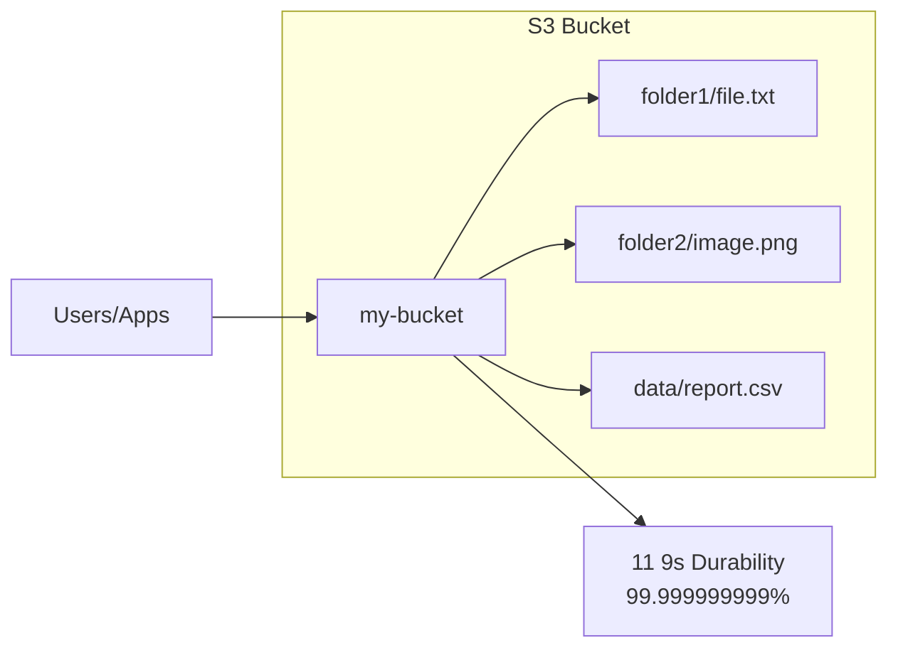

# Storage - S3

Amazon Simple Storage Service (S3) is object storage with unlimited scale.

---

## S3 Overview



### Key Concepts

| Concept | Description |
|---------|-------------|
| **Bucket** | Container for objects (globally unique name) |
| **Object** | File + metadata (up to 5TB) |
| **Key** | Full path to object (folder1/file.txt) |
| **Version ID** | Version identifier when versioning enabled |
| **Metadata** | Key-value pairs attached to object |

---

## Creating Buckets

```bash
# Create bucket
aws s3 mb s3://my-unique-bucket-name-12345

# Create with specific region
aws s3api create-bucket \
    --bucket my-bucket \
    --region us-west-2 \
    --create-bucket-configuration LocationConstraint=us-west-2

# Enable versioning
aws s3api put-bucket-versioning \
    --bucket my-bucket \
    --versioning-configuration Status=Enabled

# Block public access (recommended)
aws s3api put-public-access-block \
    --bucket my-bucket \
    --public-access-block-configuration '{
        "BlockPublicAcls": true,
        "IgnorePublicAcls": true,
        "BlockPublicPolicy": true,
        "RestrictPublicBuckets": true
    }'
```

---

## Object Operations

```bash
# Upload file
aws s3 cp file.txt s3://my-bucket/

# Upload with metadata
aws s3 cp file.txt s3://my-bucket/ \
    --metadata '{"project":"demo","version":"1.0"}'

# Upload folder (recursive)
aws s3 sync ./local-folder s3://my-bucket/folder/

# Download
aws s3 cp s3://my-bucket/file.txt ./

# List objects
aws s3 ls s3://my-bucket/
aws s3 ls s3://my-bucket/ --recursive

# Delete
aws s3 rm s3://my-bucket/file.txt

# Delete folder
aws s3 rm s3://my-bucket/folder/ --recursive

# Move/rename
aws s3 mv s3://my-bucket/old.txt s3://my-bucket/new.txt
```

### Multipart Upload (Large Files)

```bash
# Automatic with aws s3 cp (files > 8MB)
aws s3 cp large-file.zip s3://my-bucket/

# Manual control
aws s3api create-multipart-upload --bucket my-bucket --key large-file.zip
# Upload parts...
aws s3api complete-multipart-upload --bucket my-bucket --key large-file.zip \
    --upload-id $UPLOAD_ID --multipart-upload file://parts.json
```

---

## Storage Classes

| Class | Durability | Availability | Min Duration | Use Case |
|-------|------------|--------------|--------------|----------|
| **Standard** | 99.999999999% | 99.99% | None | Frequently accessed |
| **Intelligent-Tiering** | 99.999999999% | 99.9% | None | Unknown patterns |
| **Standard-IA** | 99.999999999% | 99.9% | 30 days | Infrequent access |
| **One Zone-IA** | 99.999999999% | 99.5% | 30 days | Reproducible data |
| **Glacier Instant** | 99.999999999% | 99.9% | 90 days | Archive, instant access |
| **Glacier Flexible** | 99.999999999% | 99.99% | 90 days | Archive, minutes-hours |
| **Glacier Deep** | 99.999999999% | 99.99% | 180 days | Long-term archive |

```bash
# Upload with storage class
aws s3 cp file.txt s3://my-bucket/ --storage-class STANDARD_IA

# Change storage class
aws s3 cp s3://my-bucket/file.txt s3://my-bucket/file.txt --storage-class GLACIER
```

---

## Lifecycle Policies

Automate transitions and expirations.

```json
{
  "Rules": [
    {
      "ID": "MoveToIAAfter30Days",
      "Status": "Enabled",
      "Filter": {"Prefix": "logs/"},
      "Transitions": [
        {"Days": 30, "StorageClass": "STANDARD_IA"},
        {"Days": 90, "StorageClass": "GLACIER"},
        {"Days": 365, "StorageClass": "DEEP_ARCHIVE"}
      ],
      "Expiration": {"Days": 730}
    },
    {
      "ID": "DeleteOldVersions",
      "Status": "Enabled",
      "Filter": {},
      "NoncurrentVersionExpiration": {"NoncurrentDays": 30}
    },
    {
      "ID": "AbortIncompleteUploads",
      "Status": "Enabled",
      "Filter": {},
      "AbortIncompleteMultipartUpload": {"DaysAfterInitiation": 7}
    }
  ]
}
```

```bash
aws s3api put-bucket-lifecycle-configuration \
    --bucket my-bucket \
    --lifecycle-configuration file://lifecycle.json
```

---

## Security

### Bucket Policies

```json
{
  "Version": "2012-10-17",
  "Statement": [
    {
      "Sid": "AllowSpecificAccount",
      "Effect": "Allow",
      "Principal": {"AWS": "arn:aws:iam::123456789012:root"},
      "Action": ["s3:GetObject", "s3:PutObject"],
      "Resource": "arn:aws:s3:::my-bucket/*"
    },
    {
      "Sid": "DenyUnencryptedUploads",
      "Effect": "Deny",
      "Principal": "*",
      "Action": "s3:PutObject",
      "Resource": "arn:aws:s3:::my-bucket/*",
      "Condition": {
        "StringNotEquals": {
          "s3:x-amz-server-side-encryption": "aws:kms"
        }
      }
    }
  ]
}
```

```bash
aws s3api put-bucket-policy --bucket my-bucket --policy file://policy.json
```

### Encryption

```bash
# Default encryption (SSE-S3)
aws s3api put-bucket-encryption \
    --bucket my-bucket \
    --server-side-encryption-configuration '{
        "Rules": [{
            "ApplyServerSideEncryptionByDefault": {
                "SSEAlgorithm": "AES256"
            }
        }]
    }'

# Default encryption (SSE-KMS)
aws s3api put-bucket-encryption \
    --bucket my-bucket \
    --server-side-encryption-configuration '{
        "Rules": [{
            "ApplyServerSideEncryptionByDefault": {
                "SSEAlgorithm": "aws:kms",
                "KMSMasterKeyID": "arn:aws:kms:us-east-1:123456789012:key/xxx"
            },
            "BucketKeyEnabled": true
        }]
    }'
```

---

## Versioning

```bash
# Enable versioning
aws s3api put-bucket-versioning \
    --bucket my-bucket \
    --versioning-configuration Status=Enabled

# List versions
aws s3api list-object-versions --bucket my-bucket --prefix file.txt

# Get specific version
aws s3api get-object \
    --bucket my-bucket \
    --key file.txt \
    --version-id "versionId123" \
    downloaded-file.txt

# Delete specific version
aws s3api delete-object \
    --bucket my-bucket \
    --key file.txt \
    --version-id "versionId123"
```

---

## Replication

```bash
# Enable cross-region replication
aws s3api put-bucket-replication \
    --bucket source-bucket \
    --replication-configuration '{
        "Role": "arn:aws:iam::123456789012:role/S3ReplicationRole",
        "Rules": [{
            "Status": "Enabled",
            "Priority": 1,
            "DeleteMarkerReplication": {"Status": "Disabled"},
            "Filter": {},
            "Destination": {
                "Bucket": "arn:aws:s3:::destination-bucket",
                "StorageClass": "STANDARD_IA"
            }
        }]
    }'
```

---

## Static Website Hosting

```bash
# Enable static website
aws s3 website s3://my-bucket/ \
    --index-document index.html \
    --error-document error.html

# Public read policy (if Block Public Access disabled)
aws s3api put-bucket-policy --bucket my-bucket --policy '{
    "Version": "2012-10-17",
    "Statement": [{
        "Sid": "PublicReadGetObject",
        "Effect": "Allow",
        "Principal": "*",
        "Action": "s3:GetObject",
        "Resource": "arn:aws:s3:::my-bucket/*"
    }]
}'

# Website URL: http://my-bucket.s3-website-us-east-1.amazonaws.com
```

---

## Pre-signed URLs

Temporary access to private objects.

```bash
# Generate pre-signed URL (1 hour)
aws s3 presign s3://my-bucket/private-file.txt --expires-in 3600

# Pre-signed URL for upload
aws s3 presign s3://my-bucket/upload-file.txt \
    --expires-in 3600 \
    --region us-east-1
```

---

## S3 Select

Query data in-place without downloading.

```bash
aws s3api select-object-content \
    --bucket my-bucket \
    --key data.csv \
    --expression "SELECT * FROM s3object WHERE age > 30" \
    --expression-type SQL \
    --input-serialization '{"CSV": {"FileHeaderInfo": "USE"}}' \
    --output-serialization '{"CSV": {}}' \
    output.csv
```

---

## Best Practices

1. **Enable versioning** for critical data
2. **Block public access** by default
3. **Use lifecycle policies** to manage costs
4. **Enable encryption** (SSE-KMS for compliance)
5. **Use VPC endpoints** for private access
6. **Monitor with CloudTrail** and S3 access logs
7. **Use Intelligent-Tiering** for unknown access patterns

---

## Next Steps

- **[Storage - EBS & EFS](08_storage_ebs_efs.md)** - Block and file storage
