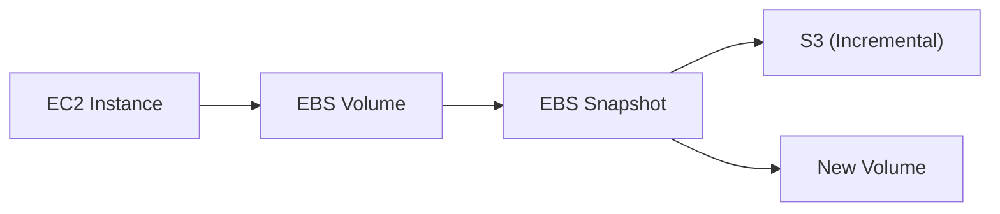
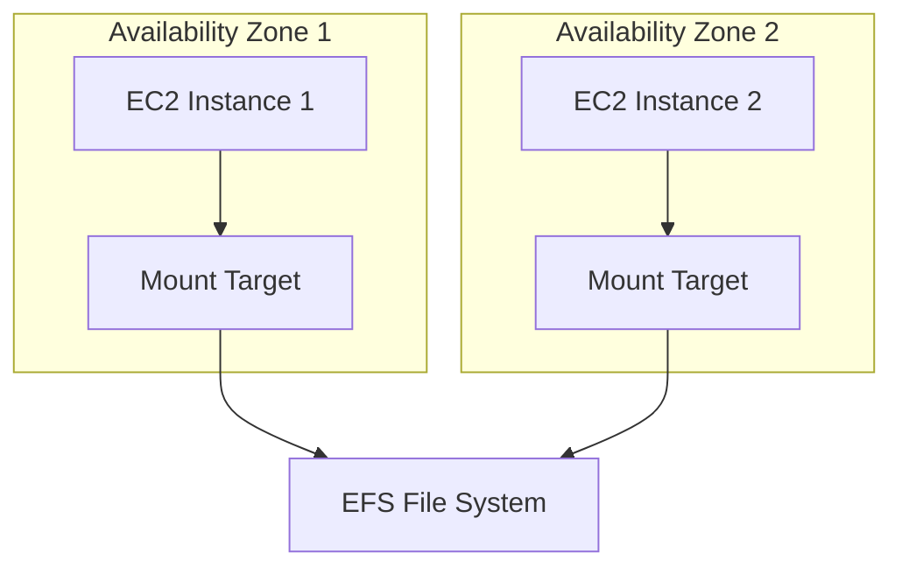

# Storage - EBS & EFS

Block storage (EBS) and file storage (EFS) for EC2 instances.

---

## Storage Types Comparison

| Type | Protocol | Attach To | Use Case |
|------|----------|-----------|----------|
| **EBS** | Block | Single EC2 | Databases, boot volumes |
| **EFS** | NFS | Multiple EC2 | Shared files, web content |
| **FSx for Windows** | SMB | Windows EC2 | Windows workloads |
| **FSx for Lustre** | Lustre | Linux EC2 | HPC, ML |

---

## Amazon EBS

Elastic Block Store - persistent block storage for EC2.



### EBS Volume Types

| Type | IOPS | Throughput | Use Case |
|------|------|------------|----------|
| **gp3** | 3,000-16,000 | 125-1,000 MB/s | General purpose |
| **gp2** | 100-16,000 | 128-250 MB/s | General (legacy) |
| **io2** | Up to 64,000 | 1,000 MB/s | Critical databases |
| **st1** | 500 | 500 MB/s | Big data, logs |
| **sc1** | 250 | 250 MB/s | Cold storage |

### Creating EBS Volumes

```bash
# Create gp3 volume
aws ec2 create-volume \
    --availability-zone us-east-1a \
    --volume-type gp3 \
    --size 100 \
    --iops 3000 \
    --throughput 125 \
    --encrypted \
    --tag-specifications 'ResourceType=volume,Tags=[{Key=Name,Value=MyVolume}]'

# Attach to instance
aws ec2 attach-volume \
    --volume-id vol-12345678 \
    --instance-id i-12345678 \
    --device /dev/sdf

# On the instance:
# sudo mkfs -t xfs /dev/nvme1n1
# sudo mount /dev/nvme1n1 /data
```

### EBS Snapshots

```bash
# Create snapshot
aws ec2 create-snapshot \
    --volume-id vol-12345678 \
    --description "Backup $(date +%Y%m%d)" \
    --tag-specifications 'ResourceType=snapshot,Tags=[{Key=Name,Value=DailyBackup}]'

# Copy to another region
aws ec2 copy-snapshot \
    --source-region us-east-1 \
    --source-snapshot-id snap-12345678 \
    --destination-region us-west-2 \
    --description "DR Copy"

# Create volume from snapshot
aws ec2 create-volume \
    --snapshot-id snap-12345678 \
    --availability-zone us-east-1a \
    --volume-type gp3

# Delete snapshot
aws ec2 delete-snapshot --snapshot-id snap-12345678
```

### EBS Encryption

```bash
# Enable encryption by default
aws ec2 enable-ebs-encryption-by-default

# Create encrypted volume with custom key
aws ec2 create-volume \
    --availability-zone us-east-1a \
    --volume-type gp3 \
    --size 100 \
    --encrypted \
    --kms-key-id arn:aws:kms:us-east-1:123456789012:key/xxx
```

### Modify Volume

```bash
# Resize volume (no downtime)
aws ec2 modify-volume \
    --volume-id vol-12345678 \
    --size 200

# Change type
aws ec2 modify-volume \
    --volume-id vol-12345678 \
    --volume-type io2 \
    --iops 10000

# After modification, extend filesystem:
# sudo xfs_growfs /data    # XFS
# sudo resize2fs /dev/xvdf # ext4
```

---

## Amazon EFS

Elastic File System - managed NFS for Linux.



### Creating EFS

```bash
# Create file system
EFS_ID=$(aws efs create-file-system \
    --performance-mode generalPurpose \
    --throughput-mode bursting \
    --encrypted \
    --tags Key=Name,Value=MyEFS \
    --query 'FileSystemId' \
    --output text)

# Create mount targets (one per AZ)
aws efs create-mount-target \
    --file-system-id $EFS_ID \
    --subnet-id subnet-aaaa \
    --security-groups sg-12345678

aws efs create-mount-target \
    --file-system-id $EFS_ID \
    --subnet-id subnet-bbbb \
    --security-groups sg-12345678
```

### Mounting EFS

```bash
# Install EFS utils
sudo yum install -y amazon-efs-utils

# Mount using EFS mount helper
sudo mount -t efs fs-12345678:/ /mnt/efs

# Mount with encryption in transit
sudo mount -t efs -o tls fs-12345678:/ /mnt/efs

# Add to /etc/fstab for persistence
echo "fs-12345678:/ /mnt/efs efs _netdev,tls 0 0" | sudo tee -a /etc/fstab
```

### EFS Performance Modes

| Mode | Use Case | Latency |
|------|----------|---------|
| **General Purpose** | Most workloads | Lowest |
| **Max I/O** | Big data, media | Higher |

### EFS Throughput Modes

| Mode | Behavior | Use Case |
|------|----------|----------|
| **Bursting** | Scales with size | Most workloads |
| **Provisioned** | Fixed throughput | Consistent performance |
| **Elastic** | Auto-scales | Variable workloads |

```bash
# Provisioned throughput
aws efs update-file-system \
    --file-system-id fs-12345678 \
    --throughput-mode provisioned \
    --provisioned-throughput-in-mibps 100
```

### EFS Lifecycle Management

```bash
# Move infrequently accessed files to IA storage
aws efs put-lifecycle-configuration \
    --file-system-id fs-12345678 \
    --lifecycle-policies '[
        {"TransitionToIA": "AFTER_30_DAYS"},
        {"TransitionToPrimaryStorageClass": "AFTER_1_ACCESS"}
    ]'
```

### Access Points

```bash
# Create access point (for application isolation)
aws efs create-access-point \
    --file-system-id fs-12345678 \
    --posix-user Uid=1000,Gid=1000 \
    --root-directory "Path=/app-data,CreationInfo={OwnerUid=1000,OwnerGid=1000,Permissions=755}"

# Mount access point
sudo mount -t efs -o tls,accesspoint=fsap-12345678 fs-12345678:/ /mnt/app
```

---

## Amazon FSx

### FSx for Windows File Server

```bash
# Create FSx for Windows
aws fsx create-file-system \
    --file-system-type WINDOWS \
    --storage-capacity 300 \
    --subnet-ids subnet-aaaa \
    --security-group-ids sg-12345678 \
    --windows-configuration '{
        "ActiveDirectoryId": "d-1234567890",
        "ThroughputCapacity": 8,
        "DailyAutomaticBackupStartTime": "01:00",
        "AutomaticBackupRetentionDays": 7
    }'
```

### FSx for Lustre

```bash
# Create FSx for Lustre (linked to S3)
aws fsx create-file-system \
    --file-system-type LUSTRE \
    --storage-capacity 1200 \
    --subnet-ids subnet-aaaa \
    --lustre-configuration '{
        "ImportPath": "s3://my-bucket/data",
        "ExportPath": "s3://my-bucket/output",
        "DeploymentType": "PERSISTENT_1",
        "PerUnitStorageThroughput": 200
    }'
```

---

## AWS Backup

Centralized backup management.

```bash
# Create backup vault
aws backup create-backup-vault \
    --backup-vault-name MyVault \
    --encryption-key-arn arn:aws:kms:us-east-1:123456789012:key/xxx

# Create backup plan
aws backup create-backup-plan \
    --backup-plan '{
        "BackupPlanName": "DailyBackup",
        "Rules": [{
            "RuleName": "DailyRule",
            "TargetBackupVaultName": "MyVault",
            "ScheduleExpression": "cron(0 5 ? * * *)",
            "StartWindowMinutes": 60,
            "CompletionWindowMinutes": 180,
            "Lifecycle": {
                "DeleteAfterDays": 30
            }
        }]
    }'

# Assign resources
aws backup create-backup-selection \
    --backup-plan-id $PLAN_ID \
    --backup-selection '{
        "SelectionName": "AllEBS",
        "IamRoleArn": "arn:aws:iam::123456789012:role/AWSBackupRole",
        "Resources": ["arn:aws:ec2:*:*:volume/*"],
        "ListOfTags": [{"ConditionType": "STRINGEQUALS", "ConditionKey": "Backup", "ConditionValue": "true"}]
    }'
```

---

## Best Practices

### EBS

1. **Use gp3** over gp2 (better price/performance)
2. **Encrypt all volumes** with KMS
3. **Regular snapshots** with lifecycle policies
4. **Right-size volumes** (can increase, not decrease)

### EFS

1. **Use Access Points** for application isolation
2. **Enable lifecycle** for cost optimization
3. **Use Elastic throughput** for variable workloads
4. **Security groups** limit access

---

## Next Steps

- **[Databases - Relational](09_databases_relational.md)** - RDS and Aurora
