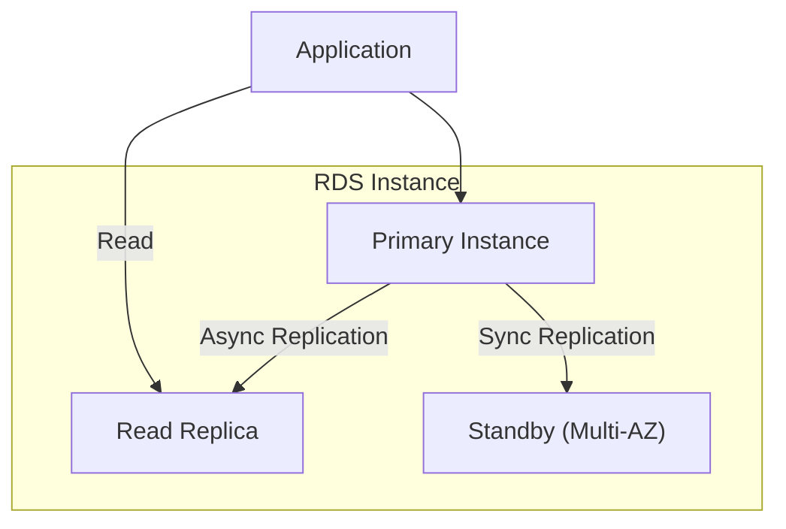
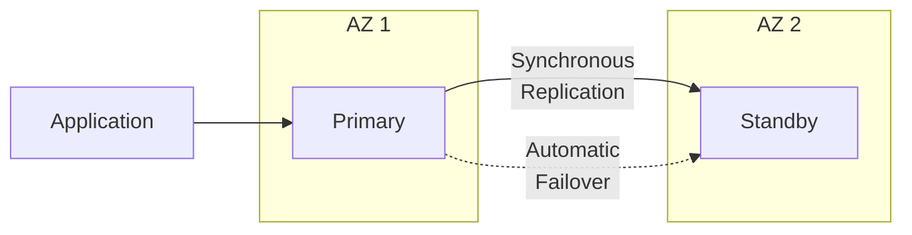
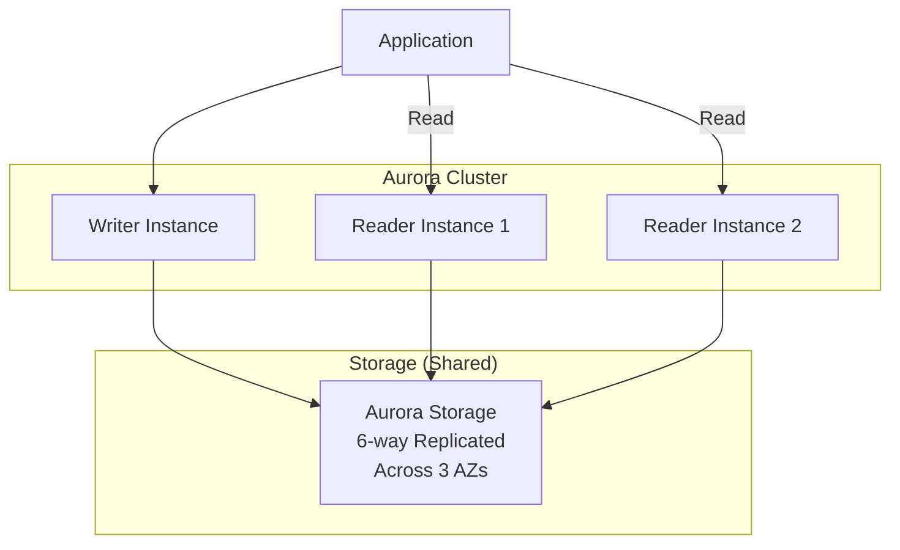

# Databases - Relational

Amazon RDS and Aurora for managed relational databases.

---

## RDS Overview

Amazon Relational Database Service (RDS) provides managed relational databases.



### Supported Engines

| Engine | Versions | Use Case |
|--------|----------|----------|
| **MySQL** | 5.7, 8.0 | Web applications |
| **PostgreSQL** | 13, 14, 15, 16 | Complex queries, PostGIS |
| **MariaDB** | 10.x | MySQL alternative |
| **Oracle** | 19c, 21c | Enterprise |
| **SQL Server** | 2017-2022 | Windows/.NET |

---

## Creating RDS Instance

```bash
# Create PostgreSQL instance
aws rds create-db-instance \
    --db-instance-identifier my-postgres \
    --db-instance-class db.t3.micro \
    --engine postgres \
    --engine-version 14 \
    --master-username admin \
    --master-user-password "SecurePassword123!" \
    --allocated-storage 20 \
    --storage-type gp3 \
    --storage-encrypted \
    --vpc-security-group-ids sg-12345678 \
    --db-subnet-group-name my-subnet-group \
    --backup-retention-period 7 \
    --multi-az \
    --no-publicly-accessible

# Wait for instance
aws rds wait db-instance-available --db-instance-identifier my-postgres

# Get endpoint
aws rds describe-db-instances \
    --db-instance-identifier my-postgres \
    --query 'DBInstances[0].Endpoint.Address' \
    --output text
```

### DB Subnet Group

```bash
# Create subnet group
aws rds create-db-subnet-group \
    --db-subnet-group-name my-subnet-group \
    --db-subnet-group-description "Private subnets for RDS" \
    --subnet-ids subnet-aaaa subnet-bbbb
```

### Parameter Groups

```bash
# Create parameter group
aws rds create-db-parameter-group \
    --db-parameter-group-name my-params \
    --db-parameter-group-family postgres14 \
    --description "Custom parameters"

# Modify parameters
aws rds modify-db-parameter-group \
    --db-parameter-group-name my-params \
    --parameters "ParameterName=log_connections,ParameterValue=1,ApplyMethod=immediate" \
                 "ParameterName=log_disconnections,ParameterValue=1,ApplyMethod=immediate"
```

---

## Multi-AZ Deployment

Synchronous standby for high availability.



```bash
# Enable Multi-AZ on existing instance
aws rds modify-db-instance \
    --db-instance-identifier my-postgres \
    --multi-az \
    --apply-immediately
```

---

## Read Replicas

Asynchronous replicas for read scaling.

```bash
# Create read replica
aws rds create-db-instance-read-replica \
    --db-instance-identifier my-postgres-replica \
    --source-db-instance-identifier my-postgres \
    --db-instance-class db.t3.medium

# Create cross-region replica
aws rds create-db-instance-read-replica \
    --db-instance-identifier my-postgres-replica-west \
    --source-db-instance-identifier arn:aws:rds:us-east-1:123456789012:db:my-postgres \
    --region us-west-2

# Promote to standalone (for DR)
aws rds promote-read-replica --db-instance-identifier my-postgres-replica
```

---

## Backups & Snapshots

```bash
# Automated backups (configured at creation)
# - Point-in-time recovery within retention period

# Manual snapshot
aws rds create-db-snapshot \
    --db-instance-identifier my-postgres \
    --db-snapshot-identifier my-postgres-snapshot-$(date +%Y%m%d)

# Restore from snapshot
aws rds restore-db-instance-from-db-snapshot \
    --db-instance-identifier my-postgres-restored \
    --db-snapshot-identifier my-postgres-snapshot-20240101

# Point-in-time recovery
aws rds restore-db-instance-to-point-in-time \
    --source-db-instance-identifier my-postgres \
    --target-db-instance-identifier my-postgres-pitr \
    --restore-time 2024-01-15T10:30:00Z

# Copy snapshot to another region
aws rds copy-db-snapshot \
    --source-db-snapshot-identifier arn:aws:rds:us-east-1:123456789012:snapshot:my-snapshot \
    --target-db-snapshot-identifier my-snapshot-west \
    --region us-west-2
```

---

## Amazon Aurora

High-performance MySQL/PostgreSQL-compatible database.



### Aurora vs RDS

| Feature | RDS | Aurora |
|---------|-----|--------|
| **Storage** | Attached EBS | Distributed (auto-grows) |
| **Replication** | Async to replicas | Shared storage |
| **Failover** | ~60 seconds | ~30 seconds |
| **Read Replicas** | Up to 5 | Up to 15 |
| **Performance** | Standard | 5x MySQL, 3x PostgreSQL |
| **Cost** | Lower | ~20% higher |

### Creating Aurora Cluster

```bash
# Create cluster
aws rds create-db-cluster \
    --db-cluster-identifier my-aurora-cluster \
    --engine aurora-postgresql \
    --engine-version 14.9 \
    --master-username admin \
    --master-user-password "SecurePassword123!" \
    --db-subnet-group-name my-subnet-group \
    --vpc-security-group-ids sg-12345678 \
    --storage-encrypted \
    --backup-retention-period 7

# Create writer instance
aws rds create-db-instance \
    --db-instance-identifier my-aurora-writer \
    --db-instance-class db.r6g.large \
    --engine aurora-postgresql \
    --db-cluster-identifier my-aurora-cluster

# Create reader instance
aws rds create-db-instance \
    --db-instance-identifier my-aurora-reader \
    --db-instance-class db.r6g.large \
    --engine aurora-postgresql \
    --db-cluster-identifier my-aurora-cluster
```

### Aurora Serverless v2

```bash
# Create serverless cluster
aws rds create-db-cluster \
    --db-cluster-identifier my-aurora-serverless \
    --engine aurora-postgresql \
    --engine-version 14.9 \
    --master-username admin \
    --master-user-password "SecurePassword123!" \
    --db-subnet-group-name my-subnet-group \
    --vpc-security-group-ids sg-12345678 \
    --serverless-v2-scaling-configuration MinCapacity=0.5,MaxCapacity=16

# Create serverless instance
aws rds create-db-instance \
    --db-instance-identifier my-aurora-serverless-instance \
    --db-instance-class db.serverless \
    --engine aurora-postgresql \
    --db-cluster-identifier my-aurora-serverless
```

### Aurora Global Database

Cross-region replication for disaster recovery.

```bash
# Create global database
aws rds create-global-cluster \
    --global-cluster-identifier my-global-cluster \
    --source-db-cluster-identifier my-aurora-cluster \
    --region us-east-1

# Add secondary region
aws rds create-db-cluster \
    --db-cluster-identifier my-aurora-secondary \
    --engine aurora-postgresql \
    --global-cluster-identifier my-global-cluster \
    --region eu-west-1
```

---

## RDS Proxy

Connection pooling for Lambda and large-scale apps.

```bash
# Create proxy
aws rds create-db-proxy \
    --db-proxy-name my-proxy \
    --engine-family POSTGRESQL \
    --auth '[{"AuthScheme": "SECRETS", "SecretArn": "arn:aws:secretsmanager:...", "IAMAuth": "REQUIRED"}]' \
    --role-arn arn:aws:iam::123456789012:role/RDSProxyRole \
    --vpc-subnet-ids subnet-aaaa subnet-bbbb \
    --vpc-security-group-ids sg-12345678

# Register target
aws rds register-db-proxy-targets \
    --db-proxy-name my-proxy \
    --target-group-name default \
    --db-instance-identifiers my-postgres
```

---

## Security

### Encryption

```bash
# Enable encryption at creation (cannot be changed later)
--storage-encrypted
--kms-key-id arn:aws:kms:us-east-1:123456789012:key/xxx

# Encrypt existing (create encrypted snapshot and restore)
aws rds copy-db-snapshot \
    --source-db-snapshot-identifier my-snapshot \
    --target-db-snapshot-identifier my-snapshot-encrypted \
    --kms-key-id arn:aws:kms:...
```

### IAM Authentication

```bash
# Enable IAM auth
aws rds modify-db-instance \
    --db-instance-identifier my-postgres \
    --enable-iam-database-authentication \
    --apply-immediately

# Connect with IAM token
TOKEN=$(aws rds generate-db-auth-token \
    --hostname my-postgres.xxx.us-east-1.rds.amazonaws.com \
    --port 5432 \
    --username iam_user)

psql "host=... user=iam_user password=$TOKEN dbname=mydb sslmode=require"
```

---

## Monitoring

```bash
# Performance Insights
aws rds modify-db-instance \
    --db-instance-identifier my-postgres \
    --enable-performance-insights \
    --performance-insights-retention-period 7 \
    --apply-immediately

# Enhanced Monitoring
aws rds modify-db-instance \
    --db-instance-identifier my-postgres \
    --monitoring-interval 60 \
    --monitoring-role-arn arn:aws:iam::123456789012:role/rds-monitoring-role

# CloudWatch metrics
aws cloudwatch get-metric-statistics \
    --namespace AWS/RDS \
    --metric-name CPUUtilization \
    --dimensions Name=DBInstanceIdentifier,Value=my-postgres \
    --start-time $(date -u -d '1 hour ago' +%Y-%m-%dT%H:%M:%SZ) \
    --end-time $(date -u +%Y-%m-%dT%H:%M:%SZ) \
    --period 300 \
    --statistics Average
```

---

## Best Practices

1. **Use Multi-AZ** for production
2. **Enable encryption** at creation
3. **Use IAM authentication** where possible
4. **Regular snapshots** with cross-region copies
5. **Use read replicas** for read-heavy workloads
6. **Use RDS Proxy** for Lambda/connection pooling
7. **Performance Insights** for query analysis
8. **Choose Aurora** for high-performance needs

---

## Next Steps

- **[Databases - NoSQL](10_databases_nosql.md)** - DynamoDB, ElastiCache
