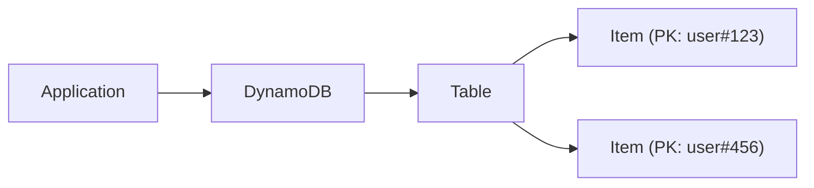
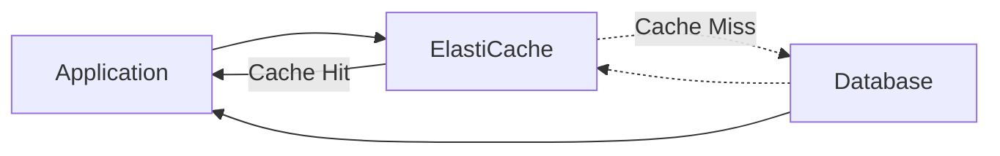
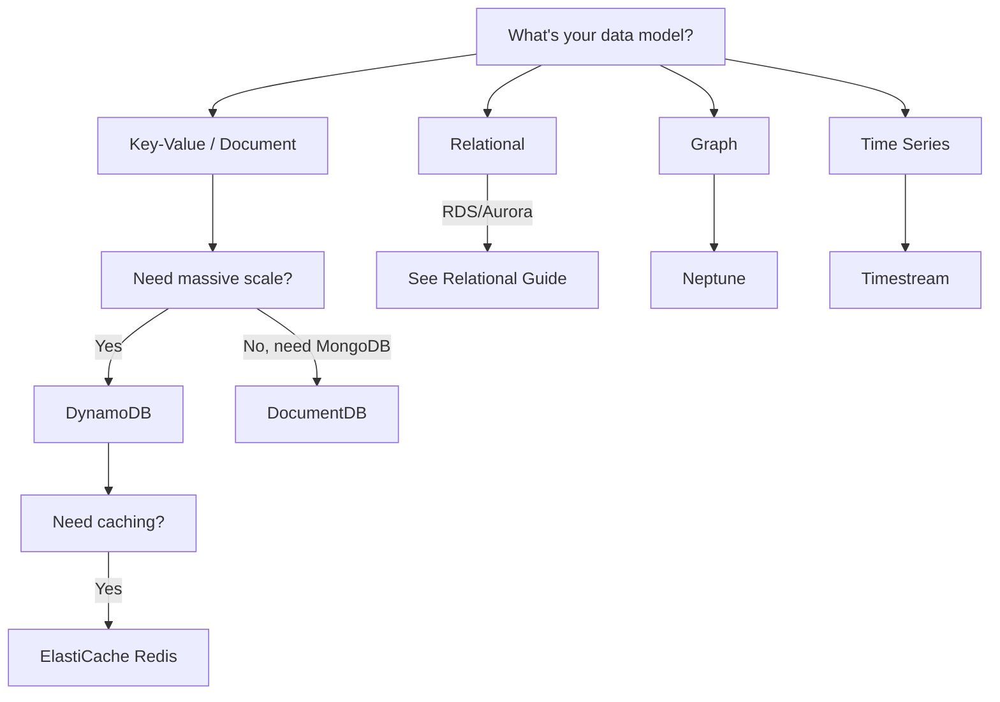

# Databases - NoSQL

Amazon DynamoDB, ElastiCache, and other NoSQL services.

---

## Amazon DynamoDB

Fully managed NoSQL key-value and document database.



### Core Concepts

| Concept | Description |
|---------|-------------|
| **Table** | Collection of items |
| **Item** | Single record (like a row) |
| **Attribute** | Data element (like a column) |
| **Primary Key** | Unique identifier |
| **Partition Key (PK)** | Hash key for distribution |
| **Sort Key (SK)** | Range key for ordering |

### Creating Tables

```bash
# Simple table (partition key only)
aws dynamodb create-table \
    --table-name Users \
    --attribute-definitions AttributeName=userId,AttributeType=S \
    --key-schema AttributeName=userId,KeyType=HASH \
    --billing-mode PAY_PER_REQUEST

# Composite key (partition + sort)
aws dynamodb create-table \
    --table-name Orders \
    --attribute-definitions \
        AttributeName=customerId,AttributeType=S \
        AttributeName=orderDate,AttributeType=S \
    --key-schema \
        AttributeName=customerId,KeyType=HASH \
        AttributeName=orderDate,KeyType=RANGE \
    --billing-mode PAY_PER_REQUEST

# Provisioned capacity
aws dynamodb create-table \
    --table-name Sessions \
    --attribute-definitions AttributeName=sessionId,AttributeType=S \
    --key-schema AttributeName=sessionId,KeyType=HASH \
    --provisioned-throughput ReadCapacityUnits=5,WriteCapacityUnits=5
```

### CRUD Operations

```bash
# Put item
aws dynamodb put-item \
    --table-name Users \
    --item '{
        "userId": {"S": "user123"},
        "name": {"S": "John Doe"},
        "email": {"S": "john@example.com"},
        "age": {"N": "30"}
    }'

# Get item
aws dynamodb get-item \
    --table-name Users \
    --key '{"userId": {"S": "user123"}}'

# Update item
aws dynamodb update-item \
    --table-name Users \
    --key '{"userId": {"S": "user123"}}' \
    --update-expression "SET age = :newage" \
    --expression-attribute-values '{":newage": {"N": "31"}}'

# Delete item
aws dynamodb delete-item \
    --table-name Users \
    --key '{"userId": {"S": "user123"}}'
```

### Query and Scan

```bash
# Query (efficient, uses index)
aws dynamodb query \
    --table-name Orders \
    --key-condition-expression "customerId = :cid AND orderDate BETWEEN :start AND :end" \
    --expression-attribute-values '{
        ":cid": {"S": "customer123"},
        ":start": {"S": "2024-01-01"},
        ":end": {"S": "2024-12-31"}
    }'

# Scan (full table scan - expensive!)
aws dynamodb scan \
    --table-name Users \
    --filter-expression "age > :minAge" \
    --expression-attribute-values '{":minAge": {"N": "25"}}'
```

### Secondary Indexes

```bash
# Global Secondary Index (GSI)
aws dynamodb update-table \
    --table-name Orders \
    --attribute-definitions AttributeName=status,AttributeType=S \
    --global-secondary-index-updates '[{
        "Create": {
            "IndexName": "StatusIndex",
            "KeySchema": [{"AttributeName": "status", "KeyType": "HASH"}],
            "Projection": {"ProjectionType": "ALL"},
            "ProvisionedThroughput": {"ReadCapacityUnits": 5, "WriteCapacityUnits": 5}
        }
    }]'

# Query GSI
aws dynamodb query \
    --table-name Orders \
    --index-name StatusIndex \
    --key-condition-expression "#s = :status" \
    --expression-attribute-names '{"#s": "status"}' \
    --expression-attribute-values '{":status": {"S": "PENDING"}}'
```

### Capacity Modes

| Mode | Description | Use Case |
|------|-------------|----------|
| **On-Demand** | Pay per request | Unpredictable workloads |
| **Provisioned** | Pre-allocated capacity | Predictable workloads |

```bash
# Switch to provisioned with auto scaling
aws dynamodb update-table \
    --table-name Users \
    --billing-mode PROVISIONED \
    --provisioned-throughput ReadCapacityUnits=10,WriteCapacityUnits=5

# Enable auto scaling
aws application-autoscaling register-scalable-target \
    --service-namespace dynamodb \
    --resource-id "table/Users" \
    --scalable-dimension "dynamodb:table:ReadCapacityUnits" \
    --min-capacity 5 \
    --max-capacity 100
```

### Global Tables

Multi-region, active-active replication.

```bash
# Create global table
aws dynamodb update-table \
    --table-name Users \
    --replica-updates '[{"Create": {"RegionName": "eu-west-1"}}]'
```

### DynamoDB Streams

Capture item-level changes.

```bash
# Enable streams
aws dynamodb update-table \
    --table-name Orders \
    --stream-specification StreamEnabled=true,StreamViewType=NEW_AND_OLD_IMAGES

# Process with Lambda
aws lambda create-event-source-mapping \
    --function-name ProcessOrderChanges \
    --event-source-arn arn:aws:dynamodb:us-east-1:123456789012:table/Orders/stream/... \
    --starting-position LATEST
```

### TTL (Time to Live)

```bash
# Enable TTL
aws dynamodb update-time-to-live \
    --table-name Sessions \
    --time-to-live-specification Enabled=true,AttributeName=expirationTime
```

---

## Amazon ElastiCache

Managed Redis and Memcached for caching.



### Redis vs Memcached

| Feature | Redis | Memcached |
|---------|-------|-----------|
| **Data Structures** | Strings, lists, sets, sorted sets | Strings only |
| **Persistence** | Yes | No |
| **Replication** | Yes | No |
| **Clustering** | Yes | Yes |
| **Pub/Sub** | Yes | No |
| **Lua scripting** | Yes | No |

### Creating Redis Cluster

```bash
# Create Redis replication group
aws elasticache create-replication-group \
    --replication-group-id my-redis \
    --replication-group-description "My Redis cluster" \
    --engine redis \
    --engine-version 7.0 \
    --cache-node-type cache.t3.micro \
    --num-cache-clusters 2 \
    --automatic-failover-enabled \
    --cache-subnet-group-name my-cache-subnet \
    --security-group-ids sg-12345678 \
    --at-rest-encryption-enabled \
    --transit-encryption-enabled

# Cluster mode enabled
aws elasticache create-replication-group \
    --replication-group-id my-redis-cluster \
    --replication-group-description "Redis cluster mode" \
    --engine redis \
    --cache-node-type cache.r6g.large \
    --num-node-groups 3 \
    --replicas-per-node-group 2 \
    --automatic-failover-enabled
```

### Creating Memcached

```bash
aws elasticache create-cache-cluster \
    --cache-cluster-id my-memcached \
    --engine memcached \
    --cache-node-type cache.t3.micro \
    --num-cache-nodes 2 \
    --cache-subnet-group-name my-cache-subnet \
    --security-group-ids sg-12345678
```

### Connection

```python
# Python example (redis-py)
import redis

r = redis.Redis(
    host='my-redis.xxx.cache.amazonaws.com',
    port=6379,
    ssl=True,
    decode_responses=True
)

# Set/Get
r.set('user:123', 'John Doe')
name = r.get('user:123')

# With TTL
r.setex('session:abc', 3600, 'session_data')
```

---

## Amazon DocumentDB

MongoDB-compatible document database.

```bash
# Create cluster
aws docdb create-db-cluster \
    --db-cluster-identifier my-docdb \
    --engine docdb \
    --master-username admin \
    --master-user-password "SecurePassword123!" \
    --vpc-security-group-ids sg-12345678 \
    --db-subnet-group-name my-subnet-group

# Create instance
aws docdb create-db-instance \
    --db-instance-identifier my-docdb-instance \
    --db-instance-class db.r6g.large \
    --engine docdb \
    --db-cluster-identifier my-docdb
```

---

## Amazon Keyspaces

Apache Cassandra-compatible database.

```bash
# Create keyspace
aws keyspaces create-keyspace --keyspace-name my_keyspace

# Create table
aws keyspaces create-table \
    --keyspace-name my_keyspace \
    --table-name my_table \
    --schema-definition '{
        "allColumns": [
            {"name": "id", "type": "uuid"},
            {"name": "name", "type": "text"},
            {"name": "created_at", "type": "timestamp"}
        ],
        "partitionKeys": [{"name": "id"}]
    }'
```

---

## Amazon Neptune

Graph database for connected data.

```bash
# Create cluster
aws neptune create-db-cluster \
    --db-cluster-identifier my-neptune \
    --engine neptune \
    --vpc-security-group-ids sg-12345678 \
    --db-subnet-group-name my-subnet-group

# Create instance
aws neptune create-db-instance \
    --db-instance-identifier my-neptune-instance \
    --db-instance-class db.r5.large \
    --engine neptune \
    --db-cluster-identifier my-neptune
```

---

## Database Selection Guide



---

## Best Practices

### DynamoDB

1. **Design for access patterns** - Think queries first
2. **Use composite keys** for filtering
3. **Avoid scans** - Use queries with indexes
4. **Enable on-demand** for variable traffic
5. **Use DAX** for microsecond reads

### ElastiCache

1. **Use Redis** for most use cases
2. **Enable cluster mode** for scaling
3. **Use TTL** to manage memory
4. **Monitor evictions** and memory usage
5. **Use read replicas** for read-heavy workloads

---

## Next Steps

- **[Serverless](11_serverless.md)** - Lambda, API Gateway, Step Functions
