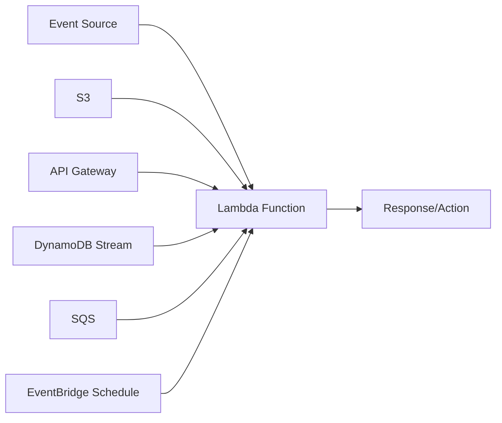
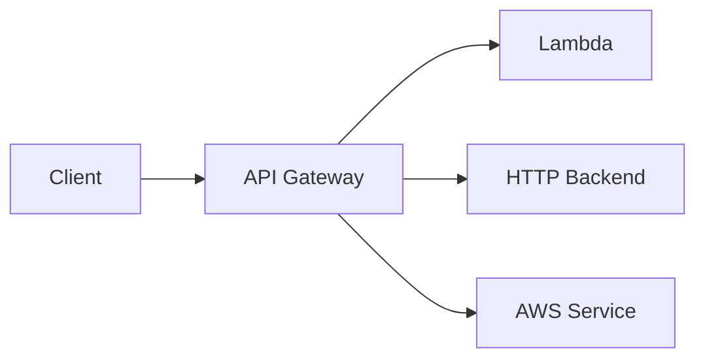
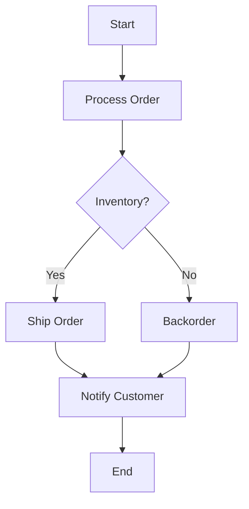

# Serverless

AWS Lambda, API Gateway, and Step Functions for event-driven applications.

---

## AWS Lambda

Run code without managing servers.



### Creating Functions

```bash
# Create function from zip
zip function.zip index.js
aws lambda create-function \
    --function-name MyFunction \
    --runtime nodejs18.x \
    --handler index.handler \
    --role arn:aws:iam::123456789012:role/lambda-role \
    --zip-file fileb://function.zip \
    --timeout 30 \
    --memory-size 256

# Update function code
aws lambda update-function-code \
    --function-name MyFunction \
    --zip-file fileb://function.zip

# Update configuration
aws lambda update-function-configuration \
    --function-name MyFunction \
    --timeout 60 \
    --memory-size 512 \
    --environment Variables={DB_HOST=localhost,DEBUG=true}
```

### Function Code Examples

```javascript
// Node.js - index.js
exports.handler = async (event) => {
    console.log('Event:', JSON.stringify(event));
    
    return {
        statusCode: 200,
        body: JSON.stringify({ message: 'Hello from Lambda!' })
    };
};
```

```python
# Python - lambda_function.py
import json

def lambda_handler(event, context):
    print(f"Event: {json.dumps(event)}")
    
    return {
        'statusCode': 200,
        'body': json.dumps({'message': 'Hello from Lambda!'})
    }
```

### Invoke Function

```bash
# Synchronous
aws lambda invoke \
    --function-name MyFunction \
    --payload '{"key": "value"}' \
    --cli-binary-format raw-in-base64-out \
    response.json

# Asynchronous
aws lambda invoke \
    --function-name MyFunction \
    --invocation-type Event \
    --payload '{"key": "value"}' \
    response.json
```

### Environment Variables & Secrets

```bash
# Environment variables
aws lambda update-function-configuration \
    --function-name MyFunction \
    --environment Variables={
        API_KEY=value,
        DB_CONNECTION_STRING=value
    }

# Using Secrets Manager
aws lambda update-function-configuration \
    --function-name MyFunction \
    --environment Variables={
        SECRET_ARN=arn:aws:secretsmanager:us-east-1:123456789012:secret:my-secret
    }
```

### Layers

Reusable code/dependencies across functions.

```bash
# Create layer
zip -r layer.zip python/
aws lambda publish-layer-version \
    --layer-name my-dependencies \
    --zip-file fileb://layer.zip \
    --compatible-runtimes python3.11

# Attach layer to function
aws lambda update-function-configuration \
    --function-name MyFunction \
    --layers arn:aws:lambda:us-east-1:123456789012:layer:my-dependencies:1
```

### Versions & Aliases

```bash
# Publish version
aws lambda publish-version \
    --function-name MyFunction \
    --description "v1.0"

# Create alias
aws lambda create-alias \
    --function-name MyFunction \
    --name prod \
    --function-version 1

# Update alias (for deployments)
aws lambda update-alias \
    --function-name MyFunction \
    --name prod \
    --function-version 2

# Weighted alias (canary)
aws lambda update-alias \
    --function-name MyFunction \
    --name prod \
    --function-version 2 \
    --routing-config AdditionalVersionWeights={1=0.1}
```

### Event Source Mappings

```bash
# SQS trigger
aws lambda create-event-source-mapping \
    --function-name MyFunction \
    --event-source-arn arn:aws:sqs:us-east-1:123456789012:my-queue \
    --batch-size 10

# DynamoDB Streams
aws lambda create-event-source-mapping \
    --function-name MyFunction \
    --event-source-arn arn:aws:dynamodb:us-east-1:123456789012:table/MyTable/stream/... \
    --starting-position LATEST \
    --batch-size 100

# Kinesis
aws lambda create-event-source-mapping \
    --function-name MyFunction \
    --event-source-arn arn:aws:kinesis:us-east-1:123456789012:stream/my-stream \
    --starting-position TRIM_HORIZON \
    --batch-size 100
```

---

## API Gateway

Create, publish, and manage APIs.



### REST API

```bash
# Create REST API
API_ID=$(aws apigateway create-rest-api \
    --name MyAPI \
    --query 'id' --output text)

# Get root resource
ROOT_ID=$(aws apigateway get-resources \
    --rest-api-id $API_ID \
    --query 'items[0].id' --output text)

# Create resource
RESOURCE_ID=$(aws apigateway create-resource \
    --rest-api-id $API_ID \
    --parent-id $ROOT_ID \
    --path-part users \
    --query 'id' --output text)

# Create method
aws apigateway put-method \
    --rest-api-id $API_ID \
    --resource-id $RESOURCE_ID \
    --http-method GET \
    --authorization-type NONE

# Create Lambda integration
aws apigateway put-integration \
    --rest-api-id $API_ID \
    --resource-id $RESOURCE_ID \
    --http-method GET \
    --type AWS_PROXY \
    --integration-http-method POST \
    --uri arn:aws:apigateway:us-east-1:lambda:path/2015-03-31/functions/arn:aws:lambda:us-east-1:123456789012:function:MyFunction/invocations

# Deploy
aws apigateway create-deployment \
    --rest-api-id $API_ID \
    --stage-name prod
```

### HTTP API (Simpler, Cheaper)

```bash
# Create HTTP API with Lambda
aws apigatewayv2 create-api \
    --name MyHttpAPI \
    --protocol-type HTTP \
    --target arn:aws:lambda:us-east-1:123456789012:function:MyFunction

# With routes
aws apigatewayv2 create-api \
    --name MyHttpAPI \
    --protocol-type HTTP

aws apigatewayv2 create-integration \
    --api-id $API_ID \
    --integration-type AWS_PROXY \
    --integration-uri arn:aws:lambda:us-east-1:123456789012:function:MyFunction \
    --payload-format-version 2.0

aws apigatewayv2 create-route \
    --api-id $API_ID \
    --route-key "GET /users" \
    --target integrations/$INTEGRATION_ID
```

### Authorization

```bash
# Cognito authorizer
aws apigatewayv2 create-authorizer \
    --api-id $API_ID \
    --authorizer-type JWT \
    --identity-source '$request.header.Authorization' \
    --name CognitoAuth \
    --jwt-configuration Issuer=https://cognito-idp.us-east-1.amazonaws.com/us-east-1_xxx,Audience=client-id
```

---

## Step Functions

Orchestrate workflows with state machines.



### State Machine Definition

```json
{
  "Comment": "Order Processing Workflow",
  "StartAt": "ProcessOrder",
  "States": {
    "ProcessOrder": {
      "Type": "Task",
      "Resource": "arn:aws:lambda:us-east-1:123456789012:function:ProcessOrder",
      "Next": "CheckInventory"
    },
    "CheckInventory": {
      "Type": "Choice",
      "Choices": [
        {
          "Variable": "$.inStock",
          "BooleanEquals": true,
          "Next": "ShipOrder"
        }
      ],
      "Default": "BackorderItem"
    },
    "ShipOrder": {
      "Type": "Task",
      "Resource": "arn:aws:lambda:us-east-1:123456789012:function:ShipOrder",
      "Next": "NotifyCustomer"
    },
    "BackorderItem": {
      "Type": "Task",
      "Resource": "arn:aws:lambda:us-east-1:123456789012:function:Backorder",
      "Next": "NotifyCustomer"
    },
    "NotifyCustomer": {
      "Type": "Task",
      "Resource": "arn:aws:states:::sns:publish",
      "Parameters": {
        "TopicArn": "arn:aws:sns:us-east-1:123456789012:OrderNotifications",
        "Message.$": "$.message"
      },
      "End": true
    }
  }
}
```

### Create State Machine

```bash
aws stepfunctions create-state-machine \
    --name OrderProcessing \
    --definition file://state-machine.json \
    --role-arn arn:aws:iam::123456789012:role/StepFunctionsRole \
    --type STANDARD

# Start execution
aws stepfunctions start-execution \
    --state-machine-arn arn:aws:states:us-east-1:123456789012:stateMachine:OrderProcessing \
    --input '{"orderId": "12345", "items": ["item1", "item2"]}'

# Get execution status
aws stepfunctions describe-execution \
    --execution-arn arn:aws:states:us-east-1:123456789012:execution:OrderProcessing:xxx
```

### Express vs Standard

| Feature | Standard | Express |
|---------|----------|---------|
| **Duration** | Up to 1 year | Up to 5 minutes |
| **Execution** | Exactly-once | At-least-once |
| **Pricing** | Per state transition | Per execution + duration |
| **Use Case** | Long-running workflows | High-volume, short |

---

## SAM (Serverless Application Model)

Infrastructure as Code for serverless.

```yaml
# template.yaml
AWSTemplateFormatVersion: '2010-09-09'
Transform: AWS::Serverless-2016-10-31

Resources:
  MyFunction:
    Type: AWS::Serverless::Function
    Properties:
      Runtime: python3.11
      Handler: app.handler
      CodeUri: ./src
      MemorySize: 256
      Timeout: 30
      Events:
        Api:
          Type: Api
          Properties:
            Path: /users
            Method: GET
      Environment:
        Variables:
          TABLE_NAME: !Ref UsersTable

  UsersTable:
    Type: AWS::DynamoDB::Table
    Properties:
      TableName: users
      AttributeDefinitions:
        - AttributeName: userId
          AttributeType: S
      KeySchema:
        - AttributeName: userId
          KeyType: HASH
      BillingMode: PAY_PER_REQUEST
```

```bash
# Build
sam build

# Local testing
sam local invoke MyFunction --event events/test.json
sam local start-api

# Deploy
sam deploy --guided
```

---

## Best Practices

### Lambda

1. **Keep functions small** - Single responsibility
2. **Use environment variables** for config
3. **Use layers** for shared dependencies
4. **Enable X-Ray** for tracing
5. **Set appropriate timeouts** and memory
6. **Use Provisioned Concurrency** for low latency

### API Gateway

1. **Use HTTP API** when possible (cheaper)
2. **Enable caching** for performance
3. **Use throttling** to protect backends
4. **Enable CloudWatch logs**

### Step Functions

1. **Use Express** for high-volume
2. **Handle errors** with Catch/Retry
3. **Use service integrations** to reduce Lambda
4. **Log to CloudWatch** for debugging

---

## Next Steps

- **[Messaging](12_messaging.md)** - SQS, SNS, EventBridge
