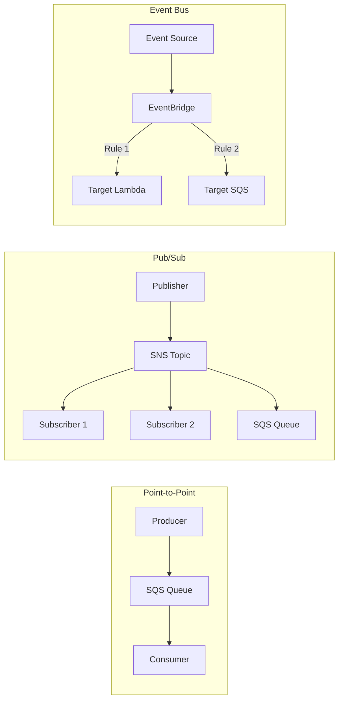
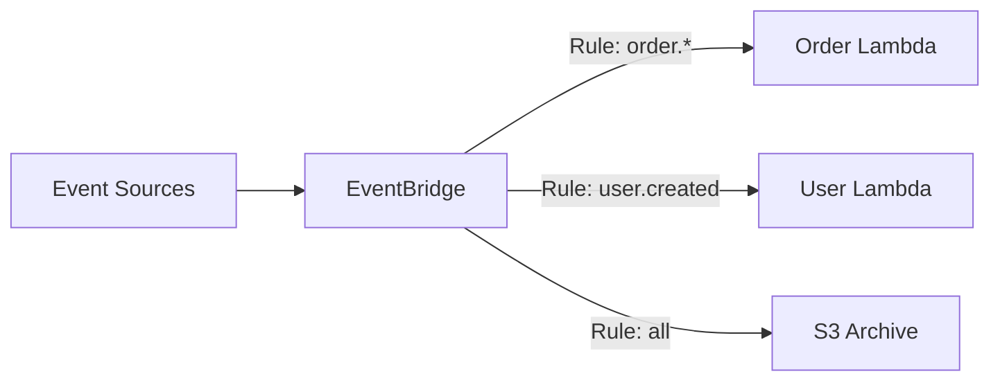
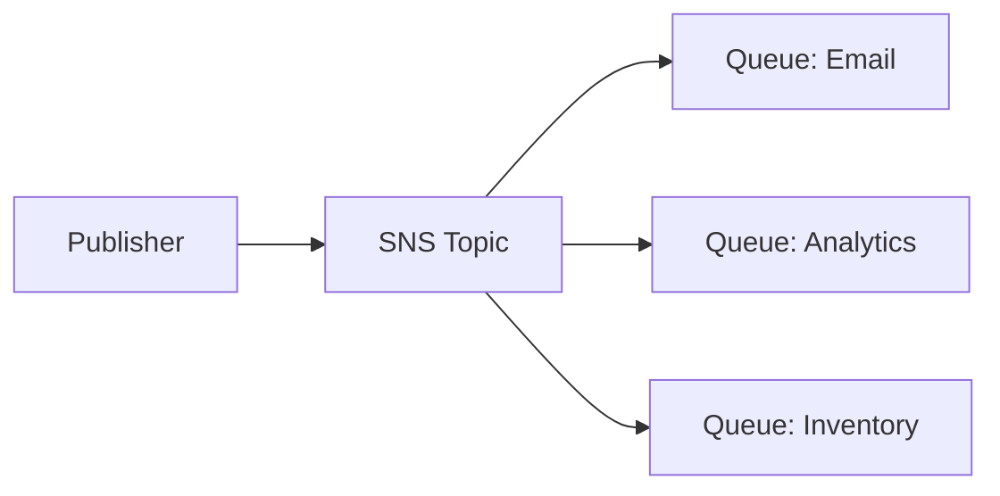

# Messaging

Amazon SQS, SNS, EventBridge, and Kinesis for decoupled architectures.

---

## Messaging Overview



---

## Amazon SQS

Simple Queue Service - fully managed message queuing.

### Queue Types

| Feature | Standard | FIFO |
|---------|----------|------|
| **Throughput** | Unlimited | 3,000 msg/s (with batching) |
| **Ordering** | Best effort | Guaranteed |
| **Delivery** | At-least-once | Exactly-once |
| **Deduplication** | No | Yes (5-min window) |

### Creating Queues

```bash
# Standard queue
aws sqs create-queue \
    --queue-name my-queue \
    --attributes '{
        "VisibilityTimeout": "30",
        "MessageRetentionPeriod": "345600",
        "ReceiveMessageWaitTimeSeconds": "20"
    }'

# FIFO queue
aws sqs create-queue \
    --queue-name my-queue.fifo \
    --attributes '{
        "FifoQueue": "true",
        "ContentBasedDeduplication": "true"
    }'

# Dead letter queue
aws sqs create-queue --queue-name my-queue-dlq
aws sqs set-queue-attributes \
    --queue-url https://sqs.../my-queue \
    --attributes '{
        "RedrivePolicy": "{\"deadLetterTargetArn\":\"arn:aws:sqs:...:my-queue-dlq\",\"maxReceiveCount\":\"3\"}"
    }'
```

### Send and Receive Messages

```bash
# Send message
aws sqs send-message \
    --queue-url https://sqs.../my-queue \
    --message-body "Hello World" \
    --delay-seconds 10

# Send batch
aws sqs send-message-batch \
    --queue-url https://sqs.../my-queue \
    --entries '[
        {"Id": "1", "MessageBody": "Message 1"},
        {"Id": "2", "MessageBody": "Message 2"}
    ]'

# Receive messages
aws sqs receive-message \
    --queue-url https://sqs.../my-queue \
    --max-number-of-messages 10 \
    --wait-time-seconds 20

# Delete message (after processing)
aws sqs delete-message \
    --queue-url https://sqs.../my-queue \
    --receipt-handle $RECEIPT_HANDLE
```

### FIFO Message Groups

```bash
# Send to FIFO with message group
aws sqs send-message \
    --queue-url https://sqs.../my-queue.fifo \
    --message-body "Order 123" \
    --message-group-id "customer-456" \
    --message-deduplication-id "order-123-v1"
```

---

## Amazon SNS

Simple Notification Service - pub/sub messaging.

### Creating Topics

```bash
# Standard topic
aws sns create-topic --name my-topic

# FIFO topic
aws sns create-topic \
    --name my-topic.fifo \
    --attributes FifoTopic=true

# Get topic ARN
TOPIC_ARN=$(aws sns list-topics --query "Topics[?ends_with(TopicArn, 'my-topic')].TopicArn" --output text)
```

### Subscriptions

```bash
# Email subscription
aws sns subscribe \
    --topic-arn $TOPIC_ARN \
    --protocol email \
    --notification-endpoint user@example.com

# SQS subscription
aws sns subscribe \
    --topic-arn $TOPIC_ARN \
    --protocol sqs \
    --notification-endpoint arn:aws:sqs:...:my-queue

# Lambda subscription
aws sns subscribe \
    --topic-arn $TOPIC_ARN \
    --protocol lambda \
    --notification-endpoint arn:aws:lambda:...:function:MyFunction

# HTTP/HTTPS endpoint
aws sns subscribe \
    --topic-arn $TOPIC_ARN \
    --protocol https \
    --notification-endpoint https://api.example.com/webhook
```

### Publish Messages

```bash
# Simple publish
aws sns publish \
    --topic-arn $TOPIC_ARN \
    --message "Hello World"

# With subject (for email)
aws sns publish \
    --topic-arn $TOPIC_ARN \
    --subject "Alert: System Status" \
    --message "System is running normally"

# With message attributes (for filtering)
aws sns publish \
    --topic-arn $TOPIC_ARN \
    --message "Order placed" \
    --message-attributes '{
        "event_type": {"DataType": "String", "StringValue": "order_placed"},
        "priority": {"DataType": "Number", "StringValue": "1"}
    }'
```

### Message Filtering

```bash
# Set filter policy on subscription
aws sns set-subscription-attributes \
    --subscription-arn arn:aws:sns:...:my-topic:xxx \
    --attribute-name FilterPolicy \
    --attribute-value '{"event_type": ["order_placed", "order_shipped"]}'
```

---

## Amazon EventBridge

Serverless event bus for event-driven architectures.



### Event Bus

```bash
# Create custom event bus
aws events create-event-bus --name my-app-events

# List event buses
aws events list-event-buses
```

### Rules

```bash
# Create rule with event pattern
aws events put-rule \
    --name OrderCreatedRule \
    --event-bus-name my-app-events \
    --event-pattern '{
        "source": ["my.app"],
        "detail-type": ["Order Created"],
        "detail": {
            "status": ["PENDING", "CONFIRMED"]
        }
    }'

# Add target (Lambda)
aws events put-targets \
    --rule OrderCreatedRule \
    --event-bus-name my-app-events \
    --targets '[{
        "Id": "OrderProcessor",
        "Arn": "arn:aws:lambda:...:function:ProcessOrder"
    }]'

# Schedule rule (cron)
aws events put-rule \
    --name DailyCleanup \
    --schedule-expression "cron(0 2 * * ? *)" \
    --state ENABLED

aws events put-targets \
    --rule DailyCleanup \
    --targets '[{"Id": "Cleanup", "Arn": "arn:aws:lambda:...:function:Cleanup"}]'
```

### Put Events

```bash
aws events put-events \
    --entries '[{
        "EventBusName": "my-app-events",
        "Source": "my.app",
        "DetailType": "Order Created",
        "Detail": "{\"orderId\": \"123\", \"customerId\": \"456\", \"status\": \"PENDING\"}"
    }]'
```

### Pipes

Connect sources to targets with filtering and transformation.

```bash
aws pipes create-pipe \
    --name sqs-to-lambda \
    --source arn:aws:sqs:...:orders-queue \
    --target arn:aws:lambda:...:function:ProcessOrder \
    --role-arn arn:aws:iam::...:role/PipesRole
```

---

## Amazon Kinesis

Real-time streaming data.

### Kinesis Data Streams

```bash
# Create stream
aws kinesis create-stream \
    --stream-name my-stream \
    --shard-count 2

# Put record
aws kinesis put-record \
    --stream-name my-stream \
    --partition-key "user-123" \
    --data $(echo '{"event": "click", "page": "/home"}' | base64)

# Get records
SHARD_ITERATOR=$(aws kinesis get-shard-iterator \
    --stream-name my-stream \
    --shard-id shardId-000000000000 \
    --shard-iterator-type LATEST \
    --query 'ShardIterator' --output text)

aws kinesis get-records --shard-iterator $SHARD_ITERATOR
```

### Kinesis Data Firehose

Deliver streaming data to destinations.

```bash
aws firehose create-delivery-stream \
    --delivery-stream-name logs-to-s3 \
    --s3-destination-configuration '{
        "RoleARN": "arn:aws:iam::...:role/FirehoseRole",
        "BucketARN": "arn:aws:s3:::my-logs-bucket",
        "Prefix": "logs/",
        "BufferingHints": {"SizeInMBs": 5, "IntervalInSeconds": 300},
        "CompressionFormat": "GZIP"
    }'
```

---

## Integration Patterns

### Fanout (SNS → SQS)



```bash
# Subscribe multiple SQS queues to SNS topic
aws sns subscribe --topic-arn $TOPIC --protocol sqs --notification-endpoint $QUEUE1_ARN
aws sns subscribe --topic-arn $TOPIC --protocol sqs --notification-endpoint $QUEUE2_ARN
```

### Request-Response (SQS Temporary Queues)

```bash
# Include ReplyTo queue in message
aws sqs send-message \
    --queue-url $REQUEST_QUEUE \
    --message-body '{"action": "process"}' \
    --message-attributes '{
        "ReplyTo": {"DataType": "String", "StringValue": "'$REPLY_QUEUE'"}
    }'
```

---

## Best Practices

### SQS

1. **Use long polling** (20 seconds) to reduce costs
2. **Set appropriate visibility timeout**
3. **Use DLQ** for failed messages
4. **Use FIFO** when order matters
5. **Batch operations** for efficiency

### SNS

1. **Use message filtering** to reduce downstream processing
2. **Enable DLQ** for failed deliveries
3. **Use FIFO** for ordered, exactly-once delivery
4. **Set delivery policies** for retries

### EventBridge

1. **Use custom event bus** for isolation
2. **Archive events** for replay
3. **Use schemas** for event validation
4. **Set up DLQ** for failed targets

---

## Next Steps

- **[Monitoring](13_monitoring.md)** - CloudWatch, X-Ray, CloudTrail
