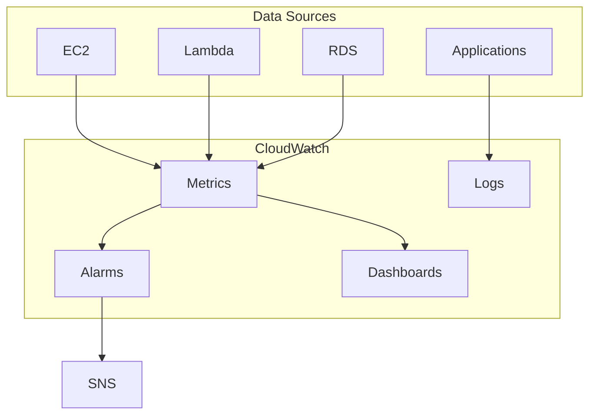
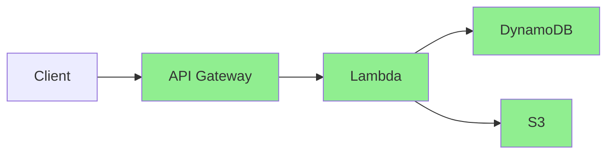

# Monitoring

CloudWatch, X-Ray, and CloudTrail for observability.

---

## Amazon CloudWatch

Monitoring and observability service.



---

## CloudWatch Metrics

### View Metrics

```bash
# List namespaces
aws cloudwatch list-metrics --query 'Metrics[*].Namespace' | sort -u

# List EC2 metrics
aws cloudwatch list-metrics --namespace AWS/EC2

# Get metric statistics
aws cloudwatch get-metric-statistics \
    --namespace AWS/EC2 \
    --metric-name CPUUtilization \
    --dimensions Name=InstanceId,Value=i-1234567890abcdef0 \
    --start-time $(date -u -d '1 hour ago' +%Y-%m-%dT%H:%M:%SZ) \
    --end-time $(date -u +%Y-%m-%dT%H:%M:%SZ) \
    --period 300 \
    --statistics Average Maximum
```

### Custom Metrics

```bash
# Put custom metric
aws cloudwatch put-metric-data \
    --namespace MyApp \
    --metric-name RequestCount \
    --value 100 \
    --unit Count \
    --dimensions Environment=Production,Service=API

# Put metric with timestamp
aws cloudwatch put-metric-data \
    --namespace MyApp \
    --metric-data '[{
        "MetricName": "ProcessingTime",
        "Value": 250,
        "Unit": "Milliseconds",
        "Dimensions": [
            {"Name": "Service", "Value": "OrderProcessor"}
        ]
    }]'
```

### Metric Math

```bash
# Query with metric math (Insights)
aws cloudwatch get-metric-data \
    --metric-data-queries '[
        {
            "Id": "m1",
            "MetricStat": {
                "Metric": {
                    "Namespace": "AWS/EC2",
                    "MetricName": "CPUUtilization",
                    "Dimensions": [{"Name": "InstanceId", "Value": "i-xxx"}]
                },
                "Period": 300,
                "Stat": "Average"
            }
        },
        {
            "Id": "e1",
            "Expression": "m1 * 100",
            "Label": "CPU Percentage"
        }
    ]' \
    --start-time 2024-01-01T00:00:00Z \
    --end-time 2024-01-01T01:00:00Z
```

---

## CloudWatch Alarms

### Create Alarm

```bash
# CPU alarm
aws cloudwatch put-metric-alarm \
    --alarm-name HighCPU \
    --alarm-description "CPU > 80%" \
    --namespace AWS/EC2 \
    --metric-name CPUUtilization \
    --dimensions Name=InstanceId,Value=i-1234567890abcdef0 \
    --statistic Average \
    --period 300 \
    --threshold 80 \
    --comparison-operator GreaterThanThreshold \
    --evaluation-periods 2 \
    --alarm-actions arn:aws:sns:us-east-1:123456789012:alerts

# Composite alarm
aws cloudwatch put-composite-alarm \
    --alarm-name CriticalSystemAlarm \
    --alarm-rule "ALARM(HighCPU) AND ALARM(HighMemory)" \
    --alarm-actions arn:aws:sns:...:critical-alerts
```

### Anomaly Detection

```bash
aws cloudwatch put-anomaly-detector \
    --namespace AWS/EC2 \
    --metric-name CPUUtilization \
    --dimensions Name=InstanceId,Value=i-xxx \
    --stat Average

aws cloudwatch put-metric-alarm \
    --alarm-name AnomalyCPU \
    --metrics '[{
        "Id": "m1",
        "MetricStat": {
            "Metric": {
                "Namespace": "AWS/EC2",
                "MetricName": "CPUUtilization"
            },
            "Period": 300,
            "Stat": "Average"
        }
    }, {
        "Id": "ad1",
        "Expression": "ANOMALY_DETECTION_BAND(m1, 2)"
    }]' \
    --threshold-metric-id ad1 \
    --comparison-operator LessThanLowerOrGreaterThanUpperThreshold
```

---

## CloudWatch Logs

### Log Groups and Streams

```bash
# Create log group
aws logs create-log-group --log-group-name /myapp/application

# Set retention
aws logs put-retention-policy \
    --log-group-name /myapp/application \
    --retention-in-days 30

# Create log stream
aws logs create-log-stream \
    --log-group-name /myapp/application \
    --log-stream-name server-1
```

### Put and Get Logs

```bash
# Put log events
aws logs put-log-events \
    --log-group-name /myapp/application \
    --log-stream-name server-1 \
    --log-events '[{
        "timestamp": '$(date +%s000)',
        "message": "Application started successfully"
    }]'

# Filter logs
aws logs filter-log-events \
    --log-group-name /myapp/application \
    --filter-pattern "ERROR" \
    --start-time $(date -d '1 hour ago' +%s000)
```

### Logs Insights

```bash
# Query logs
aws logs start-query \
    --log-group-name /myapp/application \
    --start-time $(date -d '1 hour ago' +%s) \
    --end-time $(date +%s) \
    --query-string 'fields @timestamp, @message
        | filter @message like /ERROR/
        | sort @timestamp desc
        | limit 20'

# Get results
aws logs get-query-results --query-id $QUERY_ID
```

### Subscription Filters

```bash
# Send logs to Lambda
aws logs put-subscription-filter \
    --log-group-name /myapp/application \
    --filter-name ErrorFilter \
    --filter-pattern "ERROR" \
    --destination-arn arn:aws:lambda:...:function:LogProcessor

# Send logs to Kinesis
aws logs put-subscription-filter \
    --log-group-name /myapp/application \
    --filter-name AllLogs \
    --filter-pattern "" \
    --destination-arn arn:aws:kinesis:...:stream/logs \
    --role-arn arn:aws:iam::...:role/CWLtoKinesis
```

---

## CloudWatch Agent

Collect system-level metrics and logs from EC2.

```bash
# Install agent
sudo yum install -y amazon-cloudwatch-agent

# Configure
sudo /opt/aws/amazon-cloudwatch-agent/bin/amazon-cloudwatch-agent-config-wizard

# Start agent
sudo /opt/aws/amazon-cloudwatch-agent/bin/amazon-cloudwatch-agent-ctl \
    -a fetch-config \
    -m ec2 \
    -c file:/opt/aws/amazon-cloudwatch-agent/bin/config.json \
    -s
```

### Agent Configuration

```json
{
  "metrics": {
    "namespace": "MyApp/EC2",
    "metrics_collected": {
      "cpu": {"measurement": ["cpu_usage_idle", "cpu_usage_user"]},
      "mem": {"measurement": ["mem_used_percent"]},
      "disk": {"measurement": ["disk_used_percent"]}
    }
  },
  "logs": {
    "logs_collected": {
      "files": {
        "collect_list": [
          {
            "file_path": "/var/log/myapp/*.log",
            "log_group_name": "/myapp/application",
            "log_stream_name": "{instance_id}"
          }
        ]
      }
    }
  }
}
```

---

## AWS X-Ray

Distributed tracing for microservices.



### Enable X-Ray

```bash
# Lambda
aws lambda update-function-configuration \
    --function-name MyFunction \
    --tracing-config Mode=Active

# API Gateway
aws apigateway update-stage \
    --rest-api-id $API_ID \
    --stage-name prod \
    --patch-operations op=replace,path=/tracingEnabled,value=true
```

### X-Ray SDK (Python)

```python
from aws_xray_sdk.core import xray_recorder
from aws_xray_sdk.core import patch_all

# Patch AWS SDK
patch_all()

@xray_recorder.capture('my_function')
def my_function():
    # Add annotation
    xray_recorder.put_annotation('user_id', '123')
    
    # Add metadata
    xray_recorder.put_metadata('request', request_data)
    
    # Create subsegment
    with xray_recorder.in_subsegment('process_data'):
        result = process_data()
    
    return result
```

### Query Traces

```bash
# Get trace summaries
aws xray get-trace-summaries \
    --start-time $(date -d '1 hour ago' +%s) \
    --end-time $(date +%s) \
    --filter-expression 'service("MyFunction") AND responsetime > 1'

# Get full trace
aws xray batch-get-traces --trace-ids $TRACE_ID
```

---

## AWS CloudTrail

API activity logging for security and compliance.

```bash
# Create trail
aws cloudtrail create-trail \
    --name my-trail \
    --s3-bucket-name my-cloudtrail-bucket \
    --is-multi-region-trail \
    --enable-log-file-validation

# Start logging
aws cloudtrail start-logging --name my-trail

# Lookup events
aws cloudtrail lookup-events \
    --lookup-attributes AttributeKey=EventName,AttributeValue=StopInstances \
    --start-time $(date -d '24 hours ago' +%Y-%m-%dT%H:%M:%SZ)
```

### CloudTrail Insights

```bash
aws cloudtrail put-insight-selectors \
    --trail-name my-trail \
    --insight-selectors '[{"InsightType": "ApiCallRateInsight"}, {"InsightType": "ApiErrorRateInsight"}]'
```

---

## Dashboards

```bash
# Create dashboard
aws cloudwatch put-dashboard \
    --dashboard-name MyApp \
    --dashboard-body '{
        "widgets": [
            {
                "type": "metric",
                "x": 0, "y": 0,
                "width": 12, "height": 6,
                "properties": {
                    "metrics": [
                        ["AWS/EC2", "CPUUtilization", "InstanceId", "i-xxx"]
                    ],
                    "period": 300,
                    "stat": "Average",
                    "title": "CPU Utilization"
                }
            }
        ]
    }'
```

---

## Best Practices

1. **Set log retention** - Don't keep logs forever
2. **Use structured logging** - JSON format
3. **Create dashboards** - Key metrics at a glance
4. **Set up alarms** - Don't wait for users to report issues
5. **Enable X-Ray** - For distributed systems
6. **Enable CloudTrail** - For security and compliance
7. **Use Contributor Insights** - Identify top contributors

---

## Next Steps

- **[DevOps](14_devops.md)** - CodePipeline, CodeBuild, CloudFormation
