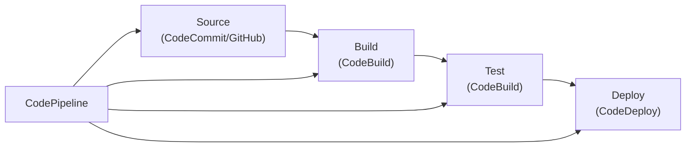

# DevOps

AWS Developer Tools for CI/CD: CodePipeline, CodeBuild, CodeDeploy, and more.

---

## AWS DevOps Services



---

## AWS CodePipeline

Continuous delivery service.

### Create Pipeline

```bash
# Create pipeline from JSON
aws codepipeline create-pipeline --cli-input-json file://pipeline.json
```

### Pipeline Definition

```json
{
  "pipeline": {
    "name": "MyAppPipeline",
    "roleArn": "arn:aws:iam::123456789012:role/CodePipelineRole",
    "stages": [
      {
        "name": "Source",
        "actions": [{
          "name": "SourceAction",
          "actionTypeId": {
            "category": "Source",
            "owner": "AWS",
            "provider": "CodeStarSourceConnection",
            "version": "1"
          },
          "configuration": {
            "ConnectionArn": "arn:aws:codestar-connections:...",
            "FullRepositoryId": "myorg/myrepo",
            "BranchName": "main"
          },
          "outputArtifacts": [{"name": "SourceOutput"}]
        }]
      },
      {
        "name": "Build",
        "actions": [{
          "name": "BuildAction",
          "actionTypeId": {
            "category": "Build",
            "owner": "AWS",
            "provider": "CodeBuild",
            "version": "1"
          },
          "configuration": {
            "ProjectName": "MyBuildProject"
          },
          "inputArtifacts": [{"name": "SourceOutput"}],
          "outputArtifacts": [{"name": "BuildOutput"}]
        }]
      },
      {
        "name": "Deploy",
        "actions": [{
          "name": "DeployAction",
          "actionTypeId": {
            "category": "Deploy",
            "owner": "AWS",
            "provider": "ECS",
            "version": "1"
          },
          "configuration": {
            "ClusterName": "my-cluster",
            "ServiceName": "my-service"
          },
          "inputArtifacts": [{"name": "BuildOutput"}]
        }]
      }
    ]
  }
}
```

### Manage Pipeline

```bash
# Start execution
aws codepipeline start-pipeline-execution --name MyAppPipeline

# Get pipeline state
aws codepipeline get-pipeline-state --name MyAppPipeline

# List executions
aws codepipeline list-pipeline-executions --pipeline-name MyAppPipeline
```

---

## AWS CodeBuild

Build and test code.

### buildspec.yml

```yaml
version: 0.2

env:
  variables:
    ENVIRONMENT: production
  secrets-manager:
    DB_PASSWORD: prod/db:password

phases:
  install:
    runtime-versions:
      nodejs: 18
    commands:
      - npm install

  pre_build:
    commands:
      - echo "Running tests..."
      - npm test

  build:
    commands:
      - echo "Building..."
      - npm run build
      - docker build -t $ECR_REPO:$CODEBUILD_RESOLVED_SOURCE_VERSION .

  post_build:
    commands:
      - echo "Pushing to ECR..."
      - aws ecr get-login-password | docker login --username AWS --password-stdin $ECR_REPO
      - docker push $ECR_REPO:$CODEBUILD_RESOLVED_SOURCE_VERSION
      - echo "Writing image definition..."
      - printf '[{"name":"app","imageUri":"%s"}]' $ECR_REPO:$CODEBUILD_RESOLVED_SOURCE_VERSION > imagedefinitions.json

artifacts:
  files:
    - imagedefinitions.json
    - appspec.yml

cache:
  paths:
    - node_modules/**/*

reports:
  test-reports:
    files:
      - 'coverage/**/*'
    file-format: COBERTURAXML
```

### Create Project

```bash
aws codebuild create-project \
    --name MyBuildProject \
    --source type=GITHUB,location=https://github.com/myorg/myrepo \
    --artifacts type=S3,location=my-artifacts-bucket \
    --environment type=LINUX_CONTAINER,computeType=BUILD_GENERAL1_SMALL,image=aws/codebuild/amazonlinux2-x86_64-standard:4.0,privilegedMode=true \
    --service-role arn:aws:iam::123456789012:role/CodeBuildRole

# Start build
aws codebuild start-build --project-name MyBuildProject

# Get build logs
aws codebuild batch-get-builds --ids $BUILD_ID
```

---

## AWS CodeDeploy

Automated deployments.

### appspec.yml (EC2/On-premises)

```yaml
version: 0.0
os: linux

files:
  - source: /
    destination: /var/www/html

hooks:
  BeforeInstall:
    - location: scripts/stop_server.sh
      timeout: 300
      runas: root
  
  AfterInstall:
    - location: scripts/install_dependencies.sh
      timeout: 300
      runas: root
  
  ApplicationStart:
    - location: scripts/start_server.sh
      timeout: 300
      runas: root
  
  ValidateService:
    - location: scripts/health_check.sh
      timeout: 300
      runas: root
```

### appspec.yml (ECS)

```yaml
version: 0.0
Resources:
  - TargetService:
      Type: AWS::ECS::Service
      Properties:
        TaskDefinition: "arn:aws:ecs:...:task-definition/my-task:1"
        LoadBalancerInfo:
          ContainerName: "app"
          ContainerPort: 8080
```

### Deployment Configurations

```bash
# Blue/Green for ECS
aws deploy create-deployment-group \
    --application-name MyApp \
    --deployment-group-name Production \
    --deployment-config-name CodeDeployDefault.ECSAllAtOnce \
    --ecs-services clusterName=my-cluster,serviceName=my-service \
    --load-balancer-info targetGroupInfoList=[{name=my-target-group}] \
    --blue-green-deployment-configuration '{
        "terminateBlueInstancesOnDeploymentSuccess": {
            "action": "TERMINATE",
            "terminationWaitTimeInMinutes": 5
        },
        "deploymentReadyOption": {
            "actionOnTimeout": "CONTINUE_DEPLOYMENT"
        }
    }'
```

---

## AWS CloudFormation

Infrastructure as Code.

### Template Structure

```yaml
AWSTemplateFormatVersion: '2010-09-09'
Description: My Application Stack

Parameters:
  Environment:
    Type: String
    AllowedValues: [dev, staging, prod]

Mappings:
  RegionAMI:
    us-east-1:
      AMI: ami-0123456789abcdef0

Conditions:
  IsProd: !Equals [!Ref Environment, prod]

Resources:
  MyVPC:
    Type: AWS::EC2::VPC
    Properties:
      CidrBlock: 10.0.0.0/16
      Tags:
        - Key: Name
          Value: !Sub ${Environment}-vpc

  MyInstance:
    Type: AWS::EC2::Instance
    Condition: IsProd
    Properties:
      ImageId: !FindInMap [RegionAMI, !Ref 'AWS::Region', AMI]
      InstanceType: t3.micro

Outputs:
  VPCId:
    Value: !Ref MyVPC
    Export:
      Name: !Sub ${Environment}-VPCId
```

### Stack Operations

```bash
# Create stack
aws cloudformation create-stack \
    --stack-name my-stack \
    --template-body file://template.yaml \
    --parameters ParameterKey=Environment,ParameterValue=prod \
    --capabilities CAPABILITY_IAM

# Update stack
aws cloudformation update-stack \
    --stack-name my-stack \
    --template-body file://template.yaml

# Delete stack
aws cloudformation delete-stack --stack-name my-stack

# Validate template
aws cloudformation validate-template --template-body file://template.yaml
```

---

## AWS Systems Manager

Operations management.

### Parameter Store

```bash
# Store parameter
aws ssm put-parameter \
    --name /myapp/database/password \
    --value "secret123" \
    --type SecureString \
    --key-id alias/aws/ssm

# Get parameter
aws ssm get-parameter \
    --name /myapp/database/password \
    --with-decryption

# Get parameters by path
aws ssm get-parameters-by-path \
    --path /myapp/ \
    --recursive \
    --with-decryption
```

### Session Manager

```bash
# Start session (SSH alternative)
aws ssm start-session --target i-1234567890abcdef0

# Run command
aws ssm send-command \
    --instance-ids i-1234567890abcdef0 \
    --document-name AWS-RunShellScript \
    --parameters commands=["yum update -y"]
```

---

## AWS Secrets Manager

```bash
# Create secret
aws secretsmanager create-secret \
    --name prod/db/credentials \
    --secret-string '{"username":"admin","password":"secret123"}'

# Get secret
aws secretsmanager get-secret-value \
    --secret-id prod/db/credentials

# Rotate secret
aws secretsmanager rotate-secret \
    --secret-id prod/db/credentials \
    --rotation-lambda-arn arn:aws:lambda:...:function:RotateSecret
```

---

## Best Practices

1. **Use IaC** - CloudFormation or Terraform for all infrastructure
2. **Automate everything** - CI/CD for all deployments
3. **Blue/Green deployments** - Minimize downtime
4. **Use Secrets Manager** - Never hardcode secrets
5. **Enable rollback** - Automatic rollback on failures
6. **Use environments** - dev → staging → prod

---

## Next Steps

- **[Well-Architected](15_well_architected.md)** - Best practices and patterns
