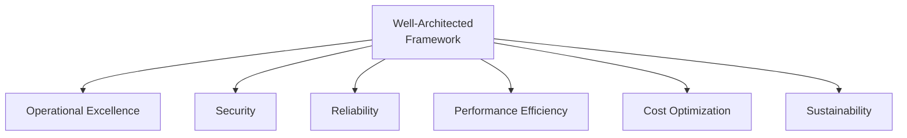
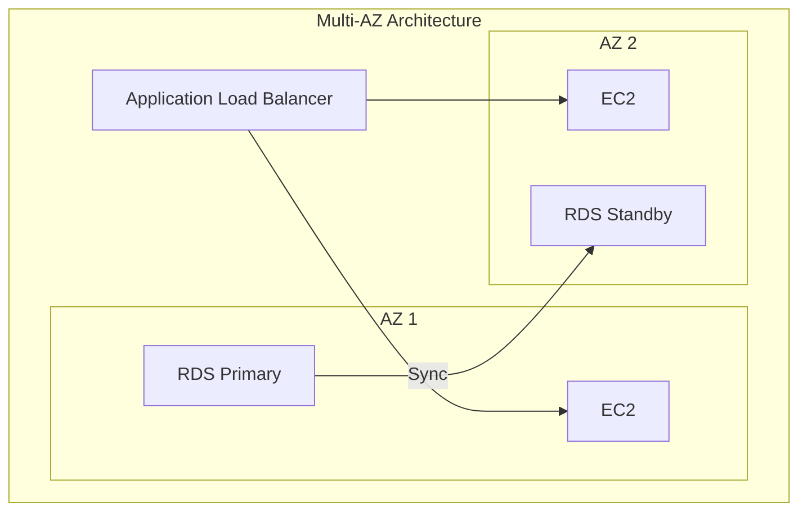
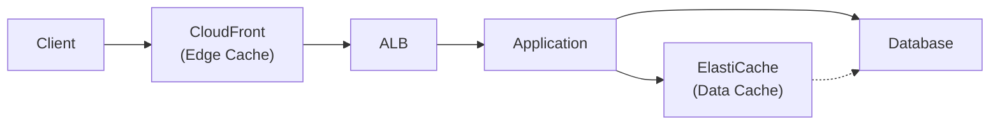
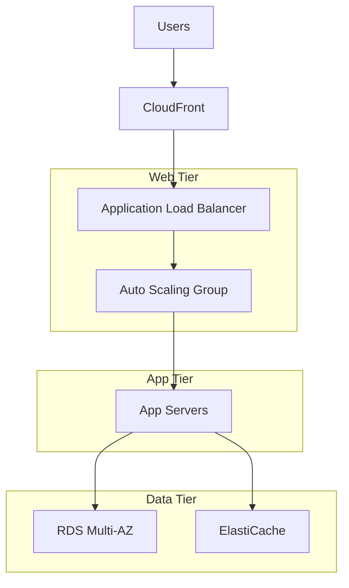
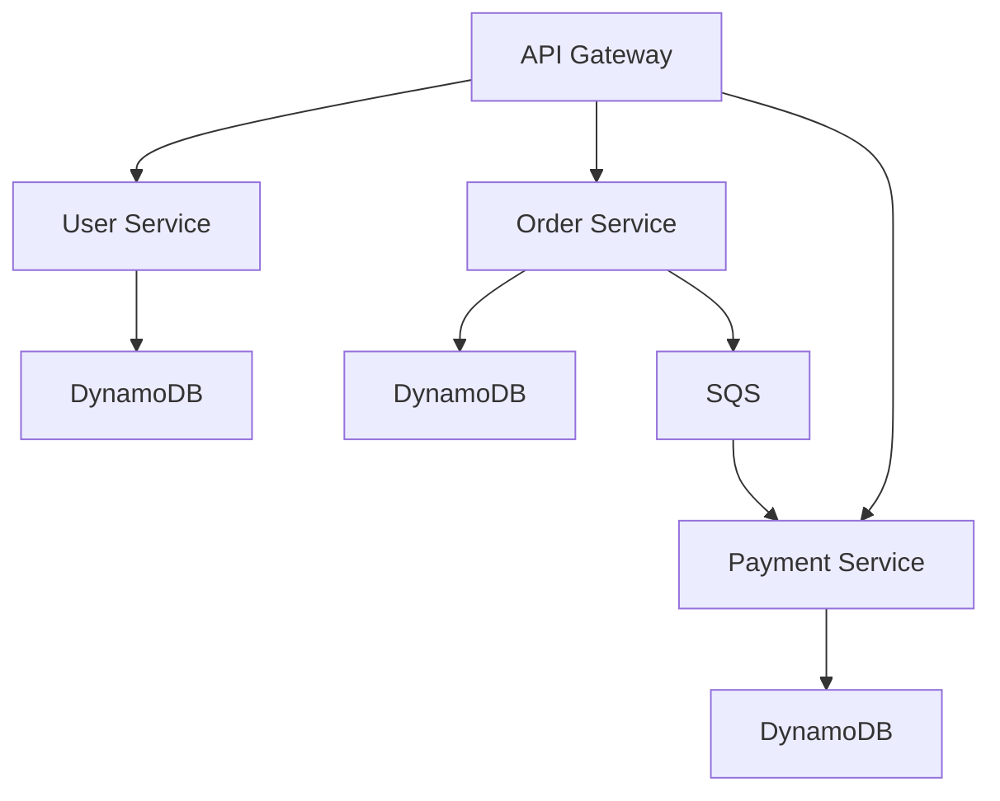
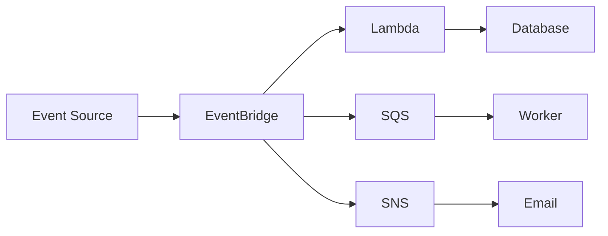

# Well-Architected Framework

AWS best practices for building reliable, secure, and cost-effective systems.

---

## Six Pillars



---

## 1. Operational Excellence

**Focus**: Run and monitor systems, continuously improve.

### Key Principles

- Perform operations as code
- Make frequent, small, reversible changes
- Refine operations procedures frequently
- Anticipate failure
- Learn from operational failures

### Best Practices

```bash
# Infrastructure as Code
aws cloudformation deploy --template-file template.yaml --stack-name my-stack

# Automated deployments with rollback
aws deploy create-deployment \
    --deployment-config-name CodeDeployDefault.AllAtOnce \
    --auto-rollback-configuration enabled=true,events=DEPLOYMENT_FAILURE

# Runbook automation
aws ssm create-document \
    --name MyRunbook \
    --document-type Automation \
    --content file://runbook.yaml
```

---

## 2. Security

**Focus**: Protect data, systems, and assets.

### Key Principles

- Implement strong identity foundation
- Enable traceability
- Apply security at all layers
- Automate security best practices
- Protect data in transit and at rest
- Keep people away from data

### Identity Best Practices

```bash
# Enable MFA
aws iam create-virtual-mfa-device --virtual-mfa-device-name user@example.com

# Use IAM roles (not users)
aws iam create-role --role-name AppRole --assume-role-policy-document file://trust.json

# Least privilege
# Start with minimal permissions, add as needed
```

### Data Protection

```bash
# Encrypt at rest
aws s3api put-bucket-encryption --bucket my-bucket \
    --server-side-encryption-configuration file://encryption.json

# Encrypt in transit (enforce HTTPS)
aws s3api put-bucket-policy --bucket my-bucket --policy '{
    "Statement": [{
        "Effect": "Deny",
        "Principal": "*",
        "Action": "s3:*",
        "Resource": "arn:aws:s3:::my-bucket/*",
        "Condition": {"Bool": {"aws:SecureTransport": "false"}}
    }]
}'
```

---

## 3. Reliability

**Focus**: Recover from failures, meet demand.

### Key Principles

- Automatically recover from failure
- Test recovery procedures
- Scale horizontally
- Stop guessing capacity
- Manage change through automation

### High Availability Patterns



```bash
# Multi-AZ deployment
aws rds create-db-instance \
    --db-instance-identifier my-db \
    --multi-az

# Auto Scaling
aws autoscaling create-auto-scaling-group \
    --min-size 2 --max-size 10 \
    --vpc-zone-identifier "subnet-az1,subnet-az2"
```

### Disaster Recovery Strategies

| Strategy | RTO | RPO | Cost |
|----------|-----|-----|------|
| **Backup & Restore** | Hours | Hours | $ |
| **Pilot Light** | 10s min | Minutes | $$ |
| **Warm Standby** | Minutes | Seconds | $$$ |
| **Active-Active** | ~0 | ~0 | $$$$ |

---

## 4. Performance Efficiency

**Focus**: Use resources efficiently, maintain efficiency as demand changes.

### Key Principles

- Democratize advanced technologies
- Go global in minutes
- Use serverless architectures
- Experiment more often
- Consider mechanical sympathy

### Right-Sizing

```bash
# Use Compute Optimizer recommendations
aws compute-optimizer get-ec2-instance-recommendations

# Use appropriate instance types
# Compute-heavy: c6i, c7g
# Memory-heavy: r6i, r7g
# General: m6i, m7g
```

### Caching



---

## 5. Cost Optimization

**Focus**: Deliver business value at the lowest price point.

### Key Principles

- Implement cloud financial management
- Adopt a consumption model
- Measure overall efficiency
- Stop spending on undifferentiated heavy lifting
- Analyze and attribute expenditure

### Cost Savings Strategies

| Strategy | Savings | Commitment |
|----------|---------|------------|
| **Right-sizing** | 20-30% | None |
| **Reserved Instances** | Up to 72% | 1-3 years |
| **Savings Plans** | Up to 72% | 1-3 years |
| **Spot Instances** | Up to 90% | None (interruptible) |
| **Graviton (ARM)** | ~20% | None |

```bash
# Set up budgets
aws budgets create-budget \
    --account-id 123456789012 \
    --budget file://budget.json

# Enable Cost Explorer
# Console: Billing → Cost Explorer → Enable
```

### Cost-Effective Architecture

```yaml
# Use managed services
Lambda vs EC2           # Pay per use
Fargate vs EC2          # No cluster management
Aurora Serverless       # Auto-scaling database
S3 Intelligent-Tiering  # Auto storage class
```

---

## 6. Sustainability

**Focus**: Minimize environmental impact.

### Key Principles

- Understand your impact
- Establish sustainability goals
- Maximize utilization
- Anticipate and adopt efficient offerings
- Use managed services
- Reduce downstream impact

### Practices

```bash
# Use efficient regions (low-carbon electricity)
# Use Graviton (40% better energy efficiency)
# Right-size to maximize utilization
# Use Spot for batch workloads
```

---

## Common Architecture Patterns

### Three-Tier Web Application



### Microservices



### Event-Driven



---

## Well-Architected Tool

```bash
# Create workload
aws wellarchitected create-workload \
    --workload-name "My Application" \
    --environment PRODUCTION \
    --lenses wellarchitected \
    --review-owner "team@example.com"

# List workloads
aws wellarchitected list-workloads

# Get lens review
aws wellarchitected get-lens-review \
    --workload-id $WORKLOAD_ID \
    --lens-alias wellarchitected
```

---

## Quick Reference Checklist

### Security

- [ ] MFA enabled for all users
- [ ] IAM roles instead of access keys
- [ ] Encryption at rest and in transit
- [ ] VPC for all resources
- [ ] Security groups with least privilege

### Reliability

- [ ] Multi-AZ deployment
- [ ] Auto Scaling enabled
- [ ] Automated backups
- [ ] Health checks configured
- [ ] Disaster recovery tested

### Performance

- [ ] Right-sized instances
- [ ] Caching implemented
- [ ] CDN for static content
- [ ] Database read replicas

### Cost

- [ ] Reserved Instances for steady workloads
- [ ] Spot for flexible workloads
- [ ] S3 lifecycle policies
- [ ] Budgets and alerts set

---

## Next Steps

- **[Cheat Sheet](cheat_sheet.md)** - Quick reference for AWS CLI commands
