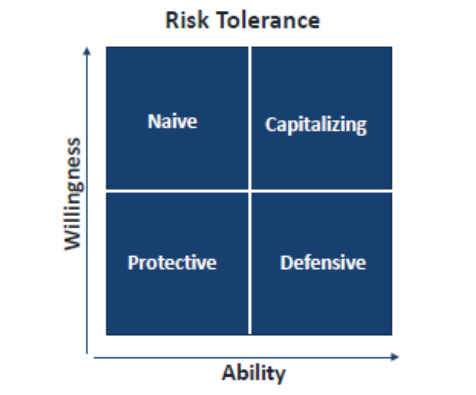

# Howard Marks Memos

## Attitude Towards Risk



- On horizontal axis, we have ability to bear risk. Financial ability to accept risk, degined by financial health, income, assets, etc.
- On vertical axis, we have the psychological willingness to bear risk, degined by mental health, emotional stability (readiness to withstand losses that might happen), etc.

### Cells

- **Capitializing**: (High ability to bear risk + High willingness to take risk) -> Taking advantage of opportunities with its financial strength and risk tolerance.

- **Defensive**: (High ability to bear risk + Low willingness to take risk) ->  Can take more rish than it does, but it has chosen to operate at a lower risk level, perhaps due to its conservative nature or risk management strategy.

- **Protective**: (Low ability to bear risk + Low willingness to take risk) -> Seems appropriate for his circumstances. However it should be recodnized that this is likely to lead to lower return.

- **Naive**: (Low ability to bear risk + High willingness to take risk) -> This is a dangerous position to be in and unfortunately most of the people are in this position. It can risk the survival of the investor.

So every investor should be in a position to understand where he stands in this matrix and should act accordingly. You need to be honest with yourself to understand where you stand in this matrix. Most of people fail here, not because they are not intelligent, but because they are not honest with themselves.

### My Take based on learning and other readings

Self-assessment is very difficult because humans are terrible at objectively evaluating themselves.

Forces that distorts your view:

```markdown
| Force | Description |
| :--- | :--- |
| **Recency Bias** | Bull markets make you feel more capable than you are (overestimate ability) |
| **Emotional State** | Fear/greed shifts willingness daily, making your quadrant unstable |
| **Social Pressure** | "Everyone is making money" pushes willingness up artificially |
| **Country/Macro** | Systemic risk (inflation, currency, geopolitical) is invisible until it's not |
| **Illusion of Control** | More information ≠ more ability to bear risk |
```

Let's ask few questions to ourselves to understand where we stand in this matrix:

#### Risk Tolerance

1. What % of my net worth is this investment?
2. What is my income stability?
3. Do I have emergency fund (6-12 months of expenses)?
4. What happens to my life if this investment drop to 50%?

#### Willingness to take risk

1. How I handle last big drop downs (2008, 2020, 2022)?
2. How many times, in day you check your portfolio?
3. Am I comparing myself with a colleague or neighbor? (Social comparison)
4. Am I able to sleep properly at night?

These questions are not easy to answer and requires a lot of introspection. It is also possible that your answers to these questions change over time. So it is important to revisit these questions from time to time and update your answers accordingly.

One more imporatant you can't ignore the risk, taking no-risk is also a risk (big risk in long run).

#### Practical Suggestions

1. Do the objective audit once a year (net worth, income stability, dependents) → places you on the ability axis.
2. Never assess willingness during market extremes (panic or euphoria). Use your behavior from past downturns.
3. Write down your quadrant and the reasons. Revisit only when your structural situation changes. (Most Important, take a note why you are taking any decision)
