# Terraform: Infrastructure as Code

Welcome to this comprehensive Terraform tutorial! This guide will take you from **complete beginner** to **confident practitioner**, using **AWS** as our primary cloud provider.

> [!NOTE]
> **Prerequisites**: Basic command-line familiarity and an AWS account. No prior Terraform or IaC experience required.

## What is Infrastructure as Code (IaC)?

Infrastructure as Code is the practice of **managing and provisioning infrastructure through code** instead of manual processes.

### The Old Way: Manual Infrastructure


**Problems with manual infrastructure:**

| Issue | Impact |
|-------|--------|
| **No reproducibility** | Can't reliably recreate environments |
| **Configuration drift** | Dev ≠ Staging ≠ Production |
| **No version control** | Who changed what, and when? |
| **Human error** | Typos, forgotten steps, misconfigurations |
| **Slow deployment** | Hours of clicking through consoles |
| **Knowledge silos** | Only "the expert" knows how to set it up |

### The New Way: Infrastructure as Code


**Benefits of IaC:**

| Benefit | Description |
|---------|-------------|
| **Version controlled** | Track every change in Git |
| **Reproducible** | Same code = same infrastructure, every time |
| **Self-documenting** | The code IS the documentation |
| **Collaborative** | Code reviews for infrastructure changes |
| **Automated** | Integrate with CI/CD pipelines |
| **Idempotent** | Run it 100 times, get the same result |

---

## What is Terraform?

**Terraform** is an open-source Infrastructure as Code tool created by HashiCorp. It lets you define cloud infrastructure in human-readable configuration files that you can version, reuse, and share.


### Key Characteristics

| Feature | Description |
|---------|-------------|
| **Declarative** | You describe WHAT you want, not HOW to create it |
| **Multi-cloud** | Single tool for AWS, Azure, GCP, and 3000+ providers |
| **State Management** | Tracks what exists vs. what's desired |
| **Plan Before Apply** | Preview changes before making them |
| **Modules** | Reusable, shareable infrastructure components |

---

## Why Terraform Over Alternatives?


### Detailed Comparison

| Tool | Cloud Support | Language | State | Learning Curve | Best For |
|------|--------------|----------|-------|----------------|----------|
| **Terraform** | Multi-cloud | HCL | Managed | Medium | Cross-cloud, team standardization |
| CloudFormation | AWS only | JSON/YAML | AWS-managed | Medium | AWS-only, native integration |
| Pulumi | Multi-cloud | General-purpose | Managed | Higher | Developers preferring real code |
| CDK | AWS (mainly) | TypeScript, Python | CloudFormation | Medium | AWS + familiar languages |
| Ansible | Multi-cloud | YAML | None | Low | Configuration management |

### Why We Choose Terraform

1. **Cloud Agnostic**: Learn once, deploy anywhere
2. **Ecosystem**: 3000+ providers in the Terraform Registry
3. **Community**: Largest IaC community, abundant resources
4. **Enterprise Ready**: Terraform Cloud/Enterprise for teams
5. **Declarative Simplicity**: HCL is purpose-built for infrastructure

---

## Terraform's Declarative Approach

Terraform uses a **declarative** paradigm: you describe the desired end state, and Terraform figures out how to get there.

### Declarative vs Imperative


**Declarative Example:**

```hcl
# You declare WHAT you want
resource "aws_instance" "web" {
  ami           = "ami-0c55b159cbfafe1f0"
  instance_type = "t2.micro"
  
  tags = {
    Name = "WebServer"
  }
}

# Terraform determines:
# 1. Does this instance exist?
# 2. If not, create it
# 3. If yes, does it match? Update if needed
```

---

## The Terraform Ecosystem


| Component | Description | Who Uses It |
|-----------|-------------|-------------|
| **Terraform CLI** | Core open-source tool | Everyone |
| **Terraform Cloud** | Managed service with collaboration features | Teams |
| **Terraform Enterprise** | Self-hosted version of Cloud | Large enterprises |
| **Terraform Registry** | Public catalog of providers and modules | Everyone |

---

## How Terraform Works: High-Level Flow

```mermaid
flowchart TD
    subgraph "Terraform Workflow"
        A[📝 Write Configuration<br/>main.tf, variables.tf] --> B[🔧 terraform init<br/>Download Providers]
        B --> C[📋 terraform plan<br/>Preview Changes]
        C --> D{Review Plan}
        D -->|Approve| E[🚀 terraform apply<br/>Create/Update Resources]
        D -->|Reject| A
        E --> F[📊 State Updated<br/>terraform.tfstate]
        F --> G[🗑️ terraform destroy<br/>Cleanup when done]
    end
    
    style E fill:#4CAF50,stroke:#333,color:#fff
    style G fill:#f44336,stroke:#333,color:#fff
```



| Command | Purpose | When to Use |
|---------|---------|-------------|
| `terraform init` | Initialize working directory, download providers | Once at start, after adding providers |
| `terraform plan` | Preview changes without making them | Before every apply |
| `terraform apply` | Create or update infrastructure | When ready to deploy |
| `terraform destroy` | Delete all managed infrastructure | Cleanup, decommissioning |

---

## Your First Terraform Concept: The Configuration File

Terraform configurations are written in `.tf` files using **HCL (HashiCorp Configuration Language)**.

```hcl
# This is a comment

# Configure the AWS Provider
terraform {
  required_providers {
    aws = {
      source  = "hashicorp/aws"
      version = "~> 5.0"
    }
  }
}

# Provider configuration
provider "aws" {
  region = "us-east-1"
}

# Resource definition
resource "aws_instance" "my_first_server" {
  ami           = "ami-0c55b159cbfafe1f0"
  instance_type = "t2.micro"
  
  tags = {
    Name        = "MyFirstTerraformServer"
    Environment = "Learning"
  }
}
```

### Anatomy of a Configuration


---

## Tutorial Structure

This tutorial is organized into progressive lessons:

| # | Document | Topics | Level |
|---|----------|--------|-------|
| 00 | **Overview** (this file) | What is Terraform, why use it | 🟢 Beginner |
| 01 | [Installation & Setup](./01_installation_setup.md) | Install Terraform, configure AWS | 🟢 Beginner |
| 02 | [Core Concepts](./02_core_concepts.md) | Providers, Resources, State | 🟢 Beginner |
| 03 | [HCL Syntax](./03_hcl_syntax.md) | Language deep dive | 🟢 Beginner |
| 04 | [Variables & Outputs](./04_variables_outputs.md) | Parameterization | 🟡 Intermediate |
| 05 | [State Management](./05_state_management.md) | Remote backends, locking | 🟡 Intermediate |
| 06 | [Modules](./06_modules.md) | Reusable components | 🟡 Intermediate |
| 07 | [Data Sources](./07_data_sources.md) | Reading existing resources | 🟡 Intermediate |
| 08 | [Provisioners & Lifecycle](./08_provisioners_lifecycle.md) | Advanced resource control | 🟠 Advanced |
| 09 | [Workspaces](./09_workspaces.md) | Environment management | 🟠 Advanced |
| 10 | [Advanced Patterns](./10_advanced_patterns.md) | Loops, conditionals, dynamic blocks | 🟠 Advanced |
| 11 | [Testing & CI/CD](./11_testing_cicd.md) | Automation, pipelines | 🔴 Expert |
| 12 | [Real-World Project](./12_real_world_project.md) | Complete 3-tier AWS architecture | 🔴 Expert |

---

## Practical Examples

Each concept is reinforced with hands-on examples:

| Example | Description | AWS Services |
|---------|-------------|--------------|
| [01_basic_ec2](./examples/01_basic_ec2/) | Your first EC2 instance | EC2, Key Pair |
| [02_vpc_network](./examples/02_vpc_network/) | Complete VPC setup | VPC, Subnets, IGW, NAT |
| [03_s3_cloudfront](./examples/03_s3_cloudfront/) | Static website hosting | S3, CloudFront |
| [04_rds_database](./examples/04_rds_database/) | Managed database | RDS, Secrets Manager |
| [05_eks_cluster](./examples/05_eks_cluster/) | Kubernetes cluster | EKS, IAM |
| [06_three_tier_arch](./examples/06_three_tier_arch/) | Production architecture | Full stack |

---

## Next Steps

Ready to begin? Start with **[01_installation_setup.md](./01_installation_setup.md)** to install Terraform and configure your AWS credentials.

> [!TIP]
> **Pro Tip**: Create a dedicated AWS account or use AWS Organizations with a sandbox account for learning. This prevents accidental changes to production resources.

---

## Quick Reference

### Common Commands Cheatsheet

```bash
# Initialize a working directory
terraform init

# Format code
terraform fmt

# Validate configuration
terraform validate

# Preview changes
terraform plan

# Apply changes
terraform apply

# Apply without prompt
terraform apply -auto-approve

# Destroy all resources
terraform destroy

# Show current state
terraform show

# List resources in state
terraform state list
```

### File Naming Conventions

| File | Purpose |
|------|---------|
| `main.tf` | Primary resource definitions |
| `variables.tf` | Input variable declarations |
| `outputs.tf` | Output value definitions |
| `providers.tf` | Provider configurations |
| `versions.tf` | Terraform and provider version constraints |
| `terraform.tfvars` | Variable values (don't commit secrets!) |
| `backend.tf` | Remote state configuration |

---

## Resources

### Official Documentation

- [Terraform Documentation](https://developer.hashicorp.com/terraform/docs)
- [AWS Provider Documentation](https://registry.terraform.io/providers/hashicorp/aws/latest/docs)
- [Terraform Registry](https://registry.terraform.io/)

### Community

- [HashiCorp Discuss](https://discuss.hashicorp.com/c/terraform-core/)
- [r/Terraform](https://www.reddit.com/r/Terraform/)

---

**Let's begin your Terraform journey! → [01_installation_setup.md](./01_installation_setup.md)**
