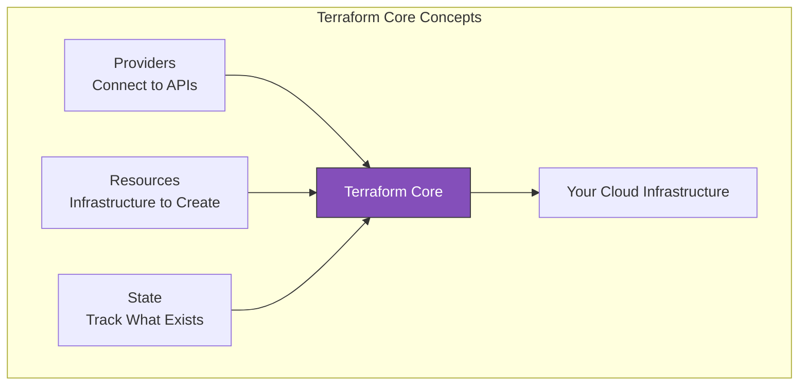
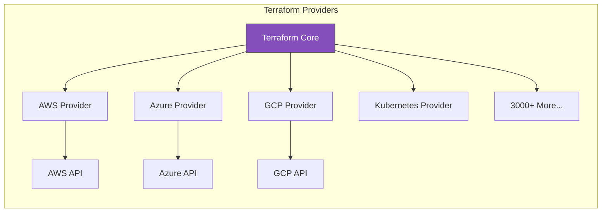
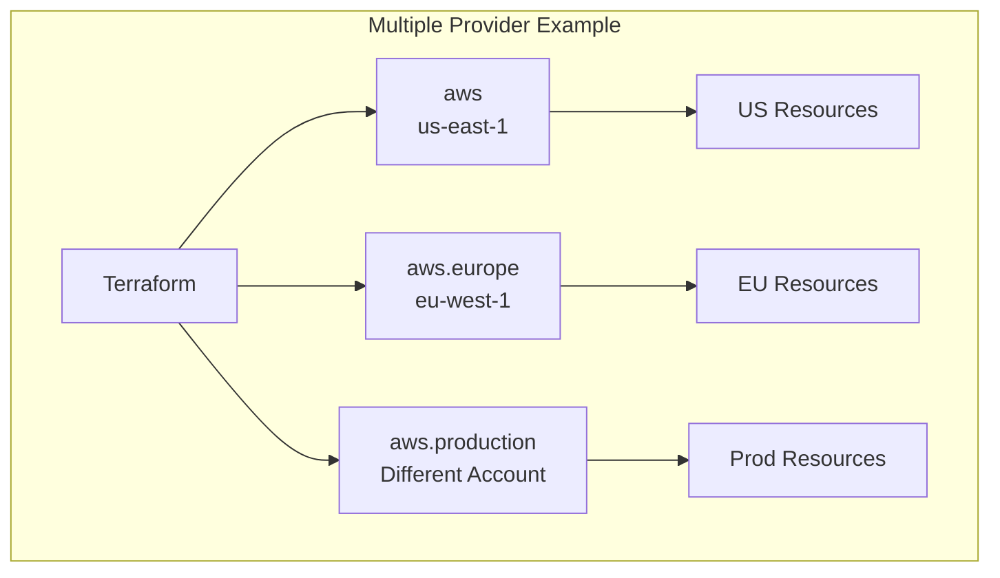
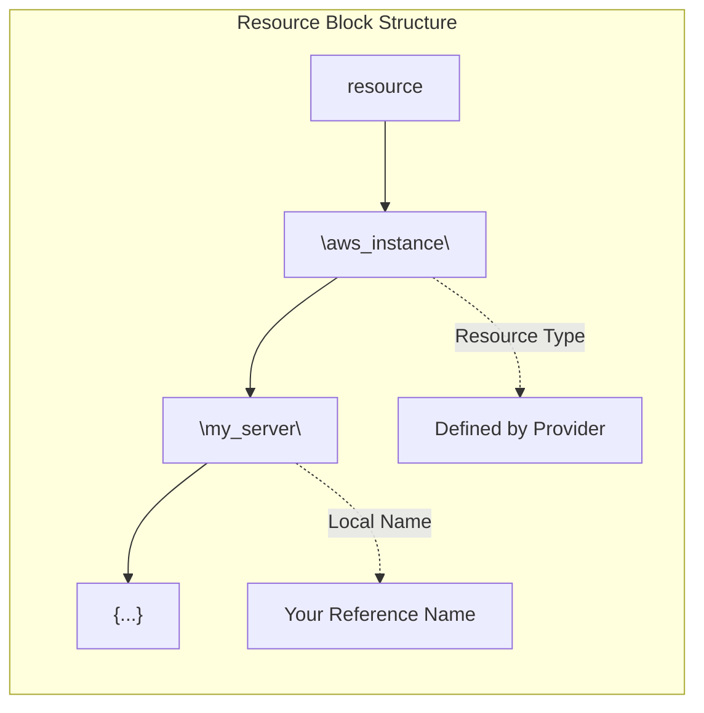
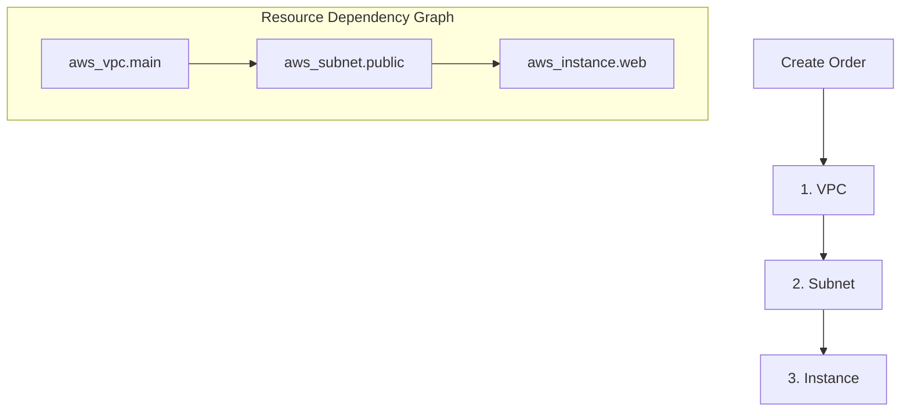
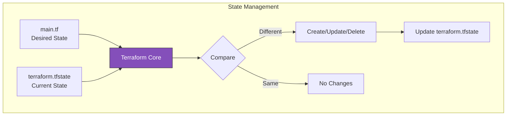
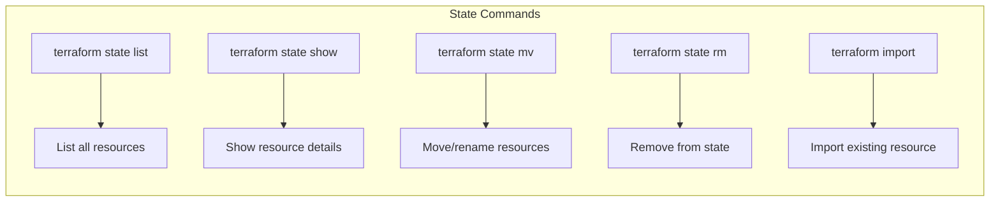
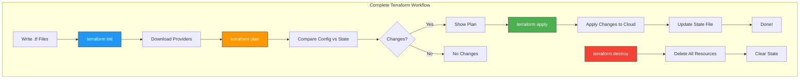
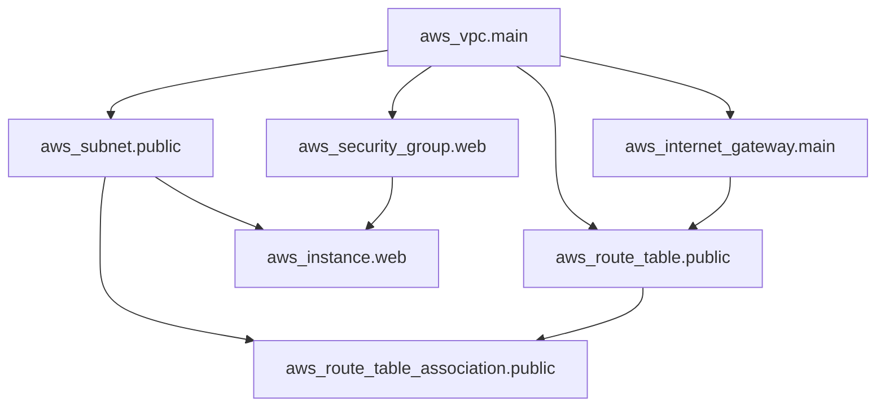

# Core Concepts: Providers, Resources, and State

This document covers the fundamental building blocks of Terraform that you'll use in every project.

> [!NOTE]
> **Learning Goal**: Understand how Terraform connects to cloud providers, creates resources, and tracks infrastructure state.

---

## The Three Pillars of Terraform



| Concept | What It Does | Analogy |
|---------|--------------|---------|
| **Provider** | Connects Terraform to a cloud platform | A driver for your database |
| **Resource** | Defines infrastructure to create | A row in your database |
| **State** | Tracks what actually exists | Your database records |

---

## Providers

A **provider** is a plugin that allows Terraform to interact with cloud platforms, SaaS services, or other APIs.



### Provider Configuration

Every Terraform configuration starts by declaring required providers:

```hcl
# terraform block - specifies version requirements
terraform {
  required_version = ">= 1.0.0"
  
  required_providers {
    aws = {
      source  = "hashicorp/aws"    # Provider source
      version = "~> 5.0"            # Version constraint
    }
  }
}

# provider block - configures the provider
provider "aws" {
  region = "us-east-1"
  
  # Optional: Use a specific profile
  # profile = "my-profile"
  
  # Optional: Default tags for all resources
  default_tags {
    tags = {
      ManagedBy = "Terraform"
      Project   = "Learning"
    }
  }
}
```

### Version Constraints

| Constraint | Meaning | Example |
|------------|---------|---------|
| `= 5.0.0` | Exact version | Only version 5.0.0 |
| `>= 5.0.0` | Minimum version | 5.0.0 or higher |
| `~> 5.0` | Pessimistic (minor) | >= 5.0.0, < 6.0.0 |
| `~> 5.0.0` | Pessimistic (patch) | >= 5.0.0, < 5.1.0 |
| `>= 5.0, < 6.0` | Range | Between 5.0 and 6.0 |

> [!TIP]
> Use `~> 5.0` for the AWS provider. This allows patch and minor updates while avoiding breaking changes in major versions.

### Multiple Provider Configurations

You can configure multiple instances of the same provider for different regions or accounts:

```hcl
# Default provider (us-east-1)
provider "aws" {
  region = "us-east-1"
}

# Additional provider for eu-west-1
provider "aws" {
  alias  = "europe"
  region = "eu-west-1"
}

# Additional provider for different account
provider "aws" {
  alias   = "production"
  region  = "us-east-1"
  profile = "production"
}

# Use specific provider with alias
resource "aws_instance" "web_eu" {
  provider = aws.europe  # Use Europe provider
  
  ami           = "ami-0123456789abcdef0"
  instance_type = "t3.micro"
}
```



---

## Resources

A **resource** is the most important element in Terraform. Each resource block describes one or more infrastructure objects.

### Resource Syntax

```hcl
resource "RESOURCE_TYPE" "LOCAL_NAME" {
  # Configuration arguments
  argument1 = "value1"
  argument2 = "value2"
  
  # Nested blocks
  nested_block {
    nested_argument = "value"
  }
}
```



### AWS EC2 Instance Example

```hcl
resource "aws_instance" "web_server" {
  # Required arguments
  ami           = "ami-0c55b159cbfafe1f0"  # Amazon Linux 2
  instance_type = "t3.micro"
  
  # Optional arguments
  key_name               = "my-key-pair"
  vpc_security_group_ids = [aws_security_group.web.id]
  subnet_id              = aws_subnet.public.id
  
  # Root block device configuration
  root_block_device {
    volume_size           = 20
    volume_type           = "gp3"
    delete_on_termination = true
    encrypted             = true
  }
  
  # Tags
  tags = {
    Name        = "WebServer"
    Environment = "Development"
  }
}
```

### Understanding Resource Types

Resource types follow the pattern: `<provider>_<resource>`

| Resource Type | Provider | Creates |
|---------------|----------|---------|
| `aws_instance` | AWS | EC2 Instance |
| `aws_s3_bucket` | AWS | S3 Bucket |
| `aws_vpc` | AWS | Virtual Private Cloud |
| `aws_security_group` | AWS | Security Group |
| `aws_rds_instance` | AWS | RDS Database |
| `azurerm_virtual_machine` | Azure | Virtual Machine |
| `google_compute_instance` | GCP | Compute Instance |

### Resource Dependencies

Terraform automatically determines the order to create resources based on references:

```hcl
# VPC is created first (no dependencies)
resource "aws_vpc" "main" {
  cidr_block = "10.0.0.0/16"
  
  tags = {
    Name = "main-vpc"
  }
}

# Subnet depends on VPC (created second)
resource "aws_subnet" "public" {
  vpc_id     = aws_vpc.main.id  # Reference creates dependency
  cidr_block = "10.0.1.0/24"
  
  tags = {
    Name = "public-subnet"
  }
}

# Instance depends on subnet (created third)
resource "aws_instance" "web" {
  ami           = "ami-0c55b159cbfafe1f0"
  instance_type = "t3.micro"
  subnet_id     = aws_subnet.public.id  # Reference creates dependency
}
```



### Resource Attributes

Every resource exposes **attributes** that can be referenced by other resources:

```hcl
# Create an instance
resource "aws_instance" "web" {
  ami           = "ami-0c55b159cbfafe1f0"
  instance_type = "t3.micro"
}

# Reference the instance's attributes
output "instance_id" {
  value = aws_instance.web.id          # Instance ID
}

output "public_ip" {
  value = aws_instance.web.public_ip   # Public IP address
}

output "private_ip" {
  value = aws_instance.web.private_ip  # Private IP address
}

output "arn" {
  value = aws_instance.web.arn         # ARN of the instance
}
```

> [!TIP]
> Find all available attributes in the [AWS Provider documentation](https://registry.terraform.io/providers/hashicorp/aws/latest/docs). Each resource page lists all arguments (inputs) and attributes (outputs).

---

## State

**State** is how Terraform knows what infrastructure exists and how it maps to your configuration.

### What is State?



### The State File (terraform.tfstate)

After `terraform apply`, Terraform creates a `terraform.tfstate` file:

```json
{
  "version": 4,
  "terraform_version": "1.6.6",
  "resources": [
    {
      "mode": "managed",
      "type": "aws_instance",
      "name": "web",
      "provider": "provider[\"registry.terraform.io/hashicorp/aws\"]",
      "instances": [
        {
          "schema_version": 1,
          "attributes": {
            "ami": "ami-0c55b159cbfafe1f0",
            "id": "i-0123456789abcdef0",
            "instance_type": "t3.micro",
            "public_ip": "54.123.45.67",
            "private_ip": "10.0.1.50",
            "tags": {
              "Name": "WebServer"
            }
            // ... more attributes
          }
        }
      ]
    }
  ]
}
```

### Why State is Critical

| Purpose | Explanation |
|---------|-------------|
| **Mapping** | Links config resources to real infrastructure |
| **Metadata** | Tracks dependencies between resources |
| **Performance** | Caches attribute values to avoid API calls |
| **Sync** | Enables team collaboration with remote backends |

### State Operations



```bash
# List all resources in state
terraform state list

# Show details of a specific resource
terraform state show aws_instance.web

# Move/rename a resource in state
terraform state mv aws_instance.web aws_instance.web_server

# Remove a resource from state (doesn't destroy it!)
terraform state rm aws_instance.web

# Import an existing AWS resource into state
terraform import aws_instance.web i-0123456789abcdef0
```

> [!CAUTION]
> **Never manually edit terraform.tfstate!** Use `terraform state` commands instead. Manual edits can corrupt the state and break your infrastructure management.

### State File Security

The state file contains sensitive information:

- Resource IDs and ARNs
- Database passwords (if not using secrets manager)
- API keys and tokens
- Private IP addresses

> [!WARNING]
> **Never commit terraform.tfstate to Git!** Use a remote backend (covered in [05_state_management.md](./05_state_management.md)).

---

## The Terraform Workflow

Now let's see how providers, resources, and state work together.



### Step 1: terraform init

```bash
terraform init
```

**What it does:**

- Creates `.terraform` directory
- Downloads provider plugins
- Creates `.terraform.lock.hcl` (dependency lock file)
- Initializes backend (if configured)

### Step 2: terraform plan

```bash
terraform plan
```

**What it does:**

- Reads current state
- Compares desired state (config) vs current state
- Shows what will change

**Plan output symbols:**

| Symbol | Meaning |
|--------|---------|
| `+` | Resource will be created |
| `-` | Resource will be destroyed |
| `~` | Resource will be updated in-place |
| `-/+` | Resource will be destroyed and recreated |

**Example plan output:**

```
Terraform will perform the following actions:

  # aws_instance.web will be created
  + resource "aws_instance" "web" {
      + ami                          = "ami-0c55b159cbfafe1f0"
      + arn                          = (known after apply)
      + id                           = (known after apply)
      + instance_type                = "t3.micro"
      + public_ip                    = (known after apply)
      + tags                         = {
          + "Name" = "WebServer"
        }
    }

Plan: 1 to add, 0 to change, 0 to destroy.
```

### Step 3: terraform apply

```bash
terraform apply
```

**What it does:**

- Shows the plan again
- Asks for confirmation
- Makes API calls to create/update/delete resources
- Updates state file

```bash
# Skip confirmation prompt (use in automation)
terraform apply -auto-approve
```

### Step 4: terraform destroy

```bash
terraform destroy
```

**What it does:**

- Plans deletion of all managed resources
- Asks for confirmation
- Deletes resources in reverse dependency order
- Clears state file

---

## Complete Example: VPC + EC2

Let's put it all together with a complete example:

```hcl
# main.tf

terraform {
  required_version = ">= 1.0.0"
  
  required_providers {
    aws = {
      source  = "hashicorp/aws"
      version = "~> 5.0"
    }
  }
}

provider "aws" {
  region = "us-east-1"
}

# VPC
resource "aws_vpc" "main" {
  cidr_block           = "10.0.0.0/16"
  enable_dns_hostnames = true
  enable_dns_support   = true
  
  tags = {
    Name = "terraform-demo-vpc"
  }
}

# Internet Gateway
resource "aws_internet_gateway" "main" {
  vpc_id = aws_vpc.main.id
  
  tags = {
    Name = "terraform-demo-igw"
  }
}

# Public Subnet
resource "aws_subnet" "public" {
  vpc_id                  = aws_vpc.main.id
  cidr_block              = "10.0.1.0/24"
  availability_zone       = "us-east-1a"
  map_public_ip_on_launch = true
  
  tags = {
    Name = "terraform-demo-public-subnet"
  }
}

# Route Table
resource "aws_route_table" "public" {
  vpc_id = aws_vpc.main.id
  
  route {
    cidr_block = "0.0.0.0/0"
    gateway_id = aws_internet_gateway.main.id
  }
  
  tags = {
    Name = "terraform-demo-public-rt"
  }
}

# Route Table Association
resource "aws_route_table_association" "public" {
  subnet_id      = aws_subnet.public.id
  route_table_id = aws_route_table.public.id
}

# Security Group
resource "aws_security_group" "web" {
  name        = "terraform-demo-web-sg"
  description = "Allow HTTP and SSH"
  vpc_id      = aws_vpc.main.id
  
  ingress {
    description = "HTTP"
    from_port   = 80
    to_port     = 80
    protocol    = "tcp"
    cidr_blocks = ["0.0.0.0/0"]
  }
  
  ingress {
    description = "SSH"
    from_port   = 22
    to_port     = 22
    protocol    = "tcp"
    cidr_blocks = ["0.0.0.0/0"]  # Restrict this in production!
  }
  
  egress {
    from_port   = 0
    to_port     = 0
    protocol    = "-1"
    cidr_blocks = ["0.0.0.0/0"]
  }
  
  tags = {
    Name = "terraform-demo-web-sg"
  }
}

# EC2 Instance
resource "aws_instance" "web" {
  ami                    = "ami-0c55b159cbfafe1f0"  # Amazon Linux 2
  instance_type          = "t3.micro"
  subnet_id              = aws_subnet.public.id
  vpc_security_group_ids = [aws_security_group.web.id]
  
  tags = {
    Name = "terraform-demo-web"
  }
}

# Outputs
output "vpc_id" {
  description = "VPC ID"
  value       = aws_vpc.main.id
}

output "instance_public_ip" {
  description = "Public IP of the web server"
  value       = aws_instance.web.public_ip
}
```

### Resource Dependency Graph



---

## Key Takeaways

| Concept | Remember |
|---------|----------|
| **Provider** | Plugin that connects Terraform to a platform. Always version-lock! |
| **Resource** | Infrastructure object managed by Terraform |
| **State** | JSON file tracking real infrastructure. Never commit locally! |
| **Dependencies** | Terraform automatically determines order from references |
| **Plan** | Always review before applying to catch mistakes |

---

## Next Steps

Continue to **[03_hcl_syntax.md](./03_hcl_syntax.md)** to learn:

- HCL syntax in depth
- Expressions and functions
- String interpolation
- Comments and formatting

**→ [03_hcl_syntax.md](./03_hcl_syntax.md)**
