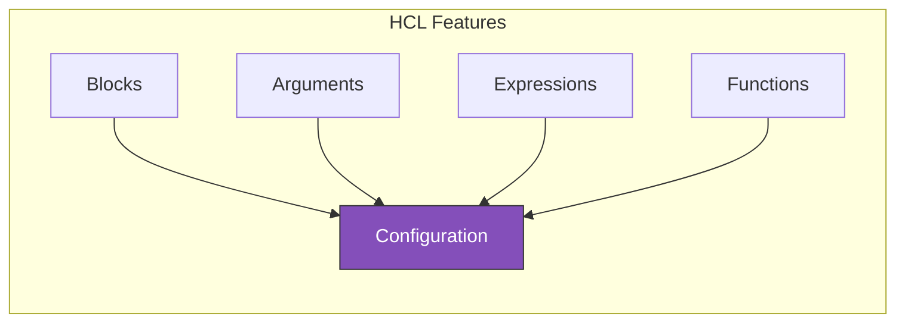
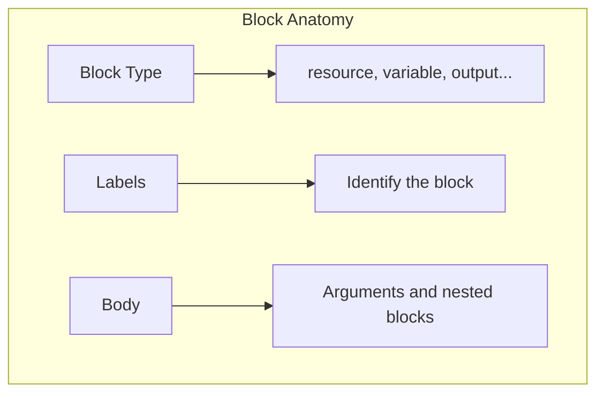
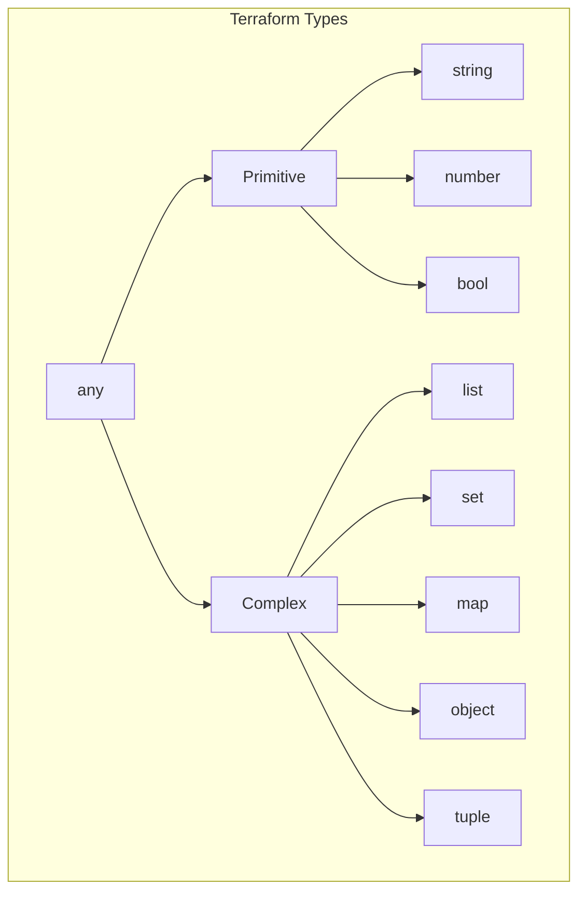
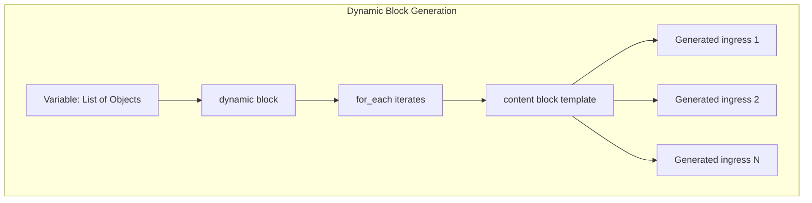

# HCL Syntax Deep Dive

HashiCorp Configuration Language (HCL) is Terraform's domain-specific language. Understanding HCL thoroughly will make you a more effective Terraform developer.

> [!NOTE]
> **Learning Goal**: Master HCL syntax, expressions, functions, and best practices for writing clean, maintainable configurations.

---

## HCL Overview

HCL is designed to be:

- **Human-readable**: Easy to read and write
- **Machine-friendly**: Structured for programmatic processing
- **Expressive**: Supports complex configurations



---

## Basic Syntax Elements

### Comments

```hcl
# This is a single-line comment (most common)

// This is also a single-line comment (C-style)

/*
  This is a
  multi-line comment
  spanning several lines
*/

resource "aws_instance" "web" {
  ami = "ami-12345"  # Inline comment after code
}
```

> [!TIP]
> Use `#` for comments—it's the Terraform convention and consistent with shell scripts.

### Blocks

Blocks are containers for configuration:

```hcl
block_type "label_one" "label_two" {
  # Arguments
  argument_name = "argument_value"
  
  # Nested block
  nested_block {
    nested_argument = "value"
  }
}
```



### Common Block Types

| Block Type | Labels | Purpose |
|------------|--------|---------|
| `terraform` | None | Terraform settings |
| `provider` | Provider name | Cloud provider config |
| `resource` | Type, Name | Infrastructure object |
| `data` | Type, Name | Read existing resource |
| `variable` | Name | Input parameter |
| `output` | Name | Return value |
| `locals` | None | Local values |
| `module` | Name | Reusable configuration |

### Arguments

Arguments assign values within blocks:

```hcl
resource "aws_instance" "example" {
  ami           = "ami-12345678"        # String
  instance_type = "t3.micro"            # String
  count         = 3                     # Number
  monitoring    = true                  # Boolean
  tags          = { Name = "Server" }   # Map
  
  # Argument with expression
  subnet_id = aws_subnet.main.id        # Reference
}
```

---

## Data Types

### Primitive Types

```hcl
# String
name = "my-server"
name = "hello, ${var.name}"  # Interpolation

# Number
count    = 5
cpu      = 2.5
negative = -10

# Boolean
enabled = true
debug   = false
```

### Complex Types

```hcl
# List (ordered collection)
availability_zones = ["us-east-1a", "us-east-1b", "us-east-1c"]
ports              = [80, 443, 8080]

# Map (key-value pairs)
tags = {
  Name        = "WebServer"
  Environment = "Production"
  Team        = "DevOps"
}

# Set (unique values, unordered)
security_group_names = toset(["web", "app", "db"])

# Object (structured type)
server_config = {
  name          = "web-1"
  instance_type = "t3.micro"
  enabled       = true
}

# Tuple (fixed-length, mixed types)
mixed_values = ["string", 42, true]
```

### Type Hierarchy



---

## Expressions

### References

Access attributes from other resources:

```hcl
# Resource reference
resource "aws_subnet" "main" {
  vpc_id = aws_vpc.main.id  # Reference aws_vpc.main's id attribute
}

# Variable reference
instance_type = var.instance_type

# Local reference
name = local.name_prefix

# Data source reference
ami = data.aws_ami.latest.id

# Module output reference
subnet_id = module.vpc.public_subnet_id
```

### String Interpolation

```hcl
# Basic interpolation
name = "server-${var.environment}"

# Multiple interpolations
connection_string = "postgres://${var.username}:${var.password}@${aws_db_instance.main.endpoint}"

# Interpolation with function
bucket_name = "logs-${formatdate("YYYY-MM", timestamp())}"
```

### Heredoc Strings

For multi-line strings:

```hcl
# Standard heredoc (processes interpolation)
user_data = <<-EOF
  #!/bin/bash
  echo "Hello, ${var.name}"
  yum update -y
  yum install -y nginx
  systemctl start nginx
EOF

# Indented heredoc (<<- strips leading whitespace)
policy = <<-POLICY
  {
    "Version": "2012-10-17",
    "Statement": [
      {
        "Effect": "Allow",
        "Action": "s3:GetObject",
        "Resource": "${aws_s3_bucket.main.arn}/*"
      }
    ]
  }
POLICY
```

### Template Strings

For complex templates:

```hcl
# Using templatefile function
user_data = templatefile("${path.module}/scripts/init.sh", {
  hostname    = var.hostname
  environment = var.environment
  packages    = join(" ", var.packages)
})
```

---

## Operators

### Arithmetic Operators

```hcl
# Addition
total = 5 + 3  # 8

# Subtraction
remaining = 10 - 3  # 7

# Multiplication
capacity = 4 * 1024  # 4096

# Division
per_instance = 100 / 4  # 25

# Modulo
remainder = 10 % 3  # 1

# Negative
offset = -1
```

### Comparison Operators

```hcl
# Equality
is_production = var.environment == "prod"

# Inequality
not_default = var.vpc_id != ""

# Greater/Less than
needs_scaling = var.cpu_usage > 80
is_small = var.instance_count < 5

# Greater/Less than or equal
enable_ha = var.availability_zones >= 2
```

### Logical Operators

```hcl
# AND
enable_feature = var.feature_flag && var.is_production

# OR
create_bucket = var.enable_logging || var.enable_backup

# NOT (negation)
skip_validation = !var.validate
```

### Conditional Expression (Ternary)

```hcl
# condition ? true_value : false_value
instance_type = var.environment == "prod" ? "t3.large" : "t3.micro"

# Nested conditional
size = var.tier == "large" ? 100 : var.tier == "medium" ? 50 : 20

# With count for conditional resource creation
count = var.create_instance ? 1 : 0
```

---

## Built-in Functions

Terraform provides many built-in functions organized by category.

### String Functions

```hcl
# format - Printf-style formatting
name = format("%s-%s-%03d", var.project, var.environment, var.index)
# "myproject-prod-001"

# join - Concatenate list with separator
subnets = join(",", var.subnet_ids)
# "subnet-123,subnet-456,subnet-789"

# split - Split string into list
parts = split(",", "a,b,c")
# ["a", "b", "c"]

# replace - Replace substring
clean_name = replace(var.name, " ", "-")

# lower/upper - Case conversion
normalized = lower(var.input)  # "hello"
shouting   = upper(var.input)  # "HELLO"

# trim/trimspace - Remove whitespace
clean = trimspace("  hello  ")  # "hello"

# substr - Extract substring
prefix = substr(var.name, 0, 3)  # First 3 characters

# regex/regexall - Regular expression matching
matches = regex("^([a-z]+)-([0-9]+)$", var.resource_name)
```

### Numeric Functions

```hcl
# abs - Absolute value
positive = abs(-5)  # 5

# ceil/floor - Rounding
rounded_up   = ceil(4.2)   # 5
rounded_down = floor(4.8)  # 4

# max/min - Extremes
largest  = max(5, 12, 9)   # 12
smallest = min(5, 12, 9)   # 5

# pow - Power
squared = pow(2, 8)  # 256

# log - Logarithm
log_value = log(100, 10)  # 2
```

### Collection Functions

```hcl
# length - Count elements
count = length(["a", "b", "c"])  # 3
chars = length("hello")         # 5

# element - Get element by index (wraps around)
first = element(["a", "b", "c"], 0)   # "a"
wrap  = element(["a", "b", "c"], 5)   # "c" (5 % 3 = 2)

# lookup - Get map value with default
value = lookup(var.tags, "Environment", "unknown")

# merge - Combine maps
all_tags = merge(var.default_tags, var.custom_tags)

# concat - Combine lists
all_subnets = concat(var.public_subnets, var.private_subnets)

# flatten - Flatten nested lists
flat = flatten([["a", "b"], ["c", "d"]])  # ["a", "b", "c", "d"]

# keys/values - Extract from map
tag_keys   = keys(var.tags)    # ["Name", "Env"]
tag_values = values(var.tags)  # ["Server", "Prod"]

# contains - Check for element
has_prod = contains(var.environments, "prod")  # true/false

# distinct - Remove duplicates
unique = distinct(["a", "b", "a", "c"])  # ["a", "b", "c"]

# sort - Sort list
sorted = sort(["c", "a", "b"])  # ["a", "b", "c"]

# reverse - Reverse list
rev = reverse(["a", "b", "c"])  # ["c", "b", "a"]

# range - Generate number sequence
nums = range(0, 5)       # [0, 1, 2, 3, 4]
odds = range(1, 10, 2)   # [1, 3, 5, 7, 9]

# zipmap - Create map from lists
mapped = zipmap(["a", "b"], [1, 2])  # {"a" = 1, "b" = 2}
```

### Type Conversion Functions

```hcl
# tostring/tonumber/tobool
str = tostring(42)       # "42"
num = tonumber("42")     # 42
bool = tobool("true")    # true

# tolist/toset/tomap
list = tolist(["a", "b", "a"])   # ["a", "b", "a"]
set  = toset(["a", "b", "a"])    # ["a", "b"] (unique)
map  = tomap({a = 1, b = 2})     # {a = 1, b = 2}

# try - Return first non-error expression
value = try(var.optional_field, "default")

# can - Check if expression is valid
is_valid = can(regex("^[a-z]+$", var.input))

# coalesce - First non-null value
result = coalesce(var.override, var.default, "fallback")

# coalescelist - First non-empty list
subnets = coalescelist(var.custom_subnets, var.default_subnets)
```

### Date and Time Functions

```hcl
# timestamp - Current UTC time
now = timestamp()  # "2024-01-15T10:30:00Z"

# formatdate - Format timestamp
formatted = formatdate("YYYY-MM-DD", timestamp())
# "2024-01-15"

# timeadd - Add duration to timestamp
future = timeadd(timestamp(), "24h")

# timecmp - Compare timestamps
result = timecmp("2024-01-01T00:00:00Z", "2024-06-01T00:00:00Z")
# -1 (first is earlier)
```

### Filesystem Functions

```hcl
# file - Read file contents
content = file("${path.module}/files/config.txt")

# fileexists - Check if file exists
exists = fileexists("${path.module}/optional.txt")

# fileset - Find files matching pattern
configs = fileset("${path.module}/configs", "*.json")

# templatefile - Render template
rendered = templatefile("${path.module}/template.tpl", {
  name = var.name
})

# basename/dirname - Path components
name = basename("/path/to/file.txt")  # "file.txt"
dir  = dirname("/path/to/file.txt")   # "/path/to"

# abspath - Absolute path
abs = abspath("relative/path")

# pathexpand - Expand ~ to home directory
home = pathexpand("~/configs")
```

### Encoding Functions

```hcl
# base64encode/base64decode
encoded = base64encode("Hello World")
decoded = base64decode("SGVsbG8gV29ybGQ=")

# jsonencode/jsondecode
json = jsonencode({
  name = "server"
  port = 8080
})
obj = jsondecode("{\"name\":\"server\"}")

# yamlencode/yamldecode
yaml = yamlencode({
  version = "1.0"
  enabled = true
})

# urlencode
url_safe = urlencode("hello world")  # "hello%20world"

# csvdecode - Parse CSV
data = csvdecode(file("${path.module}/data.csv"))
```

### Hash and Crypto Functions

```hcl
# md5/sha1/sha256/sha512
hash = md5("content")
hash = sha256("content")

# uuid/uuidv5 - Generate UUID
id = uuid()
namespaced_id = uuidv5("dns", "example.com")

# bcrypt - Hash password
hashed = bcrypt("password")
```

### IP Network Functions

```hcl
# cidrhost - Calculate IP from CIDR
ip = cidrhost("10.0.0.0/16", 5)  # "10.0.0.5"

# cidrnetmask - Get netmask from CIDR
mask = cidrnetmask("10.0.0.0/16")  # "255.255.0.0"

# cidrsubnet - Calculate subnet
subnet = cidrsubnet("10.0.0.0/16", 8, 1)  # "10.0.1.0/24"

# cidrsubnets - Calculate multiple subnets
subnets = cidrsubnets("10.0.0.0/16", 8, 8, 8)
# ["10.0.0.0/24", "10.0.1.0/24", "10.0.2.0/24"]
```

---

## For Expressions

Transform collections with `for` expressions:

### List Comprehension

```hcl
# Transform list elements
names = [for s in var.servers : upper(s)]
# ["SERVER-1", "SERVER-2"]

# Filter list elements
production = [for s in var.servers : s if s.environment == "prod"]

# With index
indexed = [for i, s in var.servers : "${i}-${s}"]
# ["0-server-1", "1-server-2"]
```

### Map Comprehension

```hcl
# Create map from list
server_map = { for s in var.servers : s.name => s.ip }
# {"server-1" = "10.0.1.1", "server-2" = "10.0.1.2"}

# Transform map
uppercase_tags = { for k, v in var.tags : upper(k) => v }

# Filter map
important_tags = { for k, v in var.tags : k => v if k != "temp" }
```

### Grouping

```hcl
# Group by attribute
by_environment = { for s in var.servers : s.environment => s... }
# {"prod" = [server1, server2], "dev" = [server3]}
```

---

## Splat Expressions

Shorthand for extracting attributes from lists:

```hcl
# Instead of
ids = [for instance in aws_instance.servers : instance.id]

# Use splat expression
ids = aws_instance.servers[*].id

# Works with nested attributes
private_ips = aws_instance.servers[*].private_ip
arns        = aws_instance.servers[*].arn
```

---

## Dynamic Blocks

Generate repetitive nested blocks dynamically:

```hcl
variable "ingress_rules" {
  type = list(object({
    port        = number
    protocol    = string
    cidr_blocks = list(string)
    description = string
  }))
  default = [
    {
      port        = 80
      protocol    = "tcp"
      cidr_blocks = ["0.0.0.0/0"]
      description = "HTTP"
    },
    {
      port        = 443
      protocol    = "tcp"
      cidr_blocks = ["0.0.0.0/0"]
      description = "HTTPS"
    }
  ]
}

resource "aws_security_group" "web" {
  name = "web-sg"
  
  # Dynamic ingress blocks
  dynamic "ingress" {
    for_each = var.ingress_rules
    content {
      from_port   = ingress.value.port
      to_port     = ingress.value.port
      protocol    = ingress.value.protocol
      cidr_blocks = ingress.value.cidr_blocks
      description = ingress.value.description
    }
  }
  
  egress {
    from_port   = 0
    to_port     = 0
    protocol    = "-1"
    cidr_blocks = ["0.0.0.0/0"]
  }
}
```



---

## Best Practices

### Code Formatting

```bash
# Auto-format all files
terraform fmt

# Check formatting (CI/CD)
terraform fmt -check

# Format recursively
terraform fmt -recursive
```

### Naming Conventions

```hcl
# Resources: snake_case
resource "aws_instance" "web_server" { }
resource "aws_s3_bucket" "app_logs" { }

# Variables: snake_case
variable "instance_type" { }
variable "enable_monitoring" { }

# Locals: snake_case
locals {
  common_tags = { }
  name_prefix = ""
}

# Outputs: snake_case
output "instance_public_ip" { }
```

### File Organization

```
project/
├── main.tf           # Primary resources
├── variables.tf      # Input variables
├── outputs.tf        # Output values
├── locals.tf         # Local values
├── providers.tf      # Provider configuration
├── versions.tf       # Version constraints
├── data.tf           # Data sources
└── terraform.tfvars  # Variable values
```

### Comments and Documentation

```hcl
# Use descriptive variable descriptions
variable "vpc_cidr" {
  description = "CIDR block for the VPC. Example: 10.0.0.0/16"
  type        = string
  default     = "10.0.0.0/16"
}

# Document complex logic
locals {
  # Calculate subnet CIDRs for each AZ
  # We use /24 subnets within the /16 VPC
  subnet_cidrs = [for i, az in var.availability_zones : 
    cidrsubnet(var.vpc_cidr, 8, i)
  ]
}

# Explain non-obvious choices
resource "aws_instance" "web" {
  # Using t3.micro for cost savings in non-prod
  # Production should override to t3.large minimum
  instance_type = var.instance_type
}
```

---

## Common Patterns

### Conditional Resource Creation

```hcl
# Create resource only if condition is true
resource "aws_eip" "web" {
  count = var.create_eip ? 1 : 0
  
  instance = aws_instance.web.id
}

# Reference conditionally created resource
output "eip" {
  value = var.create_eip ? aws_eip.web[0].public_ip : null
}
```

### Optional Arguments with null

```hcl
resource "aws_instance" "web" {
  ami           = var.ami
  instance_type = var.instance_type
  
  # Only set key_name if provided
  key_name = var.key_name != "" ? var.key_name : null
}
```

### Merging Default and Custom Values

```hcl
locals {
  default_tags = {
    ManagedBy   = "Terraform"
    Environment = var.environment
  }
  
  # Merge defaults with custom, custom takes precedence
  all_tags = merge(local.default_tags, var.custom_tags)
}
```

---

## Next Steps

Continue to **[04_variables_outputs.md](./04_variables_outputs.md)** to learn:

- Variable types and validation
- Variable files and precedence
- Output values and dependencies
- Local values for computed expressions

**→ [04_variables_outputs.md](./04_variables_outputs.md)**
