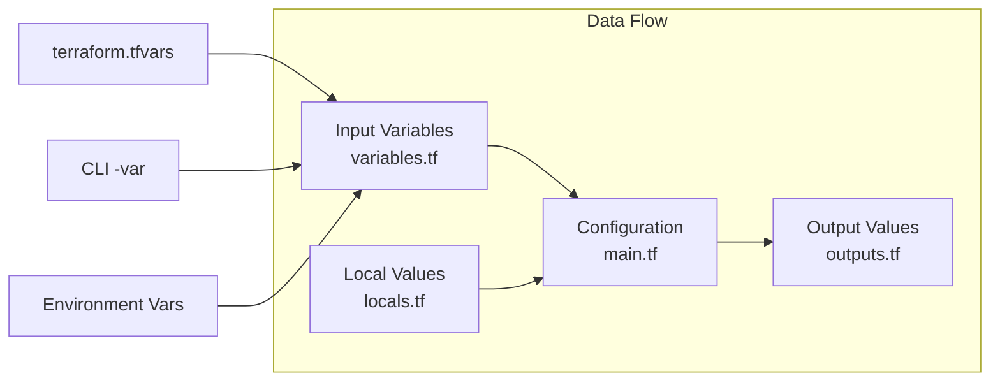
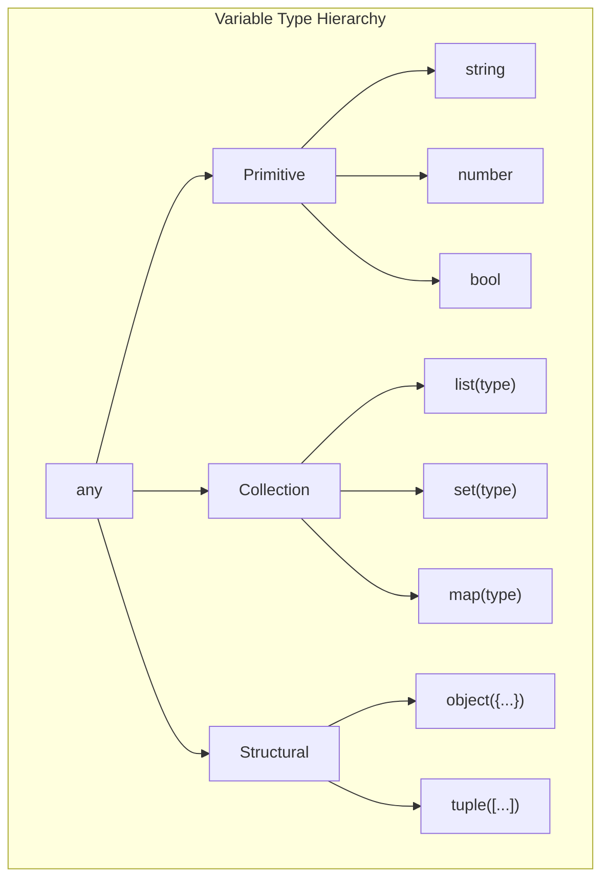
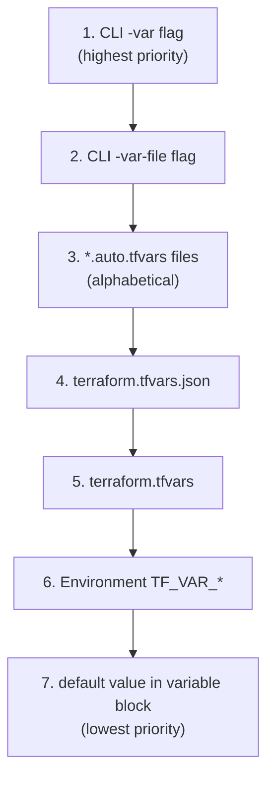

# Variables, Outputs, and Locals

Variables make your Terraform configurations flexible and reusable. This document covers input variables, output values, and local values.

> [!NOTE]
> **Learning Goal**: Master parameterization to create reusable, maintainable infrastructure code.

---

## Overview



| Type | Purpose | Defined In | Used For |
|------|---------|------------|----------|
| **Input Variables** | Accept external values | `variables.tf` | Parameterization |
| **Output Values** | Export resource attributes | `outputs.tf` | Sharing info |
| **Local Values** | Computed intermediate values | `locals.tf` | DRY, clarity |

---

## Input Variables

### Basic Variable Declaration

```hcl
# variables.tf

variable "region" {
  description = "AWS region to deploy resources"
  type        = string
  default     = "us-east-1"
}

variable "instance_type" {
  description = "EC2 instance type"
  type        = string
  # No default - must be provided
}

variable "enable_monitoring" {
  description = "Enable detailed monitoring for EC2"
  type        = bool
  default     = false
}

variable "instance_count" {
  description = "Number of instances to create"
  type        = number
  default     = 1
}
```

### Using Variables

```hcl
# main.tf

provider "aws" {
  region = var.region
}

resource "aws_instance" "web" {
  count = var.instance_count
  
  ami           = "ami-12345678"
  instance_type = var.instance_type
  monitoring    = var.enable_monitoring
  
  tags = {
    Name = "web-${count.index + 1}"
  }
}
```

---

## Variable Types

### Primitive Types

```hcl
# String
variable "environment" {
  type    = string
  default = "development"
}

# Number
variable "port" {
  type    = number
  default = 8080
}

# Boolean
variable "create_bucket" {
  type    = bool
  default = true
}
```

### Collection Types

```hcl
# List of strings
variable "availability_zones" {
  description = "List of AZs to use"
  type        = list(string)
  default     = ["us-east-1a", "us-east-1b", "us-east-1c"]
}

# List of numbers
variable "allowed_ports" {
  type    = list(number)
  default = [80, 443, 8080]
}

# Map of strings
variable "tags" {
  type = map(string)
  default = {
    Environment = "dev"
    Project     = "demo"
  }
}

# Set (unique values)
variable "security_groups" {
  type    = set(string)
  default = ["sg-123", "sg-456"]
}
```

### Structural Types

```hcl
# Object - structured type with named attributes
variable "database_config" {
  description = "Database configuration"
  type = object({
    engine         = string
    engine_version = string
    instance_class = string
    allocated_storage = number
    multi_az       = bool
  })
  default = {
    engine            = "postgres"
    engine_version    = "14.7"
    instance_class    = "db.t3.micro"
    allocated_storage = 20
    multi_az          = false
  }
}

# Tuple - fixed-length sequence with known types
variable "cidr_settings" {
  type    = tuple([string, number])
  default = ["10.0.0.0/16", 8]  # [base_cidr, newbits]
}

# List of objects
variable "users" {
  type = list(object({
    name  = string
    role  = string
    admin = bool
  }))
  default = [
    { name = "alice", role = "developer", admin = false },
    { name = "bob", role = "admin", admin = true }
  ]
}

# Map of objects
variable "environments" {
  type = map(object({
    instance_type = string
    min_size      = number
    max_size      = number
  }))
  default = {
    dev = {
      instance_type = "t3.micro"
      min_size      = 1
      max_size      = 2
    }
    prod = {
      instance_type = "t3.large"
      min_size      = 2
      max_size      = 10
    }
  }
}
```



---

## Variable Validation

Add validation rules to catch errors early:

```hcl
variable "environment" {
  description = "Deployment environment"
  type        = string
  
  validation {
    condition     = contains(["dev", "staging", "prod"], var.environment)
    error_message = "Environment must be 'dev', 'staging', or 'prod'."
  }
}

variable "instance_type" {
  description = "EC2 instance type"
  type        = string
  
  validation {
    condition     = can(regex("^t[23]\\.", var.instance_type))
    error_message = "Instance type must be t2 or t3 family (e.g., t3.micro)."
  }
}

variable "vpc_cidr" {
  description = "VPC CIDR block"
  type        = string
  
  validation {
    condition     = can(cidrnetmask(var.vpc_cidr))
    error_message = "Must be a valid CIDR notation (e.g., 10.0.0.0/16)."
  }
  
  validation {
    condition     = tonumber(split("/", var.vpc_cidr)[1]) <= 16
    error_message = "VPC CIDR must be /16 or larger."
  }
}

variable "port" {
  type = number
  
  validation {
    condition     = var.port >= 1 && var.port <= 65535
    error_message = "Port must be between 1 and 65535."
  }
}
```

> [!TIP]
> Use multiple validation blocks to provide specific error messages for different failure conditions.

---

## Providing Variable Values

### 1. Default Values

```hcl
variable "region" {
  default = "us-east-1"  # Used if no other value provided
}
```

### 2. terraform.tfvars File

```hcl
# terraform.tfvars (automatically loaded)
region         = "us-west-2"
instance_type  = "t3.small"
instance_count = 3
environment    = "staging"

tags = {
  Project = "MyApp"
  Owner   = "DevOps"
}
```

### 3. Named .tfvars Files

```hcl
# prod.tfvars
region         = "us-east-1"
instance_type  = "t3.large"
instance_count = 5
environment    = "prod"
```

```bash
# Apply with specific tfvars file
terraform apply -var-file="prod.tfvars"
```

### 4. Command Line -var Flag

```bash
terraform apply \
  -var="region=us-west-2" \
  -var="instance_type=t3.large" \
  -var='tags={"Environment":"prod"}'
```

### 5. Environment Variables

```bash
# TF_VAR_ prefix + variable name
export TF_VAR_region="us-west-2"
export TF_VAR_instance_type="t3.large"
export TF_VAR_db_password="secret"  # Good for secrets!

terraform apply
```

### Variable Precedence (High to Low)



> [!IMPORTANT]
> Later values override earlier ones. CLI `-var` always wins!

---

## Sensitive Variables

Mark variables containing secrets as sensitive:

```hcl
variable "database_password" {
  description = "Password for database"
  type        = string
  sensitive   = true
}

variable "api_key" {
  description = "API key for external service"
  type        = string
  sensitive   = true
}
```

**Effects of `sensitive = true`:**

- Value hidden in `terraform plan` and `terraform apply` output
- Value hidden in logs
- Value still stored in state file (encrypt your state!)

```
# terraform plan output
  ~ resource "aws_db_instance" "main" {
      ~ password = (sensitive value)
    }
```

> [!WARNING]
> Sensitive variables are still stored in the state file! Always encrypt state storage and use proper access controls.

---

## Output Values

Outputs expose selected values from your configuration.

### Basic Outputs

```hcl
# outputs.tf

output "vpc_id" {
  description = "The ID of the VPC"
  value       = aws_vpc.main.id
}

output "instance_public_ip" {
  description = "Public IP address of the web server"
  value       = aws_instance.web.public_ip
}

output "instance_private_ips" {
  description = "Private IPs of all instances"
  value       = aws_instance.web[*].private_ip
}

output "database_endpoint" {
  description = "Database connection endpoint"
  value       = aws_db_instance.main.endpoint
}

output "database_password" {
  description = "Database password"
  value       = var.database_password
  sensitive   = true  # Hide in CLI output
}
```

### Viewing Outputs

```bash
# Show all outputs after apply
terraform output

# Show specific output
terraform output vpc_id

# Get raw value (useful for scripts)
terraform output -raw instance_public_ip

# Get as JSON
terraform output -json
```

### Output Expressions

```hcl
# Formatted string
output "connection_string" {
  value = "postgres://${var.db_user}@${aws_db_instance.main.endpoint}/${var.db_name}"
}

# Conditional output
output "load_balancer_dns" {
  value = var.enable_lb ? aws_lb.main[0].dns_name : null
}

# Complex structure
output "instance_details" {
  value = {
    id         = aws_instance.web.id
    public_ip  = aws_instance.web.public_ip
    private_ip = aws_instance.web.private_ip
    az         = aws_instance.web.availability_zone
  }
}

# List comprehension
output "subnet_ids" {
  value = [for s in aws_subnet.private : s.id]
}
```

### Module Outputs

Outputs are essential for module interfaces:

```hcl
# In module (modules/vpc/outputs.tf)
output "vpc_id" {
  value = aws_vpc.main.id
}

output "public_subnet_ids" {
  value = aws_subnet.public[*].id
}

# In root module (main.tf)
module "vpc" {
  source = "./modules/vpc"
}

# Access module outputs
resource "aws_instance" "web" {
  subnet_id = module.vpc.public_subnet_ids[0]
}
```

---

## Local Values

Locals are computed values defined once and used multiple times.

### Basic Locals

```hcl
# locals.tf

locals {
  # Simple value
  environment = "production"
  
  # Computed value
  name_prefix = "${var.project}-${var.environment}"
  
  # Common tags
  common_tags = {
    Project     = var.project
    Environment = var.environment
    ManagedBy   = "Terraform"
    Owner       = var.owner
  }
  
  # Merged tags
  all_tags = merge(local.common_tags, var.additional_tags)
}
```

### Using Locals

```hcl
# main.tf

resource "aws_vpc" "main" {
  cidr_block = var.vpc_cidr
  
  tags = merge(local.common_tags, {
    Name = "${local.name_prefix}-vpc"
  })
}

resource "aws_instance" "web" {
  ami           = var.ami_id
  instance_type = var.instance_type
  
  tags = merge(local.common_tags, {
    Name = "${local.name_prefix}-web"
    Role = "webserver"
  })
}
```

### Computed Locals

```hcl
locals {
  # Calculate subnet CIDRs
  public_subnets = [for i in range(var.az_count) : 
    cidrsubnet(var.vpc_cidr, 8, i)
  ]
  
  private_subnets = [for i in range(var.az_count) : 
    cidrsubnet(var.vpc_cidr, 8, i + var.az_count)
  ]
  
  # Environment-specific settings
  is_production = var.environment == "prod"
  
  instance_type = local.is_production ? "t3.large" : "t3.micro"
  
  min_instances = local.is_production ? 3 : 1
  
  # Transform data
  user_map = { for user in var.users : user.name => user }
  
  admin_users = [for user in var.users : user.name if user.admin]
}
```

### When to Use Locals vs Variables

| Use Case | Variables | Locals |
|----------|-----------|--------|
| Values from outside | ✅ | ❌ |
| Internal computed values | ❌ | ✅ |
| Avoid repetition | ❌ | ✅ |
| Environment-specific defaults | ❌ | ✅ |
| Complex transformations | ❌ | ✅ |

---

## Best Practices

### Organize Variable Files

```
project/
├── main.tf
├── variables.tf          # All variable declarations
├── outputs.tf            # All outputs
├── locals.tf             # Local values
├── terraform.tfvars      # Default values
├── environments/
│   ├── dev.tfvars
│   ├── staging.tfvars
│   └── prod.tfvars
```

### Variable Naming Conventions

```hcl
# Use descriptive, consistent names
variable "vpc_cidr_block" { }       # Specific
variable "enable_monitoring" { }    # Boolean prefix
variable "instance_type" { }        # Clear purpose
variable "database_password" { }    # Sensitive, obvious

# Avoid vague names
variable "data" { }     # Too vague
variable "config" { }   # Too vague
variable "flag" { }     # Too vague
```

### Always Include Descriptions

```hcl
variable "instance_type" {
  description = "EC2 instance type for web servers. Use t3.micro for dev, t3.large+ for prod."
  type        = string
  default     = "t3.micro"
}
```

### Group Related Variables

```hcl
# ---------------------
# Network Configuration
# ---------------------
variable "vpc_cidr" {
  description = "CIDR block for VPC"
  type        = string
}

variable "availability_zones" {
  description = "List of AZs to use"
  type        = list(string)
}

# ---------------------
# Instance Configuration
# ---------------------
variable "instance_type" {
  description = "EC2 instance type"
  type        = string
}

variable "instance_count" {
  description = "Number of instances"
  type        = number
}
```

### Use Objects for Related Settings

```hcl
# Instead of multiple separate variables:
variable "db_instance_class" { }
variable "db_allocated_storage" { }
variable "db_engine" { }
variable "db_engine_version" { }

# Use a structured object:
variable "database" {
  description = "Database configuration"
  type = object({
    instance_class    = string
    allocated_storage = number
    engine            = string
    engine_version    = string
  })
  default = {
    instance_class    = "db.t3.micro"
    allocated_storage = 20
    engine            = "postgres"
    engine_version    = "14"
  }
}

# Usage
resource "aws_db_instance" "main" {
  instance_class    = var.database.instance_class
  allocated_storage = var.database.allocated_storage
  engine            = var.database.engine
  engine_version    = var.database.engine_version
}
```

---

## Complete Example

```hcl
# variables.tf

variable "project" {
  description = "Project name"
  type        = string
}

variable "environment" {
  description = "Environment (dev, staging, prod)"
  type        = string
  
  validation {
    condition     = contains(["dev", "staging", "prod"], var.environment)
    error_message = "Environment must be dev, staging, or prod."
  }
}

variable "vpc_cidr" {
  description = "VPC CIDR block"
  type        = string
  default     = "10.0.0.0/16"
}

variable "instance_config" {
  description = "Instance configuration by environment"
  type = map(object({
    instance_type = string
    count         = number
  }))
  default = {
    dev     = { instance_type = "t3.micro", count = 1 }
    staging = { instance_type = "t3.small", count = 2 }
    prod    = { instance_type = "t3.large", count = 3 }
  }
}

variable "additional_tags" {
  description = "Additional tags to apply"
  type        = map(string)
  default     = {}
}

# locals.tf

locals {
  name_prefix = "${var.project}-${var.environment}"
  
  instance_settings = var.instance_config[var.environment]
  
  common_tags = {
    Project     = var.project
    Environment = var.environment
    ManagedBy   = "Terraform"
  }
  
  all_tags = merge(local.common_tags, var.additional_tags)
}

# main.tf

resource "aws_instance" "web" {
  count = local.instance_settings.count
  
  ami           = data.aws_ami.amazon_linux.id
  instance_type = local.instance_settings.instance_type
  
  tags = merge(local.all_tags, {
    Name = "${local.name_prefix}-web-${count.index + 1}"
  })
}

# outputs.tf

output "instance_ids" {
  description = "IDs of created instances"
  value       = aws_instance.web[*].id
}

output "instance_public_ips" {
  description = "Public IPs of instances"
  value       = aws_instance.web[*].public_ip
}

output "environment_summary" {
  description = "Summary of deployed environment"
  value = {
    environment   = var.environment
    instance_type = local.instance_settings.instance_type
    instance_count = local.instance_settings.count
  }
}
```

---

## Next Steps

Continue to **[05_state_management.md](./05_state_management.md)** to learn:

- How state files work
- Remote state backends (S3 + DynamoDB)
- State locking for team collaboration
- State operations and migration

**→ [05_state_management.md](./05_state_management.md)**
