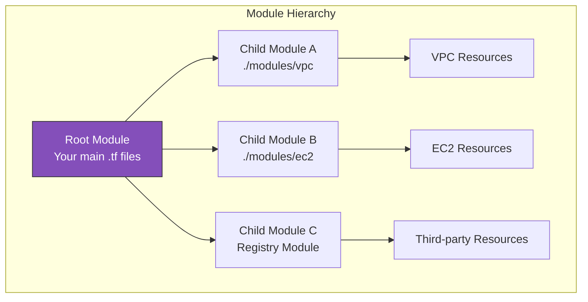
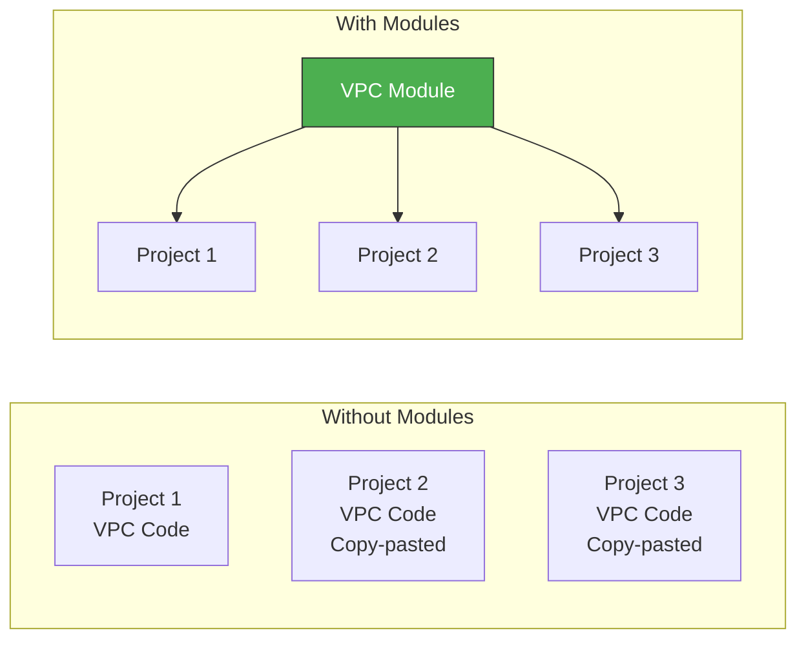
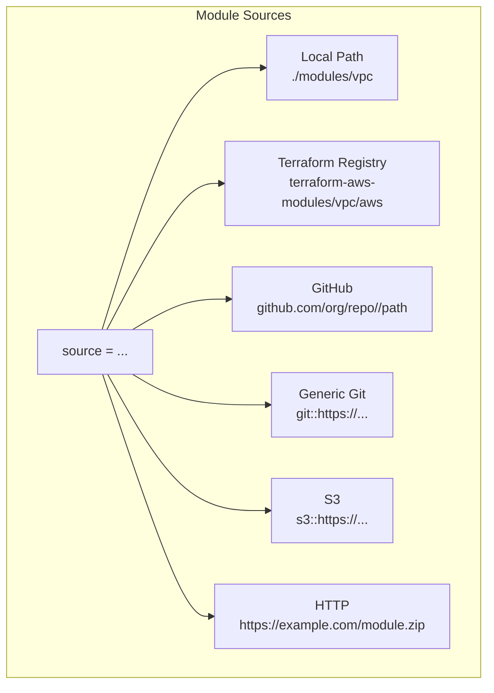
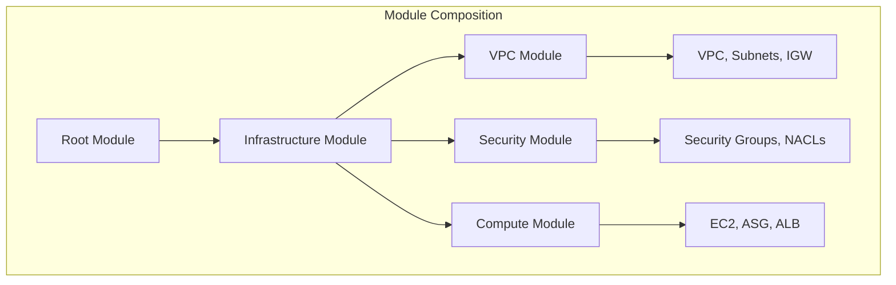
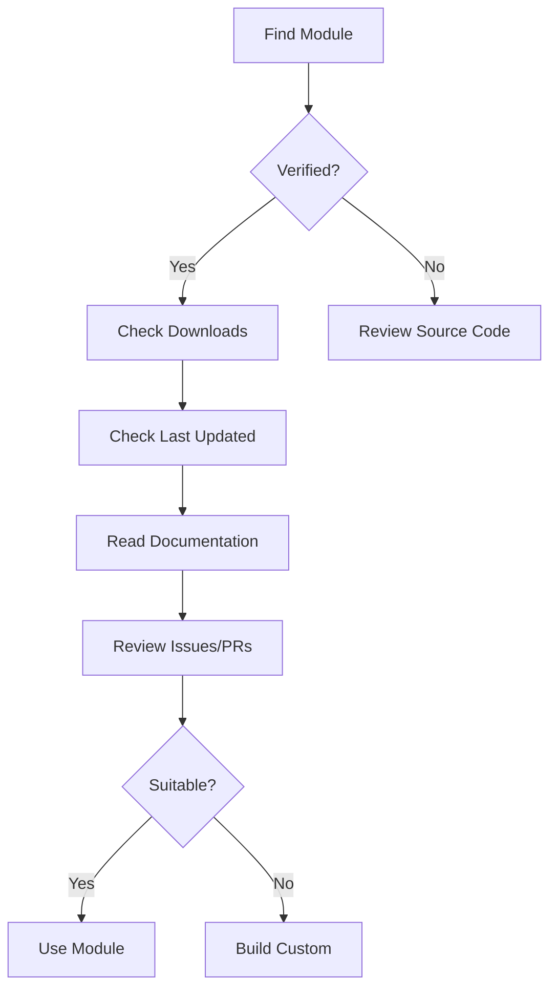

# Modules: Reusable Infrastructure Components

Modules are the key to writing reusable, maintainable Terraform code. They allow you to package infrastructure into self-contained, shareable units.

> [!NOTE]
> **Learning Goal**: Master creating, using, and versioning Terraform modules for scalable infrastructure.

---

## What is a Module?

A module is a container for multiple resources that are used together. Every Terraform configuration is technically a module.



| Term | Description |
|------|-------------|
| **Root Module** | The main working directory where you run `terraform apply` |
| **Child Module** | A module called by another module |
| **Published Module** | Module shared via Terraform Registry |

---

## Why Use Modules?



**Benefits:**

- **DRY (Don't Repeat Yourself)**: Write once, use everywhere
- **Encapsulation**: Hide complexity behind a simple interface
- **Consistency**: Enforce best practices across projects
- **Versioning**: Lock module versions for stability
- **Testing**: Test modules independently
- **Collaboration**: Share with team or community

---

## Module Structure

A well-organized module follows this structure:

```
modules/vpc/
├── main.tf           # Primary resources
├── variables.tf      # Input variables
├── outputs.tf        # Output values
├── versions.tf       # Provider requirements
├── locals.tf         # Local values (optional)
├── data.tf           # Data sources (optional)
├── README.md         # Documentation
└── examples/         # Usage examples
    └── complete/
        ├── main.tf
        ├── outputs.tf
        └── README.md
```

### Standard Files

| File | Purpose |
|------|---------|
| `main.tf` | Primary resource definitions |
| `variables.tf` | All input variable declarations |
| `outputs.tf` | All output value declarations |
| `versions.tf` | Terraform and provider version constraints |
| `README.md` | Module documentation |

---

## Creating Your First Module

### VPC Module Example

```hcl
# modules/vpc/main.tf

resource "aws_vpc" "this" {
  cidr_block           = var.cidr_block
  enable_dns_hostnames = var.enable_dns_hostnames
  enable_dns_support   = var.enable_dns_support
  
  tags = merge(var.tags, {
    Name = var.name
  })
}

resource "aws_internet_gateway" "this" {
  count = var.create_igw ? 1 : 0
  
  vpc_id = aws_vpc.this.id
  
  tags = merge(var.tags, {
    Name = "${var.name}-igw"
  })
}

resource "aws_subnet" "public" {
  count = length(var.public_subnets)
  
  vpc_id                  = aws_vpc.this.id
  cidr_block              = var.public_subnets[count.index]
  availability_zone       = var.availability_zones[count.index]
  map_public_ip_on_launch = true
  
  tags = merge(var.tags, {
    Name = "${var.name}-public-${count.index + 1}"
    Tier = "public"
  })
}

resource "aws_subnet" "private" {
  count = length(var.private_subnets)
  
  vpc_id            = aws_vpc.this.id
  cidr_block        = var.private_subnets[count.index]
  availability_zone = var.availability_zones[count.index]
  
  tags = merge(var.tags, {
    Name = "${var.name}-private-${count.index + 1}"
    Tier = "private"
  })
}

resource "aws_route_table" "public" {
  count = var.create_igw ? 1 : 0
  
  vpc_id = aws_vpc.this.id
  
  route {
    cidr_block = "0.0.0.0/0"
    gateway_id = aws_internet_gateway.this[0].id
  }
  
  tags = merge(var.tags, {
    Name = "${var.name}-public-rt"
  })
}

resource "aws_route_table_association" "public" {
  count = var.create_igw ? length(var.public_subnets) : 0
  
  subnet_id      = aws_subnet.public[count.index].id
  route_table_id = aws_route_table.public[0].id
}
```

```hcl
# modules/vpc/variables.tf

variable "name" {
  description = "Name prefix for all VPC resources"
  type        = string
}

variable "cidr_block" {
  description = "CIDR block for the VPC"
  type        = string
  default     = "10.0.0.0/16"
  
  validation {
    condition     = can(cidrnetmask(var.cidr_block))
    error_message = "Must be a valid CIDR block."
  }
}

variable "availability_zones" {
  description = "List of availability zones"
  type        = list(string)
}

variable "public_subnets" {
  description = "List of public subnet CIDR blocks"
  type        = list(string)
  default     = []
}

variable "private_subnets" {
  description = "List of private subnet CIDR blocks"
  type        = list(string)
  default     = []
}

variable "enable_dns_hostnames" {
  description = "Enable DNS hostnames in the VPC"
  type        = bool
  default     = true
}

variable "enable_dns_support" {
  description = "Enable DNS support in the VPC"
  type        = bool
  default     = true
}

variable "create_igw" {
  description = "Create an Internet Gateway"
  type        = bool
  default     = true
}

variable "tags" {
  description = "Tags to apply to all resources"
  type        = map(string)
  default     = {}
}
```

```hcl
# modules/vpc/outputs.tf

output "vpc_id" {
  description = "The ID of the VPC"
  value       = aws_vpc.this.id
}

output "vpc_cidr_block" {
  description = "The CIDR block of the VPC"
  value       = aws_vpc.this.cidr_block
}

output "public_subnet_ids" {
  description = "List of public subnet IDs"
  value       = aws_subnet.public[*].id
}

output "private_subnet_ids" {
  description = "List of private subnet IDs"
  value       = aws_subnet.private[*].id
}

output "internet_gateway_id" {
  description = "The ID of the Internet Gateway"
  value       = var.create_igw ? aws_internet_gateway.this[0].id : null
}
```

```hcl
# modules/vpc/versions.tf

terraform {
  required_version = ">= 1.0.0"
  
  required_providers {
    aws = {
      source  = "hashicorp/aws"
      version = ">= 5.0.0"
    }
  }
}
```

---

## Using Modules

### Local Module

```hcl
# main.tf (root module)

module "vpc" {
  source = "./modules/vpc"
  
  name               = "production"
  cidr_block         = "10.0.0.0/16"
  availability_zones = ["us-east-1a", "us-east-1b", "us-east-1c"]
  
  public_subnets  = ["10.0.1.0/24", "10.0.2.0/24", "10.0.3.0/24"]
  private_subnets = ["10.0.11.0/24", "10.0.12.0/24", "10.0.13.0/24"]
  
  tags = {
    Environment = "production"
    Team        = "platform"
  }
}

# Use module outputs
resource "aws_instance" "web" {
  ami           = "ami-12345678"
  instance_type = "t3.micro"
  subnet_id     = module.vpc.public_subnet_ids[0]
  
  tags = {
    Name = "web-server"
  }
}

output "vpc_id" {
  value = module.vpc.vpc_id
}
```

### Terraform Registry Module

```hcl
# Using official AWS VPC module from registry
module "vpc" {
  source  = "terraform-aws-modules/vpc/aws"
  version = "5.0.0"
  
  name = "my-vpc"
  cidr = "10.0.0.0/16"
  
  azs             = ["us-east-1a", "us-east-1b", "us-east-1c"]
  private_subnets = ["10.0.1.0/24", "10.0.2.0/24", "10.0.3.0/24"]
  public_subnets  = ["10.0.101.0/24", "10.0.102.0/24", "10.0.103.0/24"]
  
  enable_nat_gateway = true
  single_nat_gateway = true
  
  tags = {
    Environment = "production"
  }
}
```

### Git Repository Source

```hcl
# From Git repository
module "vpc" {
  source = "git::https://github.com/myorg/terraform-modules.git//vpc?ref=v1.0.0"
}

# SSH
module "vpc" {
  source = "git@github.com:myorg/terraform-modules.git//vpc?ref=v1.0.0"
}

# Specific branch
module "vpc" {
  source = "git::https://github.com/myorg/terraform-modules.git//vpc?ref=develop"
}
```

### S3 Source

```hcl
module "vpc" {
  source = "s3::https://s3-eu-west-1.amazonaws.com/my-bucket/modules/vpc.zip"
}
```

---

## Module Sources Reference



| Source Type | Example | When to Use |
|-------------|---------|-------------|
| Local | `./modules/vpc` | Development, monorepo |
| Registry | `terraform-aws-modules/vpc/aws` | Standard modules |
| GitHub | `github.com/org/repo//subdir` | Private org modules |
| Git | `git::https://...` | Generic git repos |
| S3 | `s3::https://...` | Private modules in AWS |

---

## Module Versioning

### Registry Modules

```hcl
module "vpc" {
  source  = "terraform-aws-modules/vpc/aws"
  version = "5.0.0"        # Exact version
  # version = "~> 5.0"     # >= 5.0.0, < 6.0.0
  # version = ">= 5.0, < 6.0" # Range
}
```

### Git References

```hcl
# Tag (recommended for production)
source = "git::https://github.com/org/repo.git//modules/vpc?ref=v1.2.3"

# Branch (for development)
source = "git::https://github.com/org/repo.git//modules/vpc?ref=develop"

# Commit SHA (exact version)
source = "git::https://github.com/org/repo.git//modules/vpc?ref=abc123def"
```

> [!WARNING]
> Always pin module versions in production! Using unversioned sources can lead to unexpected breaking changes.

---

## Module Composition

Modules can call other modules:



```hcl
# modules/infrastructure/main.tf

module "vpc" {
  source = "../vpc"
  
  name               = var.name
  cidr_block         = var.vpc_cidr
  availability_zones = var.availability_zones
  public_subnets     = var.public_subnets
  private_subnets    = var.private_subnets
}

module "security" {
  source = "../security"
  
  vpc_id = module.vpc.vpc_id
  name   = var.name
}

module "compute" {
  source = "../compute"
  
  vpc_id              = module.vpc.vpc_id
  subnet_ids          = module.vpc.private_subnet_ids
  security_group_ids  = [module.security.app_sg_id]
  instance_type       = var.instance_type
  instance_count      = var.instance_count
}
```

---

## Passing Providers to Modules

### Implicit Provider Inheritance

By default, child modules inherit providers from the root module:

```hcl
# Root module
provider "aws" {
  region = "us-east-1"
}

module "vpc" {
  source = "./modules/vpc"
  # Uses the aws provider defined above
}
```

### Explicit Provider Passing

For multi-region or multi-account setups:

```hcl
# Root module
provider "aws" {
  region = "us-east-1"
  alias  = "east"
}

provider "aws" {
  region = "us-west-2"
  alias  = "west"
}

module "vpc_east" {
  source = "./modules/vpc"
  
  providers = {
    aws = aws.east
  }
  
  name       = "east-vpc"
  cidr_block = "10.0.0.0/16"
}

module "vpc_west" {
  source = "./modules/vpc"
  
  providers = {
    aws = aws.west
  }
  
  name       = "west-vpc"
  cidr_block = "10.1.0.0/16"
}
```

---

## Module Best Practices

### 1. Keep Modules Focused

```hcl
# ✅ Good: Single-purpose module
modules/
├── vpc/          # Only VPC resources
├── rds/          # Only RDS resources
└── ecs/          # Only ECS resources

# ❌ Bad: Kitchen-sink module
modules/
└── everything/   # VPC + RDS + ECS + Lambda + ...
```

### 2. Sensible Defaults with Override Capability

```hcl
variable "instance_type" {
  description = "EC2 instance type"
  type        = string
  default     = "t3.micro"  # Sensible default
}

variable "enable_monitoring" {
  description = "Enable detailed monitoring"
  type        = bool
  default     = false  # Cost-saving default
}
```

### 3. Document with README

```markdown
# VPC Module

Creates a VPC with public and private subnets across multiple AZs.

## Usage

```hcl
module "vpc" {
  source = "./modules/vpc"
  
  name               = "production"
  cidr_block         = "10.0.0.0/16"
  availability_zones = ["us-east-1a", "us-east-1b"]
  public_subnets     = ["10.0.1.0/24", "10.0.2.0/24"]
  private_subnets    = ["10.0.11.0/24", "10.0.12.0/24"]
}
```

## Inputs

| Name | Description | Type | Default | Required |
|------|-------------|------|---------|----------|
| name | VPC name | string | - | yes |
| cidr_block | VPC CIDR | string | "10.0.0.0/16" | no |

## Outputs

| Name | Description |
|------|-------------|
| vpc_id | The VPC ID |
| public_subnet_ids | List of public subnet IDs |

```

### 4. Include Examples

```

modules/vpc/
├── main.tf
├── ...
└── examples/
    ├── simple/
    │   ├── main.tf
    │   └── README.md
    └── complete/
        ├── main.tf
        └── README.md

```

### 5. Use Consistent Naming

```hcl
# Consistent resource naming within module
resource "aws_vpc" "this" { }           # Use "this" for the main resource
resource "aws_subnet" "public" { }       # Descriptive names for collections
resource "aws_subnet" "private" { }
```

---

## Finding Public Modules

### Terraform Registry

Browse [registry.terraform.io](https://registry.terraform.io/) for:

- Official HashiCorp modules
- Verified partner modules
- Community modules

Popular AWS modules:

- `terraform-aws-modules/vpc/aws`
- `terraform-aws-modules/eks/aws`
- `terraform-aws-modules/rds/aws`
- `terraform-aws-modules/lambda/aws`
- `terraform-aws-modules/s3-bucket/aws`

### Evaluating Modules



| Factor | What to Check |
|--------|---------------|
| **Verification** | HashiCorp verified badge? |
| **Activity** | Recent commits? Open issues addressed? |
| **Documentation** | Clear inputs/outputs? Examples? |
| **Downloads** | Popular = battle-tested |
| **Version** | Semantic versioning? Stable API? |

---

## Next Steps

Continue to **[07_data_sources.md](./07_data_sources.md)** to learn:

- Reading existing infrastructure
- Common AWS data sources
- Data source dependencies
- Combining data sources with resources

**→ [07_data_sources.md](./07_data_sources.md)**
