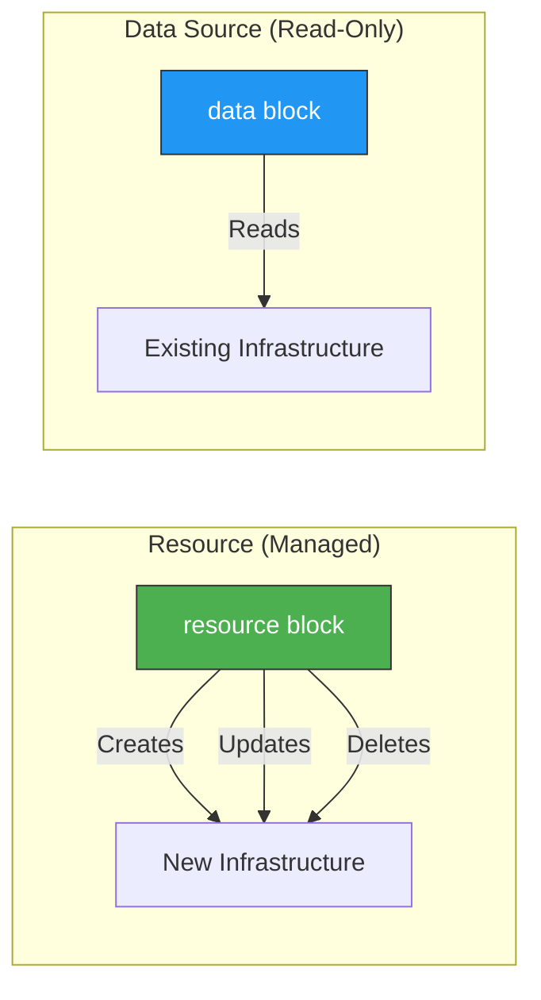
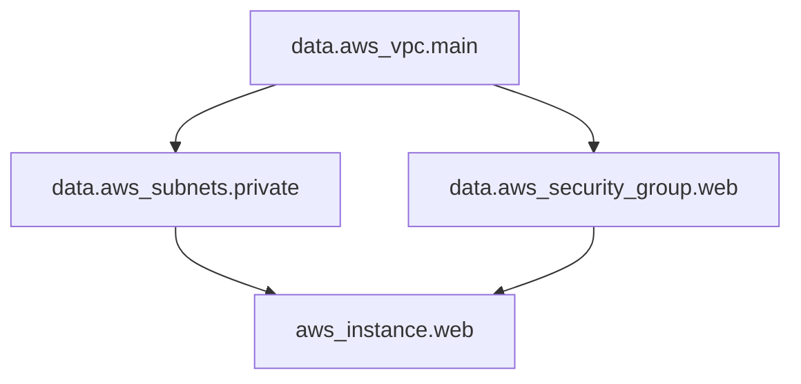
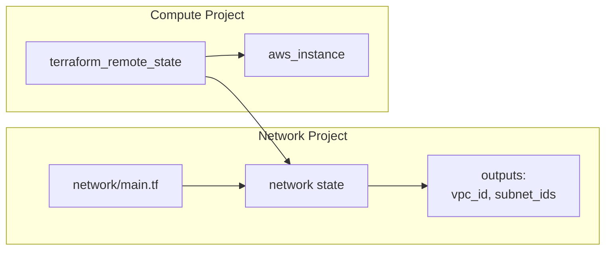

# Data Sources

Data sources allow you to read information from existing infrastructure that wasn't created by your Terraform configuration.

> [!NOTE]
> **Learning Goal**: Master reading external data and integrating it with your Terraform resources.

---

## Resource vs Data Source



| Aspect | Resource | Data Source |
|--------|----------|-------------|
| Keyword | `resource` | `data` |
| Purpose | Create/manage infrastructure | Read existing infrastructure |
| State | Tracked, managed | Cached, refreshed on plan |
| Lifecycle | Full (create, update, delete) | Read-only |

---

## Basic Syntax

```hcl
data "TYPE" "NAME" {
  # Query parameters
  filter {
    name   = "filter-name"
    values = ["filter-value"]
  }
}

# Reference
resource "aws_instance" "example" {
  ami = data.TYPE.NAME.attribute
}
```

---

## Common AWS Data Sources

### aws_ami - Find AMI IDs

```hcl
# Latest Amazon Linux 2023
data "aws_ami" "amazon_linux" {
  most_recent = true
  owners      = ["amazon"]
  
  filter {
    name   = "name"
    values = ["al2023-ami-*-kernel-6.1-x86_64"]
  }
  
  filter {
    name   = "virtualization-type"
    values = ["hvm"]
  }
  
  filter {
    name   = "architecture"
    values = ["x86_64"]
  }
}

# Latest Ubuntu 22.04
data "aws_ami" "ubuntu" {
  most_recent = true
  owners      = ["099720109477"]  # Canonical
  
  filter {
    name   = "name"
    values = ["ubuntu/images/hvm-ssd/ubuntu-jammy-22.04-amd64-server-*"]
  }
}

# Use in EC2 instance
resource "aws_instance" "web" {
  ami           = data.aws_ami.amazon_linux.id
  instance_type = "t3.micro"
}
```

### aws_availability_zones - Get Available AZs

```hcl
data "aws_availability_zones" "available" {
  state = "available"
  
  # Exclude specific AZs (e.g., Local Zones)
  filter {
    name   = "opt-in-status"
    values = ["opt-in-not-required"]
  }
}

# Create subnet in each AZ
resource "aws_subnet" "public" {
  count             = length(data.aws_availability_zones.available.names)
  vpc_id            = aws_vpc.main.id
  availability_zone = data.aws_availability_zones.available.names[count.index]
  cidr_block        = cidrsubnet(var.vpc_cidr, 8, count.index)
}

output "available_azs" {
  value = data.aws_availability_zones.available.names
}
```

### aws_caller_identity - Current AWS Account

```hcl
data "aws_caller_identity" "current" {}

data "aws_region" "current" {}

output "account_id" {
  value = data.aws_caller_identity.current.account_id
}

output "region" {
  value = data.aws_region.current.name
}

# Use in IAM policy
resource "aws_iam_policy" "example" {
  name = "example-policy"
  
  policy = jsonencode({
    Version = "2012-10-17"
    Statement = [
      {
        Effect   = "Allow"
        Action   = "s3:GetObject"
        Resource = "arn:aws:s3:::bucket-${data.aws_caller_identity.current.account_id}/*"
      }
    ]
  })
}
```

### aws_vpc - Reference Existing VPC

```hcl
# By ID
data "aws_vpc" "existing" {
  id = "vpc-12345678"
}

# By tag
data "aws_vpc" "production" {
  tags = {
    Name = "production-vpc"
  }
}

# By filter
data "aws_vpc" "default" {
  default = true
}

# Use VPC CIDR for security group rule
resource "aws_security_group" "internal" {
  vpc_id = data.aws_vpc.production.id
  
  ingress {
    from_port   = 0
    to_port     = 0
    protocol    = "-1"
    cidr_blocks = [data.aws_vpc.production.cidr_block]
  }
}
```

### aws_subnets - Find Multiple Subnets

```hcl
# Get all subnets in a VPC
data "aws_subnets" "private" {
  filter {
    name   = "vpc-id"
    values = [var.vpc_id]
  }
  
  tags = {
    Tier = "private"
  }
}

# Use with Auto Scaling Group
resource "aws_autoscaling_group" "web" {
  vpc_zone_identifier = data.aws_subnets.private.ids
  
  min_size         = 1
  max_size         = 10
  desired_capacity = 3
  
  launch_template {
    id      = aws_launch_template.web.id
    version = "$Latest"
  }
}
```

### aws_secretsmanager_secret_version - Read Secrets

```hcl
data "aws_secretsmanager_secret" "db_credentials" {
  name = "production/database/credentials"
}

data "aws_secretsmanager_secret_version" "db_credentials" {
  secret_id = data.aws_secretsmanager_secret.db_credentials.id
}

locals {
  db_credentials = jsondecode(
    data.aws_secretsmanager_secret_version.db_credentials.secret_string
  )
}

resource "aws_db_instance" "main" {
  engine         = "postgres"
  instance_class = "db.t3.micro"
  
  username = local.db_credentials.username
  password = local.db_credentials.password
}
```

### aws_iam_policy_document - Build IAM Policies

```hcl
data "aws_iam_policy_document" "s3_access" {
  statement {
    sid    = "AllowS3Access"
    effect = "Allow"
    
    actions = [
      "s3:GetObject",
      "s3:PutObject",
      "s3:DeleteObject",
    ]
    
    resources = [
      "${aws_s3_bucket.data.arn}/*"
    ]
  }
  
  statement {
    sid    = "AllowS3ListBucket"
    effect = "Allow"
    
    actions = [
      "s3:ListBucket"
    ]
    
    resources = [
      aws_s3_bucket.data.arn
    ]
  }
}

resource "aws_iam_policy" "s3_access" {
  name   = "s3-access-policy"
  policy = data.aws_iam_policy_document.s3_access.json
}
```

### aws_route53_zone - Find Hosted Zone

```hcl
data "aws_route53_zone" "main" {
  name         = "example.com"
  private_zone = false
}

resource "aws_route53_record" "www" {
  zone_id = data.aws_route53_zone.main.zone_id
  name    = "www.example.com"
  type    = "A"
  
  alias {
    name                   = aws_lb.main.dns_name
    zone_id                = aws_lb.main.zone_id
    evaluate_target_health = true
  }
}
```

---

## Data Source Dependencies

Terraform handles data source dependencies just like resource dependencies:

```hcl
# VPC must be looked up first
data "aws_vpc" "main" {
  tags = {
    Name = "production"
  }
}

# Subnets depend on VPC lookup
data "aws_subnets" "private" {
  filter {
    name   = "vpc-id"
    values = [data.aws_vpc.main.id]  # Dependency on VPC
  }
  
  tags = {
    Tier = "private"
  }
}

# Security group depends on VPC
data "aws_security_group" "web" {
  vpc_id = data.aws_vpc.main.id  # Dependency on VPC
  name   = "web-sg"
}
```



---

## Combining Data Sources and Resources

```hcl
# Look up existing infrastructure
data "aws_vpc" "existing" {
  tags = {
    Name = "shared-vpc"
  }
}

data "aws_subnets" "private" {
  filter {
    name   = "vpc-id"
    values = [data.aws_vpc.existing.id]
  }
  
  tags = {
    Tier = "private"
  }
}

data "aws_security_group" "default" {
  vpc_id = data.aws_vpc.existing.id
  name   = "default"
}

# Create new resources using existing infrastructure
resource "aws_instance" "web" {
  ami           = data.aws_ami.amazon_linux.id
  instance_type = "t3.micro"
  
  # Use existing subnet
  subnet_id = data.aws_subnets.private.ids[0]
  
  # Combine existing and new security groups
  vpc_security_group_ids = [
    data.aws_security_group.default.id,
    aws_security_group.web.id
  ]
  
  tags = {
    Name = "web-server"
  }
}

# Create new security group in existing VPC
resource "aws_security_group" "web" {
  name   = "web-sg"
  vpc_id = data.aws_vpc.existing.id
  
  ingress {
    from_port   = 80
    to_port     = 80
    protocol    = "tcp"
    cidr_blocks = ["0.0.0.0/0"]
  }
}
```

---

## External Data Source

Access external programs or scripts:

```hcl
# Call an external script
data "external" "example" {
  program = ["python3", "${path.module}/scripts/get_config.py"]
  
  query = {
    environment = var.environment
  }
}

# Output must be JSON with string values
# Script outputs: {"key": "value", "another": "data"}

resource "aws_instance" "web" {
  ami           = data.aws_ami.amazon_linux.id
  instance_type = data.external.example.result.instance_type
}
```

**Example Python script:**

```python
#!/usr/bin/env python3
import json
import sys

# Read input from stdin
input_json = json.load(sys.stdin)
environment = input_json.get("environment", "dev")

# Return configuration based on environment
configs = {
    "dev": {"instance_type": "t3.micro"},
    "prod": {"instance_type": "t3.large"}
}

# Output must be JSON with string values only
print(json.dumps(configs.get(environment, configs["dev"])))
```

---

## HTTP Data Source

Fetch data from HTTP endpoints:

```hcl
data "http" "my_ip" {
  url = "https://checkip.amazonaws.com"
}

resource "aws_security_group_rule" "my_ip" {
  type              = "ingress"
  from_port         = 22
  to_port           = 22
  protocol          = "tcp"
  cidr_blocks       = ["${chomp(data.http.my_ip.response_body)}/32"]
  security_group_id = aws_security_group.web.id
  description       = "SSH from my current IP"
}
```

---

## Terraform Remote State Data Source

Read outputs from another Terraform state:

```hcl
# Reference network state from compute project
data "terraform_remote_state" "network" {
  backend = "s3"
  
  config = {
    bucket = "terraform-state"
    key    = "network/terraform.tfstate"
    region = "us-east-1"
  }
}

# Use network outputs
resource "aws_instance" "web" {
  ami           = data.aws_ami.amazon_linux.id
  instance_type = "t3.micro"
  subnet_id     = data.terraform_remote_state.network.outputs.public_subnet_ids[0]
  
  vpc_security_group_ids = [
    data.terraform_remote_state.network.outputs.web_sg_id
  ]
}
```



---

## Best Practices

### Cache Data Source Results

Data sources are re-read on every plan. For expensive queries:

```hcl
# Store result in locals to avoid repeated lookups
locals {
  ami_id = data.aws_ami.amazon_linux.id
}

resource "aws_instance" "web1" {
  ami = local.ami_id
}

resource "aws_instance" "web2" {
  ami = local.ami_id
}
```

### Handle Missing Resources

```hcl
# Use count to make data source optional
data "aws_vpc" "custom" {
  count = var.use_custom_vpc ? 1 : 0
  
  tags = {
    Name = var.custom_vpc_name
  }
}

data "aws_vpc" "default" {
  count   = var.use_custom_vpc ? 0 : 1
  default = true
}

locals {
  vpc_id = var.use_custom_vpc ? data.aws_vpc.custom[0].id : data.aws_vpc.default[0].id
}
```

### Use Specific Filters

```hcl
# ✅ Good: Specific filters
data "aws_ami" "amazon_linux" {
  most_recent = true
  owners      = ["amazon"]
  
  filter {
    name   = "name"
    values = ["al2023-ami-*-kernel-6.1-x86_64"]
  }
}

# ❌ Bad: Too broad
data "aws_ami" "amazon_linux" {
  most_recent = true
  owners      = ["amazon"]
  # No filters - could return unexpected AMI
}
```

---

## Common Data Sources Reference

| Data Source | Purpose |
|-------------|---------|
| `aws_ami` | Find AMI IDs |
| `aws_availability_zones` | Get available AZs |
| `aws_caller_identity` | Current AWS account/user |
| `aws_region` | Current region |
| `aws_vpc` | Look up VPC |
| `aws_subnets` | Find subnets |
| `aws_subnet` | Look up single subnet |
| `aws_security_group` | Find security group |
| `aws_iam_role` | Look up IAM role |
| `aws_iam_policy_document` | Build IAM policies |
| `aws_secretsmanager_secret_version` | Read secrets |
| `aws_ssm_parameter` | Read SSM parameters |
| `aws_route53_zone` | Find hosted zone |
| `aws_acm_certificate` | Find ACM certificate |
| `aws_kms_key` | Look up KMS key |
| `aws_s3_bucket` | Look up S3 bucket |

---

## Next Steps

Continue to **[08_provisioners_lifecycle.md](./08_provisioners_lifecycle.md)** to learn:

- Provisioners (local-exec, remote-exec, file)
- Lifecycle meta-arguments
- Null resources and triggers
- When to use (and avoid) provisioners

**→ [08_provisioners_lifecycle.md](./08_provisioners_lifecycle.md)**
