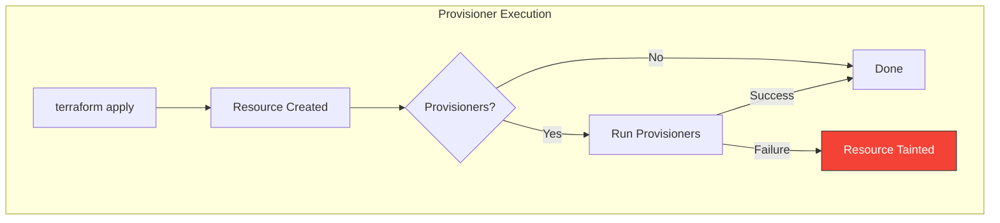
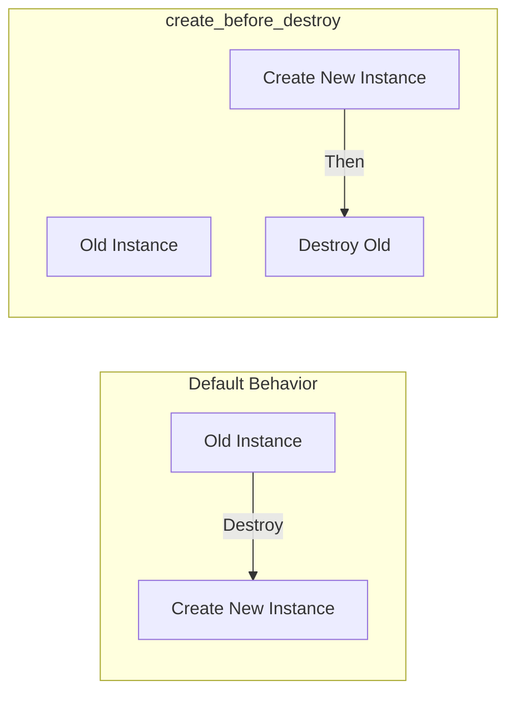

# Provisioners and Lifecycle Rules

Provisioners provide a last-resort mechanism for executing scripts or commands. Lifecycle rules control resource behavior during create, update, and delete operations.

> [!NOTE]
> **Learning Goal**: Understand when to use provisioners (sparingly!) and master lifecycle meta-arguments.

---

## Provisioners Overview

> [!WARNING]
> **Provisioners should be a last resort!** Prefer native Terraform resources, cloud-init, or configuration management tools (Ansible, Chef, Puppet) for post-provisioning configuration.



### Why Avoid Provisioners?

| Issue | Problem |
|-------|---------|
| **No idempotency** | Runs only once after creation |
| **No state tracking** | Terraform doesn't know if script succeeded |
| **Tight coupling** | Infrastructure code mixed with configuration |
| **Failure handling** | Failed provisioner taints the resource |
| **No dry-run** | Can't preview what provisioner will do |

### When Provisioners Are Appropriate

✅ **Acceptable uses:**

- Bootstrapping that can't use cloud-init
- Triggering external systems on resource creation
- Gathering information to pass to other systems

❌ **Avoid for:**

- Installing software → use cloud-init or AMI
- Configuring applications → use Ansible/Chef/Puppet
- Any repeatable configuration → use proper CM tools

---

## Provisioner Types

### local-exec

Runs commands on the machine running Terraform:

```hcl
resource "aws_instance" "web" {
  ami           = data.aws_ami.amazon_linux.id
  instance_type = "t3.micro"
  
  provisioner "local-exec" {
    command = "echo 'Instance ${self.id} created with IP ${self.public_ip}'"
  }
  
  # With working directory and interpreter
  provisioner "local-exec" {
    command     = "./scripts/post-deploy.sh"
    working_dir = path.module
    interpreter = ["/bin/bash", "-c"]
    
    environment = {
      INSTANCE_ID = self.id
      ENVIRONMENT = var.environment
    }
  }
}
```

### remote-exec

Runs commands on the remote resource via SSH or WinRM:

```hcl
resource "aws_instance" "web" {
  ami           = data.aws_ami.amazon_linux.id
  instance_type = "t3.micro"
  key_name      = aws_key_pair.deployer.key_name
  
  # Connection configuration
  connection {
    type        = "ssh"
    user        = "ec2-user"
    private_key = file("~/.ssh/deployer")
    host        = self.public_ip
    timeout     = "5m"
  }
  
  # Inline commands
  provisioner "remote-exec" {
    inline = [
      "sudo yum update -y",
      "sudo yum install -y nginx",
      "sudo systemctl start nginx",
      "sudo systemctl enable nginx"
    ]
  }
}
```

### file

Copies files or directories to the remote resource:

```hcl
resource "aws_instance" "web" {
  ami           = data.aws_ami.amazon_linux.id
  instance_type = "t3.micro"
  key_name      = aws_key_pair.deployer.key_name
  
  connection {
    type        = "ssh"
    user        = "ec2-user"
    private_key = file("~/.ssh/deployer")
    host        = self.public_ip
  }
  
  # Copy single file
  provisioner "file" {
    source      = "app/config.yml"
    destination = "/home/ec2-user/config.yml"
  }
  
  # Copy directory
  provisioner "file" {
    source      = "app/scripts/"
    destination = "/home/ec2-user/scripts"
  }
  
  # From content (no source file needed)
  provisioner "file" {
    content     = templatefile("${path.module}/templates/app.conf", {
      port        = var.app_port
      environment = var.environment
    })
    destination = "/home/ec2-user/app.conf"
  }
}
```

---

## Provisioner Timing

### on Create (Default)

```hcl
provisioner "local-exec" {
  command = "echo 'Resource created'"
  # Runs when resource is created
}
```

### on Destroy

```hcl
provisioner "local-exec" {
  when    = destroy
  command = "echo 'Resource ${self.id} being destroyed'"
  
  # Access attributes that existed before destroy
  # Use self.* to reference the resource being destroyed
}
```

### Failure Behavior

```hcl
provisioner "local-exec" {
  command    = "./scripts/notify.sh"
  on_failure = continue  # Default is "fail"
  
  # continue = ignore failure and continue
  # fail = taint resource and fail apply
}
```

---

## Connection Block

Required for `remote-exec` and `file` provisioners:

```hcl
# SSH Connection
connection {
  type        = "ssh"
  user        = "ec2-user"
  private_key = file("~/.ssh/id_rsa")
  host        = self.public_ip
  port        = 22
  timeout     = "5m"
  
  # Bastion/Jump host
  bastion_host        = var.bastion_ip
  bastion_user        = "ec2-user"
  bastion_private_key = file("~/.ssh/bastion")
}

# WinRM Connection (Windows)
connection {
  type     = "winrm"
  user     = "Administrator"
  password = var.admin_password
  host     = self.public_ip
  port     = 5986
  https    = true
  insecure = true
  timeout  = "10m"
}
```

---

## Null Resource

A resource that does nothing but run provisioners:

```hcl
resource "null_resource" "provisioner" {
  # Trigger re-run when these values change
  triggers = {
    cluster_id  = aws_eks_cluster.main.id
    config_hash = md5(file("${path.module}/config/app.yaml"))
  }
  
  provisioner "local-exec" {
    command = <<-EOT
      aws eks update-kubeconfig --name ${aws_eks_cluster.main.name}
      kubectl apply -f ${path.module}/config/app.yaml
    EOT
  }
  
  depends_on = [aws_eks_node_group.main]
}
```

### Trigger Use Cases

```hcl
# Re-run when file changes
triggers = {
  script_hash = filemd5("${path.module}/scripts/deploy.sh")
}

# Re-run when any instance changes
triggers = {
  instance_ids = join(",", aws_instance.web[*].id)
}

# Always re-run
triggers = {
  always = timestamp()
}

# Re-run on version change
triggers = {
  version = var.app_version
}
```

---

## Lifecycle Meta-Arguments

Every resource supports lifecycle customization:

### create_before_destroy

Create replacement before destroying original:

```hcl
resource "aws_instance" "web" {
  ami           = data.aws_ami.amazon_linux.id
  instance_type = var.instance_type
  
  lifecycle {
    create_before_destroy = true  # New instance created before old is destroyed
  }
}
```



### prevent_destroy

Prevent accidental destruction:

```hcl
resource "aws_s3_bucket" "important_data" {
  bucket = "company-critical-data"
  
  lifecycle {
    prevent_destroy = true  # terraform destroy will fail
  }
}

resource "aws_rds_cluster" "production" {
  cluster_identifier = "prod-database"
  
  lifecycle {
    prevent_destroy = true
  }
}
```

> [!TIP]
> Use `prevent_destroy` for stateful resources like databases, S3 buckets with data, or any resource that would be catastrophic to accidentally delete.

### ignore_changes

Ignore specific attribute changes:

```hcl
resource "aws_instance" "web" {
  ami           = data.aws_ami.amazon_linux.id
  instance_type = var.instance_type
  
  tags = {
    Name = "web-server"
  }
  
  lifecycle {
    # Ignore if someone changes tags manually
    ignore_changes = [tags["LastModified"], tags["ModifiedBy"]]
    
    # Ignore all tag changes
    # ignore_changes = [tags]
    
    # Ignore all changes (manage externally)
    # ignore_changes = all
  }
}

# Common use: Auto Scaling Groups
resource "aws_autoscaling_group" "web" {
  desired_capacity = var.desired_capacity
  min_size         = var.min_size
  max_size         = var.max_size
  
  lifecycle {
    # Ignore desired_capacity - managed by scaling policies
    ignore_changes = [desired_capacity]
  }
}
```

### replace_triggered_by

Force replacement when referenced resources change:

```hcl
resource "aws_instance" "web" {
  ami           = data.aws_ami.amazon_linux.id
  instance_type = "t3.micro"
  
  lifecycle {
    # Replace instance when launch template changes
    replace_triggered_by = [
      aws_launch_template.web.latest_version
    ]
  }
}

resource "aws_launch_template" "web" {
  name_prefix   = "web-"
  instance_type = var.instance_type
  
  # Changes here trigger instance replacement
}
```

### postcondition and precondition

Validate resource state (Terraform 1.2+):

```hcl
resource "aws_instance" "web" {
  ami           = data.aws_ami.amazon_linux.id
  instance_type = var.instance_type
  
  lifecycle {
    # Check before creation
    precondition {
      condition     = var.instance_type != "t2.micro" || var.environment != "prod"
      error_message = "Production environment requires at least t2.small."
    }
    
    # Check after creation
    postcondition {
      condition     = self.public_ip != ""
      error_message = "Instance must have a public IP address."
    }
  }
}
```

---

## Combining Lifecycle Rules

```hcl
resource "aws_db_instance" "main" {
  identifier           = "production-db"
  engine               = "postgres"
  instance_class       = var.db_instance_class
  allocated_storage    = var.db_storage
  
  # Managed separately (backup/restore)
  username = "admin"
  password = var.db_password
  
  lifecycle {
    # Never accidentally delete the database
    prevent_destroy = true
    
    # Ignore password changes (managed externally)
    ignore_changes = [password]
    
    # Create new instance before destroying old (for upgrades)
    create_before_destroy = true
  }
}
```

---

## Better Alternatives to Provisioners

### Cloud-init / User Data

```hcl
resource "aws_instance" "web" {
  ami           = data.aws_ami.amazon_linux.id
  instance_type = "t3.micro"
  
  user_data = <<-EOF
    #!/bin/bash
    yum update -y
    yum install -y nginx
    systemctl start nginx
    systemctl enable nginx
  EOF
  
  user_data_replace_on_change = true  # Recreate if user_data changes
}

# Or with templatefile
resource "aws_instance" "web" {
  ami           = data.aws_ami.amazon_linux.id
  instance_type = "t3.micro"
  
  user_data = templatefile("${path.module}/scripts/user-data.sh", {
    environment = var.environment
    app_version = var.app_version
  })
}
```

### Custom AMI with Packer


```hcl
# Use pre-baked AMI with all software installed
data "aws_ami" "custom" {
  most_recent = true
  owners      = ["self"]
  
  filter {
    name   = "name"
    values = ["my-app-*"]
  }
}

resource "aws_instance" "web" {
  ami           = data.aws_ami.custom.id  # No provisioners needed!
  instance_type = "t3.micro"
}
```

### AWS Systems Manager

```hcl
resource "aws_ssm_document" "install_nginx" {
  name          = "InstallNginx"
  document_type = "Command"
  
  content = jsonencode({
    schemaVersion = "2.2"
    description   = "Install and configure Nginx"
    mainSteps = [{
      action = "aws:runShellScript"
      name   = "installNginx"
      inputs = {
        runCommand = [
          "yum install -y nginx",
          "systemctl start nginx"
        ]
      }
    }]
  })
}

resource "aws_ssm_association" "nginx" {
  name = aws_ssm_document.install_nginx.name
  
  targets {
    key    = "tag:Role"
    values = ["webserver"]
  }
}
```

---

## Summary: When to Use What

| Need | Solution |
|------|----------|
| Install packages on boot | Cloud-init / User Data |
| Pre-installed software | Custom AMI (Packer) |
| Configuration management | Ansible / Chef / Puppet |
| Post-deploy notifications | local-exec provisioner |
| Instance registration | local-exec or AWS SSM |
| Custom one-time scripts | null_resource with triggers |

---

## Next Steps

Continue to **[09_workspaces.md](./09_workspaces.md)** to learn:

- Terraform workspaces for environment separation
- Workspace strategies
- When to use workspaces vs. directories

**→ [09_workspaces.md](./09_workspaces.md)**
