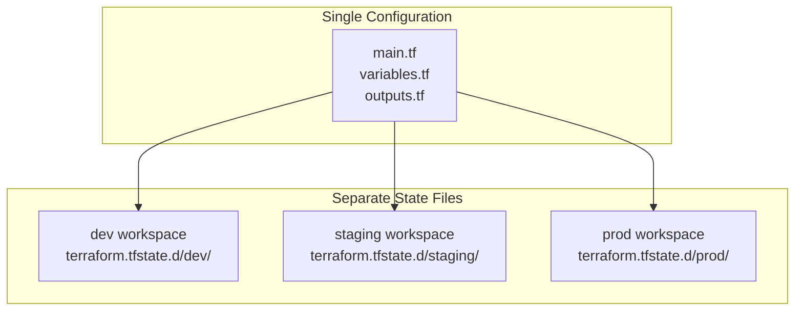
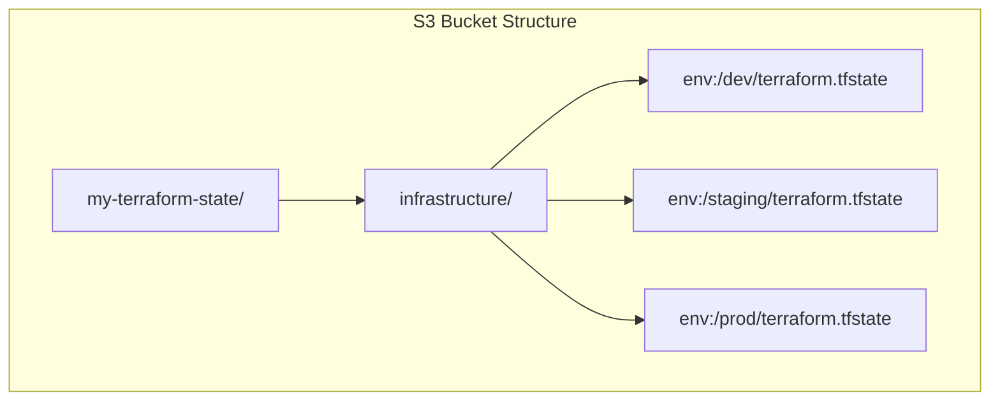
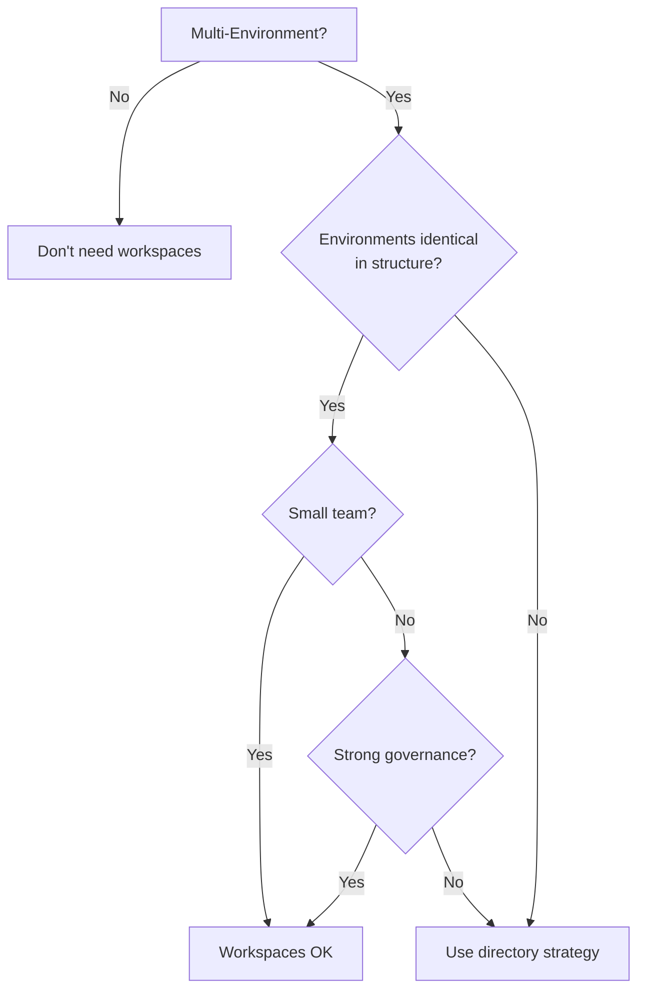

# Workspaces: Environment Management

Workspaces allow you to manage multiple distinct instances of infrastructure from a single configuration.

> [!NOTE]
> **Learning Goal**: Understand workspace strategies and choose the right approach for multi-environment deployments.

---

## What Are Workspaces?

Workspaces provide separate state files for the same configuration:



---

## Workspace Commands

```bash
# List all workspaces
terraform workspace list

# Output:
#   default
# * dev
#   staging
#   prod

# Create new workspace
terraform workspace new staging

# Switch to workspace
terraform workspace select prod

# Show current workspace
terraform workspace show

# Delete workspace (must switch away first)
terraform workspace select default
terraform workspace delete staging
```

---

## Using Workspaces in Configuration

### terraform.workspace Variable

```hcl
# Access current workspace name
locals {
  environment = terraform.workspace
}

resource "aws_instance" "web" {
  ami           = data.aws_ami.amazon_linux.id
  instance_type = local.instance_type
  
  tags = {
    Name        = "web-${local.environment}"
    Environment = local.environment
  }
}
```

### Environment-Specific Configuration

```hcl
# Environment-specific settings
locals {
  environment = terraform.workspace
  
  # Configuration per workspace
  config = {
    dev = {
      instance_type   = "t3.micro"
      instance_count  = 1
      enable_multi_az = false
    }
    staging = {
      instance_type   = "t3.small"
      instance_count  = 2
      enable_multi_az = false
    }
    prod = {
      instance_type   = "t3.large"
      instance_count  = 3
      enable_multi_az = true
    }
  }
  
  # Get config for current workspace
  env_config = local.config[local.environment]
}

resource "aws_instance" "web" {
  count = local.env_config.instance_count
  
  ami           = data.aws_ami.amazon_linux.id
  instance_type = local.env_config.instance_type
  
  tags = {
    Name        = "web-${local.environment}-${count.index + 1}"
    Environment = local.environment
  }
}
```

### Conditional Resources

```hcl
# Only create in production
resource "aws_cloudwatch_alarm" "high_cpu" {
  count = terraform.workspace == "prod" ? 1 : 0
  
  alarm_name          = "high-cpu-${terraform.workspace}"
  comparison_operator = "GreaterThanThreshold"
  evaluation_periods  = 2
  metric_name         = "CPUUtilization"
  namespace           = "AWS/EC2"
  period              = 300
  statistic           = "Average"
  threshold           = 80
}

# NAT Gateway only in non-dev environments
resource "aws_nat_gateway" "main" {
  count = terraform.workspace != "dev" ? 1 : 0
  
  allocation_id = aws_eip.nat.id
  subnet_id     = aws_subnet.public.id
}
```

---

## Workspace with Remote Backend

```hcl
# S3 backend with workspace prefix
terraform {
  backend "s3" {
    bucket         = "my-terraform-state"
    key            = "infrastructure/terraform.tfstate"
    region         = "us-east-1"
    dynamodb_table = "terraform-locks"
    
    # Each workspace gets separate state file:
    # infrastructure/dev/terraform.tfstate
    # infrastructure/staging/terraform.tfstate
    # infrastructure/prod/terraform.tfstate
    workspace_key_prefix = "infrastructure"
  }
}
```



---

## Workspace Strategies

### Strategy 1: Workspace-Based Environments

```
project/
├── main.tf
├── variables.tf
├── outputs.tf
└── environments/
    ├── dev.tfvars
    ├── staging.tfvars
    └── prod.tfvars
```

```bash
# Deploy to dev
terraform workspace select dev
terraform apply -var-file=environments/dev.tfvars

# Deploy to prod
terraform workspace select prod
terraform apply -var-file=environments/prod.tfvars
```

**Pros:**

- Single codebase
- Easy to compare environments
- Simpler CI/CD

**Cons:**

- All environments share same code version
- Risk of applying to wrong environment
- Less isolation

### Strategy 2: Directory-Based Environments

```
project/
├── modules/
│   ├── vpc/
│   ├── compute/
│   └── database/
└── environments/
    ├── dev/
    │   ├── main.tf
    │   ├── backend.tf
    │   └── terraform.tfvars
    ├── staging/
    │   ├── main.tf
    │   ├── backend.tf
    │   └── terraform.tfvars
    └── prod/
        ├── main.tf
        ├── backend.tf
        └── terraform.tfvars
```

```bash
# Deploy to dev
cd environments/dev
terraform apply

# Deploy to prod
cd environments/prod
terraform apply
```

**Pros:**

- Complete isolation
- Different code versions per environment
- Clear separation of concerns
- No risk of wrong environment

**Cons:**

- Code duplication (mitigated by modules)
- More directories to manage

### Strategy 3: Hybrid (Recommended for Large Teams)

```
project/
├── modules/                    # Shared modules
│   ├── vpc/
│   └── app/
├── infrastructure/             # Core infra (single state)
│   ├── main.tf                # Shared networking, etc.
│   └── backend.tf
└── applications/               # Per-env (workspaces)
    ├── main.tf
    ├── backend.tf
    └── environments/
        ├── dev.tfvars
        └── prod.tfvars
```

---

## Workspace Anti-Patterns

### ❌ Production and Dev in Same Workflow

```bash
# Dangerous - too easy to make mistakes
terraform workspace select prod
terraform apply  # Hope you meant to do this in prod!
```

### ❌ Completely Different Infrastructure Per Workspace

```hcl
# Bad: Too much conditional logic
resource "aws_instance" "web" {
  count         = terraform.workspace == "prod" ? 5 : terraform.workspace == "staging" ? 2 : 1
  instance_type = terraform.workspace == "prod" ? "m5.large" : "t3.micro"
  
  # 50 more lines of conditionals...
}
```

### ❌ Hard-Coded Workspace Names

```hcl
# Bad: Breaks if workspace name changes
resource "aws_instance" "web" {
  instance_type = terraform.workspace == "production" ? "m5.large" : "t3.micro"
  # What if someone creates "prod" instead of "production"?
}
```

---

## Better: Use Variables with Workspace Defaults

```hcl
# variables.tf
variable "instance_type" {
  description = "Instance type for web servers"
  type        = string
  # No default - must be provided per environment
}

variable "instance_count" {
  description = "Number of instances"
  type        = number
}

# dev.tfvars
instance_type  = "t3.micro"
instance_count = 1

# prod.tfvars
instance_type  = "t3.large"
instance_count = 3

# main.tf - Clean, no conditionals
resource "aws_instance" "web" {
  count         = var.instance_count
  instance_type = var.instance_type
}
```

---

## Workspace with Terragrunt

Terragrunt simplifies multi-environment management:

```
infrastructure/
├── terragrunt.hcl           # Root config
├── dev/
│   └── terragrunt.hcl       # Inherits from root
├── staging/
│   └── terragrunt.hcl
└── prod/
    └── terragrunt.hcl
```

```hcl
# terragrunt.hcl (root)
remote_state {
  backend = "s3"
  config = {
    bucket         = "my-terraform-state"
    key            = "${path_relative_to_include()}/terraform.tfstate"
    region         = "us-east-1"
    dynamodb_table = "terraform-locks"
  }
}

terraform {
  source = "../../modules//vpc"
}

# dev/terragrunt.hcl
include "root" {
  path = find_in_parent_folders()
}

inputs = {
  environment    = "dev"
  instance_type  = "t3.micro"
  instance_count = 1
}
```

---

## When to Use Workspaces



### ✅ Good Use Cases

- Small projects with 1-2 developers
- Nearly identical environments
- Temporary environments (feature branches)
- Testing with multiple variable sets

### ❌ Avoid When

- Environments have different architectures
- Need different Terraform versions per env
- Multiple teams managing different environments
- Strict production/non-production separation required

---

## Summary

| Approach | Best For | State Location |
|----------|----------|----------------|
| **Single Workspace** | Simple projects | One state file |
| **Multiple Workspaces** | Similar environments, small teams | `terraform.tfstate.d/<workspace>/` |
| **Directory Per Environment** | Different environments, large teams | Separate backend per directory |
| **Terragrunt** | Complex multi-environment, DRY config | Managed by Terragrunt |

---

## Next Steps

Continue to **[10_advanced_patterns.md](./10_advanced_patterns.md)** to learn:

- for_each and count patterns
- Dynamic blocks
- Complex expressions and loops
- Meta-programming techniques

**→ [10_advanced_patterns.md](./10_advanced_patterns.md)**
