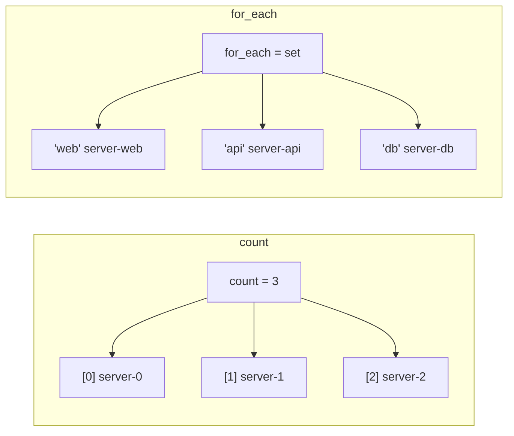

# Advanced Patterns

Master advanced Terraform techniques for complex, real-world infrastructure.

> [!NOTE]
> **Learning Goal**: Learn for_each, count, dynamic blocks, and meta-programming patterns.

---

## for_each vs count

Both create multiple instances of a resource, but with key differences:



| Feature | count | for_each |
|---------|-------|----------|
| Index type | Numeric (0, 1, 2...) | String keys |
| Deletion handling | Reindexes all | Only removes specific |
| Resource address | `resource[0]` | `resource["key"]` |
| Best for | Identical resources | Distinct resources |

---

## count Patterns

### Simple count

```hcl
resource "aws_instance" "web" {
  count = 3
  
  ami           = data.aws_ami.amazon_linux.id
  instance_type = "t3.micro"
  
  tags = {
    Name = "web-${count.index}"
  }
}

# Reference: aws_instance.web[0], aws_instance.web[1], etc.
```

### Conditional Creation

```hcl
variable "create_database" {
  type    = bool
  default = false
}

# Create only if variable is true
resource "aws_db_instance" "main" {
  count = var.create_database ? 1 : 0
  
  engine         = "postgres"
  instance_class = "db.t3.micro"
}

# Reference conditionally created resource
output "database_endpoint" {
  value = var.create_database ? aws_db_instance.main[0].endpoint : null
}
```

### count with length()

```hcl
variable "availability_zones" {
  default = ["us-east-1a", "us-east-1b", "us-east-1c"]
}

resource "aws_subnet" "public" {
  count = length(var.availability_zones)
  
  vpc_id            = aws_vpc.main.id
  availability_zone = var.availability_zones[count.index]
  cidr_block        = cidrsubnet(var.vpc_cidr, 8, count.index)
  
  tags = {
    Name = "public-${var.availability_zones[count.index]}"
  }
}
```

---

## for_each Patterns

### for_each with Set

```hcl
variable "users" {
  type    = set(string)
  default = ["alice", "bob", "carol"]
}

resource "aws_iam_user" "users" {
  for_each = var.users
  
  name = each.key  # or each.value (same for sets)
}

# Reference: aws_iam_user.users["alice"]
```

### for_each with Map

```hcl
variable "instances" {
  type = map(object({
    instance_type = string
    ami           = string
  }))
  default = {
    web = {
      instance_type = "t3.micro"
      ami           = "ami-123"
    }
    api = {
      instance_type = "t3.small"
      ami           = "ami-123"
    }
    worker = {
      instance_type = "t3.medium"
      ami           = "ami-456"
    }
  }
}

resource "aws_instance" "servers" {
  for_each = var.instances
  
  ami           = each.value.ami
  instance_type = each.value.instance_type
  
  tags = {
    Name = "server-${each.key}"
    Role = each.key
  }
}

# Reference: aws_instance.servers["web"], aws_instance.servers["api"]
```

### Converting List to Map for for_each

```hcl
variable "subnets" {
  type = list(object({
    name = string
    cidr = string
    az   = string
  }))
  default = [
    { name = "public-a",  cidr = "10.0.1.0/24", az = "us-east-1a" },
    { name = "public-b",  cidr = "10.0.2.0/24", az = "us-east-1b" },
    { name = "private-a", cidr = "10.0.10.0/24", az = "us-east-1a" },
  ]
}

resource "aws_subnet" "main" {
  # Convert list to map using name as key
  for_each = { for s in var.subnets : s.name => s }
  
  vpc_id            = aws_vpc.main.id
  cidr_block        = each.value.cidr
  availability_zone = each.value.az
  
  tags = {
    Name = each.value.name
  }
}
```

---

## Dynamic Blocks

Generate repeated nested blocks dynamically:

```hcl
variable "ingress_rules" {
  type = list(object({
    port        = number
    protocol    = string
    cidr_blocks = list(string)
    description = string
  }))
  default = [
    {
      port        = 80
      protocol    = "tcp"
      cidr_blocks = ["0.0.0.0/0"]
      description = "HTTP"
    },
    {
      port        = 443
      protocol    = "tcp"
      cidr_blocks = ["0.0.0.0/0"]
      description = "HTTPS"
    },
    {
      port        = 22
      protocol    = "tcp"
      cidr_blocks = ["10.0.0.0/8"]
      description = "SSH internal"
    }
  ]
}

resource "aws_security_group" "web" {
  name   = "web-sg"
  vpc_id = aws_vpc.main.id
  
  dynamic "ingress" {
    for_each = var.ingress_rules
    
    content {
      from_port   = ingress.value.port
      to_port     = ingress.value.port
      protocol    = ingress.value.protocol
      cidr_blocks = ingress.value.cidr_blocks
      description = ingress.value.description
    }
  }
  
  egress {
    from_port   = 0
    to_port     = 0
    protocol    = "-1"
    cidr_blocks = ["0.0.0.0/0"]
  }
}
```

### Nested Dynamic Blocks

```hcl
variable "load_balancer_config" {
  type = object({
    listeners = list(object({
      port     = number
      protocol = string
      rules = list(object({
        path    = string
        target  = string
        priority = number
      }))
    }))
  })
}

resource "aws_lb_listener" "main" {
  for_each = { for l in var.load_balancer_config.listeners : l.port => l }
  
  load_balancer_arn = aws_lb.main.arn
  port              = each.value.port
  protocol          = each.value.protocol
  
  default_action {
    type             = "forward"
    target_group_arn = aws_lb_target_group.default.arn
  }
}

resource "aws_lb_listener_rule" "rules" {
  for_each = {
    for pair in flatten([
      for listener in var.load_balancer_config.listeners : [
        for rule in listener.rules : {
          key      = "${listener.port}-${rule.priority}"
          listener = listener
          rule     = rule
        }
      ]
    ]) : pair.key => pair
  }
  
  listener_arn = aws_lb_listener.main[each.value.listener.port].arn
  priority     = each.value.rule.priority
  
  action {
    type             = "forward"
    target_group_arn = aws_lb_target_group.main[each.value.rule.target].arn
  }
  
  condition {
    path_pattern {
      values = [each.value.rule.path]
    }
  }
}
```

---

## For Expressions

Transform collections inline:

### List Transformation

```hcl
variable "users" {
  default = ["alice", "bob", "carol"]
}

locals {
  # Transform each element
  upper_users = [for u in var.users : upper(u)]
  # ["ALICE", "BOB", "CAROL"]
  
  # With index
  indexed_users = [for i, u in var.users : "${i}: ${u}"]
  # ["0: alice", "1: bob", "2: carol"]
  
  # With filter
  long_names = [for u in var.users : u if length(u) > 4]
  # ["alice", "carol"]
}
```

### Map Transformation

```hcl
variable "instances" {
  default = {
    web   = "t3.micro"
    api   = "t3.small"
    db    = "t3.medium"
  }
}

locals {
  # Transform map values
  instance_arns = { for k, v in var.instances : k => "instance-${k}" }
  
  # Swap keys and values
  instance_by_type = { for k, v in var.instances : v => k... }
  # Groups by value if duplicates exist
  
  # Filter map
  small_instances = { 
    for k, v in var.instances : k => v 
    if v == "t3.micro" 
  }
}
```

### Object Construction

```hcl
variable "server_list" {
  default = [
    { name = "web", ip = "10.0.1.10" },
    { name = "api", ip = "10.0.1.20" },
    { name = "db",  ip = "10.0.1.30" }
  ]
}

locals {
  # Create map from list
  servers_by_name = { for s in var.server_list : s.name => s.ip }
  # { web = "10.0.1.10", api = "10.0.1.20", db = "10.0.1.30" }
  
  # Create nested structure
  server_details = {
    for s in var.server_list : s.name => {
      ip        = s.ip
      dns       = "${s.name}.internal"
      full_name = "server-${s.name}"
    }
  }
}
```

---

## Flatten Pattern

Work with nested collections:

```hcl
variable "vpcs" {
  type = map(object({
    cidr    = string
    subnets = list(string)
  }))
  default = {
    dev = {
      cidr    = "10.0.0.0/16"
      subnets = ["10.0.1.0/24", "10.0.2.0/24"]
    }
    prod = {
      cidr    = "10.1.0.0/16"
      subnets = ["10.1.1.0/24", "10.1.2.0/24", "10.1.3.0/24"]
    }
  }
}

locals {
  # Flatten nested structure
  subnet_list = flatten([
    for vpc_name, vpc in var.vpcs : [
      for subnet_cidr in vpc.subnets : {
        vpc_name    = vpc_name
        vpc_cidr    = vpc.cidr
        subnet_cidr = subnet_cidr
      }
    ]
  ])
  
  # Result:
  # [
  #   { vpc_name = "dev", vpc_cidr = "10.0.0.0/16", subnet_cidr = "10.0.1.0/24" },
  #   { vpc_name = "dev", vpc_cidr = "10.0.0.0/16", subnet_cidr = "10.0.2.0/24" },
  #   { vpc_name = "prod", vpc_cidr = "10.1.0.0/16", subnet_cidr = "10.1.1.0/24" },
  #   ...
  # ]
  
  # Convert to map for for_each
  subnet_map = { for s in local.subnet_list : 
    "${s.vpc_name}-${s.subnet_cidr}" => s 
  }
}

resource "aws_subnet" "all" {
  for_each = local.subnet_map
  
  vpc_id     = aws_vpc.main[each.value.vpc_name].id
  cidr_block = each.value.subnet_cidr
  
  tags = {
    Name = each.key
    VPC  = each.value.vpc_name
  }
}
```

---

## Splat Expressions

Shorthand for extracting attributes:

```hcl
resource "aws_instance" "web" {
  count = 3
  ami   = data.aws_ami.amazon_linux.id
}

# Extract all IDs (splat)
output "instance_ids" {
  value = aws_instance.web[*].id
  # Equivalent to: [for i in aws_instance.web : i.id]
}

# Extract all private IPs
output "private_ips" {
  value = aws_instance.web[*].private_ip
}

# Works with for_each too
resource "aws_instance" "servers" {
  for_each = toset(["web", "api", "db"])
  ami      = data.aws_ami.amazon_linux.id
}

output "server_ids" {
  value = values(aws_instance.servers)[*].id
}
```

---

## Depends On

Explicit dependencies when implicit ones aren't enough:

```hcl
resource "aws_iam_role" "app" {
  name = "app-role"
  
  assume_role_policy = jsonencode({
    Version = "2012-10-17"
    Statement = [{
      Action = "sts:AssumeRole"
      Effect = "Allow"
      Principal = {
        Service = "ec2.amazonaws.com"
      }
    }]
  })
}

resource "aws_iam_role_policy_attachment" "app" {
  role       = aws_iam_role.app.name
  policy_arn = "arn:aws:iam::aws:policy/AmazonS3ReadOnlyAccess"
}

resource "aws_instance" "app" {
  ami                  = data.aws_ami.amazon_linux.id
  instance_type        = "t3.micro"
  iam_instance_profile = aws_iam_instance_profile.app.name
  
  # Explicit dependency - wait for policy attachment
  depends_on = [aws_iam_role_policy_attachment.app]
}
```

---

## Null Values and Coalesce

Handle optional values:

```hcl
variable "custom_ami" {
  type    = string
  default = null
}

resource "aws_instance" "web" {
  # Use custom AMI if provided, otherwise data source
  ami = coalesce(var.custom_ami, data.aws_ami.amazon_linux.id)
  
  instance_type = "t3.micro"
}

# Null for optional attributes
resource "aws_instance" "web" {
  ami           = data.aws_ami.amazon_linux.id
  instance_type = "t3.micro"
  
  # Only set key_name if provided
  key_name = var.key_name != "" ? var.key_name : null
}
```

---

## try() and can()

Handle potential errors:

```hcl
variable "config" {
  type = any
  default = {
    server = {
      port = 8080
    }
  }
}

locals {
  # try() returns first non-error expression
  port = try(var.config.server.port, 80)
  
  # Access deeply nested, potentially missing values
  timeout = try(var.config.server.advanced.timeout, 30)
  
  # can() returns true/false
  has_port = can(var.config.server.port)
}

# Use in validation
variable "instance_type" {
  type = string
  
  validation {
    condition     = can(regex("^t[23]\\.", var.instance_type))
    error_message = "Must be t2 or t3 family."
  }
}
```

---

## Moved Blocks (Refactoring)

Refactor without destroying resources:

```hcl
# Old resource name
# resource "aws_instance" "web" { ... }

# New resource name
resource "aws_instance" "web_server" {
  # ... same config
}

# Tell Terraform about the rename
moved {
  from = aws_instance.web
  to   = aws_instance.web_server
}

# Moving into a module
moved {
  from = aws_instance.web
  to   = module.compute.aws_instance.web
}

# Moving with for_each
moved {
  from = aws_instance.web[0]
  to   = aws_instance.web["primary"]
}
```

---

## Import Blocks (Terraform 1.5+)

Declarative imports:

```hcl
# Import existing resources
import {
  to = aws_instance.existing
  id = "i-0123456789abcdef0"
}

resource "aws_instance" "existing" {
  # Configuration matching the imported resource
  ami           = "ami-0123456789abcdef0"
  instance_type = "t3.micro"
}
```

```bash
# Generate configuration for imported resources
terraform plan -generate-config-out=generated.tf
```

---

## Complete Pattern: Multi-AZ Web Tier

```hcl
variable "config" {
  type = object({
    environment = string
    app_name    = string
    azs         = list(string)
    instance_config = object({
      type      = string
      min_count = number
      max_count = number
    })
    ingress_rules = list(object({
      port        = number
      protocol    = string
      cidr_blocks = list(string)
    }))
  })
}

locals {
  name_prefix = "${var.config.app_name}-${var.config.environment}"
  
  # Create subnet configuration from AZs
  subnets = {
    for i, az in var.config.azs : az => {
      cidr = cidrsubnet("10.0.0.0/16", 8, i)
      az   = az
    }
  }
}

# VPC
resource "aws_vpc" "main" {
  cidr_block           = "10.0.0.0/16"
  enable_dns_hostnames = true
  
  tags = { Name = local.name_prefix }
}

# Subnets using for_each
resource "aws_subnet" "public" {
  for_each = local.subnets
  
  vpc_id            = aws_vpc.main.id
  cidr_block        = each.value.cidr
  availability_zone = each.value.az
  
  tags = { Name = "${local.name_prefix}-${each.key}" }
}

# Security group with dynamic blocks
resource "aws_security_group" "web" {
  name   = "${local.name_prefix}-sg"
  vpc_id = aws_vpc.main.id
  
  dynamic "ingress" {
    for_each = var.config.ingress_rules
    content {
      from_port   = ingress.value.port
      to_port     = ingress.value.port
      protocol    = ingress.value.protocol
      cidr_blocks = ingress.value.cidr_blocks
    }
  }
  
  egress {
    from_port   = 0
    to_port     = 0
    protocol    = "-1"
    cidr_blocks = ["0.0.0.0/0"]
  }
}

# Outputs using splat
output "subnet_ids" {
  value = values(aws_subnet.public)[*].id
}
```

---

## Check Blocks (Terraform 1.5+)

Continuous validation of infrastructure state:

```hcl
# Validate that a certificate is not expiring soon
check "certificate_expiration" {
  data "aws_acm_certificate" "main" {
    domain      = "example.com"
    statuses    = ["ISSUED"]
    most_recent = true
  }
  
  assert {
    condition = timecmp(
      plantimestamp(),
      timeadd(data.aws_acm_certificate.main.not_after, "-720h")
    ) < 0
    error_message = "Certificate expires within 30 days!"
  }
}

# Validate external dependency
check "api_health" {
  data "http" "api_status" {
    url = "https://api.example.com/health"
  }
  
  assert {
    condition     = data.http.api_status.status_code == 200
    error_message = "External API is not healthy!"
  }
}

# Validate resource configuration
check "rds_backup" {
  assert {
    condition     = aws_db_instance.main.backup_retention_period >= 7
    error_message = "RDS backup retention must be at least 7 days for production."
  }
}
```

### Check vs Validation

| Feature | Variable Validation | Precondition | Check Block |
|---------|--------------------| --------------|-------------|
| When | Plan time | Plan/Apply | After apply |
| Blocks apply | ❌ | ✅ | ❌ (warning) |
| Data sources | ❌ Limited | ✅ | ✅ |
| Use case | Input validation | Resource validation | Continuous monitoring |

---

## Preconditions and Postconditions

### Preconditions

Check before resource creation:

```hcl
resource "aws_instance" "prod" {
  ami           = data.aws_ami.amazon_linux.id
  instance_type = var.instance_type
  
  lifecycle {
    precondition {
      condition     = var.environment == "prod" ? contains(["t3.large", "t3.xlarge", "m5.large"], var.instance_type) : true
      error_message = "Production requires t3.large or larger."
    }
    
    precondition {
      condition     = data.aws_ami.amazon_linux.architecture == "x86_64"
      error_message = "AMI must be x86_64 architecture."
    }
  }
}
```

### Postconditions

Validate after resource creation:

```hcl
resource "aws_instance" "web" {
  ami           = data.aws_ami.amazon_linux.id
  instance_type = "t3.micro"
  
  lifecycle {
    postcondition {
      condition     = self.public_ip != ""
      error_message = "Instance must have a public IP."
    }
    
    postcondition {
      condition     = self.root_block_device[0].encrypted
      error_message = "Root volume must be encrypted."
    }
  }
}

# Data source postconditions
data "aws_ami" "amazon_linux" {
  most_recent = true
  owners      = ["amazon"]
  
  filter {
    name   = "name"
    values = ["al2023-ami-*-kernel-6.1-x86_64"]
  }
  
  lifecycle {
    postcondition {
      condition     = self.architecture == "x86_64"
      error_message = "AMI must be x86_64."
    }
  }
}
```

---

## Advanced Variable Validation

### Multiple Validations

```hcl
variable "instance_type" {
  type        = string
  description = "EC2 instance type"
  
  validation {
    condition     = can(regex("^[a-z][0-9]", var.instance_type))
    error_message = "Instance type must start with a letter and number (e.g., t3)."
  }
  
  validation {
    condition     = !contains(["t2.nano", "t2.micro"], var.instance_type)
    error_message = "t2.nano and t2.micro are not allowed."
  }
  
  validation {
    condition     = length(split(".", var.instance_type)) == 2
    error_message = "Instance type must be in format 'family.size'."
  }
}
```

### Complex Validation with try()

```hcl
variable "config" {
  type = object({
    database = optional(object({
      engine  = string
      version = string
    }))
    cache = optional(object({
      engine = string
    }))
  })
  
  validation {
    condition = (
      var.config.database == null || 
      contains(["mysql", "postgres", "mariadb"], try(var.config.database.engine, ""))
    )
    error_message = "Database engine must be mysql, postgres, or mariadb."
  }
  
  validation {
    condition = (
      var.config.cache == null ||
      contains(["redis", "memcached"], try(var.config.cache.engine, ""))
    )
    error_message = "Cache engine must be redis or memcached."
  }
}
```

### CIDR Validation

```hcl
variable "vpc_cidr" {
  type = string
  
  validation {
    condition     = can(cidrnetmask(var.vpc_cidr))
    error_message = "Must be valid CIDR notation."
  }
  
  validation {
    condition     = tonumber(split("/", var.vpc_cidr)[1]) <= 16
    error_message = "VPC CIDR must be /16 or larger."
  }
  
  validation {
    condition     = tonumber(split("/", var.vpc_cidr)[1]) >= 8
    error_message = "VPC CIDR must be /8 or smaller."
  }
}

variable "subnet_cidrs" {
  type = list(string)
  
  validation {
    condition     = alltrue([for cidr in var.subnet_cidrs : can(cidrnetmask(cidr))])
    error_message = "All subnet CIDRs must be valid."
  }
  
  validation {
    condition     = length(var.subnet_cidrs) == length(distinct(var.subnet_cidrs))
    error_message = "Subnet CIDRs must be unique."
  }
}
```

---

## Next Steps

Continue to **[11_testing_cicd.md](./11_testing_cicd.md)** to learn:

- Testing Terraform configurations
- CI/CD pipeline integration
- Automation best practices

**→ [11_testing_cicd.md](./11_testing_cicd.md)**
