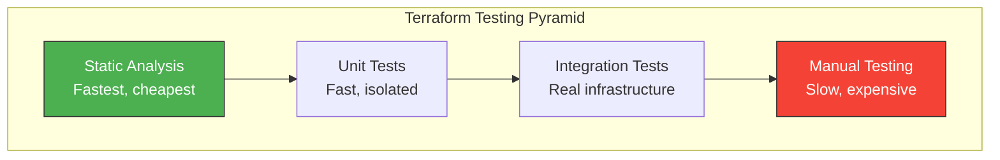
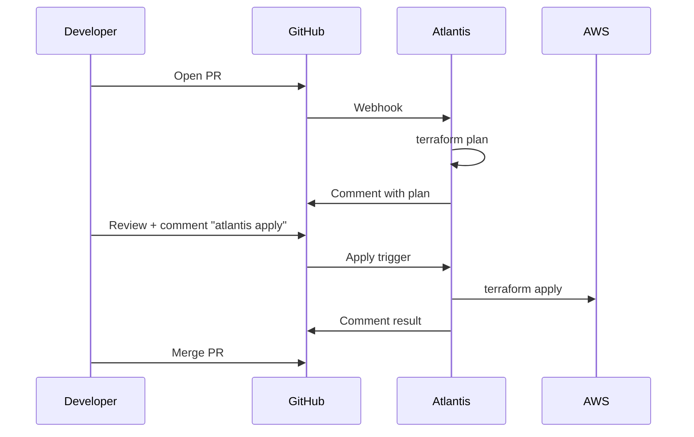
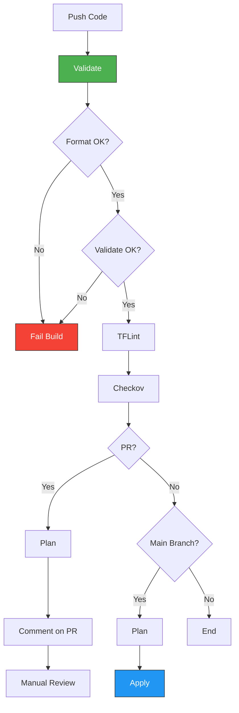
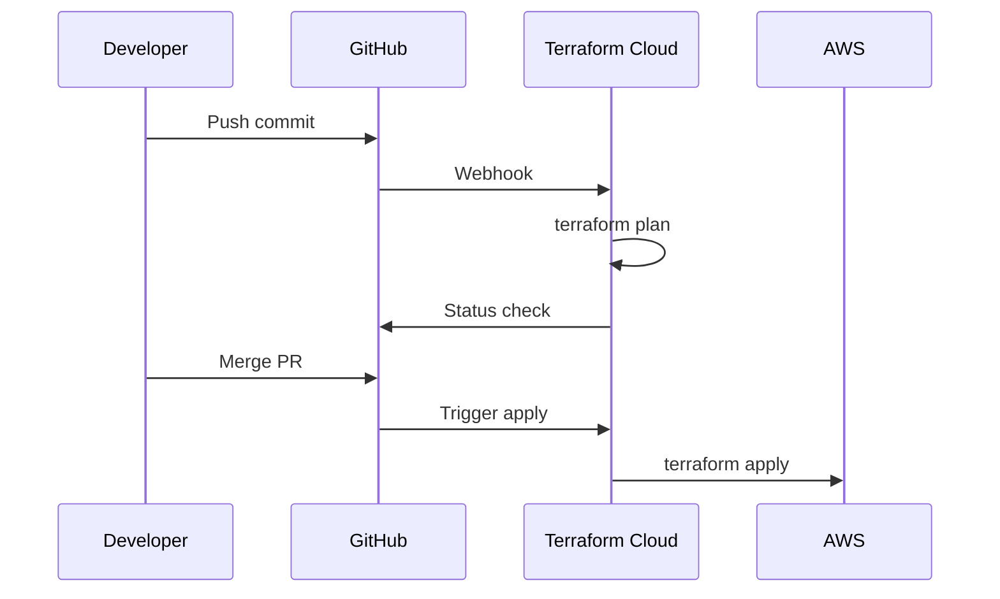

# Testing and CI/CD

Automated testing and continuous integration are essential for production Terraform deployments.

> [!NOTE]
> **Learning Goal**: Implement testing strategies and CI/CD pipelines for Terraform.

---

## Testing Pyramid



| Level | Tools | Speed | Coverage |
|-------|-------|-------|----------|
| **Static Analysis** | terraform validate, tflint, checkov | Seconds | Syntax, best practices |
| **Unit Tests** | Terratest, terraform test | Minutes | Module logic |
| **Integration Tests** | Terratest, real apply | 10-30 min | Actual infrastructure |
| **Manual Testing** | Console verification | Hours | Edge cases |

---

## Static Analysis

### terraform fmt

Check and fix formatting:

```bash
# Check if formatted (CI)
terraform fmt -check -recursive

# Auto-format
terraform fmt -recursive

# Show diff
terraform fmt -diff
```

### terraform validate

Validate configuration syntax:

```bash
# Initialize first (required for validate)
terraform init -backend=false

# Validate
terraform validate

# Output:
# Success! The configuration is valid.
```

### TFLint

Linter for Terraform:

```bash
# Install
brew install tflint

# Initialize (downloads plugins)
tflint --init

# Run
tflint

# With specific ruleset
tflint --enable-rule=terraform_naming_convention
```

**.tflint.hcl configuration:**

```hcl
plugin "aws" {
  enabled = true
  version = "0.27.0"
  source  = "github.com/terraform-linters/tflint-ruleset-aws"
}

rule "terraform_naming_convention" {
  enabled = true
}

rule "terraform_documented_variables" {
  enabled = true
}

rule "terraform_documented_outputs" {
  enabled = true
}

rule "aws_instance_invalid_type" {
  enabled = true
}
```

### Checkov (Security Scanning)

```bash
# Install
pip install checkov

# Run on directory
checkov -d .

# Skip specific checks
checkov -d . --skip-check CKV_AWS_79,CKV_AWS_88

# Output as JSON
checkov -d . -o json > checkov-results.json
```

**Example output:**

```
Passed checks: 45, Failed checks: 3, Skipped checks: 2

Check: CKV_AWS_79: "Ensure Instance Metadata Service Version 1 is not enabled"
    FAILED for resource: aws_instance.web
    File: /main.tf:15-25

Check: CKV_AWS_8: "Ensure all data stored in RDS is encrypted"
    PASSED for resource: aws_db_instance.main
```

### terraform-docs

Generate documentation:

```bash
# Install
brew install terraform-docs

# Generate README
terraform-docs markdown table . > README.md

# Custom template
terraform-docs markdown table --output-file README.md .
```

---

## Unit Testing with terraform test

Built-in testing (Terraform 1.6+):

```hcl
# tests/vpc_test.tftest.hcl

variables {
  vpc_cidr = "10.0.0.0/16"
  name     = "test-vpc"
}

run "vpc_creates_correctly" {
  command = plan  # or apply
  
  assert {
    condition     = aws_vpc.main.cidr_block == "10.0.0.0/16"
    error_message = "VPC CIDR block is incorrect"
  }
  
  assert {
    condition     = aws_vpc.main.enable_dns_hostnames == true
    error_message = "DNS hostnames should be enabled"
  }
}

run "subnet_count_matches_azs" {
  command = plan
  
  variables {
    availability_zones = ["us-east-1a", "us-east-1b"]
  }
  
  assert {
    condition     = length(aws_subnet.public) == 2
    error_message = "Should create 2 public subnets"
  }
}
```

```bash
# Run tests
terraform test

# Verbose output
terraform test -verbose
```

---

## Integration Testing with Terratest

Go-based testing framework:

```go
// test/vpc_test.go

package test

import (
    "testing"
    
    "github.com/gruntwork-io/terratest/modules/terraform"
    "github.com/stretchr/testify/assert"
)

func TestVPCCreation(t *testing.T) {
    t.Parallel()
    
    terraformOptions := terraform.WithDefaultRetryableErrors(t, &terraform.Options{
        TerraformDir: "../examples/vpc",
        
        Vars: map[string]interface{}{
            "vpc_cidr": "10.0.0.0/16",
            "name":     "test-vpc",
        },
    })
    
    // Clean up at the end
    defer terraform.Destroy(t, terraformOptions)
    
    // Deploy
    terraform.InitAndApply(t, terraformOptions)
    
    // Validate outputs
    vpcId := terraform.Output(t, terraformOptions, "vpc_id")
    assert.NotEmpty(t, vpcId)
    
    vpcCidr := terraform.Output(t, terraformOptions, "vpc_cidr")
    assert.Equal(t, "10.0.0.0/16", vpcCidr)
}
```

```bash
# Run tests
cd test
go test -v -timeout 30m
```

---

## CI/CD Pipeline

### GitHub Actions

```yaml
# .github/workflows/terraform.yml

name: Terraform CI/CD

on:
  push:
    branches: [main]
  pull_request:
    branches: [main]

env:
  TF_VERSION: 1.6.6
  AWS_REGION: us-east-1

jobs:
  # Static analysis
  validate:
    runs-on: ubuntu-latest
    steps:
      - uses: actions/checkout@v4
      
      - name: Setup Terraform
        uses: hashicorp/setup-terraform@v3
        with:
          terraform_version: ${{ env.TF_VERSION }}
      
      - name: Terraform Format Check
        run: terraform fmt -check -recursive
      
      - name: Terraform Init
        run: terraform init -backend=false
      
      - name: Terraform Validate
        run: terraform validate
      
      - name: TFLint
        uses: terraform-linters/setup-tflint@v4
      
      - name: Run TFLint
        run: |
          tflint --init
          tflint --recursive
      
      - name: Checkov
        uses: bridgecrewio/checkov-action@master
        with:
          directory: .
          skip_check: CKV_AWS_79

  # Plan on PR
  plan:
    needs: validate
    runs-on: ubuntu-latest
    if: github.event_name == 'pull_request'
    
    permissions:
      contents: read
      pull-requests: write
    
    steps:
      - uses: actions/checkout@v4
      
      - name: Configure AWS Credentials
        uses: aws-actions/configure-aws-credentials@v4
        with:
          aws-access-key-id: ${{ secrets.AWS_ACCESS_KEY_ID }}
          aws-secret-access-key: ${{ secrets.AWS_SECRET_ACCESS_KEY }}
          aws-region: ${{ env.AWS_REGION }}
      
      - name: Setup Terraform
        uses: hashicorp/setup-terraform@v3
        with:
          terraform_version: ${{ env.TF_VERSION }}
      
      - name: Terraform Init
        run: terraform init
      
      - name: Terraform Plan
        id: plan
        run: terraform plan -no-color -out=tfplan
        continue-on-error: true
      
      - name: Comment Plan on PR
        uses: actions/github-script@v7
        with:
          script: |
            const output = `#### Terraform Plan 📖
            
            \`\`\`
            ${{ steps.plan.outputs.stdout }}
            \`\`\`
            
            *Pushed by: @${{ github.actor }}*`;
            
            github.rest.issues.createComment({
              issue_number: context.issue.number,
              owner: context.repo.owner,
              repo: context.repo.repo,
              body: output
            });
      
      - name: Check Plan Status
        if: steps.plan.outcome == 'failure'
        run: exit 1

  # Apply on main
  apply:
    needs: validate
    runs-on: ubuntu-latest
    if: github.ref == 'refs/heads/main' && github.event_name == 'push'
    environment: production
    
    steps:
      - uses: actions/checkout@v4
      
      - name: Configure AWS Credentials
        uses: aws-actions/configure-aws-credentials@v4
        with:
          aws-access-key-id: ${{ secrets.AWS_ACCESS_KEY_ID }}
          aws-secret-access-key: ${{ secrets.AWS_SECRET_ACCESS_KEY }}
          aws-region: ${{ env.AWS_REGION }}
      
      - name: Setup Terraform
        uses: hashicorp/setup-terraform@v3
        with:
          terraform_version: ${{ env.TF_VERSION }}
      
      - name: Terraform Init
        run: terraform init
      
      - name: Terraform Apply
        run: terraform apply -auto-approve
```

### GitLab CI

```yaml
# .gitlab-ci.yml

stages:
  - validate
  - plan
  - apply

variables:
  TF_VERSION: "1.6.6"

.terraform_template: &terraform_template
  image: hashicorp/terraform:$TF_VERSION
  before_script:
    - terraform init

validate:
  <<: *terraform_template
  stage: validate
  script:
    - terraform fmt -check -recursive
    - terraform validate
  rules:
    - if: $CI_PIPELINE_SOURCE == "merge_request_event"
    - if: $CI_COMMIT_BRANCH == $CI_DEFAULT_BRANCH

plan:
  <<: *terraform_template
  stage: plan
  script:
    - terraform plan -out=tfplan
  artifacts:
    paths:
      - tfplan
  rules:
    - if: $CI_PIPELINE_SOURCE == "merge_request_event"
    - if: $CI_COMMIT_BRANCH == $CI_DEFAULT_BRANCH

apply:
  <<: *terraform_template
  stage: apply
  script:
    - terraform apply -auto-approve tfplan
  dependencies:
    - plan
  rules:
    - if: $CI_COMMIT_BRANCH == $CI_DEFAULT_BRANCH
  when: manual
  environment:
    name: production
```

---

## Atlantis (Pull Request Automation)



**atlantis.yaml:**

```yaml
version: 3
projects:
  - dir: infrastructure/vpc
    workspace: dev
    autoplan:
      when_modified: ["*.tf", "*.tfvars"]
      enabled: true
    apply_requirements: [approved]
    
  - dir: infrastructure/vpc
    workspace: prod
    autoplan:
      enabled: true
    apply_requirements: [approved, mergeable]

workflows:
  default:
    plan:
      steps:
        - init
        - plan
    apply:
      steps:
        - apply
```

---

## Best Practices

### 1. Pin Versions

```hcl
terraform {
  required_version = "~> 1.6.0"
  
  required_providers {
    aws = {
      source  = "hashicorp/aws"
      version = "~> 5.0"
    }
  }
}
```

### 2. Use Remote State

```hcl
terraform {
  backend "s3" {
    bucket         = "terraform-state"
    key            = "prod/terraform.tfstate"
    region         = "us-east-1"
    encrypt        = true
    dynamodb_table = "terraform-locks"
  }
}
```

### 3. Separate Environments

```bash
# Different workspaces or directories
terraform workspace select prod
terraform plan -var-file=environments/prod.tfvars
```

### 4. Protect Production

```yaml
# GitHub: Require approval for production
environment:
  name: production
  # Requires environment protection rules
```

### 5. Store Secrets Securely

```yaml
# Use GitHub/GitLab secrets
env:
  AWS_ACCESS_KEY_ID: ${{ secrets.AWS_ACCESS_KEY_ID }}
  AWS_SECRET_ACCESS_KEY: ${{ secrets.AWS_SECRET_ACCESS_KEY }}
```

---

## Complete CI/CD Workflow



---

## tfsec Security Scanning

Static analysis security scanner for Terraform:

```bash
# Install
brew install tfsec

# Run scan
tfsec .

# Output formats
tfsec . --format json > results.json
tfsec . --format sarif > results.sarif  # For GitHub
tfsec . --format junit > results.xml    # For CI

# Exclude specific checks
tfsec . --exclude aws-s3-enable-versioning,aws-s3-enable-logging

# Minimum severity
tfsec . --minimum-severity MEDIUM
```

### Inline Ignores

```hcl
resource "aws_s3_bucket" "logs" {
  bucket = "my-logs-bucket"
  
  #tfsec:ignore:aws-s3-enable-versioning
  # Logs don't need versioning - they're write-once
}

resource "aws_security_group_rule" "allow_all" {
  #tfsec:ignore:aws-vpc-no-public-ingress-sgr reason:public API
  type        = "ingress"
  from_port   = 443
  to_port     = 443
  protocol    = "tcp"
  cidr_blocks = ["0.0.0.0/0"]
}
```

### GitHub Actions Integration

```yaml
- name: tfsec
  uses: aquasecurity/tfsec-action@v1.0.0
  with:
    soft_fail: true
    format: sarif
    sarif_file: tfsec.sarif

- name: Upload SARIF
  uses: github/codeql-action/upload-sarif@v2
  with:
    sarif_file: tfsec.sarif
```

---

## terraform test with Mocking

Advanced testing with mocked providers and resources (Terraform 1.6+):

### Mock Provider

```hcl
# tests/main.tftest.hcl

mock_provider "aws" {}

run "test_vpc_creation" {
  command = plan

  assert {
    condition     = aws_vpc.main.cidr_block == "10.0.0.0/16"
    error_message = "VPC CIDR block is incorrect"
  }
}
```

### Override Resources

```hcl
# tests/with_overrides.tftest.hcl

mock_provider "aws" {
  mock_resource "aws_ami" {
    defaults = {
      id           = "ami-mock12345"
      architecture = "x86_64"
    }
  }
  
  mock_data "aws_availability_zones" {
    defaults = {
      names = ["us-east-1a", "us-east-1b", "us-east-1c"]
    }
  }
}

run "test_with_mocked_data" {
  command = plan

  assert {
    condition     = length(aws_subnet.public) == 3
    error_message = "Should create 3 public subnets"
  }
}
```

### Override Modules

```hcl
# tests/module_mocks.tftest.hcl

override_module {
  target = module.vpc
  outputs = {
    vpc_id          = "vpc-mock12345"
    private_subnets = ["subnet-1", "subnet-2"]
    public_subnets  = ["subnet-3", "subnet-4"]
  }
}

run "test_with_mocked_module" {
  command = plan

  assert {
    condition     = aws_instance.app.subnet_id == "subnet-1"
    error_message = "Instance should be in first private subnet"
  }
}
```

### Test Variables

```hcl
# tests/variables.tftest.hcl

variables {
  environment = "test"
  instance_type = "t3.micro"
}

run "test_dev_config" {
  command = plan

  variables {
    environment = "dev"
  }

  assert {
    condition     = aws_instance.app.instance_type == "t3.micro"
    error_message = "Dev should use t3.micro"
  }
}

run "test_prod_config" {
  command = plan

  variables {
    environment   = "prod"
    instance_type = "t3.large"
  }

  assert {
    condition     = aws_instance.app.instance_type == "t3.large"
    error_message = "Prod should use t3.large"
  }
}
```

---

## Terraform Cloud CI/CD Integration

### VCS-Driven Workflow



### Configure Workspace

```hcl
# Using Terraform to manage TFC
resource "tfe_workspace" "app" {
  name         = "app-production"
  organization = "my-org"
  
  vcs_repo {
    identifier     = "myorg/terraform-app"
    branch         = "main"
    oauth_token_id = var.oauth_token_id
  }
  
  # Speculative plans on PRs
  speculative_enabled = true
  
  # Auto-apply after merge
  auto_apply = true
  
  # Working directory
  working_directory = "environments/production"
}
```

### GitHub Actions with TFC

```yaml
name: Terraform Cloud

on:
  push:
    branches: [main]
  pull_request:

jobs:
  terraform:
    runs-on: ubuntu-latest
    steps:
      - uses: actions/checkout@v4
      
      - name: Setup Terraform
        uses: hashicorp/setup-terraform@v3
        with:
          cli_config_credentials_token: ${{ secrets.TF_API_TOKEN }}
      
      - name: Terraform Init
        run: terraform init
      
      - name: Terraform Plan
        run: terraform plan
        
      # TFC handles the actual apply via VCS integration
```

---

## OpenTofu Compatibility

OpenTofu is an open-source fork of Terraform:

### Installation

```bash
# macOS
brew install opentofu

# Linux
curl --proto '=https' --tlsv1.2 -fsSL https://get.opentofu.org/install-opentofu.sh | sh
```

### Key Differences

| Feature | Terraform | OpenTofu |
|---------|-----------|----------|
| License | BSL 1.1 | MPL 2.0 (Open Source) |
| Registry | registry.terraform.io | registry.opentofu.org |
| State encryption | Enterprise only | Built-in |
| Provider lock | Yes | Yes |

### Migration

```bash
# OpenTofu can use existing state
tofu init
tofu plan

# Use OpenTofu in CI
- name: Setup OpenTofu
  uses: opentofu/setup-opentofu@v1
  
- name: OpenTofu Init
  run: tofu init
  
- name: OpenTofu Plan
  run: tofu plan
```

### State Encryption (OpenTofu)

```hcl
# OpenTofu native state encryption
terraform {
  encryption {
    key_provider "pbkdf2" "main" {
      passphrase = var.state_passphrase
    }
    
    method "aes_gcm" "main" {
      keys = key_provider.pbkdf2.main
    }
    
    state {
      method = method.aes_gcm.main
    }
  }
}
```

---

## Next Steps

Continue to **[12_real_world_project.md](./12_real_world_project.md)** to build:

- Complete 3-tier AWS architecture
- VPC with public/private subnets
- Auto Scaling Group with ALB
- RDS database with Multi-AZ

**→ [12_real_world_project.md](./12_real_world_project.md)**
