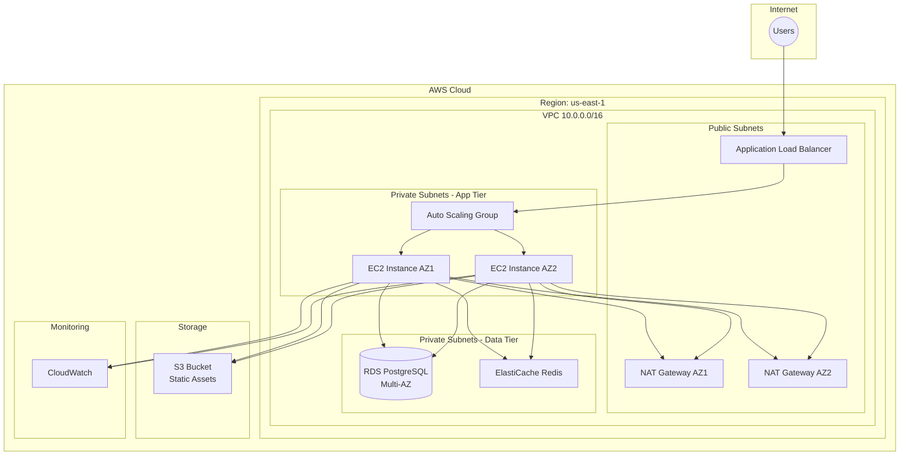

# Real-World Project: 3-Tier AWS Architecture

Build a complete, production-ready AWS infrastructure step by step.

> [!NOTE]
> **Learning Goal**: Apply all concepts learned to build a scalable, highly-available web application infrastructure.

---

## Architecture Overview



---

## Project Structure

```
three-tier-app/
├── main.tf                 # Root module
├── variables.tf            # Input variables
├── outputs.tf              # Outputs
├── versions.tf             # Terraform/provider versions
├── locals.tf               # Local values
├── data.tf                 # Data sources
├── backend.tf              # Remote state config
├── terraform.tfvars        # Variable values
├── modules/
│   ├── vpc/
│   ├── security/
│   ├── alb/
│   ├── asg/
│   ├── rds/
│   └── monitoring/
└── environments/
    ├── dev.tfvars
    └── prod.tfvars
```

---

## Step 1: Base Configuration

### versions.tf

```hcl
terraform {
  required_version = ">= 1.6.0"
  
  required_providers {
    aws = {
      source  = "hashicorp/aws"
      version = "~> 5.0"
    }
    random = {
      source  = "hashicorp/random"
      version = "~> 3.5"
    }
  }
}

provider "aws" {
  region = var.region
  
  default_tags {
    tags = {
      Project     = var.project
      Environment = var.environment
      ManagedBy   = "Terraform"
    }
  }
}
```

### variables.tf

```hcl
# General
variable "project" {
  description = "Project name"
  type        = string
}

variable "environment" {
  description = "Environment (dev, staging, prod)"
  type        = string
  
  validation {
    condition     = contains(["dev", "staging", "prod"], var.environment)
    error_message = "Environment must be dev, staging, or prod."
  }
}

variable "region" {
  description = "AWS region"
  type        = string
  default     = "us-east-1"
}

# VPC
variable "vpc_cidr" {
  description = "VPC CIDR block"
  type        = string
  default     = "10.0.0.0/16"
}

variable "availability_zones" {
  description = "Availability zones"
  type        = list(string)
  default     = ["us-east-1a", "us-east-1b"]
}

# Compute
variable "instance_type" {
  description = "EC2 instance type"
  type        = string
  default     = "t3.micro"
}

variable "min_size" {
  description = "Minimum number of instances"
  type        = number
  default     = 1
}

variable "max_size" {
  description = "Maximum number of instances"
  type        = number
  default     = 4
}

variable "desired_capacity" {
  description = "Desired number of instances"
  type        = number
  default     = 2
}

# Database
variable "db_instance_class" {
  description = "RDS instance class"
  type        = string
  default     = "db.t3.micro"
}

variable "db_name" {
  description = "Database name"
  type        = string
  default     = "appdb"
}

variable "db_username" {
  description = "Database master username"
  type        = string
  default     = "admin"
}

variable "db_password" {
  description = "Database master password"
  type        = string
  sensitive   = true
}
```

### locals.tf

```hcl
locals {
  name_prefix = "${var.project}-${var.environment}"
  
  az_count = length(var.availability_zones)
  
  public_subnets = [
    for i in range(local.az_count) : 
    cidrsubnet(var.vpc_cidr, 8, i)
  ]
  
  private_subnets = [
    for i in range(local.az_count) : 
    cidrsubnet(var.vpc_cidr, 8, i + local.az_count)
  ]
  
  database_subnets = [
    for i in range(local.az_count) : 
    cidrsubnet(var.vpc_cidr, 8, i + local.az_count * 2)
  ]
  
  common_tags = {
    Project     = var.project
    Environment = var.environment
  }
}
```

### data.tf

```hcl
# Latest Amazon Linux 2023 AMI
data "aws_ami" "amazon_linux" {
  most_recent = true
  owners      = ["amazon"]
  
  filter {
    name   = "name"
    values = ["al2023-ami-*-kernel-6.1-x86_64"]
  }
  
  filter {
    name   = "virtualization-type"
    values = ["hvm"]
  }
}

# Current AWS account
data "aws_caller_identity" "current" {}

# Current region
data "aws_region" "current" {}
```

---

## Step 2: VPC Module

### modules/vpc/main.tf

```hcl
# VPC
resource "aws_vpc" "main" {
  cidr_block           = var.vpc_cidr
  enable_dns_hostnames = true
  enable_dns_support   = true
  
  tags = {
    Name = "${var.name_prefix}-vpc"
  }
}

# Internet Gateway
resource "aws_internet_gateway" "main" {
  vpc_id = aws_vpc.main.id
  
  tags = {
    Name = "${var.name_prefix}-igw"
  }
}

# Public Subnets
resource "aws_subnet" "public" {
  count = length(var.public_subnets)
  
  vpc_id                  = aws_vpc.main.id
  cidr_block              = var.public_subnets[count.index]
  availability_zone       = var.availability_zones[count.index]
  map_public_ip_on_launch = true
  
  tags = {
    Name = "${var.name_prefix}-public-${count.index + 1}"
    Tier = "public"
  }
}

# Private Subnets (App Tier)
resource "aws_subnet" "private" {
  count = length(var.private_subnets)
  
  vpc_id            = aws_vpc.main.id
  cidr_block        = var.private_subnets[count.index]
  availability_zone = var.availability_zones[count.index]
  
  tags = {
    Name = "${var.name_prefix}-private-${count.index + 1}"
    Tier = "private"
  }
}

# Database Subnets
resource "aws_subnet" "database" {
  count = length(var.database_subnets)
  
  vpc_id            = aws_vpc.main.id
  cidr_block        = var.database_subnets[count.index]
  availability_zone = var.availability_zones[count.index]
  
  tags = {
    Name = "${var.name_prefix}-database-${count.index + 1}"
    Tier = "database"
  }
}

# Elastic IPs for NAT Gateways
resource "aws_eip" "nat" {
  count  = var.enable_nat_gateway ? (var.single_nat_gateway ? 1 : length(var.public_subnets)) : 0
  domain = "vpc"
  
  tags = {
    Name = "${var.name_prefix}-nat-eip-${count.index + 1}"
  }
  
  depends_on = [aws_internet_gateway.main]
}

# NAT Gateways
resource "aws_nat_gateway" "main" {
  count = var.enable_nat_gateway ? (var.single_nat_gateway ? 1 : length(var.public_subnets)) : 0
  
  allocation_id = aws_eip.nat[count.index].id
  subnet_id     = aws_subnet.public[count.index].id
  
  tags = {
    Name = "${var.name_prefix}-nat-${count.index + 1}"
  }
  
  depends_on = [aws_internet_gateway.main]
}

# Public Route Table
resource "aws_route_table" "public" {
  vpc_id = aws_vpc.main.id
  
  route {
    cidr_block = "0.0.0.0/0"
    gateway_id = aws_internet_gateway.main.id
  }
  
  tags = {
    Name = "${var.name_prefix}-public-rt"
  }
}

# Private Route Tables
resource "aws_route_table" "private" {
  count  = var.enable_nat_gateway ? (var.single_nat_gateway ? 1 : length(var.private_subnets)) : 0
  vpc_id = aws_vpc.main.id
  
  route {
    cidr_block     = "0.0.0.0/0"
    nat_gateway_id = aws_nat_gateway.main[var.single_nat_gateway ? 0 : count.index].id
  }
  
  tags = {
    Name = "${var.name_prefix}-private-rt-${count.index + 1}"
  }
}

# Route Table Associations - Public
resource "aws_route_table_association" "public" {
  count = length(var.public_subnets)
  
  subnet_id      = aws_subnet.public[count.index].id
  route_table_id = aws_route_table.public.id
}

# Route Table Associations - Private
resource "aws_route_table_association" "private" {
  count = var.enable_nat_gateway ? length(var.private_subnets) : 0
  
  subnet_id      = aws_subnet.private[count.index].id
  route_table_id = aws_route_table.private[var.single_nat_gateway ? 0 : count.index].id
}

# Database Subnet Group
resource "aws_db_subnet_group" "main" {
  name        = "${var.name_prefix}-db-subnet-group"
  description = "Database subnet group"
  subnet_ids  = aws_subnet.database[*].id
  
  tags = {
    Name = "${var.name_prefix}-db-subnet-group"
  }
}
```

### modules/vpc/outputs.tf

```hcl
output "vpc_id" {
  value = aws_vpc.main.id
}

output "vpc_cidr" {
  value = aws_vpc.main.cidr_block
}

output "public_subnet_ids" {
  value = aws_subnet.public[*].id
}

output "private_subnet_ids" {
  value = aws_subnet.private[*].id
}

output "database_subnet_ids" {
  value = aws_subnet.database[*].id
}

output "db_subnet_group_name" {
  value = aws_db_subnet_group.main.name
}
```

---

## Step 3: Security Module

### modules/security/main.tf

```hcl
# ALB Security Group
resource "aws_security_group" "alb" {
  name        = "${var.name_prefix}-alb-sg"
  description = "Security group for Application Load Balancer"
  vpc_id      = var.vpc_id
  
  ingress {
    description = "HTTP"
    from_port   = 80
    to_port     = 80
    protocol    = "tcp"
    cidr_blocks = ["0.0.0.0/0"]
  }
  
  ingress {
    description = "HTTPS"
    from_port   = 443
    to_port     = 443
    protocol    = "tcp"
    cidr_blocks = ["0.0.0.0/0"]
  }
  
  egress {
    from_port   = 0
    to_port     = 0
    protocol    = "-1"
    cidr_blocks = ["0.0.0.0/0"]
  }
  
  tags = {
    Name = "${var.name_prefix}-alb-sg"
  }
}

# App Security Group
resource "aws_security_group" "app" {
  name        = "${var.name_prefix}-app-sg"
  description = "Security group for app servers"
  vpc_id      = var.vpc_id
  
  ingress {
    description     = "HTTP from ALB"
    from_port       = 80
    to_port         = 80
    protocol        = "tcp"
    security_groups = [aws_security_group.alb.id]
  }
  
  egress {
    from_port   = 0
    to_port     = 0
    protocol    = "-1"
    cidr_blocks = ["0.0.0.0/0"]
  }
  
  tags = {
    Name = "${var.name_prefix}-app-sg"
  }
}

# Database Security Group
resource "aws_security_group" "database" {
  name        = "${var.name_prefix}-db-sg"
  description = "Security group for RDS"
  vpc_id      = var.vpc_id
  
  ingress {
    description     = "PostgreSQL from App"
    from_port       = 5432
    to_port         = 5432
    protocol        = "tcp"
    security_groups = [aws_security_group.app.id]
  }
  
  tags = {
    Name = "${var.name_prefix}-db-sg"
  }
}
```

---

## Step 4: Application Load Balancer

### modules/alb/main.tf

```hcl
resource "aws_lb" "main" {
  name               = "${var.name_prefix}-alb"
  internal           = false
  load_balancer_type = "application"
  security_groups    = [var.security_group_id]
  subnets            = var.subnet_ids
  
  enable_deletion_protection = var.environment == "prod"
  
  tags = {
    Name = "${var.name_prefix}-alb"
  }
}

resource "aws_lb_target_group" "main" {
  name     = "${var.name_prefix}-tg"
  port     = 80
  protocol = "HTTP"
  vpc_id   = var.vpc_id
  
  health_check {
    enabled             = true
    healthy_threshold   = 2
    interval            = 30
    matcher             = "200"
    path                = "/health"
    port                = "traffic-port"
    protocol            = "HTTP"
    timeout             = 5
    unhealthy_threshold = 3
  }
  
  tags = {
    Name = "${var.name_prefix}-tg"
  }
}

resource "aws_lb_listener" "http" {
  load_balancer_arn = aws_lb.main.arn
  port              = 80
  protocol          = "HTTP"
  
  default_action {
    type             = "forward"
    target_group_arn = aws_lb_target_group.main.arn
  }
}
```

---

## Step 5: Auto Scaling Group

### modules/asg/main.tf

```hcl
# Launch Template
resource "aws_launch_template" "main" {
  name_prefix   = "${var.name_prefix}-lt-"
  image_id      = var.ami_id
  instance_type = var.instance_type
  
  vpc_security_group_ids = [var.security_group_id]
  
  iam_instance_profile {
    name = aws_iam_instance_profile.main.name
  }
  
  user_data = base64encode(templatefile("${path.module}/user-data.sh", {
    environment = var.environment
    db_endpoint = var.db_endpoint
    db_name     = var.db_name
  }))
  
  monitoring {
    enabled = true
  }
  
  tag_specifications {
    resource_type = "instance"
    tags = {
      Name = "${var.name_prefix}-instance"
    }
  }
  
  lifecycle {
    create_before_destroy = true
  }
}

# Auto Scaling Group
resource "aws_autoscaling_group" "main" {
  name                = "${var.name_prefix}-asg"
  vpc_zone_identifier = var.subnet_ids
  target_group_arns   = [var.target_group_arn]
  
  min_size         = var.min_size
  max_size         = var.max_size
  desired_capacity = var.desired_capacity
  
  health_check_type         = "ELB"
  health_check_grace_period = 300
  
  launch_template {
    id      = aws_launch_template.main.id
    version = "$Latest"
  }
  
  instance_refresh {
    strategy = "Rolling"
    preferences {
      min_healthy_percentage = 50
    }
  }
  
  tag {
    key                 = "Name"
    value               = "${var.name_prefix}-asg-instance"
    propagate_at_launch = true
  }
  
  lifecycle {
    ignore_changes = [desired_capacity]
  }
}

# Scaling Policy - Scale Up
resource "aws_autoscaling_policy" "scale_up" {
  name                   = "${var.name_prefix}-scale-up"
  autoscaling_group_name = aws_autoscaling_group.main.name
  adjustment_type        = "ChangeInCapacity"
  scaling_adjustment     = 1
  cooldown               = 300
}

# Scaling Policy - Scale Down
resource "aws_autoscaling_policy" "scale_down" {
  name                   = "${var.name_prefix}-scale-down"
  autoscaling_group_name = aws_autoscaling_group.main.name
  adjustment_type        = "ChangeInCapacity"
  scaling_adjustment     = -1
  cooldown               = 300
}

# CloudWatch Alarm - High CPU
resource "aws_cloudwatch_metric_alarm" "high_cpu" {
  alarm_name          = "${var.name_prefix}-high-cpu"
  comparison_operator = "GreaterThanThreshold"
  evaluation_periods  = 2
  metric_name         = "CPUUtilization"
  namespace           = "AWS/EC2"
  period              = 120
  statistic           = "Average"
  threshold           = 80
  
  dimensions = {
    AutoScalingGroupName = aws_autoscaling_group.main.name
  }
  
  alarm_actions = [aws_autoscaling_policy.scale_up.arn]
}

# CloudWatch Alarm - Low CPU
resource "aws_cloudwatch_metric_alarm" "low_cpu" {
  alarm_name          = "${var.name_prefix}-low-cpu"
  comparison_operator = "LessThanThreshold"
  evaluation_periods  = 2
  metric_name         = "CPUUtilization"
  namespace           = "AWS/EC2"
  period              = 120
  statistic           = "Average"
  threshold           = 20
  
  dimensions = {
    AutoScalingGroupName = aws_autoscaling_group.main.name
  }
  
  alarm_actions = [aws_autoscaling_policy.scale_down.arn]
}
```

---

## Step 6: RDS Database

### modules/rds/main.tf

```hcl
resource "aws_db_instance" "main" {
  identifier = "${var.name_prefix}-db"
  
  engine               = "postgres"
  engine_version       = "14"
  instance_class       = var.instance_class
  allocated_storage    = 20
  max_allocated_storage = 100
  storage_type         = "gp3"
  storage_encrypted    = true
  
  db_name  = var.db_name
  username = var.db_username
  password = var.db_password
  
  db_subnet_group_name   = var.db_subnet_group_name
  vpc_security_group_ids = [var.security_group_id]
  
  multi_az               = var.multi_az
  publicly_accessible    = false
  
  backup_retention_period = var.environment == "prod" ? 7 : 1
  backup_window           = "03:00-04:00"
  maintenance_window      = "Mon:04:00-Mon:05:00"
  
  skip_final_snapshot       = var.environment != "prod"
  final_snapshot_identifier = var.environment == "prod" ? "${var.name_prefix}-final-snapshot" : null
  deletion_protection       = var.environment == "prod"
  
  performance_insights_enabled = true
  
  tags = {
    Name = "${var.name_prefix}-db"
  }
  
  lifecycle {
    prevent_destroy = false  # Set to true for production
  }
}
```

---

## Step 7: Root Module

### main.tf

```hcl
# VPC
module "vpc" {
  source = "./modules/vpc"
  
  name_prefix        = local.name_prefix
  vpc_cidr           = var.vpc_cidr
  availability_zones = var.availability_zones
  public_subnets     = local.public_subnets
  private_subnets    = local.private_subnets
  database_subnets   = local.database_subnets
  
  enable_nat_gateway = true
  single_nat_gateway = var.environment != "prod"  # Multi-NAT for prod
}

# Security Groups
module "security" {
  source = "./modules/security"
  
  name_prefix = local.name_prefix
  vpc_id      = module.vpc.vpc_id
  vpc_cidr    = module.vpc.vpc_cidr
}

# Application Load Balancer
module "alb" {
  source = "./modules/alb"
  
  name_prefix       = local.name_prefix
  environment       = var.environment
  vpc_id            = module.vpc.vpc_id
  subnet_ids        = module.vpc.public_subnet_ids
  security_group_id = module.security.alb_security_group_id
}

# Auto Scaling Group
module "asg" {
  source = "./modules/asg"
  
  name_prefix       = local.name_prefix
  environment       = var.environment
  ami_id            = data.aws_ami.amazon_linux.id
  instance_type     = var.instance_type
  subnet_ids        = module.vpc.private_subnet_ids
  security_group_id = module.security.app_security_group_id
  target_group_arn  = module.alb.target_group_arn
  
  min_size         = var.min_size
  max_size         = var.max_size
  desired_capacity = var.desired_capacity
  
  db_endpoint = module.rds.endpoint
  db_name     = var.db_name
}

# RDS Database
module "rds" {
  source = "./modules/rds"
  
  name_prefix          = local.name_prefix
  environment          = var.environment
  instance_class       = var.db_instance_class
  db_name              = var.db_name
  db_username          = var.db_username
  db_password          = var.db_password
  db_subnet_group_name = module.vpc.db_subnet_group_name
  security_group_id    = module.security.database_security_group_id
  multi_az             = var.environment == "prod"
}
```

### outputs.tf

```hcl
output "vpc_id" {
  description = "VPC ID"
  value       = module.vpc.vpc_id
}

output "alb_dns_name" {
  description = "ALB DNS name"
  value       = module.alb.dns_name
}

output "alb_zone_id" {
  description = "ALB zone ID"
  value       = module.alb.zone_id
}

output "db_endpoint" {
  description = "RDS endpoint"
  value       = module.rds.endpoint
  sensitive   = true
}

output "db_name" {
  description = "Database name"
  value       = module.rds.db_name
}
```

---

## Step 8: Environment Files

### environments/dev.tfvars

```hcl
project     = "myapp"
environment = "dev"
region      = "us-east-1"

vpc_cidr           = "10.0.0.0/16"
availability_zones = ["us-east-1a", "us-east-1b"]

instance_type    = "t3.micro"
min_size         = 1
max_size         = 2
desired_capacity = 1

db_instance_class = "db.t3.micro"
db_name           = "appdb"
db_username       = "admin"
# db_password provided via TF_VAR_db_password or -var
```

### environments/prod.tfvars

```hcl
project     = "myapp"
environment = "prod"
region      = "us-east-1"

vpc_cidr           = "10.1.0.0/16"
availability_zones = ["us-east-1a", "us-east-1b", "us-east-1c"]

instance_type    = "t3.large"
min_size         = 2
max_size         = 10
desired_capacity = 3

db_instance_class = "db.r5.large"
db_name           = "appdb"
db_username       = "admin"
```

---

## Deployment Commands

```bash
# Initialize
terraform init

# Deploy to dev
terraform workspace new dev || terraform workspace select dev
export TF_VAR_db_password="your-secure-password"
terraform apply -var-file=environments/dev.tfvars

# Deploy to prod
terraform workspace new prod || terraform workspace select prod
export TF_VAR_db_password="your-prod-password"
terraform apply -var-file=environments/prod.tfvars

# Destroy dev (for cleanup)
terraform workspace select dev
terraform destroy -var-file=environments/dev.tfvars
```

---

## Cost Estimation

| Resource | Dev (Monthly) | Prod (Monthly) |
|----------|---------------|----------------|
| EC2 (Auto Scaling) | ~$8 | ~$150 |
| ALB | ~$16 | ~$25 |
| NAT Gateway | ~$32 | ~$96 |
| RDS (t3.micro/r5.large) | ~$13 | ~$200 |
| CloudWatch | ~$5 | ~$15 |
| **Total** | **~$75** | **~$485** |

> [!TIP]
> For development, set `single_nat_gateway = true` and use smaller instance types to minimize costs.

---

## Congratulations! 🎉

You've completed the Terraform tutorial from beginner to expert level, culminating in a production-ready 3-tier AWS architecture.

### Summary of What You Learned

1. **IaC Fundamentals** - Why Terraform, declarative approach
2. **Installation** - Terraform, AWS CLI, editor setup
3. **Core Concepts** - Providers, resources, state
4. **HCL Syntax** - Expressions, functions, blocks
5. **Variables** - Input/output variables, locals, validation
6. **State Management** - Remote backends, locking, operations
7. **Modules** - Creating and using reusable components
8. **Data Sources** - Reading existing infrastructure
9. **Provisioners** - Post-deployment configuration
10. **Workspaces** - Multi-environment management
11. **Advanced Patterns** - for_each, dynamic blocks, meta-programming
12. **Testing & CI/CD** - Automated testing and pipelines
13. **Real-World Project** - Complete 3-tier architecture

### Next Steps

- Explore the [practical examples](./examples/) directory
- Add HTTPS with ACM certificates
- Implement CloudFront for static assets
- Add ECS/EKS for containerized workloads
- Set up cross-region disaster recovery

---

## Additional Resources

- [Terraform Documentation](https://developer.hashicorp.com/terraform/docs)
- [AWS Provider Docs](https://registry.terraform.io/providers/hashicorp/aws/latest/docs)
- [Terraform Best Practices](https://www.terraform-best-practices.com/)
- [Terraform Registry](https://registry.terraform.io/)
