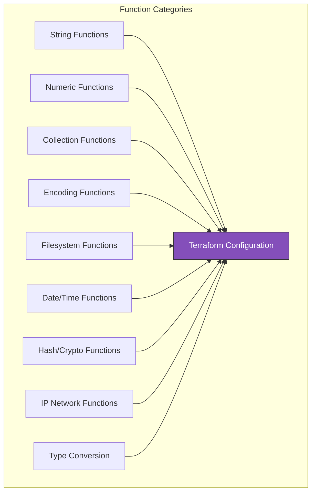

# Terraform Functions Reference

A comprehensive reference for all built-in Terraform functions, organized by category.

> [!NOTE]
> **Learning Goal**: Master Terraform's built-in functions to write more powerful and flexible configurations.

---

## Functions Overview



---

## String Functions

### format

Printf-style string formatting:

```hcl
# Basic formatting
format("Hello, %s!", "World")
# "Hello, World!"

# With numbers
format("Server %s: port %d", "web", 8080)
# "Server web: port 8080"

# Zero-padded numbers
format("instance-%03d", 5)
# "instance-005"

# Width specification
format("%-10s: %s", "Name", "value")
# "Name      : value"
```

| Verb | Description |
|------|-------------|
| `%s` | String |
| `%d` | Integer (base 10) |
| `%f` | Float |
| `%t` | Boolean |
| `%v` | Default format |
| `%q` | Quoted string |

### formatlist

Apply format to each list element:

```hcl
formatlist("https://%s:%d", ["server1", "server2"], [8080, 8081])
# ["https://server1:8080", "https://server2:8081"]

# With single value repeated
formatlist("%s-instance", ["web", "api", "db"])
# ["web-instance", "api-instance", "db-instance"]
```

### join

Concatenate list elements with separator:

```hcl
join(", ", ["a", "b", "c"])
# "a, b, c"

join("-", ["prod", "us", "east", "1"])
# "prod-us-east-1"

# Common use: Security group rule CIDR blocks
join(",", var.allowed_cidrs)
```

### split

Split string into list:

```hcl
split(",", "a,b,c")
# ["a", "b", "c"]

split("/", "arn:aws:s3:::bucket/key")
# ["arn:aws:s3:::bucket", "key"]

# Extract domain from URL
split("//", "https://example.com")[1]
# "example.com"
```

### lower / upper / title

Case conversion:

```hcl
lower("HELLO WORLD")
# "hello world"

upper("hello world")
# "HELLO WORLD"

title("hello world")
# "Hello World"

# Common use: Normalize environment names
lower(var.environment)
```

### replace

Replace substrings:

```hcl
replace("hello world", "world", "terraform")
# "hello terraform"

# With regex (use $$ to escape)
replace("hello-world-123", "-", "_")
# "hello_world_123"

# Remove characters
replace("my bucket name", " ", "")
# "mybucketname"
```

### substr

Extract substring:

```hcl
substr("hello world", 0, 5)
# "hello"

substr("hello world", 6, -1)  # -1 = to end
# "world"

# Truncate long names
substr(var.name, 0, min(length(var.name), 32))
```

### trim / trimprefix / trimsuffix / trimspace

Remove characters:

```hcl
trim("  hello  ", " ")
# "hello"

trimspace("  hello world  ")
# "hello world"

trimprefix("helloworld", "hello")
# "world"

trimsuffix("helloworld", "world")
# "hello"

trimprefix("arn:aws:s3:::bucket", "arn:aws:s3:::")
# "bucket"
```

### regex / regexall

Regular expression matching:

```hcl
# Extract first match
regex("[a-z]+", "hello123world")
# "hello"

# Extract all matches
regexall("[a-z]+", "hello123world")
# ["hello", "world"]

# Capture groups
regex("^([a-z]+)-([0-9]+)$", "server-001")
# ["server", "001"]

# Named capture groups
regex("(?P<name>[a-z]+)-(?P<num>[0-9]+)", "server-001")
# { name = "server", num = "001" }
```

### startswith / endswith

Check string prefixes/suffixes:

```hcl
startswith("hello world", "hello")
# true

endswith("hello world", "world")
# true

# Common use: Conditional logic
startswith(var.environment, "prod") ? "large" : "small"
```

### strrev

Reverse a string:

```hcl
strrev("hello")
# "olleh"
```

### indent / chomp

Whitespace manipulation:

```hcl
# Add indentation
indent(2, "line1\nline2\nline3")
# "  line1\n  line2\n  line3"

# Remove trailing newlines
chomp("hello\n\n")
# "hello"
```

---

## Numeric Functions

### abs

Absolute value:

```hcl
abs(-5)
# 5

abs(5)
# 5
```

### ceil / floor

Rounding:

```hcl
ceil(4.1)
# 5

floor(4.9)
# 4

# Calculate instances needed
ceil(var.total_capacity / var.capacity_per_instance)
```

### max / min

Find extremes:

```hcl
max(5, 12, 9)
# 12

min(5, 12, 9)
# 5

# With list (splat)
max(var.values...)

# Ensure minimum value
max(var.instance_count, 1)
```

### pow

Power:

```hcl
pow(2, 8)
# 256

pow(10, 3)
# 1000
```

### log

Logarithm:

```hcl
log(100, 10)
# 2

log(8, 2)
# 3
```

### signum

Sign of number:

```hcl
signum(-5)
# -1

signum(0)
# 0

signum(5)
# 1
```

### parseint

Parse string as integer:

```hcl
parseint("100", 10)
# 100

parseint("ff", 16)
# 255

parseint("1010", 2)
# 10
```

### sum

Sum of list:

```hcl
sum([1, 2, 3, 4, 5])
# 15

# Calculate total storage
sum([for vol in var.volumes : vol.size])
```

---

## Collection Functions

### length

Count elements:

```hcl
length(["a", "b", "c"])
# 3

length({ a = 1, b = 2 })
# 2

length("hello")
# 5
```

### element

Get element by index (wraps around):

```hcl
element(["a", "b", "c"], 0)
# "a"

element(["a", "b", "c"], 3)
# "a" (wraps around)

# Distribute across AZs
element(var.availability_zones, count.index)
```

### index

Find element index:

```hcl
index(["a", "b", "c"], "b")
# 1
```

### lookup

Get map value with default:

```hcl
lookup({ a = 1, b = 2 }, "a", 0)
# 1

lookup({ a = 1, b = 2 }, "c", 0)
# 0

# Environment-specific settings
lookup(var.instance_types, var.environment, "t3.micro")
```

### contains

Check for element:

```hcl
contains(["a", "b", "c"], "b")
# true

contains(["a", "b", "c"], "d")
# false

# Validation
contains(["dev", "staging", "prod"], var.environment)
```

### keys / values

Extract from map:

```hcl
keys({ a = 1, b = 2, c = 3 })
# ["a", "b", "c"]

values({ a = 1, b = 2, c = 3 })
# [1, 2, 3]
```

### merge

Combine maps:

```hcl
merge({ a = 1 }, { b = 2 })
# { a = 1, b = 2 }

# Later values override
merge({ a = 1 }, { a = 2 })
# { a = 2 }

# Common use: Tags
merge(local.common_tags, var.extra_tags, { Name = "web" })
```

### concat

Combine lists:

```hcl
concat(["a"], ["b"], ["c"])
# ["a", "b", "c"]

concat(var.public_subnets, var.private_subnets)
```

### flatten

Flatten nested lists:

```hcl
flatten([["a", "b"], ["c", "d"]])
# ["a", "b", "c", "d"]

flatten([[["a"]], [["b"]]])
# ["a", "b"]

# Flatten complex structures
flatten([for vpc in var.vpcs : vpc.subnets])
```

### distinct

Remove duplicates:

```hcl
distinct(["a", "b", "a", "c", "b"])
# ["a", "b", "c"]
```

### sort / reverse

Order lists:

```hcl
sort(["c", "a", "b"])
# ["a", "b", "c"]

reverse(["a", "b", "c"])
# ["c", "b", "a"]
```

### range

Generate number sequence:

```hcl
range(5)
# [0, 1, 2, 3, 4]

range(1, 5)
# [1, 2, 3, 4]

range(0, 10, 2)
# [0, 2, 4, 6, 8]
```

### slice

Extract list segment:

```hcl
slice(["a", "b", "c", "d", "e"], 1, 3)
# ["b", "c"]
```

### chunklist

Split into chunks:

```hcl
chunklist(["a", "b", "c", "d", "e"], 2)
# [["a", "b"], ["c", "d"], ["e"]]
```

### coalesce / coalescelist

First non-null/non-empty:

```hcl
coalesce(null, "", "default")
# "default"

coalesce(var.custom_ami, data.aws_ami.default.id)

coalescelist(var.custom_subnets, data.aws_subnets.default.ids)
```

### compact

Remove empty strings:

```hcl
compact(["a", "", "b", "", "c"])
# ["a", "b", "c"]
```

### zipmap

Create map from lists:

```hcl
zipmap(["a", "b", "c"], [1, 2, 3])
# { a = 1, b = 2, c = 3 }

# Create instance name->ID mapping
zipmap(
  aws_instance.web[*].tags.Name,
  aws_instance.web[*].id
)
```

### one

Get single element or null:

```hcl
one([])
# null

one(["a"])
# "a"

# Error if more than one element
# one(["a", "b"])  # Error!

# Common use: Optional resources
one(aws_eip.web[*].public_ip)
```

### alltrue / anytrue

Boolean aggregation:

```hcl
alltrue([true, true, true])
# true

alltrue([true, false, true])
# false

anytrue([false, false, true])
# true

# Validation
alltrue([for sg in var.security_groups : startswith(sg, "sg-")])
```

### setproduct

Cartesian product:

```hcl
setproduct(["a", "b"], [1, 2])
# [["a", 1], ["a", 2], ["b", 1], ["b", 2]]

# Create all AZ + subnet tier combinations
setproduct(var.azs, ["public", "private"])
```

### setunion / setintersection / setsubtract

Set operations:

```hcl
setunion(["a", "b"], ["b", "c"])
# ["a", "b", "c"]

setintersection(["a", "b", "c"], ["b", "c", "d"])
# ["b", "c"]

setsubtract(["a", "b", "c"], ["b"])
# ["a", "c"]
```

### transpose

Transpose map of lists:

```hcl
transpose({ a = ["1", "2"], b = ["2", "3"] })
# { "1" = ["a"], "2" = ["a", "b"], "3" = ["b"] }
```

### matchkeys

Filter by matching keys:

```hcl
matchkeys(
  ["i-123", "i-456", "i-789"],
  ["us-east-1a", "us-east-1b", "us-east-1a"],
  ["us-east-1a"]
)
# ["i-123", "i-789"]
```

---

## Encoding Functions

### jsonencode / jsondecode

JSON conversion:

```hcl
jsonencode({
  name = "server"
  port = 8080
})
# "{\"name\":\"server\",\"port\":8080}"

jsondecode("{\"name\":\"server\",\"port\":8080}")
# { name = "server", port = 8080 }

# IAM policy
resource "aws_iam_policy" "example" {
  policy = jsonencode({
    Version = "2012-10-17"
    Statement = [{
      Effect   = "Allow"
      Action   = "s3:GetObject"
      Resource = "*"
    }]
  })
}
```

### yamlencode / yamldecode

YAML conversion:

```hcl
yamlencode({
  apiVersion = "v1"
  kind       = "ConfigMap"
  metadata = {
    name = "config"
  }
})

yamldecode(file("${path.module}/config.yaml"))
```

### base64encode / base64decode

Base64 encoding:

```hcl
base64encode("hello")
# "aGVsbG8="

base64decode("aGVsbG8=")
# "hello"

# User data for EC2
resource "aws_instance" "web" {
  user_data = base64encode(<<-EOF
    #!/bin/bash
    echo "Hello World"
  EOF
  )
}
```

### base64gzip

Compress and encode:

```hcl
base64gzip(file("${path.module}/script.sh"))
# Compressed and base64 encoded
```

### urlencode

URL encoding:

```hcl
urlencode("hello world")
# "hello%20world"
```

### csvdecode

Parse CSV:

```hcl
csvdecode(file("${path.module}/users.csv"))
# [{ name = "alice", role = "admin" }, ...]

# CSV file:
# name,role
# alice,admin
# bob,user
```

### textdecodebase64 / textencodebase64

Base64 with character encoding:

```hcl
textencodebase64("hello", "UTF-8")
textdecodebase64("aGVsbG8=", "UTF-8")
```

---

## Filesystem Functions

### file

Read file content:

```hcl
file("${path.module}/scripts/init.sh")

# SSH public key
resource "aws_key_pair" "deployer" {
  public_key = file("~/.ssh/id_rsa.pub")
}
```

### fileexists

Check file existence:

```hcl
fileexists("${path.module}/optional.conf")
# true or false

# Conditional file loading
locals {
  config = fileexists("${path.module}/custom.conf") ? 
           file("${path.module}/custom.conf") : 
           file("${path.module}/default.conf")
}
```

### fileset

Find files matching pattern:

```hcl
fileset("${path.module}/configs", "*.json")
# ["app.json", "db.json"]

fileset("${path.module}", "**/*.tf")
# All .tf files recursively

# Upload all files to S3
resource "aws_s3_object" "configs" {
  for_each = fileset("${path.module}/configs", "*")
  
  bucket = aws_s3_bucket.config.id
  key    = each.value
  source = "${path.module}/configs/${each.value}"
}
```

### filebase64

Read file as base64:

```hcl
filebase64("${path.module}/image.png")
```

### templatefile

Render template:

```hcl
templatefile("${path.module}/user-data.tpl", {
  hostname    = var.hostname
  environment = var.environment
  packages    = ["nginx", "docker"]
})
```

**Template file (user-data.tpl):**

```bash
#!/bin/bash
hostnamectl set-hostname ${hostname}
echo "Environment: ${environment}"

%{ for pkg in packages ~}
yum install -y ${pkg}
%{ endfor ~}
```

### abspath / dirname / basename

Path manipulation:

```hcl
abspath("./modules/vpc")
# "/full/path/to/modules/vpc"

dirname("/path/to/file.tf")
# "/path/to"

basename("/path/to/file.tf")
# "file.tf"
```

### pathexpand

Expand ~ to home:

```hcl
pathexpand("~/.ssh/id_rsa")
# "/Users/username/.ssh/id_rsa"
```

---

## Date and Time Functions

### timestamp

Current UTC time:

```hcl
timestamp()
# "2024-01-15T10:30:00Z"

# Common use: Tags
tags = {
  CreatedAt = timestamp()
}
```

### formatdate

Format timestamp:

```hcl
formatdate("YYYY-MM-DD", timestamp())
# "2024-01-15"

formatdate("DD MMM YYYY hh:mm", timestamp())
# "15 Jan 2024 10:30"

formatdate("EEEE", timestamp())
# "Monday"
```

| Specifier | Description |
|-----------|-------------|
| `YYYY` | 4-digit year |
| `YY` | 2-digit year |
| `MM` | Zero-padded month |
| `DD` | Zero-padded day |
| `hh` | Zero-padded hour (24h) |
| `mm` | Zero-padded minute |
| `ss` | Zero-padded second |
| `EEEE` | Full weekday name |
| `EEE` | Abbreviated weekday |

### timeadd

Add duration to timestamp:

```hcl
timeadd(timestamp(), "24h")
# Tomorrow

timeadd("2024-01-15T10:00:00Z", "1h30m")
# "2024-01-15T11:30:00Z"

# Certificate expiry
timeadd(timestamp(), "8760h")  # 1 year
```

### timecmp

Compare timestamps:

```hcl
timecmp("2024-01-01T00:00:00Z", "2024-06-01T00:00:00Z")
# -1 (first is earlier)

timecmp("2024-06-01T00:00:00Z", "2024-01-01T00:00:00Z")
# 1 (first is later)

timecmp("2024-01-01T00:00:00Z", "2024-01-01T00:00:00Z")
# 0 (equal)
```

---

## Hash and Crypto Functions

### md5 / sha1 / sha256 / sha512

Hash strings:

```hcl
md5("hello")
# "5d41402abc4b2a76b9719d911017c592"

sha256("hello")
# "2cf24dba5fb0a30e26e83b2ac5b9e29e1b161e5c1fa7425e..."

# Common use: Resource naming
resource "aws_s3_bucket" "data" {
  bucket = "data-${md5(var.project)}"
}
```

### filemd5 / filesha256 / filesha512

Hash file contents:

```hcl
filemd5("${path.module}/script.sh")

# Trigger updates on file change
resource "aws_lambda_function" "main" {
  source_code_hash = filebase64sha256("${path.module}/lambda.zip")
}
```

### base64sha256 / base64sha512

Hash and base64 encode:

```hcl
base64sha256("hello")
```

### bcrypt

Hash password:

```hcl
bcrypt("password")
# bcrypt hash (different each time)

bcrypt("password", 10)  # Cost factor
```

### uuid / uuidv5

Generate UUIDs:

```hcl
uuid()
# "b5ee72a3-54dd-c4b8-551c-4bdc0204cedb"

uuidv5("dns", "example.com")
# Deterministic UUID for same inputs

# Caution: uuid() generates new value each run!
# Use with ignore_changes or in locals
```

### rsadecrypt

Decrypt RSA-encrypted content:

```hcl
rsadecrypt(filebase64("${path.module}/secret.enc"), file("${path.module}/private.pem"))
```

---

## IP Network Functions

### cidrhost

Get IP address from CIDR:

```hcl
cidrhost("10.0.0.0/16", 5)
# "10.0.0.5"

cidrhost("10.0.0.0/16", 256)
# "10.0.1.0"

# Assign specific IPs
resource "aws_network_interface" "web" {
  private_ips = [cidrhost(var.subnet_cidr, 10)]
}
```

### cidrnetmask

Get netmask from CIDR:

```hcl
cidrnetmask("10.0.0.0/16")
# "255.255.0.0"

cidrnetmask("10.0.0.0/24")
# "255.255.255.0"
```

### cidrsubnet

Calculate subnet CIDR:

```hcl
# cidrsubnet(prefix, newbits, netnum)
cidrsubnet("10.0.0.0/16", 8, 0)
# "10.0.0.0/24"

cidrsubnet("10.0.0.0/16", 8, 1)
# "10.0.1.0/24"

cidrsubnet("10.0.0.0/16", 8, 255)
# "10.0.255.0/24"

# Create subnets
resource "aws_subnet" "private" {
  count      = 3
  cidr_block = cidrsubnet(var.vpc_cidr, 8, count.index)
}
```

### cidrsubnets

Calculate multiple subnets:

```hcl
cidrsubnets("10.0.0.0/16", 8, 8, 8, 8)
# ["10.0.0.0/24", "10.0.1.0/24", "10.0.2.0/24", "10.0.3.0/24"]

# Different sizes
cidrsubnets("10.0.0.0/16", 8, 8, 4)
# ["10.0.0.0/24", "10.0.1.0/24", "10.0.16.0/20"]

# Named subnets
locals {
  subnet_cidrs = cidrsubnets(var.vpc_cidr, 8, 8, 8, 8, 8, 8)
  subnets = {
    public-1  = local.subnet_cidrs[0]
    public-2  = local.subnet_cidrs[1]
    private-1 = local.subnet_cidrs[2]
    private-2 = local.subnet_cidrs[3]
    data-1    = local.subnet_cidrs[4]
    data-2    = local.subnet_cidrs[5]
  }
}
```

### cidrcontains (Terraform 1.7+)

Check if CIDR contains address:

```hcl
cidrcontains("10.0.0.0/16", "10.0.1.50")
# true

cidrcontains("10.0.0.0/16", "192.168.1.1")
# false
```

---

## Type Conversion Functions

### tostring / tonumber / tobool

Primitive conversion:

```hcl
tostring(42)
# "42"

tonumber("42")
# 42

tobool("true")
# true
```

### tolist / toset / tomap

Collection conversion:

```hcl
tolist(["a", "b", "a"])
# ["a", "b", "a"]

toset(["a", "b", "a"])
# ["a", "b"] (unique, unordered)

tomap({ a = 1, b = 2 })
# { a = 1, b = 2 }
```

### try

Return first non-error:

```hcl
try(var.config.server.port, 80)
# Returns port if exists, else 80

try(
  var.custom_ami,
  data.aws_ami.default.id,
  "ami-12345678"
)

# Access nested values safely
try(var.settings.database.connection.timeout, 30)
```

### can

Check if expression is valid:

```hcl
can(regex("^[a-z]+$", var.name))
# true if matches, false if error

# Validation
variable "instance_type" {
  validation {
    condition     = can(regex("^t[23]\\.", var.instance_type))
    error_message = "Must be t2 or t3 family."
  }
}
```

### sensitive / nonsensitive

Sensitivity markers:

```hcl
# Mark as sensitive
sensitive(local.api_key)

# Remove sensitivity (use carefully!)
nonsensitive(data.aws_secretsmanager_secret_version.db.secret_string)
```

### type

Get expression type:

```hcl
type("hello")
# string

type(42)
# number

type(["a", "b"])
# tuple
```

---

## Best Practices

### Use Locals for Complex Expressions

```hcl
locals {
  # Compute once, use many times
  subnet_cidrs = cidrsubnets(var.vpc_cidr, 8, 8, 8)
  
  # Complex transformation
  instance_map = {
    for instance in var.instances :
    instance.name => {
      type     = instance.type
      az       = element(var.availability_zones, index(var.instances, instance))
      dns_name = lower("${instance.name}.${var.domain}")
    }
  }
}
```

### Combine Functions for Power

```hcl
# Generate unique bucket name
locals {
  bucket_name = lower(join("-", [
    var.project,
    var.environment,
    substr(md5(data.aws_caller_identity.current.account_id), 0, 8)
  ]))
}

# Parse and transform
locals {
  config = yamldecode(file("${path.module}/config.yaml"))
  
  enabled_features = [
    for feature, settings in local.config.features :
    feature if try(settings.enabled, false)
  ]
}
```

### Use try() for Optional Values

```hcl
locals {
  # Safe access with defaults
  port     = try(var.config.server.port, 8080)
  timeout  = try(var.config.server.timeout, 30)
  features = try(var.config.features, [])
  
  # Nested optional access
  db_host = try(
    var.config.database.primary.host,
    var.config.database.host,
    "localhost"
  )
}
```

---

## Quick Reference Table

| Category | Common Functions |
|----------|------------------|
| **String** | `format`, `join`, `split`, `replace`, `lower`, `upper`, `trimspace` |
| **Numeric** | `max`, `min`, `ceil`, `floor`, `abs`, `sum` |
| **Collection** | `length`, `merge`, `concat`, `flatten`, `lookup`, `contains`, `keys`, `values` |
| **Encoding** | `jsonencode`, `yamlencode`, `base64encode`, `urlencode` |
| **Filesystem** | `file`, `fileexists`, `fileset`, `templatefile`, `abspath` |
| **Date/Time** | `timestamp`, `formatdate`, `timeadd` |
| **Hash** | `md5`, `sha256`, `uuid`, `filesha256` |
| **IP Network** | `cidrsubnet`, `cidrsubnets`, `cidrhost`, `cidrnetmask` |
| **Type** | `tostring`, `tolist`, `toset`, `tomap`, `try`, `can` |

---

## Next Steps

Continue to **[14_security_best_practices.md](./14_security_best_practices.md)** to learn about securing your Terraform deployments with secrets management, least-privilege IAM, and policy-as-code.

**→ [14_security_best_practices.md](./14_security_best_practices.md)**
