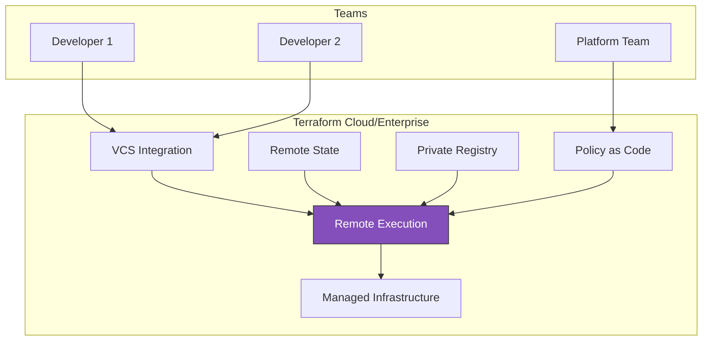
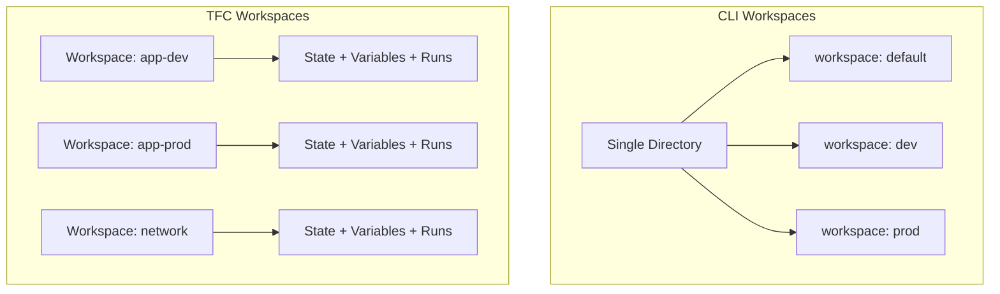
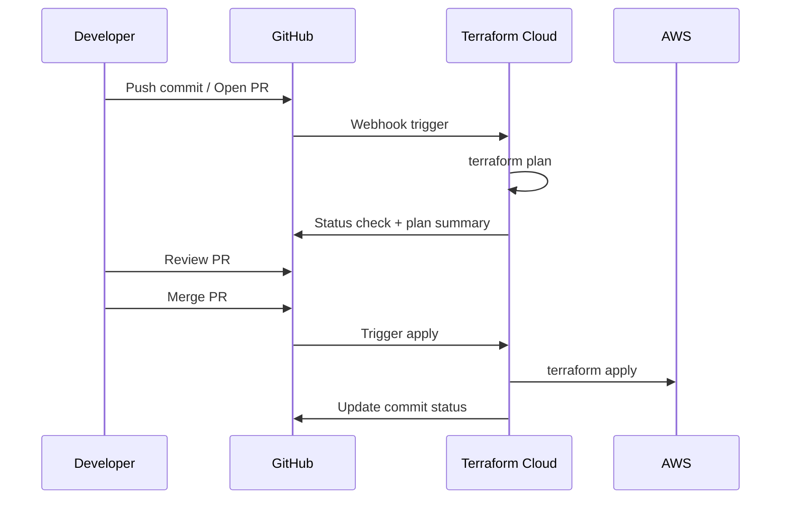
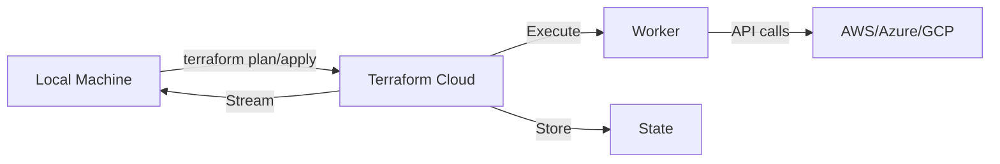
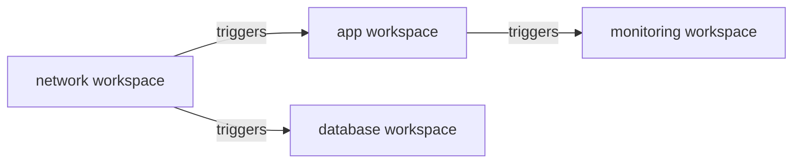
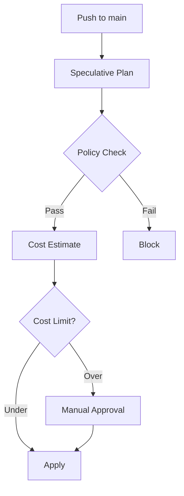

# Terraform Cloud & Enterprise

Scale Terraform for teams with collaboration features, governance, and remote execution.

> [!NOTE]
> **Learning Goal**: Understand Terraform Cloud/Enterprise features for team workflows, remote state, and policy enforcement.

---

## Overview



| Feature | CLI | Terraform Cloud | Terraform Enterprise |
|---------|-----|-----------------|---------------------|
| **Hosting** | Local | HashiCorp SaaS | Self-hosted |
| **State Storage** | Local/Remote | Managed | Self-managed |
| **Remote Execution** | ❌ | ✅ | ✅ |
| **VCS Integration** | ❌ | ✅ | ✅ |
| **Private Registry** | ❌ | ✅ | ✅ |
| **Sentinel Policies** | ❌ | Paid | ✅ |
| **Audit Logging** | ❌ | Paid | ✅ |
| **SSO/SAML** | ❌ | Paid | ✅ |
| **Cost** | Free | Free tier + Paid | License |

---

## Getting Started with Terraform Cloud

### Sign Up

1. Go to [app.terraform.io](https://app.terraform.io)
2. Create account
3. Create organization

### Configure CLI

```bash
terraform login

# Opens browser for authentication
# Token saved to ~/.terraform.d/credentials.tfrc.json
```

### Connect to Workspace

```hcl
# versions.tf
terraform {
  cloud {
    organization = "my-organization"
    
    workspaces {
      name = "my-workspace"
    }
  }
}
```

```bash
terraform init
# Initializes with Terraform Cloud backend
```

---

## Workspaces in Terraform Cloud

> [!IMPORTANT]
> **Terraform Cloud workspaces are different from CLI workspaces!** Each TFC workspace has its own state, variables, and run history.



### Workspace Types

| Workflow | Description | Best For |
|----------|-------------|----------|
| **VCS-driven** | Auto-trigger on Git push | GitOps, team workflows |
| **CLI-driven** | `terraform apply` from local | Development, migrations |
| **API-driven** | Programmatic via API | CI/CD pipelines |

### Create Workspace (VCS-driven)

```hcl
# Using Terraform to manage TFC workspaces
resource "tfe_workspace" "app" {
  name         = "app-production"
  organization = "my-org"
  
  # VCS settings
  vcs_repo {
    identifier     = "myorg/terraform-app"
    branch         = "main"
    oauth_token_id = var.oauth_token_id
  }
  
  # Working directory
  working_directory = "environments/production"
  
  # Execution mode
  execution_mode = "remote"
  
  # Auto-apply on successful plan
  auto_apply = false
  
  # Queue all runs (vs only latest)
  queue_all_runs = true
  
  # Terraform version
  terraform_version = "~> 1.6.0"
  
  # Tags for organization
  tag_names = ["production", "app"]
}
```

### Dynamic Workspace Selection

```hcl
terraform {
  cloud {
    organization = "my-org"
    
    workspaces {
      # Pattern matching
      tags = ["app", "production"]
    }
  }
}
```

---

## Variables in Terraform Cloud

### Variable Types

| Type | Description | Use Case |
|------|-------------|----------|
| **Terraform** | Input variables | `var.environment` |
| **Environment** | Shell variables | `AWS_ACCESS_KEY_ID` |

### Set Variables (UI)

1. Workspace → Variables
2. Add Variable
3. Mark sensitive if needed

### Set Variables (Terraform)

```hcl
resource "tfe_variable" "environment" {
  workspace_id = tfe_workspace.app.id
  key          = "environment"
  value        = "production"
  category     = "terraform"
  description  = "Deployment environment"
}

resource "tfe_variable" "aws_secret" {
  workspace_id = tfe_workspace.app.id
  key          = "AWS_SECRET_ACCESS_KEY"
  value        = var.aws_secret  # From secure source
  category     = "env"
  sensitive    = true
}
```

### Variable Sets

Share variables across workspaces:

```hcl
resource "tfe_variable_set" "common" {
  name         = "Common AWS Settings"
  description  = "Shared across all AWS workspaces"
  organization = "my-org"
}

resource "tfe_variable_set_variable" "region" {
  variable_set_id = tfe_variable_set.common.id
  key             = "aws_region"
  value           = "us-east-1"
  category        = "terraform"
}

# Attach to workspaces
resource "tfe_workspace_variable_set" "app" {
  workspace_id    = tfe_workspace.app.id
  variable_set_id = tfe_variable_set.common.id
}
```

---

## VCS Integration

### Supported Providers

- GitHub / GitHub Enterprise
- GitLab / GitLab EE
- Bitbucket Cloud / Server
- Azure DevOps

### Workflow



### Configure VCS Connection

```hcl
# OAuth connection (one per org)
resource "tfe_oauth_client" "github" {
  organization     = "my-org"
  api_url          = "https://api.github.com"
  http_url         = "https://github.com"
  oauth_token      = var.github_token
  service_provider = "github"
}

# Workspace with VCS
resource "tfe_workspace" "app" {
  name         = "app-production"
  organization = "my-org"
  
  vcs_repo {
    identifier     = "myorg/terraform-app"
    branch         = "main"
    oauth_token_id = tfe_oauth_client.github.oauth_token_id
  }
}
```

---

## Remote Execution

### How It Works



### Execution Modes

| Mode | Plan | Apply | State |
|------|------|-------|-------|
| **Remote** | TFC | TFC | TFC |
| **Local** | Local | Local | TFC |
| **Agent** | Agent | Agent | TFC |

### Agent Pools (Enterprise)

Run Terraform in your own network:

```hcl
resource "tfe_agent_pool" "private" {
  name         = "private-network"
  organization = "my-org"
}

resource "tfe_workspace" "internal" {
  name           = "internal-app"
  organization   = "my-org"
  execution_mode = "agent"
  agent_pool_id  = tfe_agent_pool.private.id
}
```

---

## Private Module Registry

### Publishing Modules

```hcl
# Module structure
module-name/
├── main.tf
├── variables.tf
├── outputs.tf
├── versions.tf
└── README.md
```

### Using Private Modules

```hcl
module "vpc" {
  source  = "app.terraform.io/my-org/vpc/aws"
  version = "1.0.0"
  
  name       = "production"
  cidr_block = "10.0.0.0/16"
}
```

### Module Versioning

```hcl
resource "tfe_registry_module" "vpc" {
  organization = "my-org"
  
  vcs_repo {
    display_identifier = "myorg/terraform-aws-vpc"
    identifier         = "myorg/terraform-aws-vpc"
    oauth_token_id     = tfe_oauth_client.github.oauth_token_id
  }
}

# Tag-based versioning
# v1.0.0, v1.1.0, v2.0.0 → module versions
```

---

## Run Triggers

Chain workspace runs:



```hcl
resource "tfe_run_trigger" "app" {
  workspace_id  = tfe_workspace.app.id
  sourceable_id = tfe_workspace.network.id
}

# When network workspace has successful apply,
# app workspace automatically queues a run
```

---

## Sentinel Policies

### Policy Structure

```hcl
# policies/require-tags.sentinel

import "tfplan/v2" as tfplan

# Required tags
required_tags = ["Environment", "Owner", "CostCenter"]

# Get all resources that will be created or updated
allResources = filter tfplan.resource_changes as _, rc {
    rc.mode is "managed" and
    (rc.change.actions contains "create" or 
     rc.change.actions contains "update")
}

# Find resources missing required tags
violatingResources = filter allResources as _, r {
    tags = r.change.after.tags else {}
    missing_tags = filter required_tags as t {
        not (t in keys(tags))
    }
    length(missing_tags) > 0
}

# Main rule
main = rule {
    length(violatingResources) is 0
}
```

### Enforcement Levels

| Level | Behavior |
|-------|----------|
| **advisory** | Warn but allow |
| **soft-mandatory** | Block, but can override |
| **hard-mandatory** | Block, no override |

### Policy Sets

```hcl
resource "tfe_policy_set" "security" {
  name         = "security-policies"
  description  = "Security compliance policies"
  organization = "my-org"
  
  # Apply to all workspaces
  global = false
  
  # Or specific workspaces
  workspace_ids = [
    tfe_workspace.production.id
  ]
  
  vcs_repo {
    identifier         = "myorg/terraform-policies"
    branch             = "main"
    oauth_token_id     = tfe_oauth_client.github.oauth_token_id
    ingress_submodules = false
  }
  
  policies_path = "policies"
}
```

### Sentinel Testing

```bash
# sentinel.hcl
policy "require-tags" {
  source            = "./require-tags.sentinel"
  enforcement_level = "hard-mandatory"
}

# Test
sentinel test require-tags.sentinel
```

---

## Cost Estimation

Terraform Cloud estimates costs before apply:

```
Cost Estimation:

Resources: 3 of 3 estimated
           $100.00/mo +$50.00

┌────────────────────────────────────┬───────────────┬─────────────┐
│ Name                               │ Monthly       │ Change      │
├────────────────────────────────────┼───────────────┼─────────────┤
│ aws_instance.web                   │ $50.00        │ +$50.00     │
│ aws_db_instance.main               │ $50.00        │ -           │
│ aws_s3_bucket.data                 │ $0.00         │ -           │
└────────────────────────────────────┴───────────────┴─────────────┘
```

### Enable Cost Estimation

1. Organization Settings → Cost Estimation
2. Enable for workspaces

### Cost Policies

```hcl
# policies/cost-limit.sentinel

import "tfrun"
import "decimal"

# Maximum allowed cost increase
max_monthly_increase = 500.00

# Get cost change
cost_change = decimal.new(tfrun.cost_estimate.delta_monthly_cost)
max_increase = decimal.new(max_monthly_increase)

# Main rule
main = rule {
    cost_change.lte(max_increase)
}
```

---

## Team Management

### Team Structure

```hcl
resource "tfe_team" "platform" {
  name         = "platform"
  organization = "my-org"
  
  organization_access {
    manage_workspaces = true
    manage_modules    = true
    manage_policies   = false
  }
}

resource "tfe_team" "developers" {
  name         = "developers"
  organization = "my-org"
}
```

### Workspace Permissions

| Permission | Plan | Apply | Variables | State |
|------------|------|-------|-----------|-------|
| **read** | ✅ | ❌ | ❌ | ❌ |
| **plan** | ✅ | ❌ | ✅ | ❌ |
| **write** | ✅ | ✅ | ✅ | ✅ |
| **admin** | ✅ | ✅ | ✅ | ✅ + Settings |

```hcl
resource "tfe_team_access" "platform_admin" {
  access       = "admin"
  team_id      = tfe_team.platform.id
  workspace_id = tfe_workspace.production.id
}

resource "tfe_team_access" "developers_plan" {
  access       = "plan"
  team_id      = tfe_team.developers.id
  workspace_id = tfe_workspace.production.id
}
```

---

## API-Driven Workflow

### Trigger Runs via API

```bash
# Create run
curl \
  --header "Authorization: Bearer $TFE_TOKEN" \
  --header "Content-Type: application/vnd.api+json" \
  --request POST \
  --data @payload.json \
  https://app.terraform.io/api/v2/runs
```

**payload.json:**

```json
{
  "data": {
    "type": "runs",
    "attributes": {
      "message": "Triggered via API",
      "auto-apply": false
    },
    "relationships": {
      "workspace": {
        "data": {
          "type": "workspaces",
          "id": "ws-abc123"
        }
      }
    }
  }
}
```

### Using TFE Provider

```hcl
provider "tfe" {
  # Token from TFE_TOKEN env var
}

# Trigger run
resource "tfe_run_trigger" "deploy" {
  workspace_id  = data.tfe_workspace.target.id
  sourceable_id = data.tfe_workspace.source.id
}
```

---

## Migration to Terraform Cloud

### From Local State

```hcl
# 1. Add cloud block
terraform {
  cloud {
    organization = "my-org"
    workspaces {
      name = "my-workspace"
    }
  }
}

# 2. Initialize
terraform init

# Terraform will ask to migrate state
# Type "yes" to confirm
```

### From S3 Backend

```hcl
# 1. Comment out S3 backend
# terraform {
#   backend "s3" { ... }
# }

# 2. Add cloud block
terraform {
  cloud {
    organization = "my-org"
    workspaces {
      name = "my-workspace"
    }
  }
}

# 3. Initialize with migration
terraform init -migrate-state
```

---

## Best Practices

### Workspace Organization

```
Organization: acme-corp
├── Workspaces:
│   ├── network-dev
│   ├── network-staging
│   ├── network-prod
│   ├── app-dev
│   ├── app-staging
│   ├── app-prod
│   └── platform-shared
├── Teams:
│   ├── platform-admins (full access)
│   ├── app-developers (write to dev, plan to staging/prod)
│   └── security (admin on policies)
└── Variable Sets:
    ├── aws-credentials
    ├── common-tags
    └── environment-defaults
```

### Run Pipelines



---

## Terraform Cloud vs Enterprise

| Feature | Cloud (Free) | Cloud (Team) | Cloud (Business) | Enterprise |
|---------|--------------|--------------|------------------|------------|
| Users | 5 | Unlimited | Unlimited | Unlimited |
| Remote Execution | ✅ | ✅ | ✅ | ✅ |
| Private Registry | ✅ | ✅ | ✅ | ✅ |
| Team Management | ❌ | ✅ | ✅ | ✅ |
| Sentinel Policies | ❌ | ❌ | ✅ | ✅ |
| Audit Logging | ❌ | ❌ | ✅ | ✅ |
| SSO | ❌ | ❌ | ✅ | ✅ |
| Self-Hosted Agents | ❌ | ❌ | ✅ | ✅ |
| Air-Gapped | ❌ | ❌ | ❌ | ✅ |
| Clustering | ❌ | ❌ | ❌ | ✅ |

---

## Next Steps

Continue to **[16_multi_cloud_patterns.md](./16_multi_cloud_patterns.md)** to learn about managing infrastructure across multiple cloud providers.

**→ [16_multi_cloud_patterns.md](./16_multi_cloud_patterns.md)**
