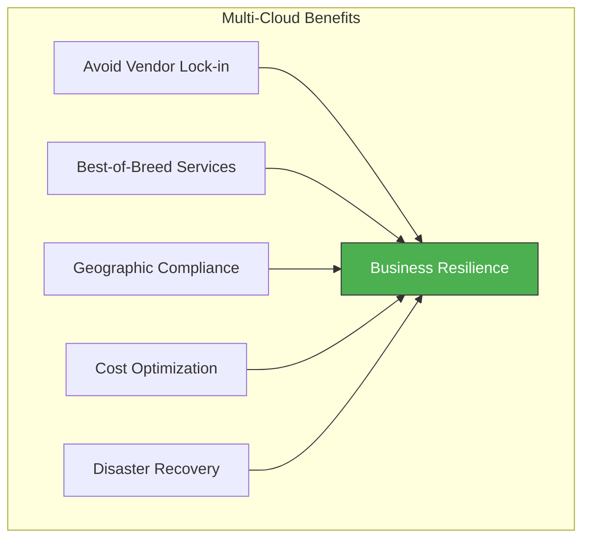
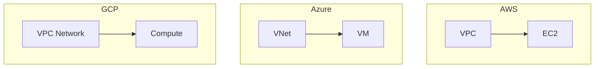
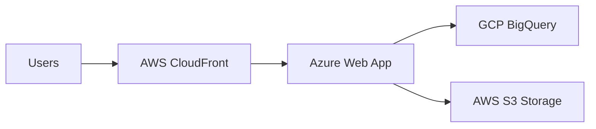
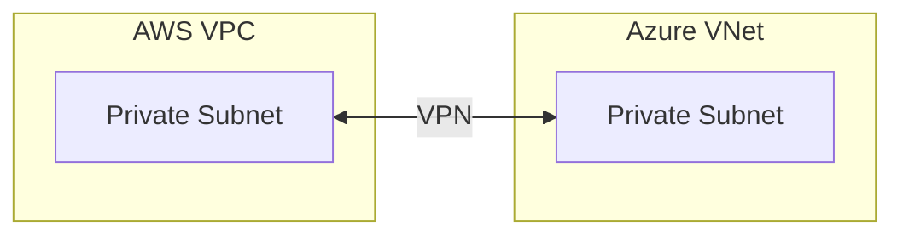
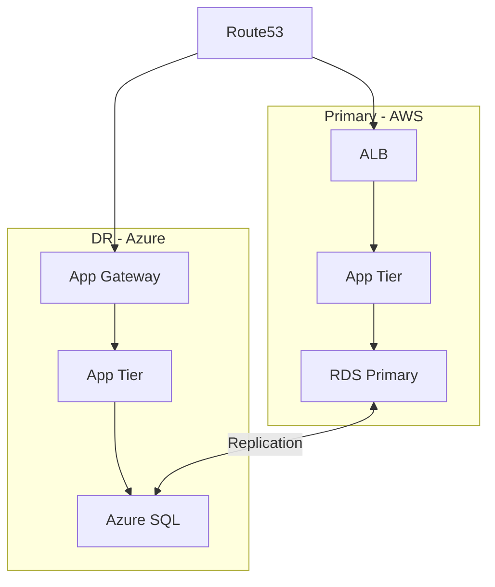

# Multi-Cloud Patterns

Managing infrastructure across AWS, Azure, GCP, and other providers from a single Terraform configuration.

> [!NOTE]
> **Learning Goal**: Master multi-provider configurations, cross-cloud patterns, and state organization for multi-cloud deployments.

---

## Why Multi-Cloud?



| Reason | Example |
|--------|---------|
| **Compliance** | Data residency requirements |
| **Best-of-Breed** | AWS Lambda + GCP BigQuery |
| **Acquisitions** | Inherited multi-cloud environments |
| **DR/HA** | Cross-cloud disaster recovery |
| **Cost** | Spot pricing arbitrage |

---

## Multi-Provider Configuration

### Basic Setup

```hcl
# versions.tf
terraform {
  required_version = ">= 1.6.0"
  
  required_providers {
    aws = {
      source  = "hashicorp/aws"
      version = "~> 5.0"
    }
    azurerm = {
      source  = "hashicorp/azurerm"
      version = "~> 3.0"
    }
    google = {
      source  = "hashicorp/google"
      version = "~> 5.0"
    }
  }
}

# providers.tf
provider "aws" {
  region = "us-east-1"
  
  default_tags {
    tags = {
      ManagedBy = "Terraform"
      Project   = var.project
    }
  }
}

provider "azurerm" {
  features {}
  
  subscription_id = var.azure_subscription_id
}

provider "google" {
  project = var.gcp_project_id
  region  = "us-central1"
}
```

### Multiple Regions/Accounts

```hcl
# AWS multi-region
provider "aws" {
  alias  = "us_east"
  region = "us-east-1"
}

provider "aws" {
  alias  = "eu_west"
  region = "eu-west-1"
}

provider "aws" {
  alias   = "production"
  region  = "us-east-1"
  profile = "prod-account"
}

# Use specific provider
resource "aws_vpc" "us" {
  provider   = aws.us_east
  cidr_block = "10.0.0.0/16"
}

resource "aws_vpc" "eu" {
  provider   = aws.eu_west
  cidr_block = "10.1.0.0/16"
}
```

---

## Cross-Cloud Patterns

### Pattern 1: Parallel Deployments

Deploy similar infrastructure across clouds:



```hcl
# AWS Compute
resource "aws_instance" "app" {
  ami           = data.aws_ami.amazon_linux.id
  instance_type = "t3.micro"
  
  tags = {
    Name  = "app-aws"
    Cloud = "aws"
  }
}

# Azure Compute
resource "azurerm_linux_virtual_machine" "app" {
  name                = "app-azure"
  resource_group_name = azurerm_resource_group.main.name
  location            = azurerm_resource_group.main.location
  size                = "Standard_B1s"
  admin_username      = "adminuser"
  
  network_interface_ids = [azurerm_network_interface.main.id]
  
  os_disk {
    caching              = "ReadWrite"
    storage_account_type = "Standard_LRS"
  }
  
  source_image_reference {
    publisher = "Canonical"
    offer     = "0001-com-ubuntu-server-jammy"
    sku       = "22_04-lts"
    version   = "latest"
  }
  
  admin_ssh_key {
    username   = "adminuser"
    public_key = file("~/.ssh/id_rsa.pub")
  }
  
  tags = {
    Cloud = "azure"
  }
}

# GCP Compute
resource "google_compute_instance" "app" {
  name         = "app-gcp"
  machine_type = "e2-micro"
  zone         = "us-central1-a"
  
  boot_disk {
    initialize_params {
      image = "debian-cloud/debian-11"
    }
  }
  
  network_interface {
    network = google_compute_network.main.id
  }
  
  labels = {
    cloud = "gcp"
  }
}
```

### Pattern 2: Best-of-Breed Services

Use each cloud's strengths:



```hcl
# Azure - Web Application (App Service)
resource "azurerm_linux_web_app" "main" {
  name                = "myapp-${var.environment}"
  resource_group_name = azurerm_resource_group.main.name
  location            = azurerm_resource_group.main.location
  service_plan_id     = azurerm_service_plan.main.id
  
  site_config {
    application_stack {
      node_version = "18-lts"
    }
  }
  
  app_settings = {
    GCP_BIGQUERY_PROJECT = var.gcp_project_id
    AWS_S3_BUCKET        = aws_s3_bucket.data.id
  }
}

# AWS - CDN (CloudFront)
resource "aws_cloudfront_distribution" "main" {
  origin {
    domain_name = azurerm_linux_web_app.main.default_hostname
    origin_id   = "azure-app"
    
    custom_origin_config {
      http_port              = 80
      https_port             = 443
      origin_protocol_policy = "https-only"
      origin_ssl_protocols   = ["TLSv1.2"]
    }
  }
  
  enabled             = true
  default_root_object = "index.html"
  
  default_cache_behavior {
    allowed_methods  = ["GET", "HEAD"]
    cached_methods   = ["GET", "HEAD"]
    target_origin_id = "azure-app"
    
    forwarded_values {
      query_string = false
      cookies {
        forward = "none"
      }
    }
    
    viewer_protocol_policy = "redirect-to-https"
  }
  
  restrictions {
    geo_restriction {
      restriction_type = "none"
    }
  }
  
  viewer_certificate {
    cloudfront_default_certificate = true
  }
}

# GCP - Analytics (BigQuery)
resource "google_bigquery_dataset" "analytics" {
  dataset_id = "analytics"
  location   = "US"
}

resource "google_bigquery_table" "events" {
  dataset_id = google_bigquery_dataset.analytics.dataset_id
  table_id   = "events"
  
  time_partitioning {
    type = "DAY"
  }
  
  schema = <<EOF
[
  {"name": "timestamp", "type": "TIMESTAMP", "mode": "REQUIRED"},
  {"name": "event_type", "type": "STRING", "mode": "REQUIRED"},
  {"name": "user_id", "type": "STRING", "mode": "NULLABLE"}
]
EOF
}

# AWS - Object Storage
resource "aws_s3_bucket" "data" {
  bucket = "myapp-data-${var.environment}"
}
```

### Pattern 3: Cross-Cloud Networking

VPN/Interconnect between clouds:



```hcl
# AWS VPN Gateway
resource "aws_vpn_gateway" "main" {
  vpc_id = aws_vpc.main.id
}

resource "aws_customer_gateway" "azure" {
  bgp_asn    = 65000
  ip_address = azurerm_public_ip.vpn.ip_address
  type       = "ipsec.1"
}

resource "aws_vpn_connection" "azure" {
  vpn_gateway_id      = aws_vpn_gateway.main.id
  customer_gateway_id = aws_customer_gateway.azure.id
  type                = "ipsec.1"
  static_routes_only  = true
}

# Azure Virtual Network Gateway
resource "azurerm_virtual_network_gateway" "main" {
  name                = "vpn-gateway"
  location            = azurerm_resource_group.main.location
  resource_group_name = azurerm_resource_group.main.name
  
  type     = "Vpn"
  vpn_type = "RouteBased"
  sku      = "VpnGw1"
  
  ip_configuration {
    name                 = "vnetGatewayConfig"
    public_ip_address_id = azurerm_public_ip.vpn.id
    subnet_id            = azurerm_subnet.gateway.id
  }
}

resource "azurerm_local_network_gateway" "aws" {
  name                = "aws-local-gateway"
  location            = azurerm_resource_group.main.location
  resource_group_name = azurerm_resource_group.main.name
  gateway_address     = aws_vpn_connection.azure.tunnel1_address
  address_space       = [aws_vpc.main.cidr_block]
}

resource "azurerm_virtual_network_gateway_connection" "aws" {
  name                       = "aws-connection"
  location                   = azurerm_resource_group.main.location
  resource_group_name        = azurerm_resource_group.main.name
  
  type                       = "IPsec"
  virtual_network_gateway_id = azurerm_virtual_network_gateway.main.id
  local_network_gateway_id   = azurerm_local_network_gateway.aws.id
  
  shared_key = aws_vpn_connection.azure.tunnel1_preshared_key
}
```

### Pattern 4: Active-Active DR



---

## State Organization

### Approach 1: Single State (Simple)

```hcl
# All providers in one state
terraform {
  backend "s3" {
    bucket = "terraform-state"
    key    = "multi-cloud/terraform.tfstate"
    region = "us-east-1"
  }
}
```

**Pros:** Simple, single apply  
**Cons:** Blast radius, single point of failure

### Approach 2: State Per Cloud (Recommended)

```
infrastructure/
├── aws/
│   ├── main.tf
│   ├── backend.tf  # S3 backend
│   └── outputs.tf
├── azure/
│   ├── main.tf
│   ├── backend.tf  # Azure Storage backend
│   └── outputs.tf
├── gcp/
│   ├── main.tf
│   ├── backend.tf  # GCS backend
│   └── outputs.tf
└── shared/
    ├── main.tf     # Cross-cloud resources
    └── data.tf     # Remote state references
```

```hcl
# shared/data.tf
data "terraform_remote_state" "aws" {
  backend = "s3"
  config = {
    bucket = "terraform-state"
    key    = "aws/terraform.tfstate"
    region = "us-east-1"
  }
}

data "terraform_remote_state" "azure" {
  backend = "azurerm"
  config = {
    resource_group_name  = "terraform-state-rg"
    storage_account_name = "tfstate"
    container_name       = "tfstate"
    key                  = "azure/terraform.tfstate"
  }
}

data "terraform_remote_state" "gcp" {
  backend = "gcs"
  config = {
    bucket = "terraform-state-bucket"
    prefix = "gcp"
  }
}

# Cross-cloud DNS
resource "aws_route53_record" "azure_app" {
  zone_id = data.terraform_remote_state.aws.outputs.route53_zone_id
  name    = "app"
  type    = "CNAME"
  ttl     = 300
  records = [data.terraform_remote_state.azure.outputs.app_hostname]
}
```

### Approach 3: Terragrunt

```
infrastructure/
├── terragrunt.hcl          # Root config
├── aws/
│   ├── vpc/
│   │   └── terragrunt.hcl
│   └── compute/
│       └── terragrunt.hcl
├── azure/
│   ├── vnet/
│   │   └── terragrunt.hcl
│   └── app-service/
│       └── terragrunt.hcl
└── gcp/
    ├── network/
    │   └── terragrunt.hcl
    └── bigquery/
        └── terragrunt.hcl
```

```hcl
# terragrunt.hcl (root)
remote_state {
  backend = "s3"
  config = {
    bucket         = "my-terraform-state"
    key            = "${path_relative_to_include()}/terraform.tfstate"
    region         = "us-east-1"
    encrypt        = true
    dynamodb_table = "terraform-locks"
  }
}

# aws/vpc/terragrunt.hcl
include "root" {
  path = find_in_parent_folders()
}

terraform {
  source = "../../modules//aws-vpc"
}

inputs = {
  vpc_cidr = "10.0.0.0/16"
  name     = "production"
}
```

---

## Kubernetes Multi-Cloud

### EKS + AKS + GKE

```hcl
# AWS EKS
provider "aws" {
  region = "us-east-1"
}

module "eks" {
  source  = "terraform-aws-modules/eks/aws"
  version = "19.0.0"
  
  cluster_name    = "app-eks"
  cluster_version = "1.28"
  
  vpc_id     = module.vpc.vpc_id
  subnet_ids = module.vpc.private_subnets
}

# Azure AKS
provider "azurerm" {
  features {}
}

resource "azurerm_kubernetes_cluster" "main" {
  name                = "app-aks"
  location            = azurerm_resource_group.main.location
  resource_group_name = azurerm_resource_group.main.name
  dns_prefix          = "app-aks"
  kubernetes_version  = "1.28"
  
  default_node_pool {
    name       = "default"
    node_count = 3
    vm_size    = "Standard_D2_v2"
  }
  
  identity {
    type = "SystemAssigned"
  }
}

# GCP GKE
provider "google" {
  project = var.gcp_project_id
  region  = "us-central1"
}

resource "google_container_cluster" "main" {
  name     = "app-gke"
  location = "us-central1"
  
  initial_node_count       = 1
  remove_default_node_pool = true
  
  workload_identity_config {
    workload_pool = "${var.gcp_project_id}.svc.id.goog"
  }
}

resource "google_container_node_pool" "main" {
  name       = "main-pool"
  location   = "us-central1"
  cluster    = google_container_cluster.main.name
  node_count = 3
  
  node_config {
    preemptible  = false
    machine_type = "e2-medium"
  }
}

# Configure Kubernetes providers for each cluster
data "aws_eks_cluster_auth" "main" {
  name = module.eks.cluster_name
}

provider "kubernetes" {
  alias                  = "eks"
  host                   = module.eks.cluster_endpoint
  cluster_ca_certificate = base64decode(module.eks.cluster_certificate_authority_data)
  token                  = data.aws_eks_cluster_auth.main.token
}

provider "kubernetes" {
  alias                  = "aks"
  host                   = azurerm_kubernetes_cluster.main.kube_config.0.host
  client_certificate     = base64decode(azurerm_kubernetes_cluster.main.kube_config.0.client_certificate)
  client_key             = base64decode(azurerm_kubernetes_cluster.main.kube_config.0.client_key)
  cluster_ca_certificate = base64decode(azurerm_kubernetes_cluster.main.kube_config.0.cluster_ca_certificate)
}

provider "kubernetes" {
  alias = "gke"
  host  = "https://${google_container_cluster.main.endpoint}"
  token = data.google_client_config.default.access_token
  cluster_ca_certificate = base64decode(
    google_container_cluster.main.master_auth[0].cluster_ca_certificate
  )
}
```

---

## DNS Across Clouds

### Route53 as Primary DNS

```hcl
# Central DNS in AWS Route53
resource "aws_route53_zone" "main" {
  name = "example.com"
}

# AWS services
resource "aws_route53_record" "aws_app" {
  zone_id = aws_route53_zone.main.zone_id
  name    = "aws.example.com"
  type    = "A"
  
  alias {
    name                   = aws_lb.main.dns_name
    zone_id                = aws_lb.main.zone_id
    evaluate_target_health = true
  }
}

# Azure services
resource "aws_route53_record" "azure_app" {
  zone_id = aws_route53_zone.main.zone_id
  name    = "azure.example.com"
  type    = "CNAME"
  ttl     = 300
  records = [azurerm_linux_web_app.main.default_hostname]
}

# GCP services
resource "aws_route53_record" "gcp_app" {
  zone_id = aws_route53_zone.main.zone_id
  name    = "gcp.example.com"
  type    = "A"
  ttl     = 300
  records = [google_compute_global_address.main.address]
}

# Health-based failover
resource "aws_route53_health_check" "aws" {
  fqdn              = "aws.example.com"
  port              = 443
  type              = "HTTPS"
  resource_path     = "/health"
  failure_threshold = 3
  request_interval  = 30
}

resource "aws_route53_record" "failover_primary" {
  zone_id = aws_route53_zone.main.zone_id
  name    = "app.example.com"
  type    = "CNAME"
  ttl     = 60
  
  failover_routing_policy {
    type = "PRIMARY"
  }
  
  set_identifier  = "primary"
  health_check_id = aws_route53_health_check.aws.id
  records         = ["aws.example.com"]
}

resource "aws_route53_record" "failover_secondary" {
  zone_id = aws_route53_zone.main.zone_id
  name    = "app.example.com"
  type    = "CNAME"
  ttl     = 60
  
  failover_routing_policy {
    type = "SECONDARY"
  }
  
  set_identifier = "secondary"
  records        = ["azure.example.com"]
}
```

---

## Abstraction with Modules

### Cloud-Agnostic Interface

```hcl
# modules/compute/variables.tf
variable "cloud" {
  type = string
  validation {
    condition     = contains(["aws", "azure", "gcp"], var.cloud)
    error_message = "Cloud must be aws, azure, or gcp."
  }
}

variable "name" {
  type = string
}

variable "size" {
  type = string
  description = "Size: small, medium, large"
}

# modules/compute/main.tf
locals {
  # Instance type mapping
  instance_types = {
    aws = {
      small  = "t3.micro"
      medium = "t3.small"
      large  = "t3.large"
    }
    azure = {
      small  = "Standard_B1s"
      medium = "Standard_B2s"
      large  = "Standard_D2s_v3"
    }
    gcp = {
      small  = "e2-micro"
      medium = "e2-small"
      large  = "e2-medium"
    }
  }
  
  instance_type = local.instance_types[var.cloud][var.size]
}

# AWS
resource "aws_instance" "main" {
  count         = var.cloud == "aws" ? 1 : 0
  ami           = data.aws_ami.amazon_linux[0].id
  instance_type = local.instance_type
  
  tags = {
    Name = var.name
  }
}

# Azure
resource "azurerm_linux_virtual_machine" "main" {
  count               = var.cloud == "azure" ? 1 : 0
  name                = var.name
  size                = local.instance_type
  # ... other config
}

# GCP
resource "google_compute_instance" "main" {
  count        = var.cloud == "gcp" ? 1 : 0
  name         = var.name
  machine_type = local.instance_type
  # ... other config
}

# modules/compute/outputs.tf
output "public_ip" {
  value = coalesce(
    one(aws_instance.main[*].public_ip),
    one(azurerm_linux_virtual_machine.main[*].public_ip_address),
    one(google_compute_instance.main[*].network_interface.0.access_config.0.nat_ip)
  )
}
```

### Usage

```hcl
module "app_aws" {
  source = "./modules/compute"
  
  cloud = "aws"
  name  = "app-aws"
  size  = "medium"
}

module "app_azure" {
  source = "./modules/compute"
  
  cloud = "azure"
  name  = "app-azure"
  size  = "medium"
}

module "app_gcp" {
  source = "./modules/compute"
  
  cloud = "gcp"
  name  = "app-gcp"
  size  = "medium"
}
```

---

## Best Practices

### 1. Consistent Naming

```hcl
locals {
  # Standard naming convention across clouds
  name_prefix = "${var.project}-${var.environment}"
  
  resource_names = {
    aws_vpc           = "${local.name_prefix}-vpc"
    azure_vnet        = "${local.name_prefix}-vnet"
    gcp_network       = "${local.name_prefix}-network"
  }
}
```

### 2. Unified Tagging

```hcl
locals {
  common_tags = {
    Project     = var.project
    Environment = var.environment
    ManagedBy   = "Terraform"
    CostCenter  = var.cost_center
  }
}

# AWS
provider "aws" {
  default_tags {
    tags = local.common_tags
  }
}

# Azure
resource "azurerm_resource_group" "main" {
  tags = local.common_tags
}

# GCP
resource "google_compute_instance" "main" {
  labels = {
    for k, v in local.common_tags : lower(replace(k, " ", "_")) => lower(v)
  }
}
```

### 3. Credential Management

```bash
# Use environment variables or credential files
export AWS_PROFILE=production
export ARM_SUBSCRIPTION_ID=xxx
export GOOGLE_APPLICATION_CREDENTIALS=~/.gcp/credentials.json
```

### 4. When to Separate vs Combine

| Scenario | Recommendation |
|----------|----------------|
| Independent workloads | Separate states per cloud |
| Cross-cloud dependencies | Combined state or remote state references |
| Different teams per cloud | Separate repositories |
| Single platform team | Mono-repo with directories |

---

## Next Steps

Continue to **[17_import_migration.md](./17_import_migration.md)** to learn about importing existing infrastructure into Terraform.

**→ [17_import_migration.md](./17_import_migration.md)**
