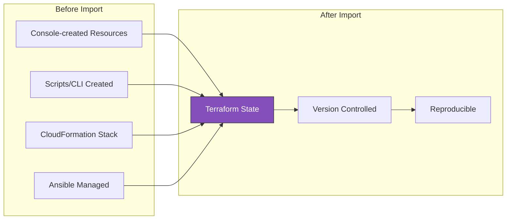
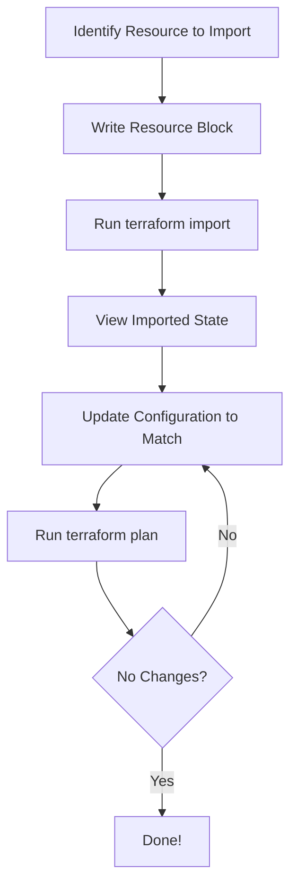
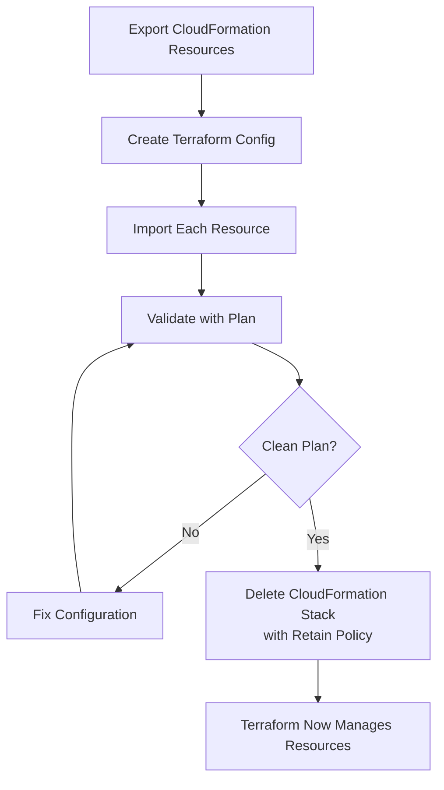
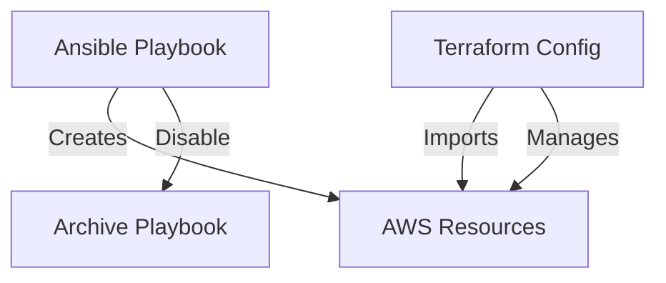
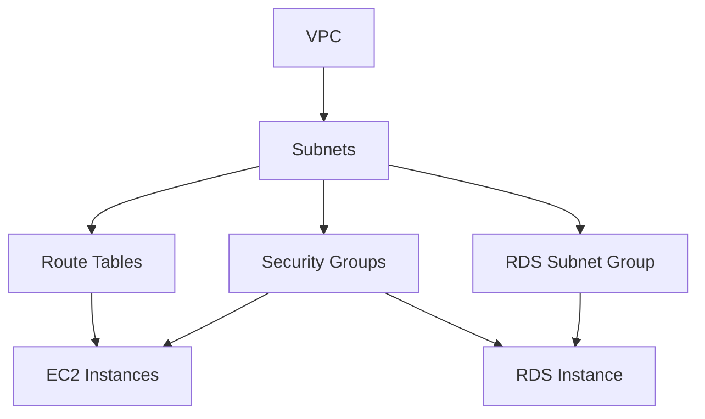

# Import and Migration

Bring existing infrastructure under Terraform management and migrate from other IaC tools.

> [!NOTE]
> **Learning Goal**: Master importing existing resources, generating configurations, and migrating from CloudFormation, Ansible, and manually-created infrastructure.

---

## Why Import?



| Scenario | Solution |
|----------|----------|
| Resources created via console | `terraform import` |
| Bulk import hundreds of resources | Terraformer or import blocks |
| Migrate from CloudFormation | Import + cf2tf |
| Track existing infrastructure | Import + `plan -generate-config-out` |

---

## terraform import Command

### Basic Syntax

```bash
terraform import <resource_address> <resource_id>
```

### Step-by-Step Process



### Example: Import EC2 Instance

**Step 1: Write the resource block (minimal)**

```hcl
# main.tf
resource "aws_instance" "existing" {
  # Will be populated after import
}
```

**Step 2: Run import**

```bash
terraform import aws_instance.existing i-0123456789abcdef0
```

**Step 3: View imported state**

```bash
terraform state show aws_instance.existing
```

**Output:**

```hcl
resource "aws_instance" "existing" {
    ami                          = "ami-0c55b159cbfafe1f0"
    arn                          = "arn:aws:ec2:us-east-1:123456789:instance/i-0123456789abcdef0"
    availability_zone            = "us-east-1a"
    id                           = "i-0123456789abcdef0"
    instance_type                = "t3.micro"
    key_name                     = "my-key"
    subnet_id                    = "subnet-12345678"
    vpc_security_group_ids       = ["sg-12345678"]
    tags                         = {
        "Name" = "MyServer"
    }
    # ... more attributes
}
```

**Step 4: Update configuration**

```hcl
resource "aws_instance" "existing" {
  ami                    = "ami-0c55b159cbfafe1f0"
  instance_type          = "t3.micro"
  key_name               = "my-key"
  subnet_id              = "subnet-12345678"
  vpc_security_group_ids = ["sg-12345678"]
  
  tags = {
    Name = "MyServer"
  }
}
```

**Step 5: Verify with plan**

```bash
terraform plan
# Should show: No changes. Your infrastructure matches the configuration.
```

---

## Import Blocks (Terraform 1.5+)

Declarative imports that can be committed to version control:

```hcl
# imports.tf

import {
  to = aws_instance.existing
  id = "i-0123456789abcdef0"
}

import {
  to = aws_vpc.main
  id = "vpc-12345678"
}

import {
  to = aws_s3_bucket.data
  id = "my-existing-bucket"
}

# Resource blocks can be empty initially
resource "aws_instance" "existing" {}
resource "aws_vpc" "main" {}
resource "aws_s3_bucket" "data" {}
```

```bash
# Run plan to see what will be imported
terraform plan

# Apply to actually import
terraform apply
```

### Advantages of Import Blocks

| Feature | terraform import | Import Blocks |
|---------|-----------------|---------------|
| Declarative | ❌ | ✅ |
| Version controlled | ❌ | ✅ |
| Generate config | ❌ | ✅ |
| Batch imports | ❌ | ✅ |
| Preview before import | ❌ | ✅ |

---

## Generate Configuration (Terraform 1.5+)

Auto-generate Terraform config from imported resources:

```bash
# Generate config for all imports
terraform plan -generate-config-out=generated.tf
```

### Example Workflow

**Step 1: Create import blocks**

```hcl
# imports.tf
import {
  to = aws_instance.web
  id = "i-0123456789abcdef0"
}

import {
  to = aws_security_group.web
  id = "sg-12345678"
}

import {
  to = aws_vpc.main
  id = "vpc-abcdef12"
}
```

**Step 2: Generate configuration**

```bash
terraform plan -generate-config-out=generated.tf
```

**Step 3: Review generated.tf**

```hcl
# generated.tf
resource "aws_instance" "web" {
  ami                    = "ami-0c55b159cbfafe1f0"
  instance_type          = "t3.micro"
  key_name               = "my-key"
  subnet_id              = "subnet-12345678"
  vpc_security_group_ids = ["sg-12345678"]
  
  tags = {
    Name = "WebServer"
  }
  
  # ... complete configuration
}

resource "aws_security_group" "web" {
  name        = "web-sg"
  description = "Web security group"
  vpc_id      = "vpc-abcdef12"
  
  ingress {
    from_port   = 80
    to_port     = 80
    protocol    = "tcp"
    cidr_blocks = ["0.0.0.0/0"]
  }
  
  # ... complete configuration
}

resource "aws_vpc" "main" {
  cidr_block           = "10.0.0.0/16"
  enable_dns_hostnames = true
  enable_dns_support   = true
  
  tags = {
    Name = "main-vpc"
  }
}
```

**Step 4: Clean up and refactor**

```hcl
# Move to appropriate files
# Add variables
# Add references between resources

resource "aws_instance" "web" {
  ami                    = data.aws_ami.amazon_linux.id
  instance_type          = var.instance_type
  key_name               = var.key_name
  subnet_id              = aws_subnet.public.id  # Reference
  vpc_security_group_ids = [aws_security_group.web.id]  # Reference
  
  tags = merge(local.common_tags, {
    Name = "${var.project}-web"
  })
}
```

**Step 5: Remove import blocks after successful import**

```bash
# After apply succeeds
rm imports.tf
```

---

## Common Import Examples

### VPC Resources

```bash
# VPC
terraform import aws_vpc.main vpc-12345678

# Subnet
terraform import aws_subnet.public subnet-12345678

# Internet Gateway
terraform import aws_internet_gateway.main igw-12345678

# NAT Gateway
terraform import aws_nat_gateway.main nat-12345678

# Route Table
terraform import aws_route_table.public rtb-12345678

# Route Table Association
terraform import aws_route_table_association.public subnet-12345678/rtb-12345678

# Security Group
terraform import aws_security_group.web sg-12345678

# Security Group Rule (ingress)
terraform import aws_security_group_rule.http sg-12345678_ingress_tcp_80_80_0.0.0.0/0
```

### Compute Resources

```bash
# EC2 Instance
terraform import aws_instance.web i-12345678

# EBS Volume
terraform import aws_ebs_volume.data vol-12345678

# EBS Volume Attachment
terraform import aws_volume_attachment.data /dev/xvdf:vol-12345678:i-12345678

# Elastic IP
terraform import aws_eip.web eipalloc-12345678

# Key Pair
terraform import aws_key_pair.deployer my-key-name

# Launch Template
terraform import aws_launch_template.web lt-12345678

# Auto Scaling Group
terraform import aws_autoscaling_group.web my-asg-name
```

### Database Resources

```bash
# RDS Instance
terraform import aws_db_instance.main my-database-identifier

# RDS Subnet Group
terraform import aws_db_subnet_group.main my-db-subnet-group

# RDS Parameter Group
terraform import aws_db_parameter_group.main my-parameter-group

# ElastiCache Cluster
terraform import aws_elasticache_cluster.main my-redis-cluster

# DynamoDB Table
terraform import aws_dynamodb_table.main my-table-name
```

### Storage Resources

```bash
# S3 Bucket
terraform import aws_s3_bucket.data my-bucket-name

# S3 Bucket Policy
terraform import aws_s3_bucket_policy.data my-bucket-name

# S3 Bucket Versioning
terraform import aws_s3_bucket_versioning.data my-bucket-name

# EFS File System
terraform import aws_efs_file_system.main fs-12345678
```

### IAM Resources

```bash
# IAM User
terraform import aws_iam_user.developer my-username

# IAM Role
terraform import aws_iam_role.app my-role-name

# IAM Policy
terraform import aws_iam_policy.custom arn:aws:iam::123456789:policy/my-policy

# IAM Role Policy Attachment
terraform import aws_iam_role_policy_attachment.app my-role/arn:aws:iam::aws:policy/AmazonS3ReadOnlyAccess

# IAM Instance Profile
terraform import aws_iam_instance_profile.app my-profile-name
```

### Load Balancer Resources

```bash
# Application Load Balancer
terraform import aws_lb.main arn:aws:elasticloadbalancing:us-east-1:123456789:loadbalancer/app/my-alb/1234567890abcdef

# Target Group
terraform import aws_lb_target_group.main arn:aws:elasticloadbalancing:us-east-1:123456789:targetgroup/my-tg/1234567890abcdef

# Listener
terraform import aws_lb_listener.http arn:aws:elasticloadbalancing:us-east-1:123456789:listener/app/my-alb/1234567890abcdef/1234567890abcdef
```

---

## Terraformer: Bulk Import Tool

Import hundreds of resources automatically:

```bash
# Install
brew install terraformer

# or
go install github.com/GoogleCloudPlatform/terraformer/cmd/terraformer@latest
```

### Import All VPC Resources

```bash
terraformer import aws \
  --resources=vpc,subnet,igw,nat,route_table,security_group \
  --regions=us-east-1 \
  --profile=my-profile
```

### Import Specific Resources

```bash
# By tag
terraformer import aws \
  --resources=ec2_instance \
  --filter="Name=tags.Environment;Value=production" \
  --regions=us-east-1

# By resource ID
terraformer import aws \
  --resources=vpc \
  --filter=vpc=vpc-12345678 \
  --regions=us-east-1
```

### Generated Structure

```
generated/
└── aws/
    ├── vpc/
    │   ├── vpc.tf
    │   ├── outputs.tf
    │   └── provider.tf
    ├── subnet/
    │   ├── subnet.tf
    │   └── ...
    └── security_group/
        ├── security_group.tf
        └── ...
```

### Post-Processing

```bash
# Convert to single state
cd generated/aws/vpc
terraform init
terraform plan

# Merge files and add references
# Replace hardcoded IDs with references
```

---

## Migration from CloudFormation

### Using Former2

Web-based tool to generate Terraform from existing AWS resources:

1. Go to [former2.com](https://former2.com)
2. Scan AWS resources
3. Generate Terraform code
4. Download and import

### Using cf2tf

Convert CloudFormation templates to Terraform:

```bash
# Install
pip install cf2tf

# Convert template
cf2tf my-stack.yaml > main.tf

# Or convert deployed stack
aws cloudformation get-template --stack-name my-stack \
  | jq -r '.TemplateBody' > template.yaml
cf2tf template.yaml > main.tf
```

### Manual Migration Steps



**Step 1: List CloudFormation resources**

```bash
aws cloudformation list-stack-resources \
  --stack-name my-stack \
  --query 'StackResourceSummaries[*].[LogicalResourceId,PhysicalResourceId,ResourceType]' \
  --output table
```

**Step 2: Update CF stack with DeletionPolicy: Retain**

```yaml
# Update all resources
Resources:
  MyVPC:
    Type: AWS::EC2::VPC
    DeletionPolicy: Retain
    Properties:
      CidrBlock: 10.0.0.0/16
```

**Step 3: Create Terraform config and import**

```hcl
import {
  to = aws_vpc.main
  id = "vpc-12345678"  # PhysicalResourceId from CF
}
```

**Step 4: Delete CF stack (resources retained)**

```bash
# Delete stack - resources remain because of DeletionPolicy: Retain
aws cloudformation delete-stack --stack-name my-stack
```

---

## Migration from Ansible

### Strategy



### Example: Ansible EC2 → Terraform

**Existing Ansible:**

```yaml
# playbook.yml
- name: Create EC2 instance
  amazon.aws.ec2_instance:
    name: "web-server"
    instance_type: t3.micro
    image_id: ami-12345678
    vpc_subnet_id: subnet-12345678
    security_groups:
      - web-sg
    tags:
      Environment: production
```

**Terraform equivalent + import:**

```hcl
# Step 1: Get instance ID from Ansible output or AWS console

# Step 2: Create import block
import {
  to = aws_instance.web
  id = "i-0123456789abcdef0"
}

# Step 3: Generate or write config
resource "aws_instance" "web" {
  ami                    = "ami-12345678"
  instance_type          = "t3.micro"
  subnet_id              = "subnet-12345678"
  vpc_security_group_ids = [aws_security_group.web.id]
  
  tags = {
    Name        = "web-server"
    Environment = "production"
  }
}
```

**Step 3: Apply and verify**

```bash
terraform apply
terraform plan  # Should show no changes
```

**Step 4: Archive Ansible playbook**

```bash
mv playbook.yml playbook.yml.archived
# Or delete after verification period
```

---

## Handling Import Challenges

### Missing Required Arguments

```bash
Error: Missing required argument
The argument "key_name" is required, but no definition was found.
```

**Solution:** Add the missing argument to your configuration:

```hcl
resource "aws_instance" "web" {
  ami           = "ami-12345678"
  instance_type = "t3.micro"
  key_name      = "my-key"  # Add missing required field
}
```

### Computed vs Configured Values

Some values are computed by AWS but look like configuration:

```hcl
resource "aws_instance" "web" {
  ami           = "ami-12345678"
  instance_type = "t3.micro"
  
  # These are computed - don't include in config
  # arn = "arn:aws:ec2:..."          # Computed
  # id = "i-12345678"                 # Computed
  # private_ip = "10.0.1.50"          # Computed (unless specified)
  
  # These should be in config
  key_name  = "my-key"
  subnet_id = "subnet-12345678"
}
```

### Resource Already Exists in State

```bash
Error: Resource already managed by Terraform
```

**Solution:** Remove from state first, then re-import:

```bash
terraform state rm aws_instance.web
terraform import aws_instance.web i-12345678
```

### Resource Doesn't Support Import

Some resources don't support import:

```bash
Error: Resource import not implemented
```

**Solution:**

1. Create new resource with Terraform
2. Migrate data if needed
3. Delete old resource

### Sensitive Values

Imported resources may have sensitive values:

```hcl
resource "aws_db_instance" "main" {
  identifier = "my-database"
  
  # Password won't be in state after import
  # You must provide it or use secrets manager
  password = var.db_password
  
  # Or manage via Secrets Manager
  manage_master_user_password = true
}
```

---

## Import Workflow Best Practices

### 1. Plan Before Importing

```bash
# Map out resources first
aws resourcegroupstaggingapi get-resources \
  --tag-filters Key=Environment,Values=production \
  --output json > resources.json
```

### 2. Import in Dependency Order



### 3. Use Import Blocks Over CLI

```hcl
# Preferred: Declarative, version controlled
import {
  to = aws_vpc.main
  id = "vpc-12345678"
}

# Avoid: Imperative, not tracked
# terraform import aws_vpc.main vpc-12345678
```

### 4. Generate Then Refactor

```bash
# Step 1: Generate raw config
terraform plan -generate-config-out=generated.tf

# Step 2: Apply to get clean state
terraform apply

# Step 3: Refactor
# - Add variables
# - Add references
# - Add locals
# - Split into modules

# Step 4: Verify refactoring
terraform plan  # Should show no changes
```

### 5. Document Import Process

```markdown
# Import Log

## Date: 2024-01-15

### Resources Imported
- VPC: vpc-12345678 → aws_vpc.main
- Subnet: subnet-12345678 → aws_subnet.public
- EC2: i-12345678 → aws_instance.web

### Configuration Changes
- Added variables for instance_type, ami_id
- Created locals for common_tags
- Refactored to use data sources for AMI

### Verification
- `terraform plan` shows no changes
- All resources accessible via outputs
```

---

## Summary

| Method | Best For | Complexity |
|--------|----------|------------|
| `terraform import` | Single resources, quick imports | Low |
| Import blocks | Version-controlled, bulk imports | Medium |
| `-generate-config-out` | New Terraform users, full config generation | Low |
| Terraformer | Hundreds of resources | Medium |
| cf2tf | CloudFormation migration | Medium |
| Former2 | Visual exploration, code generation | Low |

---

## Checklist for Resource Import

- [ ] Identify all resources to import
- [ ] Map dependencies between resources
- [ ] Create import blocks for each resource
- [ ] Run `terraform plan -generate-config-out=generated.tf`
- [ ] Apply imports
- [ ] Refactor configuration (variables, references)
- [ ] Verify with `terraform plan` (no changes)
- [ ] Remove import blocks
- [ ] Document the import process
- [ ] Archive or delete old management tools

---

## Additional Resources

- [Terraform Import Documentation](https://developer.hashicorp.com/terraform/cli/import)
- [Terraformer GitHub](https://github.com/GoogleCloudPlatform/terraformer)
- [Former2](https://former2.com)
- [cf2tf](https://github.com/DontShaveTheYak/cf2tf)
