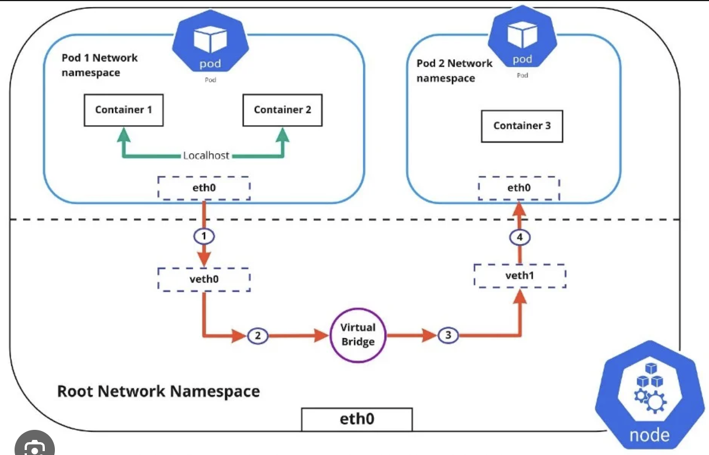
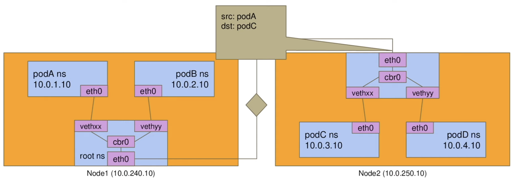

## Introduction

A Pod is a set of containers with shared namespaces and shared filesystem volumes.

Usually you don't need to create Pods directly, even singleton Pods. Instead, create them using workload resources such as Deployment or Job. If your Pods need to track state, consider the StatefulSet resource.

Pods in Kubernetes cluster are used in two main ways:

1. Pods that run a single container
2. Pods that run multiple containers that need to work together. The containers in a Pod are automatically co-located and co-scheduled on the same physical or virtual machine in the cluster. The containers can share resources and dependencies, communicate with one another, and coordinate when and how they are terminated.

**Pods natively provide two kinds of shared resources for their constituent containers: networking and storage.**
**Restarting a container in a Pod should not be confused with restarting a Pod. A Pod is not a process, but an environment for running container(s). A Pod persists until it is deleted.**

Pods is a group of one/many containers
- Guarded by CGroups
- Isolated by Namespaces

### Networking

- Every Pod gets its own IP address
- Pods on a node can communicate with all pods on all node without NAT
- Agents on a node (e.g. system daemons, kubelet) can communicate with all pods on that node
- Pods in the host network of a node can communicate with all pods on all nodes without NAT
- Containers in same pod can communicate with each other over localhost. 
- If a container reside in one pod need to talk with another container reside in another pod, communication will happen via pod IP address.

- Inter-Node Pod Networking

  
Kubernetes does not deal with assigning IP Address to Pods, its the job of CNI plugin.
Inside a pod you cannot have clashing ports.

There are 3 IP ranges.
1- Host IP range (assigned by the cloud provider)
2- Pod IP range (assigned by the CNI plugin)
3- Service IP range (assigned by the k8)

Overlay Network?

