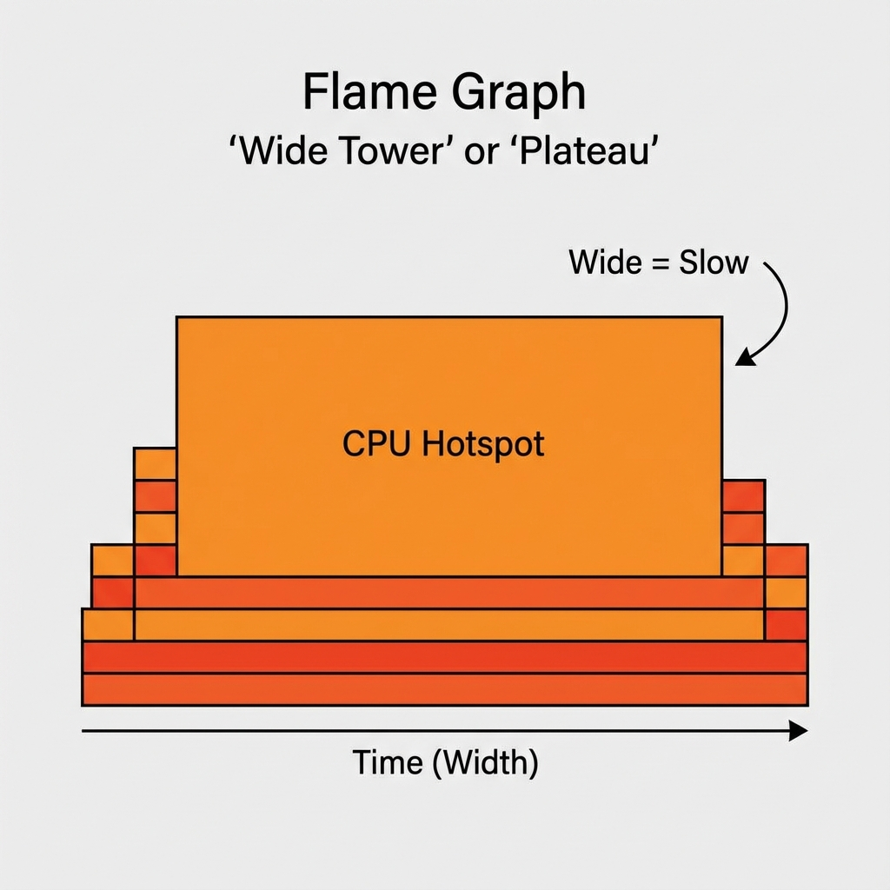
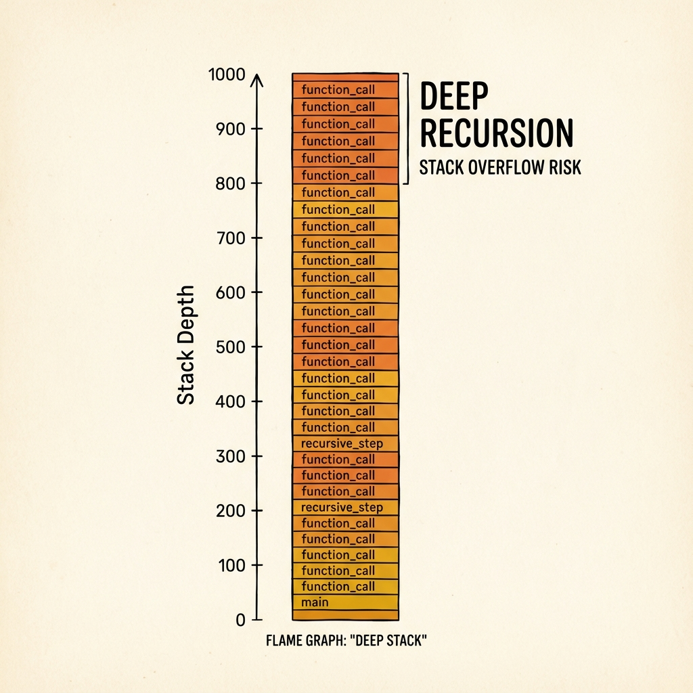
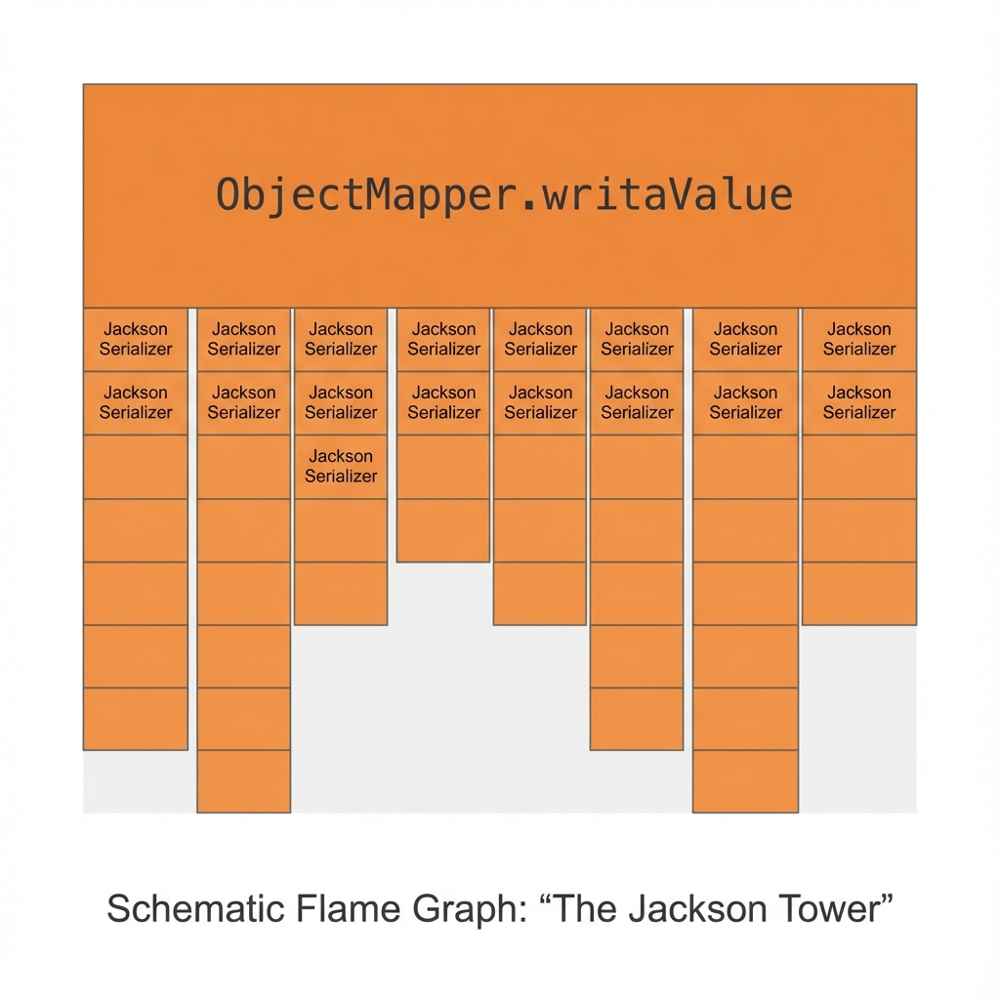
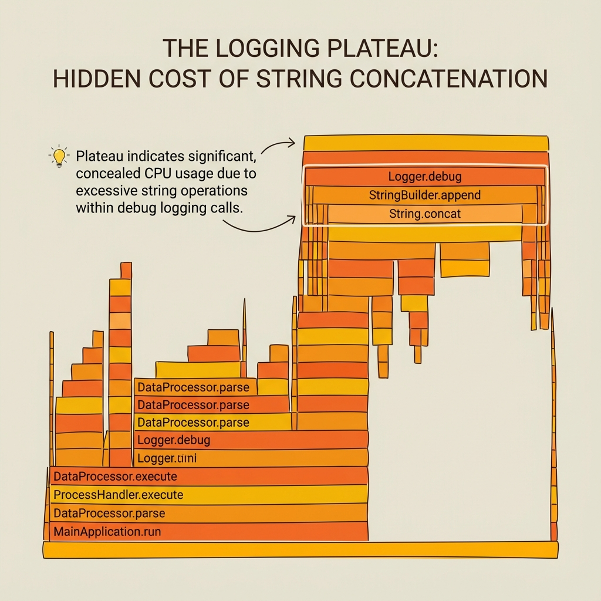
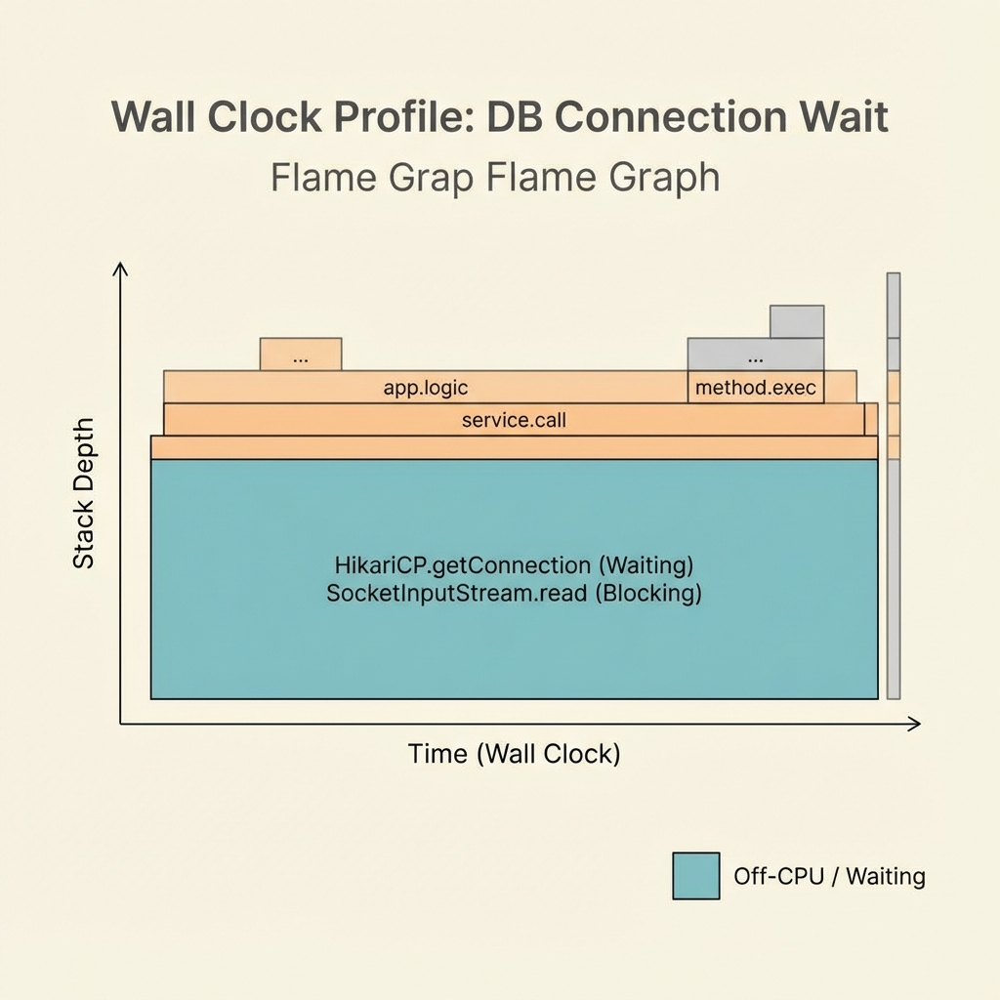
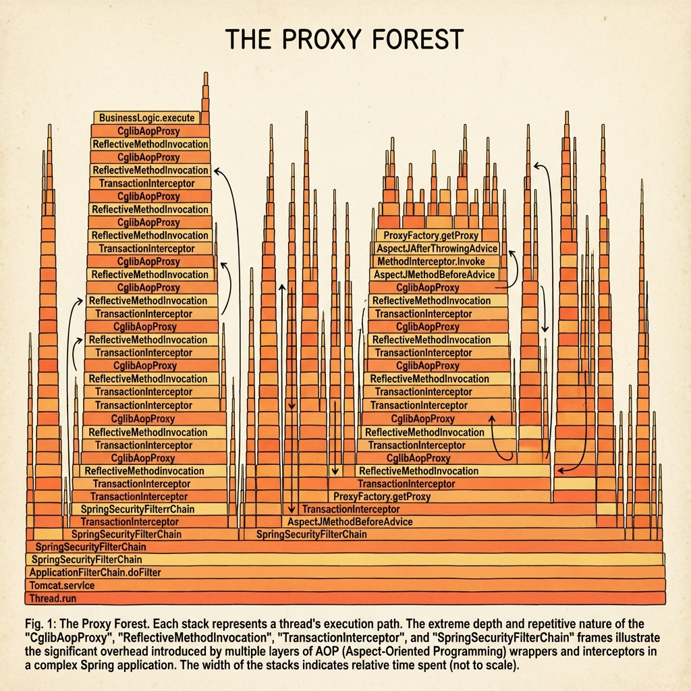
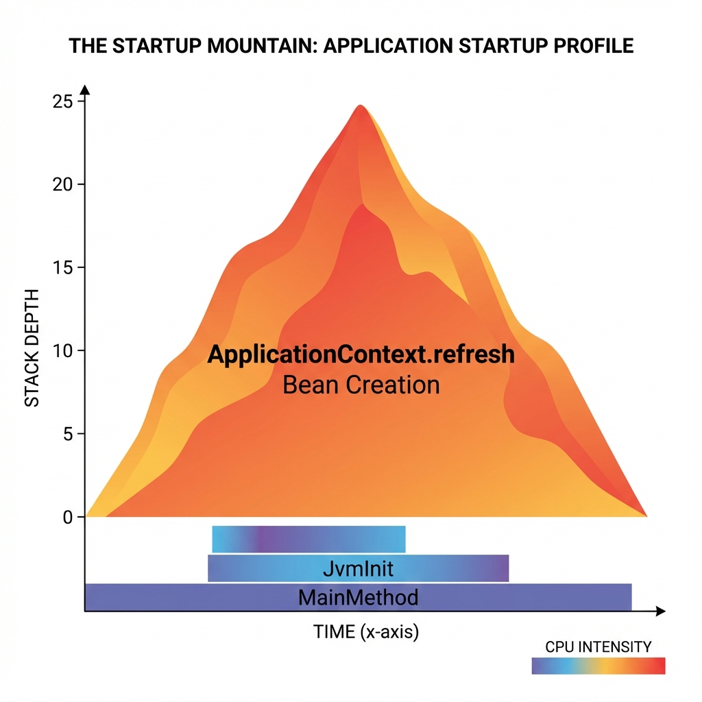

# The Comprehensive Guide to Flamegraphs (Java Edition)

> **For Beginners**: This guide assumes no prior knowledge of flamegraphs. It will walk you through what they are, why you need them, and how to use them to solve real performance problems.

## 1. What is a Flamegraph?

Imagine your application is a building. You want to know which room is the most crowded.

- **Log files** are like reading a guest list—valid but tedious.
- **Flamegraphs** are like an X-ray heatmap. You can instantly see which room (function) is packed.

### How to Read one

A flamegraph is a chart of stacked rectangles.

- **X-AXIS (Width)**: This is the most important part. **Width = Time**. The wider the box, the more time your CPU spent in that function.
- **Y-AXIS (Height)**: This is "Stack Depth". The top box is the function currently running, and the box below is the function that called it.
- **Color**: Usually random. It helps your eye distinguish between different methods. It does *not* mean "red is bad".

**The Golden Rule**: Look for the **widest "plateaus"**. These are your bottlenecks.


*Fig 1: A "Wide Tower" indicates a function spending a lot of time on CPU.*


*Fig 2: A "Deep Stack" indicates deep recursion or limits.*

---

## 2. Setup: Getting the Tools

We will use **async-profiler** (via the `asprof` command), the industry-standard low-overhead profiler for Java.

### Prerequisites

- macOS or Linux.
- Java (JDK 21+ is recommended for this tutorial).

### Installation (if not done)

1. Download from [GitHub Releases](https://github.com/jvm-profiling-tools/async-profiler/releases).
2. Add the directory to your PATH (as done in previous steps) so you can run `asprof`.

---

## 3. The "FlamegraphExample" Application

We have built a special Java application that simulates 7 distinct performance problems.
Compile it first:

```bash
javac src/main/java/com/learning/performance/FlamegraphExample.java
```

Now, let's explore each scenario.

### Scenario A: The CPU Hog (CPU Profiling)

**The Problem**: Your app is slow because it's doing too much math or text processing.

1. **Run**: `java -cp src/main/java com.learning.performance.FlamegraphExample cpu`
2. **Profile**: `asprof -d 10 -f cpu.html <PID>`
3. **Analyze**: Open `cpu.html`.
    - **Look for**: A wide bar involving `Pattern.matches` or `hotMethod`.
    - **Lesson**: Inefficient Regex usage inside a loop is a classic CPU killer.

### Scenario B: The Memory Leak / GC Pressure (Allocation Profiling)

**The Problem**: Your app pauses frequently ("GC pauses"). It's creating too many objects.

1. **Run**: `java -cp src/main/java com.learning.performance.FlamegraphExample alloc`
2. **Profile**: `asprof -d 10 -e alloc -f alloc.html <PID>`
    - Note `-e alloc`: This tells the profiler to track *memory allocation*, not CPU time.
3. **Analyze**: Open `alloc.html`.
    - **Look for**: Wide bars showing `new String` or `Integer.valueOf`.
    - **Lesson**: The widest bars are the methods generating the most garbage.

### Scenario C: Lock Contention (Lock Profiling)

**The Problem**: Threads are stuck waiting for `synchronized` blocks. CPU usage might be low, but the app is slow.

1. **Run**: `java -cp src/main/java com.learning.performance.FlamegraphExample locks`
2. **Profile**: `asprof -d 10 -e lock -f locks.html <PID>`
    - Note `-e lock`: Tracks time spent waiting for locks.
3. **Analyze**: Open `locks.html`.
    - **Look for**: `simulateLockContention` or `Unsafe.park`.
    - **Lesson**: If you see wide bars here, your threads are fighting each other. Consider reducing the scope of the lock.

### Scenario D: Blocking I/O (Wall-clock Profiling)

**The Problem**: Threads are stuck reading files or making network calls. They are "Off-CPU".

1. **Run**: `java -cp src/main/java com.learning.performance.FlamegraphExample file-io`
2. **Profile**: `asprof -d 10 -e wall -f wall.html <PID>`
    - Note `-e wall`: Tracks "wall clock" time (real world time), regardless of whether the thread is on CPU or sleeping.
3. **Analyze**: Open `wall.html`.
    - **Look for**: `FileInputStream.read` or `FileDispatcherImpl`.
    - **Lesson**: Standard profiles miss this. Use `-e wall` to find where threads are sleeping.

---

## 4. Virtual Threads: The Scalability Solution

This is where Modern Java shines.

### The Problem: Platform Threads are Expensive

Standard Java threads (Platform Threads) are managed by the OS.

1. **Run**: `java -cp src/main/java com.learning.performance.FlamegraphExample pt-scale`
    - It tries to spawn 5,000 threads.
    - **Result**: You will notice it's slow to start, uses a lot of memory, and might crash your machine if you go higher.

### The Solution: Virtual Threads

Virtual Threads are lightweight. You can have millions.

1. **Run**: `java -cp src/main/java com.learning.performance.FlamegraphExample vt-ops`
    - It spawns **100,000** threads!
    - **Result**: It runs almost instantly and uses very little memory.

### Profiling Virtual Threads

Standard CPU profiling won't show Virtual Threads if they are blocking (sleeping).

1. **Run**: `java -cp src/main/java com.learning.performance.FlamegraphExample vt-ops`
2. **Profile**: `asprof -d 5 -e wall -f vt.html <PID>`
3. **Analyze**: You will see `java.base/java.lang.VirtualThread` frames.
    - **Visual**: You might see thousands of thin stacks if you zoom in, or one massive block of "Parking" threads.
    - **Lesson**: If your app is I/O bound, switching to Virtual Threads can massively improve throughput without changing your code structure much.

---

## 4. The "Spring Boot" Example Application

For a more realistic experience, we have included a full Spring Boot application in `src/main/java/com/learning/performance/springboot`.

### How to Run

```bash
mvn spring-boot:run
```

The server will start on port `8080`.

### Scenarios & Endpoints

We have mapped the patterns above to REST endpoints so you can profile a live web server.

| Scenario | Endpoint | Description |
| :--- | :--- | :--- |
| **Jackson Tower** | `GET /heavy/cpu` | Simulates CPU-heavy Regex & Math |
| **Logging Plateau** | `GET /heavy/alloc` | Simulates high allocation & String churn |
| **DB Wait** | `GET /heavy/db` | Simulates thread blocking (sleep) |
| **Proxy Forest** | `GET /heavy/proxy` | Simulates AOP overhead |

### How to Profile

1. Start the app: `mvn spring-boot:run`
2. Run a load generator in a separate terminal (e.g., `ab` or a loop):

   ```bash
   # Example: Hit the Proxy endpoint 1000 times
   while true; do curl -s http://localhost:8080/heavy/proxy > /dev/null; done
   ```

3. Run `asprof`:

   ```bash
   asprof -d 10 -f proxy-forest.html <PID_OF_SPRING_BOOT_APP>
   ```

---

## 5. Real World Production Patterns

In production, performance issues often follow specific patterns. Here are three common "Shapes" you will see in your flamegraphs.

### A. The "Jackson Tower" (Serialization Cost)

**Scenario**: You have a high-throughput API. The CPU usage is high, but your business logic seems fast.
**The Shape**: A very wide, dominant tower at the top of the stack, often involving `ObjectMapper`, `SerializerProvider`, or `writeString`.
**Why**: Converting Java objects to JSON (and vice-versa) is expensive. If you do it thousands of times per second, it becomes a bottleneck.


*Fig 3: The "Jackson Tower". The width represents massive CPU time spent just converting data formats.*

**The Fix**:

- Use "View" objects to serialize less data.
- Switch to a binary format check (e.g., Protobuf) if internal.
- Ensure you reuse the `ObjectMapper` instance (it's thread-safe).

### B. The "Logging Plateau" (String Concatenation)

**Scenario**: Your app is slow, and you see high memory allocation (GC pressure).
**The Shape**: It looks like a "plateau" or "mesa"—many medium-width stacks that flatten out. You see `StringBuilder.append`, `Logger.debug`, and `String.concat`.
**Why**: Even if debug logging is disabled, `log.debug("User " + user.toString())` still executes the `toString` and concatenation *before* checking if debug is enabled!


*Fig 4: The "Logging Plateau". Hidden cost of string operations inside log calls.*

**The Fix**:

- Use parameterized logging: `log.debug("User {}", user)`.
- Check log levels before constructing messages: `if (log.isDebugEnabled()) ...`.

### C. The "Connection Pool Wait" (DB Bottleneck)

**Scenario**: The app is unresponsive, but CPU usage is almost zero.
**The Shape**: You only see this with **Wall-clock profiling** (`-e wall`). It appears as a massive, solid block at the bottom involving `HikariCP`, `getConnection`, `SocketInputStream.read` or `Unsafe.park`.
**Why**: Your threads are all waiting for a database connection or a response from a remote service. They are doing nothing, but the user is waiting.


*Fig 5: The "Connection Pool Wait". Note the off-CPU waiting state captured by wall-clock profiling.*

**The Fix**:

- Increase connection pool size.
- Optimize slow SQL queries (the root cause).
- Use non-blocking drivers (Reactive/R2DBC).

---

## 6. Spring Boot & Microservices Patterns

If you are a Spring Boot developer, your flamegraphs will look unique due to the framework's magic.

### A. The "Proxy Forest" (AOP Overhead)

**Scenario**: Your stack trace is incredibly deep (100+ frames), full of `CglibAopProxy`, `ReflectiveMethodInvocation`, and `TransactionInterceptor`.
**The Shape**: It looks like a dense forest of thin, tall stacks.
**Why**: Spring uses Proxies for `@Transactional`, `@Async`, and Security. Every method call goes through a chain of interceptors before hitting your code.


*Fig 6: The "Proxy Forest". Deep stacks caused by AOP wrappers.*

**The Fix**:

- This is mostly normal overhead.
- If excessive, check if you are nesting `@Transactional` usage too deeply or have circular dependencies.

### B. The "Startup Mountain" (Bean Initialization)

**Scenario**: You profile your application startup.
**The Shape**: A single, massive, solid mountain shape.
**Why**: This is the `ApplicationContext.refresh()` phase where Spring scans classes and creates Beans. It is usually single-threaded and CPU intensive.


*Fig 7: The "Startup Mountain". High CPU usage during Bean creation.*

**The Fix**:

- Use "Lazy Initialization" (`spring.main.lazy-initialization=true`) to spread this cost.
- Profile `alloc` to seeing if scanning the classpath is generating too many String objects.

---

## Summary Cheat Sheet

| Problem Type | Symptom | Profiler Command | Event flag |
| :--- | :--- | :--- | :--- |
| **High CPU** | Fans spinning, high load | `asprof -d 30 -f cpu.html <PID>` | (default) |
| **GC Pauses** | App freezes, high memory | `asprof -d 30 -e alloc -f alloc.html <PID>` | `-e alloc` |
| **Locks** | Slow app, low CPU | `asprof -d 30 -e lock -f lock.html <PID>` | `-e lock` |
| **I/O Wait** | Slow app, low CPU | `asprof -d 30 -e wall -f wall.html <PID>` | `-e wall` |

Happy Profiling!
