# Git Branching Strategies

A comprehensive guide to Git branching methodologies including **Git Flow**, **GitHub Flow**, **Trunk-Based Development**, and other strategies. This document will help developers understand each strategy, their workflows, and make informed decisions about which approach fits their project best.

---

## Table of Contents

1. [Overview](#overview)
2. [Understanding Branch Types](#understanding-branch-types)
3. [Git Flow](#git-flow)
4. [GitHub Flow](#github-flow)
5. [Trunk-Based Development](#trunk-based-development)
6. [Other Branching Strategies](#other-branching-strategies)
   - [GitLab Flow](#gitlab-flow)
   - [Release Flow (Microsoft)](#release-flow-microsoft)
   - [Environment Branching](#environment-branching)
   - [Feature Flag Branching](#feature-flag-branching)
7. [Comparison Matrix](#comparison-matrix)
8. [Decision Guide: Which to Choose?](#decision-guide-which-to-choose)
9. [Migration Between Strategies](#migration-between-strategies)

---

## Overview

Branching strategies define how teams manage code changes, releases, and collaboration. The right strategy depends on:

- **Team size** and distribution
- **Release frequency** (daily, weekly, monthly)
- **Project complexity** and maturity
- **CI/CD maturity** and automation level
- **Regulatory requirements** (if any)


---

## Understanding Branch Types

Before diving into branching strategies, it's essential to understand the common branch types used across all methodologies. Each branch type serves a specific purpose in the development lifecycle.

### Branch Types Overview


### Default Branch (main/master)

| Attribute | Description |
|-----------|-------------|
| **Also Known As** | `main`, `master`, `trunk` |
| **Purpose** | The primary branch that reflects the production-ready state of your code |
| **Lifetime** | Permanent - exists for the entire project lifecycle |
| **Who Merges** | Usually through PRs after code review, or automated pipelines |
| **Protected** | Yes - typically has branch protection rules |

**Characteristics:**

- ✅ Always contains stable, deployable code
- ✅ Never commit directly (use PRs/merge requests)
- ✅ Every commit should be tagged or releasable
- ✅ CI/CD pipelines deploy from this branch

```bash
# The default branch is configured in Git settings
git config --global init.defaultBranch main

# View the current default branch
git symbolic-ref refs/remotes/origin/HEAD

# Set default branch for existing repo
git branch -M main
```

---

### Develop Branch

| Attribute | Description |
|-----------|-------------|
| **Also Known As** | `develop`, `dev`, `development` |
| **Purpose** | Integration branch where features are combined before release |
| **Lifetime** | Permanent (in Git Flow) or doesn't exist (in GitHub Flow/TBD) |
| **Branches From** | `main` (once, at project start) |
| **Merges To** | `release/*` branches, eventually to `main` |

**Characteristics:**

- ✅ Contains latest delivered development changes
- ✅ May be unstable at times
- ✅ Features are merged here for integration testing
- ✅ Nightly builds often come from this branch

```bash
# Create develop branch (Git Flow setup)
git checkout main
git checkout -b develop
git push -u origin develop
```

---

### Feature Branch

| Attribute | Description |
|-----------|-------------|
| **Also Known As** | `feature/*`, `feat/*`, `topic/*` |
| **Purpose** | Develop new features in isolation from the main codebase |
| **Lifetime** | Temporary - exists only while the feature is being developed |
| **Branches From** | `develop` (Git Flow) or `main` (GitHub Flow) |
| **Merges To** | `develop` (Git Flow) or `main` (GitHub Flow) |

**Naming Conventions:**

```
feature/user-authentication
feature/JIRA-123-add-payment-gateway
feature/add-dark-mode
feat/shopping-cart
```

**Lifecycle:**


**Best Practices:**

- 🎯 One feature per branch
- 🎯 Keep branches short-lived (days, not weeks)
- 🎯 Regularly sync with parent branch to avoid conflicts
- 🎯 Use descriptive names that explain the feature

```bash
# Create and work on a feature branch
git checkout develop
git pull origin develop
git checkout -b feature/user-dashboard

# Keep in sync with develop
git fetch origin
git rebase origin/develop

# Push and create PR
git push -u origin feature/user-dashboard
```

---

### Bugfix Branch

| Attribute | Description |
|-----------|-------------|
| **Also Known As** | `bugfix/*`, `fix/*`, `bug/*` |
| **Purpose** | Fix non-critical bugs that aren't urgent production issues |
| **Lifetime** | Temporary - typically short (hours to days) |
| **Branches From** | `develop` or the branch where bug was found |
| **Merges To** | `develop` (or `main` if using GitHub Flow) |

**Naming Conventions:**

```
bugfix/login-validation-error
bugfix/JIRA-456-fix-null-pointer
fix/broken-pagination
```

**When to Use:**

- 🐛 Non-urgent bugs found during development
- 🐛 Issues discovered in QA before release
- 🐛 Technical debt fixes

```bash
# Create bugfix branch
git checkout develop
git checkout -b bugfix/fix-login-validation

# Fix the bug
git add .
git commit -m "fix: resolve login validation error for empty username"

# Merge back
git checkout develop
git merge --no-ff bugfix/fix-login-validation
git branch -d bugfix/fix-login-validation
```

---

### Hotfix Branch

| Attribute | Description |
|-----------|-------------|
| **Also Known As** | `hotfix/*`, `emergency/*`, `patch/*` |
| **Purpose** | Urgent fixes for critical production issues |
| **Lifetime** | Very temporary - should be resolved ASAP (hours) |
| **Branches From** | `main` (production) |
| **Merges To** | Both `main` AND `develop` (to sync the fix) |

> [!CAUTION]
> Hotfix branches are for **URGENT** production issues only. Non-critical bugs should use bugfix branches.

**Naming Conventions:**

```
hotfix/security-vulnerability-patch
hotfix/1.2.1
hotfix/fix-payment-crash
```

**Hotfix Workflow:**

```mermaid
flowchart LR
    subgraph "Hotfix Flow"
        A["🚨 Production Bug"] --> B["Branch from main"]
        B --> C["Fix the issue"]
        C --> D["Test thoroughly"]
        D --> E{"Deploy"}
        E --> F["Merge to main"]
        E --> G["Merge to develop"]
        F --> H["Tag release"]
    end
    
    style A fill:#6e1a1a,stroke:#420d0d,color:#fff
    style H fill:#2d5a2d,stroke:#1a3a1a,color:#fff
```



**Critical Differences: Hotfix vs Bugfix:**

| Aspect | Hotfix 🔥 | Bugfix 🐛 |
|--------|----------|----------|
| **Urgency** | Critical, immediate | Normal priority |
| **Branches from** | `main` (production) | `develop` |
| **Merges to** | Both `main` AND `develop` | `develop` only |
| **Deployment** | Immediately to production | With next release |
| **Examples** | Security breach, app crash | UI glitch, minor error |

```bash
# Emergency hotfix workflow
git checkout main
git pull origin main
git checkout -b hotfix/critical-security-fix

# Fix the critical issue
git commit -m "fix: patch critical security vulnerability CVE-2024-XXXX"

# Deploy to production first, then merge
git checkout main
git merge --no-ff hotfix/critical-security-fix
git tag -a v1.2.1 -m "Emergency security patch"
git push origin main --tags

# Don't forget to sync with develop!
git checkout develop
git merge --no-ff hotfix/critical-security-fix
git push origin develop

# Cleanup
git branch -d hotfix/critical-security-fix
```

---

### Release Branch

| Attribute | Description |
|-----------|-------------|
| **Also Known As** | `release/*`, `release-*` |
| **Purpose** | Prepare for a production release (version bumps, final testing) |
| **Lifetime** | Temporary - exists during release preparation (days to weeks) |
| **Branches From** | `develop` |
| **Merges To** | Both `main` (for release) AND `develop` (to sync changes) |

**Naming Conventions:**

```
release/1.2.0
release/v2.0.0-beta
release/2024-Q1
```

**What Happens in a Release Branch:**


> [!IMPORTANT]
> No new features are added in release branches - only bug fixes, documentation, and release preparation tasks.

```bash
# Start a release
git checkout develop
git checkout -b release/1.2.0

# Update version
npm version 1.2.0 --no-git-tag-version
git commit -am "chore: bump version to 1.2.0"

# Any bug fixes during QA
git commit -m "fix: resolve edge case in validation"

# Finish release
git checkout main
git merge --no-ff release/1.2.0
git tag -a v1.2.0 -m "Release 1.2.0"

git checkout develop
git merge --no-ff release/1.2.0

git branch -d release/1.2.0
```

---

### Support/Maintenance Branch

| Attribute | Description |
|-----------|-------------|
| **Also Known As** | `support/*`, `maintenance/*`, `lts/*` |
| **Purpose** | Maintain older versions that are still in production |
| **Lifetime** | Long-lived - as long as the version is supported |
| **Branches From** | Specific tag on `main` |
| **Merges To** | Nowhere (gets tagged for releases) |

**Use Cases:**

- 📦 Enterprise customers on older versions
- 📦 LTS (Long-Term Support) releases
- 📦 Security patches for legacy versions

```
support/1.x
support/v2-lts
maintenance/2023
```

```bash
# Create support branch for v1.x line
git checkout v1.9.0  # Last tag of v1.x
git checkout -b support/1.x

# Apply security fix to old version
git cherry-pick <commit-hash>
git tag v1.9.1
git push origin support/1.x --tags
```

---

### Experimental/Spike Branches

| Attribute | Description |
|-----------|-------------|
| **Also Known As** | `experiment/*`, `spike/*`, `poc/*`, `prototype/*` |
| **Purpose** | Explore ideas, prototypes, or proof-of-concepts |
| **Lifetime** | Varies - may be abandoned or may lead to feature branches |
| **Branches From** | Any branch (usually `main` or `develop`) |
| **Merges To** | Usually nowhere - knowledge gained informs new feature branches |

```
experiment/new-rendering-engine
spike/evaluate-graphql
poc/ai-integration
prototype/new-ui-framework
```

> [!NOTE]
> Experimental branches often don't get merged directly. Instead, learnings are applied to new, clean feature branches.

---

### Branch Types Summary Table

| Branch Type | Prefix | Branches From | Merges To | Lifetime | Purpose |
|-------------|--------|---------------|-----------|----------|---------|
| **Default** | `main` | - | - | Permanent | Production code |
| **Develop** | `develop` | `main` | `release/*` | Permanent | Integration |
| **Feature** | `feature/*` | `develop`/`main` | `develop`/`main` | Days-weeks | New features |
| **Bugfix** | `bugfix/*` | `develop` | `develop` | Hours-days | Non-urgent fixes |
| **Hotfix** | `hotfix/*` | `main` | `main` + `develop` | Hours | Urgent fixes |
| **Release** | `release/*` | `develop` | `main` + `develop` | Days-weeks | Release prep |
| **Support** | `support/*` | Tag on `main` | Nowhere | Months-years | LTS maintenance |
| **Experiment** | `experiment/*` | Any | Usually nowhere | Varies | R&D / POCs |

---

## Git Flow

### What is Git Flow?

Git Flow is a branching model introduced by **Vincent Driessen** in 2010. It defines a strict branching structure designed around project releases, making it ideal for projects with scheduled release cycles.

### Branch Types

| Branch Type | Purpose | Lifetime | Naming Convention |
|-------------|---------|----------|-------------------|
| `main` (or `master`) | Production-ready code | Permanent | `main` |
| `develop` | Integration branch for features | Permanent | `develop` |
| `feature/*` | New features | Temporary | `feature/user-auth` |
| `release/*` | Prepare for a release | Temporary | `release/1.2.0` |
| `hotfix/*` | Production bug fixes | Temporary | `hotfix/login-fix` |

### Git Flow Workflow Diagram


### Branch Flow Diagram

```mermaid
flowchart TB
    subgraph "Git Flow Branch Structure"
        direction LR
        
        subgraph permanent["Permanent Branches"]
            main["🏠 main<br/>(production)"]
            develop["🔧 develop<br/>(integration)"]
        end
        
        subgraph temporary["Temporary Branches"]
            feature["✨ feature/*<br/>(new features)"]
            release["📦 release/*<br/>(release prep)"]
            hotfix["🔥 hotfix/*<br/>(urgent fixes)"]
        end
        
        feature -->|merge| develop
        develop -->|branch| release
        release -->|merge| main
        release -->|back-merge| develop
        main -->|branch| hotfix
        hotfix -->|merge| main
        hotfix -->|merge| develop
    end
    
    style main fill:#2d5a2d,stroke:#1a3a1a,color:#fff
    style develop fill:#1a4a6e,stroke:#0d2d42,color:#fff
    style feature fill:#4a3a6e,stroke:#2d1d42,color:#fff
    style release fill:#6e5a1a,stroke:#423a0d,color:#fff
    style hotfix fill:#6e1a1a,stroke:#420d0d,color:#fff
```



### Step-by-Step Workflow

#### 1. Starting a New Feature

```bash
# Start from develop branch
git checkout develop
git pull origin develop

# Create feature branch
git checkout -b feature/user-authentication

# Work on the feature
git add .
git commit -m "feat: add user authentication"

# Push to remote
git push -u origin feature/user-authentication
```

#### 2. Completing a Feature

```bash
# Update develop and merge
git checkout develop
git pull origin develop
git merge --no-ff feature/user-authentication

# Delete feature branch
git branch -d feature/user-authentication
git push origin --delete feature/user-authentication
```

#### 3. Creating a Release

```bash
# Create release branch from develop
git checkout develop
git checkout -b release/1.2.0

# Update version numbers, documentation
git commit -m "chore: bump version to 1.2.0"

# Fix any bugs found during QA
git commit -m "fix: resolve validation error"

# Finish release - merge to main and develop
git checkout main
git merge --no-ff release/1.2.0
git tag -a v1.2.0 -m "Release 1.2.0"

git checkout develop
git merge --no-ff release/1.2.0

# Cleanup
git branch -d release/1.2.0
```

#### 4. Emergency Hotfix

```bash
# Create hotfix from main
git checkout main
git checkout -b hotfix/critical-security-fix

# Fix the issue
git commit -m "fix: patch security vulnerability"

# Merge to main and develop
git checkout main
git merge --no-ff hotfix/critical-security-fix
git tag -a v1.2.1 -m "Hotfix 1.2.1"

git checkout develop
git merge --no-ff hotfix/critical-security-fix

# Cleanup
git branch -d hotfix/critical-security-fix
```

### Pros ✅

| Advantage | Description |
|-----------|-------------|
| **Clear separation** | Production, development, and feature code are clearly separated |
| **Parallel development** | Multiple features can be developed simultaneously |
| **Release management** | Releases are planned and tested before deployment |
| **Hotfix support** | Production issues can be fixed without affecting ongoing development |
| **Audit trail** | Clear history of what was released and when |

### Cons ❌

| Disadvantage | Description |
|--------------|-------------|
| **Complexity** | Many branches to manage and understand |
| **Merge conflicts** | Long-lived branches lead to complex merges |
| **Slow releases** | Not suitable for continuous deployment |
| **Overhead** | Significant ceremony for small changes |
| **Learning curve** | New team members need training |

### When to Use Git Flow


**Best suited for:**

- ✅ Projects with scheduled release cycles
- ✅ Large teams with dedicated QA phases
- ✅ Software that supports multiple versions in production
- ✅ Enterprise software with compliance requirements
- ✅ Mobile apps with app store review processes

---

## GitHub Flow

### What is GitHub Flow?

GitHub Flow is a lightweight, branch-based workflow introduced by **GitHub** in 2011. It emphasizes simplicity and continuous deployment, with the main branch always being deployable.

### Branch Types

| Branch Type | Purpose | Lifetime | Naming Convention |
|-------------|---------|----------|-------------------|
| `main` | Production-ready code | Permanent | `main` |
| `feature/*` or descriptive | Any change | Temporary (short) | `add-user-auth`, `fix-login-bug` |

### GitHub Flow Workflow Diagram


### GitHub Flow Process

```mermaid
flowchart TB
    subgraph "GitHub Flow - The 6 Rules"
        A["1️⃣ Main branch is<br/>always deployable"]
        B["2️⃣ Create descriptive<br/>branch from main"]
        C["3️⃣ Commit and push<br/>regularly"]
        D["4️⃣ Open Pull Request<br/>for discussion"]
        E["5️⃣ Review, discuss,<br/>and approve"]
        F["6️⃣ Deploy before<br/>merging to main"]
        
        A --> B --> C --> D --> E --> F
    end
    
    style A fill:#2d5a2d,stroke:#1a3a1a,color:#fff
    style F fill:#2d5a2d,stroke:#1a3a1a,color:#fff
```



### Detailed Process Flow


### Step-by-Step Workflow

#### 1. Create a Branch

```bash
# Start from main
git checkout main
git pull origin main

# Create a descriptive branch
git checkout -b add-user-authentication
```

#### 2. Make Changes and Commit

```bash
# Make your changes
git add .
git commit -m "feat: add user authentication service"

# Continue with more commits
git commit -m "test: add authentication tests"
git commit -m "docs: update API documentation"

# Push regularly
git push -u origin add-user-authentication
```

#### 3. Open a Pull Request

```bash
# Using GitHub CLI
gh pr create --title "Add User Authentication" \
  --body "This PR adds user authentication including:
  - Login/logout functionality
  - Session management
  - JWT token handling"
```

#### 4. Review and Discuss

- Team reviews the code
- CI/CD runs automated tests
- Address feedback with additional commits

```bash
# Address review feedback
git commit -m "refactor: address review comments"
git push
```

#### 5. Deploy and Verify

```bash
# Deploy to staging (usually automated via CI)
# Verify the changes work correctly
```

#### 6. Merge to Main

```bash
# Via GitHub UI or CLI
gh pr merge --squash

# Or from command line
git checkout main
git merge --squash add-user-authentication
git push origin main
```

### Pros ✅

| Advantage | Description |
|-----------|-------------|
| **Simplicity** | Only one permanent branch, easy to understand |
| **Fast iterations** | Short-lived branches, quick merges |
| **Continuous deployment** | Changes go live quickly |
| **Pull request culture** | Built-in code review process |
| **Low overhead** | Minimal ceremony for changes |

### Cons ❌

| Disadvantage | Description |
|--------------|-------------|
| **No release management** | Not ideal for scheduled releases |
| **Requires robust CI/CD** | Must have strong automated testing |
| **Single version** | Difficult to maintain multiple versions |
| **Risk without proper testing** | Main is deployed directly |
| **Feature flags needed** | For incomplete features |

### When to Use GitHub Flow

```mermaid
flowchart LR
    A[Your Project] --> B{Deploy Frequency?}
    B -->|Daily/Continuous| C{Good CI/CD?}
    B -->|Weekly+| Z[Consider Git Flow]
    C -->|Yes| D{Single Version<br/>in Production?}
    C -->|No| Y[Build CI/CD first]
    D -->|Yes| E[✅ GitHub Flow is<br/>a great fit]
    D -->|No| Z
    
    style E fill:#2d5a2d,stroke:#1a3a1a,color:#fff
```



**Best suited for:**

- ✅ SaaS applications with continuous deployment
- ✅ Web applications and APIs
- ✅ Small to medium teams
- ✅ Projects with strong CI/CD pipelines
- ✅ Open source projects

---

## Trunk-Based Development

### What is Trunk-Based Development?

Trunk-Based Development (TBD) is a source-control branching model where developers collaborate on code in a single branch called "trunk" (or main). Feature branches, if used, are very short-lived (< 1-2 days). This approach enables **continuous integration** in its truest form.

### Branch Types

| Branch Type | Purpose | Lifetime | Naming Convention |
|-------------|---------|----------|-------------------|
| `trunk` / `main` | All development | Permanent | `main` or `trunk` |
| Short-lived branches | Small, incremental changes | Hours to 1-2 days max | `short-desc` |
| `release/*` (optional) | Release stabilization | Short, for cherry-picks | `release/1.2` |

### Trunk-Based Development Diagram


### TBD Workflow Patterns

```mermaid
flowchart TB
    subgraph "Two Styles of Trunk-Based Development"
        direction TB
        
        subgraph pure["🎯 Pure TBD (Committing to Trunk)"]
            P1[Developer] -->|commit| P2[Trunk/Main]
            P2 -->|CI/CD| P3[Automated Tests]
            P3 -->|deploy| P4[Production]
        end
        
        subgraph scaled["📊 Scaled TBD (Short-Lived Branches)"]
            S1[Developer] -->|branch| S2[Short Branch<br/>1-2 days max]
            S2 -->|PR| S3[Review + CI]
            S3 -->|merge| S4[Trunk/Main]
            S4 -->|deploy| S5[Production]
        end
    end
    
    style P2 fill:#2d5a2d,stroke:#1a3a1a,color:#fff
    style S4 fill:#2d5a2d,stroke:#1a3a1a,color:#fff
```



### Feature Flags Architecture


### Continuous Integration Pipeline


### Step-by-Step Workflow

#### Style 1: Direct Commits to Trunk

```bash
# Always start fresh
git checkout main
git pull origin main

# Make a small, complete change
git add .
git commit -m "feat: add login button to navbar"

# Push immediately
git push origin main

# CI/CD takes over and deploys
```

#### Style 2: Short-Lived Branches

```bash
# Create a short-lived branch
git checkout main
git pull origin main
git checkout -b add-login-button

# Work for a few hours (max 1-2 days)
git add .
git commit -m "feat: add login button"

# Create PR immediately
git push -u origin add-login-button
gh pr create --title "Add login button"

# Merge same day
gh pr merge --squash

# Cleanup
git checkout main
git pull
git branch -d add-login-button
```

#### Working with Feature Flags

```javascript
// Example feature flag usage
const featureFlags = {
  newCheckoutFlow: false,  // Disabled in production
  darkMode: true,          // Enabled for all
  betaAnalytics: 'beta'    // Enabled for beta users
};

function renderCheckout() {
  if (featureFlags.newCheckoutFlow) {
    return <NewCheckoutFlow />;
  }
  return <LegacyCheckout />;
}
```

#### Release Branches (Optional)

```bash
# Create release branch for stabilization
git checkout main
git checkout -b release/1.2

# Cherry-pick specific fixes if needed
git cherry-pick abc123

# Tag and deploy
git tag v1.2.0
git push origin release/1.2 --tags

# Continue development on main
git checkout main
# ... normal development continues
```

### Pros ✅

| Advantage | Description |
|-----------|-------------|
| **True CI** | Constant integration eliminates merge hell |
| **Fast feedback** | Small changes, quick validation |
| **Simple model** | One branch to rule them all |
| **Reduced conflict** | Small incremental changes rarely conflict |
| **High velocity** | Teams can ship multiple times per day |
| **Clean history** | Linear history, easy to understand |

### Cons ❌

| Disadvantage | Description |
|--------------|-------------|
| **Requires discipline** | Teams must commit to small, complete changes |
| **Feature flags overhead** | Need infrastructure for feature toggles |
| **Senior team needed** | Requires experienced developers |
| **Robust testing required** | Must have comprehensive automated tests |
| **Cultural shift** | Big change from traditional branching |

### When to Use Trunk-Based Development


**Best suited for:**

- ✅ High-performing teams with senior developers
- ✅ Organizations with mature CI/CD and testing
- ✅ Products requiring multiple daily deployments
- ✅ Teams practicing extreme programming (XP)
- ✅ Companies like Google, Facebook, Netflix, Amazon

---

## Other Branching Strategies

While Git Flow, GitHub Flow, and Trunk-Based Development are the most widely adopted, several other branching strategies exist that may better suit specific organizational needs.

### GitLab Flow

GitLab Flow combines elements of GitHub Flow with environment branches, offering a middle ground between simplicity and structure.

#### Key Concepts


#### The Three GitLab Flow Variations

**1. Environment Branches (Continuous Delivery)**


**2. Release Branches (Versioned Releases)**


**3. Upstream First (Fix in Main First)**

All fixes go to main first, then are cherry-picked to release branches:

```bash
# Fix bug in main first
git checkout main
git commit -m "fix: resolve payment issue"

# Cherry-pick to release branch
git checkout release/1.x
git cherry-pick <commit-hash>
git tag v1.2.1
```

#### GitLab Flow Pros & Cons

| Pros ✅ | Cons ❌ |
|---------|---------|
| Clear environment progression | More complex than GitHub Flow |
| Supports scheduled releases | Requires environment branch management |
| Easy rollbacks | Can accumulate drift between environments |
| Works well with CI/CD pipelines | Team needs to understand promotion process |

#### When to Use GitLab Flow

- ✅ Teams needing environment-based deployments (dev → staging → prod)
- ✅ Organizations with compliance requirements
- ✅ Projects needing both continuous delivery and release versions
- ✅ Teams already using GitLab

---

### Release Flow (Microsoft)

Release Flow is Microsoft's branching strategy used for their DevOps and Azure teams. It's designed for large-scale, frequent releases.

#### Key Principles

1. **Work in topic branches** - All work happens in short-lived topic branches
2. **Merge to main** - PRs are merged to main branch
3. **Branch for release** - Create release branches when ready to ship
4. **Cherry-pick hotfixes** - Fix in main first, then cherry-pick to release

```mermaid
flowchart TB
    subgraph "Release Flow"
        direction TB
        
        main["main<br/>(latest code)"]
        topic["topic/feature-x"]
        rel1["releases/2024.01"]
        rel2["releases/2024.02"]
        
        topic -->|PR merge| main
        main -->|branch at milestone| rel1
        main -->|branch at milestone| rel2
        main -->|cherry-pick fix| rel1
    end
    
    style main fill:#1a4a6e,stroke:#0d2d42,color:#fff
    style rel1 fill:#2d5a2d,stroke:#1a3a1a,color:#fff
    style rel2 fill:#2d5a2d,stroke:#1a3a1a,color:#fff
```

#### Release Flow Workflow

```mermaid
sequenceDiagram
    participant Dev as Developer
    participant Topic as Topic Branch
    participant Main as main
    participant Release as releases/X.Y
    participant Prod as Production
    
    Dev->>Topic: Create topic branch
    Dev->>Topic: Develop feature
    Topic->>Main: PR + Code Review
    Main->>Main: CI validates
    
    Note over Main: Sprint complete
    
    Main->>Release: Create release branch
    Release->>Prod: Deploy release
    
    Note over Main: Bug found in production
    
    Dev->>Main: Fix bug in main
    Main->>Release: Cherry-pick fix
    Release->>Prod: Deploy hotfix
```

#### Release Flow Commands

```bash
# Work on a feature
git checkout main
git checkout -b topic/add-search-feature
# ... work ...
git push -u origin topic/add-search-feature
# Create PR, get review, merge

# Create a release (usually automated)
git checkout main
git checkout -b releases/2024.01
git push origin releases/2024.01

# Hotfix process
git checkout main
git commit -m "fix: critical bug"
git push origin main

# Cherry-pick to release
git checkout releases/2024.01
git cherry-pick <commit-sha>
git push origin releases/2024.01
```

#### Release Flow Pros & Cons

| Pros ✅ | Cons ❌ |
|---------|---------|
| Scales to large teams | Requires discipline in cherry-picking |
| Main always deployable | Multiple release branches to maintain |
| Clear release process | Needs good tooling for cherry-picks |
| Proven at Microsoft scale | More complex than GitHub Flow |

---

### Environment Branching

Environment Branching maintains separate branches that mirror deployment environments. Each environment has a dedicated long-lived branch.

```mermaid
flowchart LR
    subgraph "Environment Branching"
        dev["development"] -->|promote| staging["staging"]
        staging -->|promote| uat["UAT"]
        uat -->|promote| prod["production"]
        
        feature["feature/*"] -->|merge| dev
    end
    
    style dev fill:#4a3a6e,stroke:#2d1d42,color:#fff
    style staging fill:#6e5a1a,stroke:#423a0d,color:#fff
    style uat fill:#1a4a6e,stroke:#0d2d42,color:#fff
    style prod fill:#2d5a2d,stroke:#1a3a1a,color:#fff
```

#### Environment Branch Structure

| Branch | Purpose | Deployment Target |
|--------|---------|-------------------|
| `development` | Active development | Dev servers |
| `staging` | Testing & QA | Staging environment |
| `uat` | User acceptance testing | UAT environment |
| `production` | Live code | Production servers |

#### Promotion Workflow

```bash
# Developer works on feature
git checkout development
git checkout -b feature/new-dashboard
# ... work ...
git checkout development
git merge feature/new-dashboard
git push origin development
# Auto-deploys to dev environment

# Promote to staging (after dev testing)
git checkout staging
git merge development
git push origin staging
# Auto-deploys to staging

# Promote to UAT (after QA approval)
git checkout uat
git merge staging
git push origin uat
# Auto-deploys to UAT

# Promote to production (after UAT signoff)
git checkout production
git merge uat
git push origin production
# Auto-deploys to production
```

#### Environment Branching Pros & Cons

| Pros ✅ | Cons ❌ |
|---------|---------|
| Direct mapping to environments | Branches can drift significantly |
| Easy to understand promotion flow | Merge conflicts increase over time |
| Clear audit trail | Not suitable for continuous deployment |
| Works with traditional deployment | Environment syncing overhead |

#### When to Use

- ✅ Organizations with strict environment separation
- ✅ Regulated industries (finance, healthcare)
- ✅ Traditional deployment pipelines
- ✅ Teams with manual QA gates

---

### Feature Flag Branching

Feature Flag Branching focuses on deploying incomplete features to production behind feature flags, rather than using long-lived feature branches.

```mermaid
flowchart TB
    subgraph "Feature Flag Branching"
        direction TB
        
        code["Code in main"] --> ff{Feature Flag}
        ff -->|OFF| existing["Existing Behavior"]
        ff -->|ON - Internal| dev_test["Dev Testing"]
        ff -->|ON - Beta| beta["Beta Users"]
        ff -->|ON - 100%| full["Full Rollout"]
        full --> cleanup["Remove Flag"]
    end
    
    style ff fill:#6e5a1a,stroke:#423a0d,color:#fff
    style cleanup fill:#2d5a2d,stroke:#1a3a1a,color:#fff
```

#### Feature Flag Lifecycle

```mermaid
sequenceDiagram
    participant Dev as Developer
    participant Main as main
    participant Flag as Feature Flag
    participant Prod as Production
    
    Dev->>Main: Merge incomplete feature
    Main->>Prod: Deploy (flag OFF)
    Note over Prod: Feature hidden
    
    Dev->>Flag: Enable for devs
    Dev->>Prod: Test in production
    
    Dev->>Flag: Enable for 10%
    Dev->>Prod: Monitor metrics
    
    Dev->>Flag: Enable for 50%
    Dev->>Prod: Monitor metrics
    
    Dev->>Flag: Enable for 100%
    Note over Prod: Full rollout
    
    Dev->>Main: Remove flag code
```

#### Implementation Example

```javascript
// Feature flag service
class FeatureFlags {
  static isEnabled(flag, user = null) {
    const config = {
      'new-checkout': {
        enabled: true,
        rollout: 25,  // 25% of users
        allowlist: ['internal@company.com'],
        blocklist: []
      },
      'dark-mode': {
        enabled: true,
        rollout: 100
      }
    };
    
    const feature = config[flag];
    if (!feature?.enabled) return false;
    
    // Check allowlist
    if (user && feature.allowlist.includes(user.email)) {
      return true;
    }
    
    // Check rollout percentage
    return Math.random() * 100 < feature.rollout;
  }
}

// Usage in code
function renderCheckout() {
  if (FeatureFlags.isEnabled('new-checkout', currentUser)) {
    return <NewCheckout />;
  }
  return <LegacyCheckout />;
}
```

#### Feature Flag Branching Pros & Cons

| Pros ✅ | Cons ❌ |
|---------|---------|
| No long-lived feature branches | Requires feature flag infrastructure |
| Instant rollbacks | Code complexity increases |
| A/B testing built-in | Flag cleanup can be forgotten |
| Gradual rollouts | Testing complexity |
| Deploy anytime | Performance overhead (minimal) |

#### When to Use

- ✅ SaaS products with continuous deployment
- ✅ Teams wanting A/B testing capabilities
- ✅ Organizations needing instant rollback
- ✅ Products with gradual feature rollouts

---

### Comparison of All Strategies

| Strategy | Complexity | Best For | Release Type | Environment Support |
|----------|------------|----------|--------------|---------------------|
| **Git Flow** | High | Scheduled releases | Versioned | Limited |
| **GitHub Flow** | Low | Continuous deployment | Continuous | Basic |
| **Trunk-Based** | Low* | Rapid iteration | Continuous | Via flags |
| **GitLab Flow** | Medium | Environment promotion | Both | Excellent |
| **Release Flow** | Medium | Large teams | Scheduled | Via branches |
| **Environment** | Medium | Traditional ops | Promotion-based | Native |
| **Feature Flag** | Low-Medium | Controlled rollouts | Continuous | Decoupled |

*Trunk-Based is conceptually simple but requires team discipline

---

## Comparison Matrix

### At a Glance

| Aspect | Git Flow | GitHub Flow | Trunk-Based |
|--------|----------|-------------|-------------|
| **Complexity** | High | Low | Very Low |
| **Learning Curve** | Steep | Gentle | Moderate* |
| **Release Frequency** | Scheduled | Continuous | Continuous |
| **Deployment** | Manual/Scheduled | Automatic | Automatic |
| **Branch Lifespan** | Long (days-weeks) | Medium (days) | Short (hours) |
| **Merge Conflicts** | Frequent | Occasional | Rare |
| **Best Team Size** | Large | Any | Senior/Experienced |
| **CI/CD Requirement** | Nice to have | Required | Critical |
| **Feature Flags** | Optional | Helpful | Required |

*Trunk-Based is conceptually simple but requires experience to execute well

### Visual Comparison

```mermaid
flowchart TB
    subgraph comparison["Strategy Comparison"]
        direction TB
        
        subgraph gitflow["Git Flow"]
            GF1[5 Branch Types]
            GF2[Scheduled Releases]
            GF3[Long-lived branches]
            GF4[High ceremony]
        end
        
        subgraph githubflow["GitHub Flow"]
            GH1[2 Branch Types]
            GH2[Continuous Deployment]
            GH3[Medium-lived branches]
            GH4[PR-based review]
        end
        
        subgraph tbd["Trunk-Based"]
            TB1[1 Primary Branch]
            TB2[Multiple Daily Deploys]
            TB3[Very short branches]
            TB4[Feature flags]
        end
    end
    
    style GF1 fill:#4a3a6e,stroke:#2d1d42,color:#fff
    style GH1 fill:#1a4a6e,stroke:#0d2d42,color:#fff
    style TB1 fill:#2d5a2d,stroke:#1a3a1a,color:#fff
```

### Complexity Spectrum

```mermaid
flowchart LR
    subgraph spectrum["Complexity Spectrum"]
        direction LR
        Simple["Simple"] ~~~ TBD["🟢 Trunk-Based"]
        TBD ~~~ GHF["🟡 GitHub Flow"]
        GHF ~~~ GitF["🔴 Git Flow"]
        GitF ~~~ Complex["Complex"]
    end
    
    style TBD fill:#2d5a2d,stroke:#1a3a1a,color:#fff
    style GHF fill:#6e5a1a,stroke:#423a0d,color:#fff
    style GitF fill:#6e1a1a,stroke:#420d0d,color:#fff
```

---

## Decision Guide: Which to Choose?

### Decision Flowchart

```mermaid
flowchart TB
    Start([Start]) --> Q1{Do you need to<br/>maintain multiple<br/>versions?}
    
    Q1 -->|Yes| GitFlow[🔴 Git Flow]
    Q1 -->|No| Q2{How often do<br/>you deploy?}
    
    Q2 -->|Monthly or less| GitFlow
    Q2 -->|Weekly| Q3{How mature is<br/>your CI/CD?}
    Q2 -->|Daily+| Q4{Team experience<br/>level?}
    
    Q3 -->|Basic| GitFlow
    Q3 -->|Good| GitHubFlow[🟡 GitHub Flow]
    Q3 -->|Excellent| Q4
    
    Q4 -->|Junior/Mixed| GitHubFlow
    Q4 -->|Senior| Q5{Can implement<br/>feature flags?}
    
    Q5 -->|Yes| TBD[🟢 Trunk-Based Development]
    Q5 -->|No| GitHubFlow
    
    GitFlow --> EndGF([Use Git Flow])
    GitHubFlow --> EndGH([Use GitHub Flow])
    TBD --> EndTBD([Use Trunk-Based])
    
    style EndGF fill:#6e1a1a,stroke:#420d0d,color:#fff
    style EndGH fill:#6e5a1a,stroke:#423a0d,color:#fff
    style EndTBD fill:#2d5a2d,stroke:#1a3a1a,color:#fff
```

### Quick Reference Table

| Your Situation | Recommended Strategy |
|----------------|---------------------|
| Mobile app with app store releases | **Git Flow** |
| Enterprise software with QA phases | **Git Flow** |
| Embedded systems with versioned firmware | **Git Flow** |
| SaaS web application | **GitHub Flow** or **Trunk-Based** |
| Startup with rapid iterations | **Trunk-Based** |
| Open source project | **GitHub Flow** |
| Microservices architecture | **Trunk-Based** |
| Legacy system migration | **Git Flow** (for stability) |
| New greenfield project | **GitHub Flow** → **Trunk-Based** |

### Team Maturity Assessment

```mermaid
quadrantChart
    title Team Readiness for Branching Strategies
    x-axis Low CI/CD Maturity --> High CI/CD Maturity
    y-axis Junior Team --> Senior Team
    quadrant-1 Trunk-Based Development
    quadrant-2 GitHub Flow with mentoring
    quadrant-3 Git Flow (start here)
    quadrant-4 GitHub Flow
    
    Git Flow: [0.25, 0.25]
    GitHub Flow: [0.65, 0.35]
    Git Flow with mentoring: [0.25, 0.65]
    TBD: [0.8, 0.8]
```

---

## Migration Between Strategies

### Git Flow → GitHub Flow

```mermaid
flowchart LR
    subgraph before["Git Flow"]
        B1[main] --> B2[develop]
        B2 --> B3[feature/*]
        B2 --> B4[release/*]
        B1 --> B5[hotfix/*]
    end
    
    Arrow[➡️ Simplify]
    
    subgraph after["GitHub Flow"]
        A1[main]
        A1 --> A2[feature branches]
    end
    
    before --> Arrow --> after
```

**Steps:**

1. Merge all active feature branches to develop
2. Merge develop to main
3. Delete develop branch
4. Set up CI/CD to deploy from main
5. Train team on PR-based workflow

### GitHub Flow → Trunk-Based

```mermaid
flowchart LR
    subgraph before["GitHub Flow"]
        B1[main]
        B1 --> B2[feature branches<br/>days-long]
    end
    
    Arrow[➡️ Shorten cycles]
    
    subgraph after["Trunk-Based"]
        A1[main/trunk]
        A1 --> A2[tiny branches<br/>hours only]
    end
    
    before --> Arrow --> after
```

**Steps:**

1. Implement feature flag infrastructure
2. Gradually reduce branch lifetimes
3. Increase deployment frequency
4. Train on breaking features into small increments
5. Build culture of continuous integration

---

## Summary

| Strategy | One-Liner | Best For |
|----------|-----------|----------|
| **Git Flow** | Structured workflow with dedicated release management | Scheduled releases, large teams, multiple versions |
| **GitHub Flow** | Simple, PR-based continuous deployment | Web apps, SaaS, teams of any size |
| **Trunk-Based** | Single branch with feature flags and rapid deployment | High-velocity teams, continuous deployment orgs |

> 💡 **Pro Tip**: Start with GitHub Flow if you're unsure. It's simple enough for beginners but powerful enough for most projects. As your CI/CD matures and your team gains experience, you can evolve toward Trunk-Based Development.

---

## References

- [Git Flow by Vincent Driessen](https://nvie.com/posts/a-successful-git-branching-model/)
- [GitHub Flow Documentation](https://docs.github.com/en/get-started/quickstart/github-flow)
- [Trunk Based Development](https://trunkbaseddevelopment.com/)
- [Google's Engineering Practices](https://google.github.io/eng-practices/)
- [Atlassian Git Tutorials](https://www.atlassian.com/git/tutorials/comparing-workflows)
