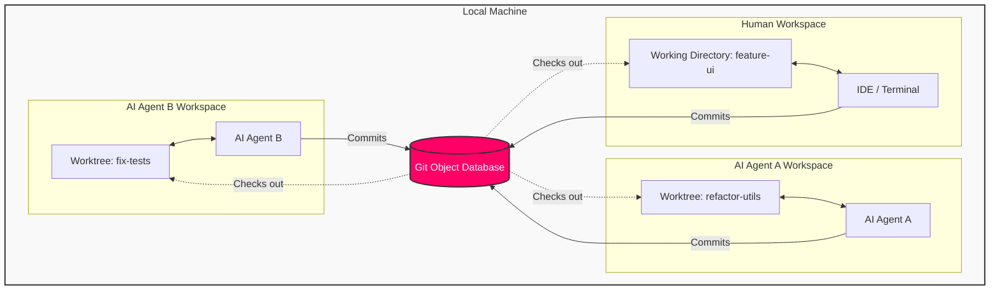

# Git Worktree: Master Parallel Development

Git Worktree is a powerful feature that allows you to manage multiple working trees attached to the same repository. This means you can check out more than one branch at a time in separate directories, all backed by the same local git repository.

## Why Use Git Worktree?

### 1. Instant Context Switching

Stop relying on `git stash` or "WIP" commits. If you're working on a complex feature and need to fix a critical bug on `main`:

1. Run `git worktree add ../hotfix main`
2. Fix the bug in the `../hotfix` directory.
3. Push and remove the worktree.
Your original workspace remains untouched, with all your uncommitted changes, running servers, and open files exactly as you left them.

### 2. Parallel Workflows

Run long-running processes on different branches simultaneously:

* **Test & Code**: Run the full test suite on a `release` branch worktree while you continue coding features in your main workspace.
* **Compare Versions**: Open two versions of your application side-by-side to visually compare behaviors or debug regressions.

## The Future of Work: Agentic Collaboration

As we move toward a world where humans collaborate with multiple AI Agents, Git Worktree becomes essential. It allows a human and multiple agents to work on the same codebase simultaneously without stepping on each other's toes (e.g., file locks, build artifacts, or changing the checked-out branch underneath someone).

### Visualization: Human + AI Swarm

In this model, the **Human** creates a dedicated worktree for an **AI Agent** to perform a specific task (e.g., refactoring, writing tests). The Agent works in its isolated directory, while the Human continues their high-level design work.



## Essential Commands

### Adding a Worktree

Create a new folder containing the checked-out branch.

```bash
# Syntax: git worktree add <path> <branch>
git worktree add ../my-feature feature-branch

# Create a new branch deeply linked to a worktree
git worktree add -b new-feature ../new-feature main
```

### Listing Worktrees

See all active worktrees for the current repository.

```bash
git worktree list
```

*Output:*

```
/path/to/repo       (main)
/path/to/my-feature (feature-branch)
```

### Removing a Worktree

When you're done, simply remove the worktree configuration.

```bash
git worktree remove ../my-feature
```

*Note: This does not delete the branch, only the working directory.*

### Pruning

If you manually deleted a worktree directory (e.g., `rm -rf ../my-feature`), Git might still think it exists. Clean up stale entries:

```bash
git worktree prune
```

## Mastering with LazyGit

[LazyGit](https://github.com/jesseduffield/lazygit) has excellent support for worktrees, making them even easier to use.

1. **Open Worktrees Panel**: In LazyGit, press `w` (depending on your keybinding configuration, usually accessible via the Status panel or by pressing `w` in the branches view).
2. **Add Worktree**: Press `n` to create a new worktree. You can specify the path and the branch.
3. **Switch**: Select a worktree and press `Enter` to switch to that directory (LazyGit will open that repo).
4. **Remove**: Press `d` on a worktree to remove it.

This UI-driven approach removes the friction of remembering paths and commands, making "throwaway workspaces" for reviews or quick fixes second nature.

## Best Practices

1. **Directory Structure**: Don't nest worktrees *inside* your main repository. It confuses tools and `.gitignore`.
    * **Bad**: `~/projects/my-app/worktree-feature`
    * **Good**:

        ```
        ~/projects/my-app-main/  (Bare repo or main worktree)
        ~/projects/my-app-feature/
        ~/projects/my-app-hotfix/
        ```

    * **Alternative**: Use a "bare" repository technique where the `.git` dir is the root, and all worktrees (including main) are folders side-by-side.
2. **Node Modules / Dependencies**: Remember that each worktree is a fresh directory. You will need to run `npm install`, `pip install`, or `cargo build` in the new worktree. This provides isolation but costs disk space.
    * *Tip*: Use `pnpm` to save disk space as it shares the content-addressable store across projects.
