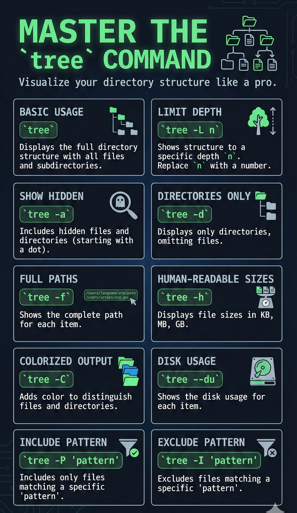
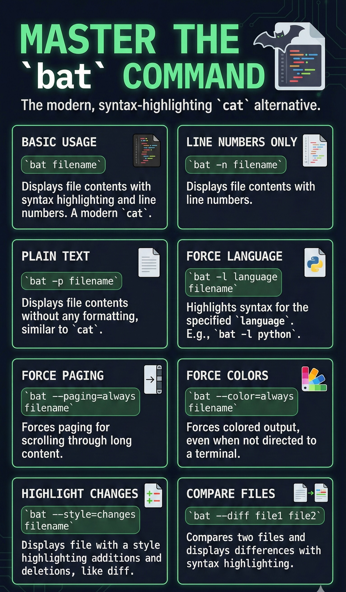

# Overview

In this I will capture various linux commands that I find useful while working on terminal.

## ripgrep

```cmd
rg "search_term"
```

This command searches for "search_term" in the current directory and all its subdirectories, displaying the matching lines along with their file names and line numbers. Ripgrep is known for its speed and efficiency compared to other search tools like grep or ack.

```cmd
rg -i "search_term"
```

This command performs a case-insensitive search for "search_term" in the current directory and all its subdirectories, displaying the matching lines along with their file names and line numbers.

```cmd
rg -w "search_term"
```

This command searches for whole word matches of "search_term" in the current directory and all its subdirectories, displaying the matching lines along with their file names and line numbers.

```cmd
rg -t py "search_term"
```

This command searches for "search_term" only in Python files (files with .py extension) in the current directory and all its subdirectories, displaying the matching lines along with their file names and line numbers. Similarly, you can use `-t` followed by other file extensions like `js`, `md`, `txt`, etc.

```cmd
rg "pattern" -g "*.md"
```

This command searches for "pattern" only in Markdown files (files with .md extension) in the current directory and all its subdirectories, displaying the matching lines along with their file names and line numbers. The `-g` option allows you to specify a glob pattern to filter the files to be searched.

```cmd
rg --hidden "search_term"
```

This command searches for "search_term" in the current directory and all its subdirectories, including hidden files and directories.

```cmd
rg -l "search_term"
```

This command lists only the names of files that contain "search_term", without displaying the matching lines.

```cmd
rg -r "replacement_text" "search_term"
```

This command replaces all occurrences of "search_term" with "replacement_text" on display only. It does not modify the files. To actually replace text in files, you would need to use additional tools like `sed` or `perl`.

```cmd
rg --files
```

This command lists all files in the current directory and its subdirectories.

```cmd
rg --files | fzf
```

This command lists all files and allows you to interactively search and select a file using fzf (a command-line fuzzy finder).

```cmd
rg "search_term" --json
```

This command outputs the search results in JSON format, which can be useful for further processing or integration with other tools.


## fd

```cmd
fd "pattern"
```

This command searches for files and directories matching "pattern" in the current directory and its subdirectories. It is a simple, fast, and user-friendly alternative to the traditional find command.

Note: You can combine `fd` with `rg` to search for content within files that match a certain pattern. For example:

```cmd
rg "search_term" $(fd "pattern")
```

This command first finds all files matching "pattern" using `fd`, and then searches for "search_term" within those files using `rg`.

```cmd
fd -i "pattern"
```

This command performs a case-insensitive search for files and directories matching "pattern" in the current directory and its subdirectories.

```cmd
fd -I "pattern"
```

This command performs a case-sensitive search for files and directories matching "pattern" in the current directory and its subdirectories.

```cmd
fd pattern -E "exclude_pattern" -E ".git"
```

This command searches for files and directories matching "pattern" in the current directory and its subdirectories, excluding those that match "exclude_pattern".

```cmd
fd -e "ext"
```

This command searches for files with the specified extension "ext" in the current directory and its subdirectories. For example, `fd -e py` will find all Python files.

```cmd
fd -t d "pattern"
```

This command searches for directories matching "pattern" in the current directory and its subdirectories. The `-t d` option specifies that only directories should be searched.

```cmd
fd -t f "pattern"
```

This command searches for files matching "pattern" in the current directory and its subdirectories. The `-t f` option specifies that only files should be searched.

```cmd
fd --hidden "pattern"
```

This command searches for files and directories matching "pattern" in the current directory and its subdirectories, including hidden files and directories.

```cmd
fd --exec "command {}"
```

This command executes the specified "command" on each file or directory that matches "pattern". The `{}` placeholder is replaced with the matched file or directory name. For example, `fd --exec "cat {}"` will display the contents of each matched file.

```cmd
fd -e log -X rm
```

This command finds all files with the `.log` extension and deletes them. The `-X` option is used to execute the specified command (`rm` in this case) on the matched files.


## tree

```cmd
tree
```

This command displays the directory structure of the current directory in a tree-like format, showing all files and subdirectories.

```cmd
tree -L n
```

This command displays the directory structure of the current directory up to a depth of `n` levels. Replace `n` with the desired number of levels.

```cmd
tree -a
```

This command displays the directory structure of the current directory, including hidden files and directories (those starting with a dot).

```cmd
tree -d
```

This command displays only the directories in the current directory structure, omitting files.  

```cmd
tree -f
```

This command displays the full path of each file and directory in the tree structure.

```cmd
tree -h
```

This command displays the directory structure of the current directory with human-readable file sizes (e.g., KB, MB).

```cmd
tree -C
```

This command displays the directory structure of the current directory with colorized output, making it easier to distinguish between files and directories.

```cmd
tree --du
```

This command displays the directory structure of the current directory along with the disk usage of each file and directory.

```cmd
tree -P "pattern"
```

This command displays the directory structure of the current directory, including only files and directories that match the specified "pattern". The pattern can include wildcards (e.g., `*.txt` to match all text files).

```cmd
tree -I "pattern"
```

This command displays the directory structure of the current directory, excluding files and directories that match the specified "pattern". The pattern can include wildcards (e.g., `*.log` to exclude all log files).



## bat

```cmd
bat filename
```

This command displays the contents of "filename" with syntax highlighting and line numbers. It is a modern alternative to the traditional `cat` command.

```cmd
bat -n filename
```

This command displays the contents of "filename" with line numbers.

```cmd
bat -p filename
```

This command displays the contents of "filename" without any additional formatting, similar to the traditional `cat` command.

```cmd
bat -l language filename
```

This command displays the contents of "filename" with syntax highlighting for the specified programming "language". For example, `bat -l python script.py` will highlight the syntax as Python code.

```cmd
bat --paging=always filename
```

This command forces paging for the output of "filename", allowing you to scroll through the content if it exceeds the terminal height.

```cmd
bat --color=always filename
```

This command forces colored output for the contents of "filename", even when the output is not directed to a terminal.

```cmd
bat --style=changes filename
```

This command displays the contents of "filename" with a style that highlights changes, such as additions and deletions, similar to a diff view.

```cmd
bat --diff file1 file2
```

This command compares "file1" and "file2" and displays the differences between them with syntax highlighting.



## openvpn

```cmd
sudo openvpn --config /path/to/config.ovpn
```

This command starts an OpenVPN connection using the specified configuration file located at `/path/to/config.ovpn`. You may need superuser privileges to run this command, hence the use of `sudo`.

```cmd
sudo systemctl start openvpn@config
```

This command starts the OpenVPN service using a configuration file named `config.conf` located in the `/etc/openvpn/` directory. Replace `config` with the actual name of your configuration file (without the `.conf` extension).

```cmd
sudo systemctl stop openvpn@config
```

This command stops the OpenVPN service that was started with the configuration file named `config.conf`. Replace `config` with the actual name of your configuration file (without the `.conf` extension).

```cmd
sudo systemctl status openvpn@config
```

This command checks the status of the OpenVPN service that was started with the configuration file named `config.conf`. Replace `config` with the actual name of your configuration file (without the `.conf` extension).

```cmd
sudo journalctl -u openvpn@config
```

This command displays the log entries for the OpenVPN service that was started with the configuration file named `config.conf`. Replace `config` with the actual name of your configuration file (without the `.conf` extension).

```cmd
sudo openvpn --config /path/to/config.ovpn --daemon
```

This command starts an OpenVPN connection in the background (daemon mode) using the specified configuration file located at `/path/to/config.ovpn`.

```cmd
sudo openvpn --config /path/to/config.ovpn --log /path/to/logfile.log
```

This command starts an OpenVPN connection using the specified configuration file located at `/path/to/config.ovpn` and logs the output to `/path/to/logfile.log`.

```cmd
sudo openvpn --config /path/to/config.ovpn --auth-user-pass /path/to/credentials.txt
```

This command starts an OpenVPN connection using the specified configuration file located at `/path/to/config.ovpn` and uses the credentials stored in `/path/to/credentials.txt` for authentication.

## zoxide

```cmd
z
```

This command displays the current directory ranking list maintained by zoxide, showing the most frequently and recently accessed directories.

```cmd
z <pattern> 
```

This command changes the current directory to the most relevant directory that matches the specified "pattern". Zoxide uses a ranking algorithm based on frequency and recency of access to determine the best match.

```cmd
z -l
```

This command lists all directories tracked by zoxide along with their scores, which indicate how frequently and recently each directory has been accessed.

```cmd
z -r
```

This command refreshes the zoxide database by rescanning the filesystem for directories. It updates the ranking list based on any new directories that have been added or removed since the last scan.

```cmd
z -c
```

This command clears the zoxide database, removing all tracked directories and their associated scores. Use this command with caution, as it will reset your directory history.

## eza

```cmd
eza
```

This command lists the contents of the current directory with enhanced formatting, including colors and icons, making it easier to distinguish between different file types.

```cmd
eza -l
```

This command lists the contents of the current directory in a long format, displaying detailed information such as file permissions, ownership, size, and modification date.

```cmd
eza -a
```

This command lists all files and directories in the current directory, including hidden files (those starting with a dot).

```cmd
eza -h
```

This command lists the contents of the current directory with human-readable file sizes (e.g., KB, MB).

```cmd
eza -R
```

This command lists the contents of the current directory and all its subdirectories recursively, displaying the entire directory tree.

```cmd
eza --icons
```

This command lists the contents of the current directory with icons representing different file types, enhancing visual identification.

```cmd
eza -s size
```

This command lists the contents of the current directory sorted by file size, with the largest files appearing first.

```cmd
eza -s modified
```

This command lists the contents of the current directory sorted by modification date, with the most recently modified files appearing first.

```cmd
eza --git
```

This command lists the contents of the current directory with Git status indicators, showing which files are modified, staged, or untracked in a Git repository.

```cmd
eza -T
```

This command lists the contents of the current directory in a tree-like format, displaying the hierarchical structure of files and directories.

```cmd
eza -F
```

This command lists the contents of the current directory and appends a character to each file name to indicate its type (e.g., `/` for directories, `*` for executable files).

## jq

```cmd
jq '.'
```

This command pretty-prints the input JSON data, making it easier to read and understand.

```cmd
jq '.[0]'
```

This command extracts and displays the first element of a JSON array.

```cmd
jq '.key'
```

This command extracts and displays the value associated with "key" in a JSON object.

```cmd
jq '.key1.key2'
```

This command extracts and displays the value associated with "key2" nested within "key1" in a JSON object.

```cmd
jq '.[].key'
```

This command extracts and displays the values associated with "key" from all objects in a JSON array.

```cmd
jq 'map(.key)'
```

This command creates a new array containing the values associated with "key" from all objects in a JSON array.

```cmd
jq 'select(.key == "value")'
```

This command filters and displays objects from a JSON array where the value of "key" matches "value".

```cmd
jq '.[].key | length'
```

This command calculates and displays the length of the values associated with "key" from all objects in a JSON array.

```cmd
jq '.[].key |= "new_value"'
```

This command updates the value associated with "key" to "new_value" for all objects in a JSON array.

```cmd
jq 'del(.key)'
```

This command deletes the "key" and its associated value from all objects in a JSON array.

```cmd
jq '.[].key1 += .key2'
```

This command adds the value of "key2" to "key1" for all objects in a JSON array.

## curl

```cmd
curl http://example.com
``` 

This command retrieves the content of the specified URL (http://example.com) and displays it in the terminal.

```cmd
curl -O http://example.com/file.txt
```

This command downloads the file located at the specified URL (http://example.com/file.txt) and saves it with the same name in the current directory.

```cmd
curl -o myfile.txt http://example.com/file.txt
```

This command downloads the file located at the specified URL (http://example.com/file.txt) and saves it as "myfile.txt" in the current directory.

```cmd
curl -I http://example.com
```

This command retrieves only the HTTP headers of the specified URL (http://example.com) without downloading the actual content.

```cmd
curl -L http://example.com
```

This command follows any redirects that may occur when accessing the specified URL (http://example.com) and retrieves the final content.

```cmd
curl -d "param1=value1&param2=value2" -X POST http://example.com
``` 

This command sends a POST request to the specified URL (http://example.com) with the provided data parameters (param1 and param2).

```cmd
curl -H "Authorization: Bearer YOUR_TOKEN" http://example.com
```

This command sends a GET request to the specified URL (http://example.com) with an Authorization header containing a bearer token.

```cmd
curl -u username:password http://example.com
```

This command sends a GET request to the specified URL (http://example.com) with basic authentication using the provided username and password.

```cmd
curl -x http://proxyserver:port http://example.com
```

This command sends a GET request to the specified URL (http://example.com) using the specified proxy server (http://proxyserver:port).

```cmd
curl -X POST -H "Content-Type: application/json" -d '{"key1":"value1","key2":"value2"}' http://example.com
```

This command sends a POST request to the specified URL (http://example.com) with a JSON payload containing key-value pairs.

```cmd
curl -X POST http://example.com -d @data.json
```

This command sends a POST request to the specified URL (http://example.com) with the contents of the "data.json" file as the request body.

## docker

```cmd
docker run image_name
```

This command runs a Docker container based on the specified image (image_name). If the image is not available locally, Docker will attempt to pull it from a registry.

```cmd
docker ps
```

This command lists all currently running Docker containers, displaying information such as container ID, image name, status, and ports.

```cmd
docker ps -a
```

This command lists all Docker containers, including those that are currently stopped, displaying information such as container ID, image name, status, and ports.

```cmd
docker stop container_id
```

This command stops a running Docker container identified by its container ID (container_id).

```cmd
docker rm container_id
```

This command removes a stopped Docker container identified by its container ID (container_id).

```cmd
docker images
```

This command lists all Docker images available locally on the system, displaying information such as repository name, tag, image ID, and size.

```cmd
docker rmi image_name
```

This command removes a Docker image identified by its name (image_name) from the local system.

```cmd
docker build -t image_name .
```

This command builds a Docker image from a Dockerfile located in the current directory (.) and tags it with the specified name (image_name).

```cmd
docker pull image_name
```

This command pulls a Docker image identified by its name (image_name) from a Docker registry (e.g., Docker Hub) to the local system.

```cmd
docker push image_name
```

This command pushes a Docker image identified by its name (image_name) from the local system to a Docker registry (e.g., Docker Hub).

```cmd
docker logs container_id
```

This command retrieves and displays the logs of a Docker container identified by its container ID (container_id).

```cmd
docker exec -it container_id /bin/bash
```

This command opens an interactive bash shell inside a running Docker container identified by its container ID (container_id).

```cmd
docker run -p host_port:container_port image_name
```

This command runs a Docker container based on the specified image (image_name) and maps a port from the host machine (host_port) to a port inside the container (container_port).

```cmd
docker run -d image_name
```

This command runs a Docker container based on the specified image (image_name) in detached mode, allowing it to run in the background.

```cmd
docker run -V /host/path:/container/path image_name
```

This command runs a Docker container based on the specified image (image_name) and mounts a volume from the host machine (/host/path) to a path inside the container (/container/path).

```cmd
docker logs -f container_id
```

This command retrieves and continuously streams the logs of a Docker container identified by its container ID (container_id).

```cmd
docker system prune
```

This command removes all unused Docker data, including stopped containers, unused networks, dangling images, and build cache, to free up disk space.

```cmd
docker inspect container_id
```

This command retrieves detailed information about a Docker container identified by its container ID (container_id), including configuration, network settings, and resource usage.

```cmd
docker run -e "ENV_VAR_NAME=value" image_name
```

This command runs a Docker container based on the specified image (image_name) and sets an environment variable (ENV_VAR_NAME) with the specified value (value) inside the container.

## docker-compose

```cmd
docker-compose up
```

This command starts all the services defined in the `docker-compose.yml` file, creating and running the containers as specified in the configuration.

```cmd
docker-compose down
```

This command stops and removes all the containers, networks, and volumes created by `docker-compose up`, effectively tearing down the entire application stack defined in the `docker-compose.yml` file.

```cmd
docker-compose ps
```

This command lists all the containers managed by Docker Compose, displaying their current status, names, and other relevant information.

```cmd
docker-compose build
```

This command builds or rebuilds the Docker images for all the services defined in the `docker-compose.yml` file, based on the specified build context and Dockerfile.

```cmd
docker-compose logs
```

This command retrieves and displays the logs of all the services managed by Docker Compose, allowing you to monitor their output and diagnose issues.

```cmd
docker-compose exec service_name command
```

This command executes a specified command (command) inside a running container of the specified service (service_name) managed by Docker Compose.

```cmd
docker-compose up -d
```

This command starts all the services defined in the `docker-compose.yml` file in detached mode, allowing them to run in the background.

```cmd
docker-compose up -d --build
```

This command builds the Docker images for all services defined in the `docker-compose.yml` file and starts them in detached mode, allowing them to run in the background.

```cmd
docker-compose logs -f
```

This command retrieves and continuously streams the logs of all the services managed by Docker Compose, allowing you to monitor their output in real-time.

```cmd
docker-compose restart service_name
```

This command restarts the specified service (service_name) managed by Docker Compose, stopping and then starting its container.

```cmd
docker-compose down -V
```

This command stops and removes all the containers, networks, and volumes created by `docker-compose up`, including any named volumes defined in the `docker-compose.yml` file.

```cmd
docker-compose up -d --scale service_name=num
```

This command starts the specified service (service_name) in detached mode and scales it to the specified number of instances (num), allowing multiple containers of the same service to run concurrently.

## lazydocker

```cmd
lazydocker
```

This command launches the LazyDocker terminal user interface, allowing you to manage Docker containers, images, volumes, and networks interactively.

```cmd
lazydocker -p /path/to/docker-compose.yml
```

This command launches the LazyDocker terminal user interface with a specific Docker Compose file located at `/path/to/docker-compose.yml`, allowing you to manage the services defined in that file interactively.

## systemctl (this is only for systemd based linux systems)

```cmd
systemctl start service_name
```

This command starts the specified service (service_name) on a Linux system that uses systemd as its init system.

```cmd
systemctl stop service_name
```

This command stops the specified service (service_name) on a Linux system that uses systemd as its init system.

```cmd
systemctl restart service_name
```

This command restarts the specified service (service_name) on a Linux system that uses systemd as its init system.  

```cmd
systemctl status service_name
```

This command checks the status of the specified service (service_name) on a Linux system that uses systemd as its init system, displaying whether the service is active, inactive, or failed, along with additional information such as recent log entries.

```cmd
systemctl enable service_name
```

This command enables the specified service (service_name) to start automatically at boot time on a Linux system that uses systemd as its init system.

```cmd
systemctl disable service_name
```

This command disables the specified service (service_name) from starting automatically at boot time on a Linux system that uses systemd as its init system.

```cmd
systemctl reload service_name
```

This command reloads the configuration of the specified service (service_name) without stopping or restarting it on a Linux system that uses systemd as its init system.

```cmd
systemctl is-active service_name
```

This command checks whether the specified service (service_name) is currently active (running) on a Linux system that uses systemd as its init system. It returns "active" if the service is running and "inactive" if it is not.

```cmd
systemctl is-enabled service_name
```

This command checks whether the specified service (service_name) is enabled to start automatically at boot time on a Linux system that uses systemd as its init system. It returns "enabled" if the service is set to start at boot and "disabled" if it is not.

```cmd
systemctl list-units --type=service
```

This command lists all active services on a Linux system that uses systemd as its init system, displaying their current status and other relevant information.

```cmd
systemctl list-unit-files --type=service
```

This command lists all installed service unit files on a Linux system that uses systemd as its init system, displaying whether each service is enabled, disabled, static, or masked.

```cmd
systemctl daemon-reload
```

This command reloads the systemd manager configuration on a Linux system that uses systemd as its init system. It is typically used after making changes to service unit files to apply the new configuration without restarting the system.

```cmd
systemctl journalctl -u service_name
```

This command displays the log entries for the specified service (service_name) on a Linux system that uses systemd as its init system, allowing you to view recent logs and diagnose issues.

## lsof

```cmd
lsof
```

This command lists all open files and the processes that opened them on the system.

```cmd
lsof -i
```

This command lists all open network files, including network connections and listening ports.

```cmd
lsof -u username
```

This command lists all open files for the specified user (username).

```cmd
lsof -p pid
```

This command lists all open files for the specified process ID (pid).   

```cmd
lsof +D /path/to/directory
``` 

This command lists all open files within the specified directory (/path/to/directory) and its subdirectories.

```cmd
lsof /path/to/file
```

This command lists all processes that have the specified file (/path/to/file) open.

```cmd
lsof -t -i :port
```

This command lists the process IDs (PIDs) of processes that are using the specified network port (port).

```cmd
lsof -n -P
```

This command lists all open files without resolving hostnames (-n) and without converting port numbers to service names (-P), providing raw numerical output.

## ss (for linux only)

```cmd
ss 
``` 

This command displays all active network connections and listening sockets on the system.

```cmd
ss -t
```

This command displays all active TCP network connections on the system.

```cmd
ss -u
```

This command displays all active UDP network connections on the system.

```cmd
ss -l
```

This command displays all listening sockets on the system.

```cmd
ss -p
```

This command displays all active network connections along with the process IDs (PIDs) and names of the processes that opened them.

```cmd
ss -r
```

This command displays all active network connections along with their routing information.

```cmd
ss -s
```

This command provides a summary of socket statistics, including the number of sockets in various states (e.g., established, listening, closed).

## procs

```cmd
procs
```

This command displays a list of all running processes on the system with detailed information such as PID, user, CPU and memory usage, and command name.

```cmd
procs -u username
```

This command displays a list of all running processes owned by the specified user (username) with detailed information such as PID, CPU and memory usage, and command name.

```cmd
procs -p pid
```

This command displays detailed information about the process with the specified process ID (pid), including CPU and memory usage, user, and command name.

```cmd
procs -s
``` 

This command displays a summary of system resource usage, including CPU, memory, and I/O statistics.

```cmd
procs -t
```

This command displays a tree view of all running processes, showing the parent-child relationships between processes.

```cmd
procs -m
```

This command displays a list of all running processes sorted by memory usage, with detailed information such as PID, user, CPU and memory usage, and command name.

```cmd
procs -c
```

This command displays a list of all running processes sorted by CPU usage, with detailed information such as PID, user, CPU and memory usage, and command name.

```cmd
procs -f
``` 

This command displays a full-format listing of all running processes, including additional information such as start time, terminal, and more.

## watch

```cmd
watch command
```

This command runs the specified command repeatedly at regular intervals (default is every 2 seconds) and displays the output in the terminal, allowing you to monitor changes over time.

```cmd
watch -n seconds command
```

This command runs the specified command repeatedly at the specified interval (in seconds) and displays the output in the terminal. Replace "seconds" with the desired interval time.

```cmd
watch -d command
```

This command runs the specified command repeatedly and highlights the differences between successive outputs, making it easier to spot changes.

```cmd
watch -t command
``` 

This command runs the specified command repeatedly without displaying the header information (such as the interval and timestamp) in the terminal output.

```cmd
watch -g command
```

This command runs the specified command repeatedly and exits when the output of the command changes, allowing you to monitor for specific changes.

## ip

```cmd
ip addr show
```

This command displays all network interfaces and their associated IP addresses on the system.

```cmd
ip link show
```

This command displays all network interfaces on the system along with their status and configuration details.

```cmd
ip route show
```

This command displays the current routing table on the system, showing how network traffic is directed.

```cmd
ip addr add IP_ADDRESS/CIDR dev INTERFACE
```

This command assigns the specified IP address (IP_ADDRESS) with the given CIDR notation (CIDR) to the specified network interface (INTERFACE).

```cmd
ip addr del IP_ADDRESS/CIDR dev INTERFACE
```

This command removes the specified IP address (IP_ADDRESS) with the given CIDR notation (CIDR) from the specified network interface (INTERFACE).

```cmd
ip link set INTERFACE up
```

This command brings the specified network interface (INTERFACE) up, enabling it for use.

```cmd
ip link set INTERFACE down
```

This command brings the specified network interface (INTERFACE) down, disabling it from use.

```cmd
ip route add NETWORK/CIDR via GATEWAY dev INTERFACE
```

This command adds a new route to the specified network (NETWORK) with the given CIDR notation (CIDR) via the specified gateway (GATEWAY) on the specified network interface (INTERFACE).

```cmd
ip route del NETWORK/CIDR
```

This command deletes the route to the specified network (NETWORK) with the given CIDR notation (CIDR) from the routing table.

```cmd
ip neigh show
```

This command displays the current ARP (Address Resolution Protocol) table, showing the mapping of IP addresses to MAC addresses for devices on the local network.

## dig

```cmd
dig domain_name
```

This command performs a DNS lookup for the specified domain name (domain_name) and displays the associated DNS records, including A, AAAA, CNAME, MX, and others.

## mtr

```cmd
mtr domain_name
```

This command starts a network diagnostic tool that combines the functionality of traceroute and ping to provide real-time information about the route and performance of packets to the specified domain name (domain_name).

## ncdu

```cmd
ncdu
```

This command launches the ncdu (NCurses Disk Usage) interface, allowing you to analyze and visualize disk usage in the current directory and its subdirectories interactively.

```cmd
ncdu /path/to/directory
```

This command launches the ncdu (NCurses Disk Usage) interface for the specified directory (/path/to/directory), allowing you to analyze and visualize disk usage in that directory and its subdirectories interactively.

## tldr

```cmd
tldr command_name
```

This command retrieves and displays a simplified and concise explanation of the specified command (command_name), along with common usage examples, making it easier to understand and use the command effectively.

## shellcheck

```cmd
shellcheck script.sh
```

This command analyzes the specified shell script (script.sh) for potential errors, warnings, and best practices, providing suggestions for improving the script's quality and reliability.

## perf

```cmd
perf stat command
```

This command runs the specified command (command) and collects performance statistics, such as CPU cycles, instructions, cache misses, and more, providing insights into the command's performance characteristics.

## git grep

```cmd
git grep "search_term"
```

This command searches for the specified "search_term" within the files tracked by Git in the current repository, displaying the matching lines along with their file names and line numbers.

## git worktree

```cmd
git worktree add /path/to/new/worktree branch_name
```

This command creates a new working tree at the specified path (/path/to/new/worktree) and checks out the specified branch (branch_name) into that working tree, allowing you to work on multiple branches simultaneously in separate directories.

## git bisect start

```cmd
git bisect start
```

This command initiates the Git bisect process, which helps you identify the specific commit that introduced a bug or issue in your codebase by performing a binary search through the commit history.

```cmd
git bisect bad
```

This command marks the current commit as "bad" during the Git bisect process, indicating that the bug or issue is present in this commit.

```cmd
git bisect good commit_hash
```

This command marks the specified commit (commit_hash) as "good" during the Git bisect process, indicating that the bug or issue is not present in this commit.

```cmd
git bisect reset
```

This command ends the Git bisect process and returns the repository to the original HEAD state before the bisect started.

## delta

```cmd
git diff | delta
```

This command pipes the output of `git diff` through `delta`, a syntax-highlighting pager for Git diffs, providing a more readable and visually appealing representation of the differences between commits or branches.
