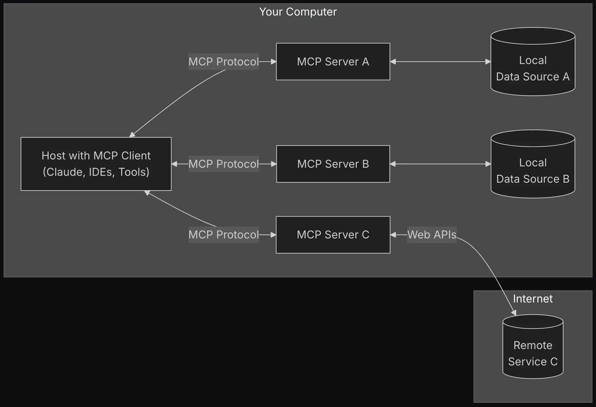

# MCP (Model Context Protocol)

Its a Protocol to enable integration between LLM applications and external data sources and tools.

- Standardizes way to connect AI models to different data sources and tools.
- MCP Provides:
  
  - List of pre-built integrations that your LLM can directly plug into.
  - Flexibility to swiitch between LLM providers and vendors
  - Best practices for securing your data within your infrastructure.

## MCP Components

### MCP Hosts:

Programs like Claude desktop, IDEs, or AI tools.

### MCP Clients:

Protocol clients that maintain 1:1 connections with servers.

### MCP Servers:

Lightweight programs exposes specific capabilities.

## MCP Architecture

MCP Follows a client-server Architecture.




## MCP Servers

It can provide three main types of capabilities:

1. **Resources**: File-like data that can be read by clients.
2. **Tools**: Function that can be called by LLM (with user approval).
3. **Prompts**: Pre-written templates that help users accomplish specific tasks.

## Message types

MCP has these main types of messages:

1. **Requests** expect a response from the other side.

2. **Results** are successful responses to requests.

3. **Errors** indicate that a request failed.

4. **Notifications** are one-way messages that don't expect a response.


```
```


```


