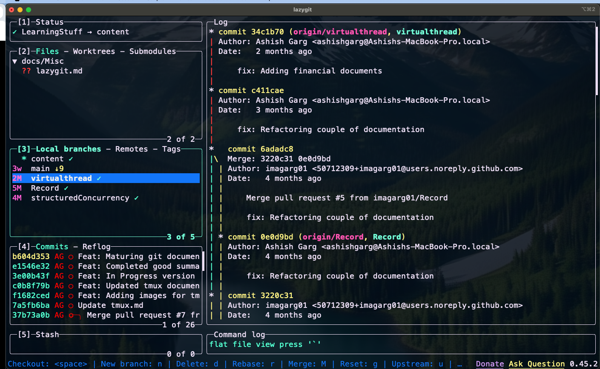

# Overview

Lazygit is an  terminal-base user interface (TUI) written in Go that provides a keyboard-driven, intuitive interface for interacting with Git repositories. Instead of typing long commands, you can perform these actions with single keypresses.

The interface is divided into panels—such as 
- Files  
- Commits 
- Branches
- Stash 
- Status
- Command Log: A command log shows the Git commands executed behind the scenes, making it a great learning tool as well.

Here you can see how, all these panels are arranged in the interface:

## Key Features of lazygit

- **Interactive Staging**: Stage or unstage files, hunks, or even individual lines with minimal effort.

- **Commit Management**: Amend, squash, reword, or drop commits directly from the interface.

- **Interactive Rebase**: Simplify complex rebasing tasks without editing a TODO file manually.

- **Branch Management**: Create, switch, merge, or delete branches with ease.

- **Visual Diffs**: View changes in real-time as you stage or review commits.

- **Stash Handling**: Stash and apply changes quickly.

- **Conflict Resolution**: Resolve merge conflicts within the tool.

- **Keyboard-Driven**: Perform actions with single keystrokes, reducing reliance on the mouse.

## How to Leverage Lazygit’s Power
To make the most of Lazygit, here’s how you can integrate it into your workflow and harness its capabilities:

1. Install and Set Up
Install Lazygit via package managers like Homebrew (brew install lazygit), apt, or from its GitHub releases page.
Open it in a Git repository by typing lazygit in your terminal.
Optionally, set an alias (e.g., alias lg='lazygit') in your shell configuration (.bashrc, .zshrc, etc.) for quick access.

2. Master the Basics
- **Navigation**: Use arrow keys or Vim-style bindings (h, j, k, l) to move between panels and items. Switch panels with number keys (1 for Status, 2 for Files, etc.) or Tab.

- **Staging Files**: In the Files panel, press Space to stage/unstage a file. Press a to stage all changes.

- **Committing**: Stage your changes, press c, write a commit message, and hit Enter.

- **Keybindings Help**: Press ? in any panel to see context-specific shortcuts.

3. Streamline Daily Tasks
- **Quick Commits**: Instead of typing git add . && git commit -m "message", use Lazygit to stage files visually and commit with c.

- **Review Changes**: Highlight a file and press Enter to see its diff. Stage specific lines by navigating to them and pressing Space.

- **Push/Pull**: Use Shift+P to push and p to pull, ensuring your branch stays in sync.

4. Tame Complex Workflows
- **Interactive Rebase**: Navigate to the Commits panel, select a commit, and press e to start an interactive rebase. Use s to squash, r to reword, or d to drop commits—all without touching a TODO file.

- **Amend Commits**: Stage changes, go to a commit, and press Shift+A to amend it instantly.

- **Resolve Conflicts**: When a merge or rebase conflict arises, Lazygit’s power lies in its ability to make Git’s complexity accessible without sacrificing control. For example:
Staging a single line from a file takes seconds in Lazygit (Enter on file, Space on line) versus multiple CLI commands (git add -p, then navigating hunks).

5. Boost Efficiency with Advanced Features
- **Stashing**: Press Shift+S to stash all changes or use w to see stash options (e.g., stash staged changes only). Apply stashes with Space.

- **Branch Switching**: Go to the Branches panel, hit c to checkout by name, or n to create a new branch.

- **Undo Mistakes**: Use Ctrl+Z to undo certain actions (limited by Git’s reflog), providing a safety net for experimentation.

6. Customize to Your Needs
Edit the configuration file (typically at ~/.config/lazygit/config.yml) to tweak keybindings, themes, or behavior (e.g., auto-fetch interval).

Integrate with tools like pre-commit hooks, which Lazygit supports, to enforce code quality.

