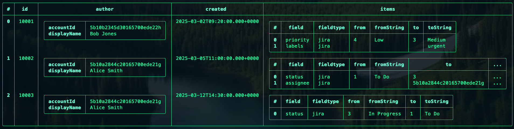

# Overview

- It works on Windows, macOS, and Linux, and is designed to be fast and efficient. It is built on top of the Rust programming language, which makes it fast and secure. It is also extensible, so you can add your own commands and plugins to customize it to your needs.

- NuShell works on data, not just text. This means that you can use it to work with structured data like JSON, CSV, and XML, as well as text files. It also has built-in support for working with files, directories, and processes, so you can use it to automate tasks and build scripts.

- It follows unix philosophy of small, sharp tools that do one thing well. This means that you can combine commands together to build complex pipelines that do exactly what you need them to do. It also has a powerful scripting language that lets you write scripts to automate tasks and  build complex workflows.

- Every command in Nushell outputs data not text. This means that you can use the output of one command as the input to another command, and you can use the output of a command to create new data structures. This makes it easy to work with data in a flexible and powerful way.

- Data could be in any format, NuShell provides a way to convert data from one format to another. It also provides a way to filter data, sort data, and aggregate data. It also provides a way to create new data structures from existing data structures.

- **Pros**

    1. It makes shell interactive and user-friendly.
    2. Works everywhere and easy to learn.
    3. Error messages are clear and easy to understand.
    4. Can be enhanced with plugins.

- **Cons**

    1. Not Posix compliant.

## Few Examples

- Print the current directory and filter the output based on different criteria.

    ```cmd
    ls | where size > 100kb
    ```

    It will print the files in the current directory whose size is greater than 100kb in a nice tabular format.

- Print the current directory and sort the output based on different criteria.

    ```cmd
    ls | sort-by name --ignore-case
    ```

    It will print the files in the current directory sorted by name in a case-insensitive manner.

- Perform multiple operations in a single command.

    ```cmd
    ls | sort-by size | reverse | first | get name
    ```

    It will print the name of the largest file in the current directory.

- For better readability, you can also write multi-line operations. To put a command on multi-line, put '|' after the command and press enter. For example:

    ```cmd
    ls |
    sort-by size |
    reverse |
    first
    ```

- As every command generates a table, you can fetch the data against a column from the table using the get command. For example:

    ```cmd
    ls |
    sort-by size |
    reverse |
    first |
    get name
    ```

- **Wildcards**: If you want to list the files that end in ".md", you can achieve it like:

    ```cmd
    ls *.md
    ```

    Nushell also supports a double wildcard "**" which matches any number of characters, including directories. For example, "ls**/*.md" will list all the non-hidden paths nested under the current directory that end in ".md".

- **Http**: Nushell has a built-in http get command and handles JSON data natively. For example:

    ```cmd
    http get https://api.github.com/repos/nushell/nushell/contributors | select login contributions
    ```

- **Opening Files**: Nushell has a powerful open command. For example:

    ```cmd
    open editors/vscode/package.json
    ```

    will print the JSON data in the form of a table. Nu currently supports opening files in the following formats: json, toml, yaml, xml, csv, ini, hcl, and plist, etc.

- **Pipeline**: A pipeline is composed of three parts: the input, the filter, and the output. For example:

    ```cmd
    open Cargo.toml | update workspace.dependencies.base64 0.24.2 | save Cargo_new.toml
    ```

    Here:
  - open Cargo.toml: The input is the contents of the file Cargo.toml.
  - update workspace.dependencies.base64 0.24.2: The filter is the update command, which updates the base64 dependency to version 0.24.2.
  - save Cargo_new.toml: The output is the new contents of the file Cargo_new.toml.

- Working with **variables**

  - String

    ```cmd
    let name = "Ashish"
    echo $name
    ```

  - list

    ```cmd
    let number = [1,2,3,4]
    echo $number.2
    ```

## Work with JSON

Let's take an sample JSON file. I am taking [this](./sample.json) as reference to explain.

Here we are opening this JSON and loading into a variable. Then we are filtering the data based on some criteria.

```cmd
let issue = (open sample.json)
```

Now take few examples what we can do.

- List all history.

    ```cmd
    $issue.changelog.histories
    ```

    

- Let's iterate over comments and see who commented.

    ```cmd
    $$issue.fields.comments | each { |comment| $"($comment.author.displayName): ($comment.body)" }
    ```

    

- Now let's see if we want to when and what status changes happened

    ```cmd
    $issue.changelog.histories
    | where { |row| "status" in ($row.items | get field) }
    | each { |row| {created: $row.created, new_status: ($row.items | where field == "status" | get toString | first)} }
    | select created new_status
    ```
    

    **Explaination**
  - where { |row| "status" in ($row.items | get field) }: Filters rows where items contains a field of "status"
  - each { |row| {created: $row.created, new_status: (...)} }: Processes each filtered row, creating a new record with created and a computed new_status (extracted from the items list where field == "status").
  - select created new_status: Selects the two columns from the resulting records.


### What we have learned in this

1. **Structured Data Handling**: Nushell converts JSON into records and tables, making navigation and filtering easier.
2. **Dot Notation**: Simplified access to nested data fields (e.g. fields.assignee.displayName).
3. **List Processing**: Nushell provides a way to iterate over lists and apply functions to each element. Commands like each, where, select, etc., are used to filter and transform data.
4. **Filtering and Querying**: Nushell provides a way to filter data based on certain criteria and query data based on specific fields. where, select, get, etc., are used for this purpose.
5. **Custom Commands**: Nushell allows you to create custom commands to perform specific tasks. To have recursive and complex logic for deep hierarchies.
6. Pipeline Power: Chaining commands together to make complex workflows concise and readable.

## Bonus Tips

1. Command Pipelines and Data Transformations

    Nushell's pipeline-driven approach lets you chain commands to transform data seemlessly.
      - **Piping**: Pass data between commands with |.
      - **Data Shaping**: Use ***select***,***reject***,***rename***, and ***update*** to reshape tables or records.

      ```cmd
      open issue.json | get fields | select summary issuetype.name priority.name | rename title type urgency
      ```
2. Working with External Commands

    Nushell integrates external shell commands (e.g., git, curl, etc.) while treating their output as structured data when possible.

      ```cmd
      curl -s "https://your-domain.atlassian.net/rest/api/3/issue/10002" -u "user:token" | from json | get fields.summary
      ```
  
    Here we are fetching the summary of an issue from Jira using curl and parsing the JSON output to get the summary field.

3. Conditional Logic and Control Flow

    Nushell supports conditionals and loops, crucial for dynamic workflows.
    
    - **If-Else**: Use if for branching
    - **Loops**: for, while and each for iteration

      ```cmd
      let issue = (open issue.json)
      if ($issue.fields.labels | any { |label| $label == "urgent" }) {
          echo "Urgent issue detected!"
      } else {
          echo "No urgency."
      }
      ```
4. Error Handling
   
   Nushell error handling ensure robust sctipts:

    - **Try-Catch**: Use try and catch to manage failures.
    - **Optional Access**: Use 'get -i' to safely handles missing keys.

      ```cmd
      let issue = (open issue.json)
      try {
          $issue.fields.labels | each { |label| $"($label)" }
      } catch {
          echo "Error: $_"
      }
      ```
5. Custom Commands

    Nushell allows you to create custom commands to perform specific tasks. Define resuable functions with 'def' to encapsulate logic.

    - **Parameters**: Support optional, reqquired and rest args.  
    - **Pipeline Input**: Use $in to process piped data.

      ```cmd
      def get-urgent-issues {
          let issues = $in
          $issues | where { |issue| $issue.fields.labels | any { |label| $label == "urgent" } }
      }
      open issues.json | get-urgent-issues
      ```
6. File and System Operations

    Nushell excels at file manipulation and system operations.

    - **File Commands**: ***ls***, ***cp***, ***mv***, ***rm*** with structured output.
    - **Path Handling**: Use path commands (e.g. path join).

    ```cmd
    open issue.json | get fields | each { |issue|
      let filename = $"issues_{$issue.priority.name | str downcase).txt"
      $issue.summary | save -a $filename
    }
    ```
7. String Manipulation

   Powerful string manipulation capabilities.

    - **String Functions**: ***str***, ***to-string***, ***to-int***, ***to-decimal***, ***to-bool***.
    - **Regex**: Use ***str find***, ***str replace***, ***str match***.

    ```cmd
    open issue.json | get fields | each { |issue|
      let filename = $"issues_{$issue.priority.name | str downcase).txt"
      $issue.summary | save -a $filename
    }
    ```
8. Table Operations

   Nushell's table-centric design is ideal for data analysis.

    - **Table Commands**: ***group-by***, ***pivot***, ***rollup***, ***cross-join***.
    - **Aggregation**: ***count***, ***sum***, ***avg***, ***min***, ***max***.

    ```cmd
    open issues.json | get fields | group-by priority.name | each { |group|
      echo "Priority: $group.key"
      echo "Total: ($group | count)"
    }
    ```
9. Environment and Configuration

   Manage environment variables and configuration files.

    - **Env Commands**: ***env set***, ***env get***, ***env remove***.
    - **Config Files**: ***config set***, ***config get***, ***config remove***.

    ```cmd
    env set API_KEY "your-api-key"
    open issue.json | get fields | each { |issue|
      let filename = $"issues_{$issue.priority.name | str downcase).txt"
      $issue.summary | save -a $filename
    }
    ```

10. Plugin and Extensibility

  Nushell's plugin system allows you to extend its functionality.

    - **Plugin Commands**: ***plugin install***, ***plugin list***, ***plugin remove***.
    - **Custom Plugins**: Create custom plugins in Rust.

    ```cmd
    plugin install nushell-npm
    npm list | npm search "nushell"
    ```


