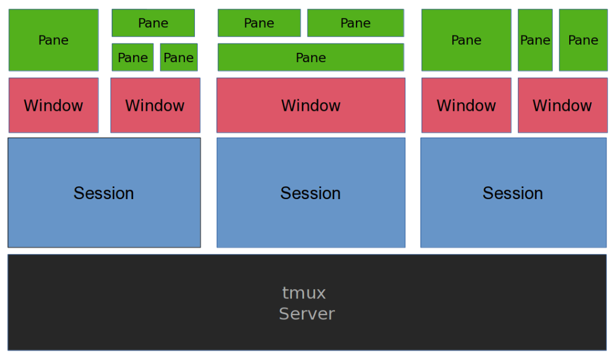

# Tmux (Terminal Multiplexer)

There are 3 important terms in tmux.

1. Session - A session is a collection of windows and panes.
2. Window - A window is a collection of panes.
3. Pane - A pane is a section of the terminal. Pane is actually a terminal where we run commands, scripts etc.



## Sessions

========================================

- To create a new session

```cmd
tmux new -s <session-name>
```

As long as you didn't kill the session or reboot the laptop, you can always attach to it.

- To list all the sessions (it might throw an error if tmux server is not running)

```cmd
tmux ls
```

If you are already in a tmux session, you can list all the sessions using

```cmd
<Prefix Key> then s
```

- To attach to a session

```cmd
tmux attach -t <session-name>
```

If you have a single session, you can attach to it using

```cmd
tmux attach
```

- To detach from a session

```cmd
<Prefix Key> then d
```

- To kill a session

```cmd
tmux kill-session -t <session-name>
```

## Windows

===========================================

- To create a new window

```cmd
<Prefix Key> then c
```

- To list all the windows

```cmd
<Prefix Key> then w
```

- To switch to a window

```cmd
<Prefix Key> then <window-number>
```

- To switch to the previous window

```cmd
<Prefix Key> then p
```

- To switch to the next window

```cmd
<Prefix Key> then n
```

- To rename a window

```cmd
<Prefix Key> then ,
```

It will prompt you to enter the new name for the current window.

- To kill a window

```cmd
<Prefix Key> then &
```

It will ask for a confirmation to kill the window.

## Panes

================================

- To split the current pane horizontally

```cmd
<Prefix Key> then %
```

- To split the current pane vertically

```cmd
<Prefix Key> then "
```

- To switch to the next pane

```cmd
<Prefix Key> then o
```

- To switch to the pane above the current pane

```cmd
<Prefix Key> then Up Arrow
```

- To switch to the pane below the current pane

```cmd
<Prefix Key> then Down Arrow
```

- To switch to the pane on the left of the current pane

```cmd
<Prefix Key> then Left Arrow
```

- To switch to the pane on the right of the current pane

```cmd
<Prefix Key> then Right Arrow
```

- To show number on pane

```cmd
<Prefix Key> then q
```

It will show the number on each pane, then you can switch to the pane by pressing the number.

- To jump on a pane

```cmd
<Prefix Key> then q then <index of pane>
```

- Move Panes Left/Right

```cmd
<Prefix Key> then {/}
```

- To make a pane full screen

```cmd
<Prefix Key> then z
```

Press same command to toggle back

## Command Mode

========================================

- To bring command mode of tmux

```cmd
<Prefix Key> then :
```

- To see all the key bindings

```cmd
<Prefix Key> then : then list-keys
```

- To see all the commands

```cmd
<Prefix Key> then : then list-commands
```

## Copy and Paste

=======================================

- Enter into cope mode

```cmd
<Prefix Key> then [
# To start the selection
Press Space
# Copy Selection
Press Enter
```

- Paste the copied text

```cmd
<Prefix Key> then ]
```
