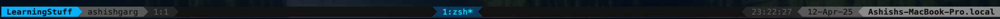

# Tmux (Terminal Multiplexer)

## Overview

tmux is a terminal multiplexer that allows you to run multiple terminal sessions within a single window. It's particularly valuable for:

✨ **Key Benefits**:

- Persistent sessions that survive SSH disconnections
- Multiple terminal sessions in one window
- Split-screen terminal layouts
- Easy session management and switching

## Core Concepts

tmux is built around three main components:

1. **Session**
   - Collection of windows and panes
   - Persists across disconnections
   - Can run multiple sessions simultaneously

2. **Window**
   - Like tabs in a browser
   - Contains one or more panes
   - Easy to switch between windows

3. **Pane**
   - Individual terminal instances
   - Split views within a window
   - Run different commands in each pane

See below diagram for better understanding.


## Session Management

### Creating Sessions

```bash
# Create a new named session
tmux new -s <session-name>
```

### Listing Sessions

```bash
# From outside tmux
tmux ls

# From inside tmux
<Prefix Key> s
```

### Session Operations

| Action | Command |
|--------|---------|
| Attach to session | `tmux attach -t <session-name>` |
| Quick attach (single session) | `tmux attach` |
| Detach current session | `<Prefix Key> d` |
| Kill a session | `tmux kill-session -t <session-name>` |

## Window Management

### Window Operations

| Action | Command |
|--------|---------|
| Create new window | `<Prefix Key> c` |
| List windows | `<Prefix Key> w` |
| Switch to window | `<Prefix Key> <window-number>` |
| Previous window | `<Prefix Key> p` |
| Next window | `<Prefix Key> n` |
| Rename window | `<Prefix Key> ,` |
| Kill window | `<Prefix Key> &` |

## Pane Management

### Basic Pane Operations

| Action | Command |
|--------|---------|
| Split horizontally | `<Prefix Key> %` |
| Split vertically | `<Prefix Key> "` |
| Next pane | `<Prefix Key> o` |
| Toggle full screen | `<Prefix Key> z` |

### Pane Navigation

| Direction | Command |
|-----------|---------|
| Up | `<Prefix Key> ↑` |
| Down | `<Prefix Key> ↓` |
| Left | `<Prefix Key> ←` |
| Right | `<Prefix Key> →` |

### Advanced Pane Features

- Show pane numbers: `<Prefix Key> q`
- Jump to pane: `<Prefix Key> q <index>`
- Move pane: `<Prefix Key> {/}`

## Command Mode & Copy Mode

### Command Mode

Access command mode with `<Prefix Key> :`

Useful commands:

- `list-keys`: Show all key bindings
- `list-commands`: Show all available commands

### Copy Mode

| Action | Command |
|--------|---------|
| Enter copy mode | `<Prefix Key> [` |
| Start selection | `Space` |
| Copy selection | `Enter` |
| Paste | `<Prefix Key> ]` |

## Configuration & Status Bar

### Custom Configuration

My complete tmux configuration is available in my [dotfiles repository](https://github.com/imagarg01/imagarg01/tree/main/dotfiles).

### Status Bar

The status bar provides valuable information about your tmux session:



For example, `1:zsh*` indicates that `zsh` is running in window 1.
