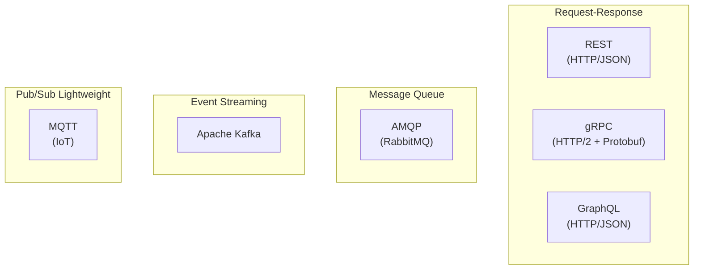
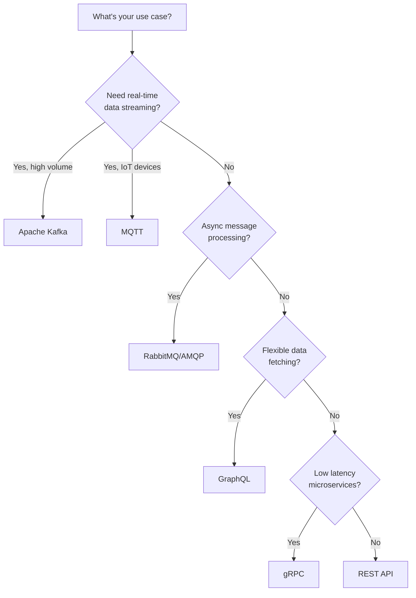
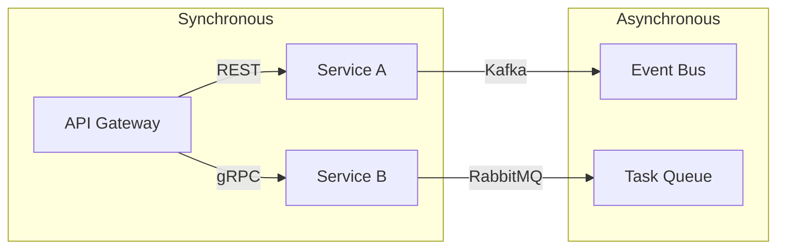
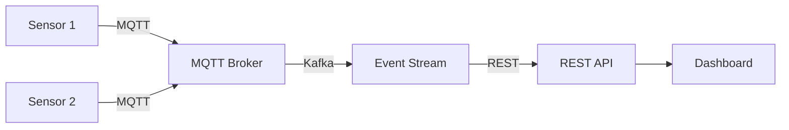

# Network Protocols Overview

A comprehensive comparison of modern communication protocols for distributed systems.

---

## Protocol Categories



---

## Protocol Comparison

| Feature | REST | gRPC | GraphQL | AMQP | Kafka | MQTT |
|---------|------|------|---------|------|-------|------|
| **Pattern** | Request-Response | Request-Response | Request-Response | Message Queue | Event Stream | Pub/Sub |
| **Transport** | HTTP/1.1, HTTP/2 | HTTP/2 | HTTP | TCP | TCP | TCP |
| **Data Format** | JSON, XML | Protobuf | JSON | Binary | Binary | Binary |
| **Schema** | OpenAPI (optional) | .proto (required) | SDL (required) | Optional | Avro/JSON | Payload agnostic |
| **Streaming** | Limited | Yes (bidirectional) | Subscriptions | N/A | Yes (high throughput) | Yes |
| **Browser Support** | Native | gRPC-Web | Native | No | No | WebSocket |
| **Latency** | Medium | Low | Medium | Low | Very Low | Very Low |
| **Throughput** | Medium | High | Medium | High | Very High | Medium |
| **Complexity** | Low | Medium | Medium | Medium | High | Low |

---

## When to Use What



---

## Detailed Comparison

### REST (Representational State Transfer)

**Best for:** Public APIs, web applications, simple CRUD operations

```
Client ──HTTP GET /users/123──> Server
       <──200 OK + JSON────────
```

**Pros:**

- Universal browser support
- Simple to understand
- Cacheable
- Large ecosystem

**Cons:**

- Over-fetching/under-fetching
- Multiple round trips
- No built-in streaming

---

### gRPC (Google Remote Procedure Call)

**Best for:** Microservices, low-latency internal APIs, polyglot systems

```
Client ──HTTP/2 + Protobuf──> Server
       <──Binary Response─────
```

**Pros:**

- Very fast (binary serialization)
- Strong typing with .proto
- Bidirectional streaming
- Code generation

**Cons:**

- No native browser support
- Harder to debug
- Learning curve

---

### GraphQL

**Best for:** Applications with complex data requirements, mobile apps

```
Client ──POST /graphql──> Server
         { query: "{ user(id: 123) { name email } }" }
       <──Exact data requested──
```

**Pros:**

- Fetch exactly what you need
- Single endpoint
- Strong typing
- Real-time subscriptions

**Cons:**

- Complexity for simple cases
- Caching challenges
- N+1 query problem

---

### AMQP (RabbitMQ)

**Best for:** Task queues, decoupled services, reliable messaging

```
Producer ──Message──> Exchange ──Route──> Queue ──> Consumer
```

**Pros:**

- Guaranteed delivery
- Flexible routing
- Message acknowledgment
- Dead letter queues

**Cons:**

- Broker is SPOF
- Not for high throughput
- Operational complexity

---

### Apache Kafka

**Best for:** Event sourcing, log aggregation, high-throughput streaming

```
Producer ──Event──> Topic (Partitions) ──> Consumer Group
```

**Pros:**

- Extremely high throughput
- Durable message storage
- Replay capability
- Horizontal scaling

**Cons:**

- Complex to operate
- High resource usage
- Overkill for simple use cases

---

### MQTT

**Best for:** IoT devices, mobile apps, constrained networks

```
Publisher ──Message──> Broker ──Topic──> Subscribers
```

**Pros:**

- Extremely lightweight
- Low bandwidth
- QoS levels
- Last Will and Testament

**Cons:**

- Limited message size
- No built-in security
- Limited routing

---

## Performance Characteristics

### Latency (Lower is Better)

```
gRPC      ████░░░░░░░░░░░░░░░░ ~1-5ms
MQTT      █████░░░░░░░░░░░░░░░ ~5-10ms
Kafka     ██████░░░░░░░░░░░░░░ ~5-15ms
AMQP      ████████░░░░░░░░░░░░ ~10-30ms
REST      ██████████░░░░░░░░░░ ~20-50ms
GraphQL   ███████████░░░░░░░░░ ~30-60ms
```

### Throughput (Higher is Better)

```
Kafka     ████████████████████ 1M+ msg/s
gRPC      ████████████████░░░░ 100K+ req/s
MQTT      ████████████░░░░░░░░ 50K+ msg/s
AMQP      ██████████░░░░░░░░░░ 20K+ msg/s
REST      ████████░░░░░░░░░░░░ 10K+ req/s
GraphQL   ██████░░░░░░░░░░░░░░ 5K+ req/s
```

---

## Architecture Patterns

### Microservices Communication



### IoT Architecture



---

## Decision Matrix

| Scenario | Recommended |
|----------|-------------|
| Public API for web/mobile | REST |
| Internal microservices | gRPC |
| Complex data requirements | GraphQL |
| Task queue / work distribution | RabbitMQ |
| Event sourcing / streaming | Kafka |
| IoT / constrained devices | MQTT |
| Real-time web updates | GraphQL Subscriptions or WebSocket |
| Batch processing | Kafka |
| Request-response with streaming | gRPC |

---

## Next Steps

1. **[REST API](01_rest_api.md)** - HTTP-based web services
2. **[gRPC](02_grpc.md)** - High-performance RPC
3. **[GraphQL](03_graphql.md)** - Flexible data queries
4. **[AMQP/RabbitMQ](04_amqp_rabbitmq.md)** - Message queuing
5. **[Apache Kafka](05_kafka.md)** - Event streaming
6. **[MQTT](06_mqtt.md)** - IoT messaging
