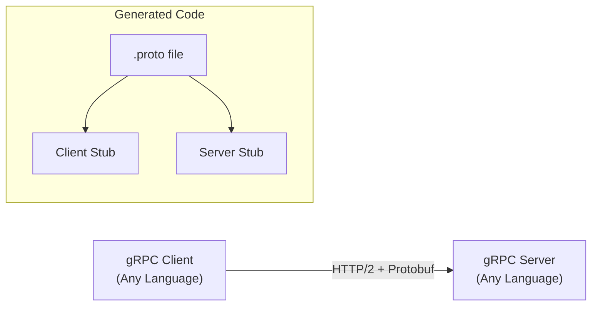
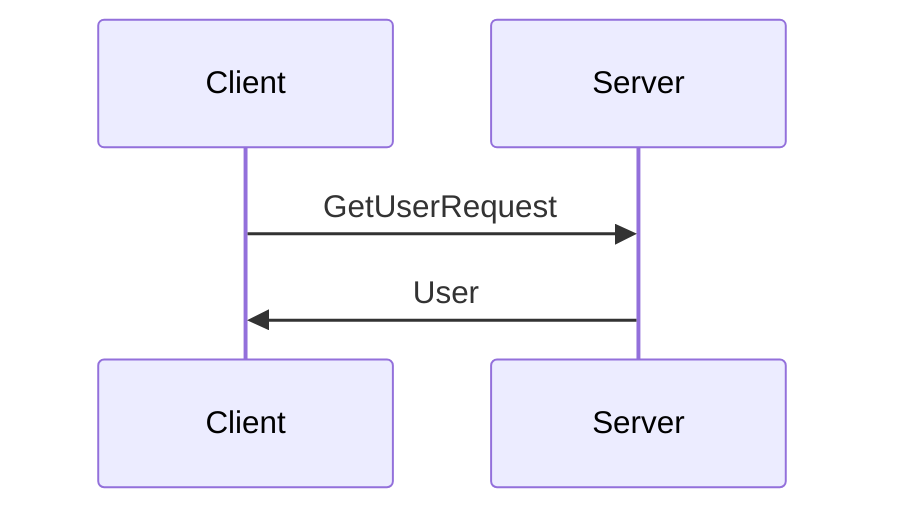
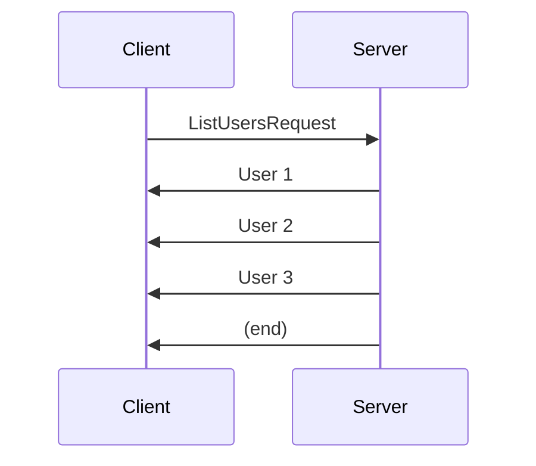
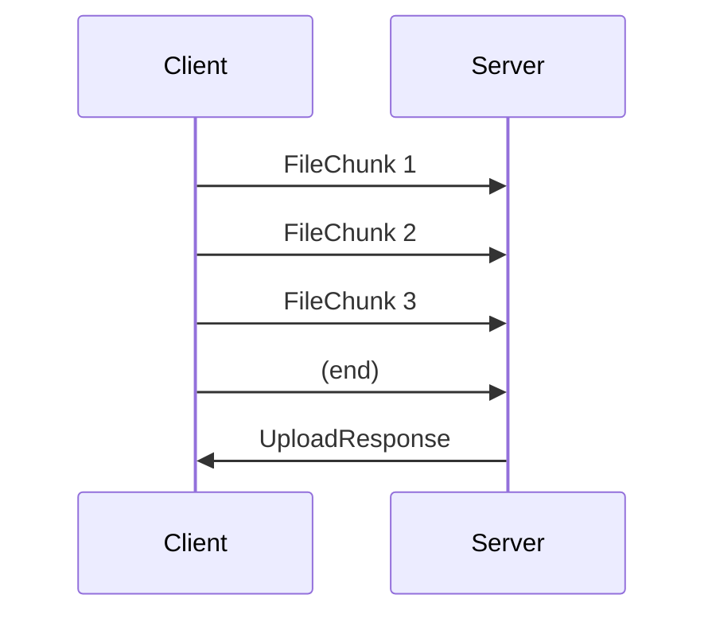
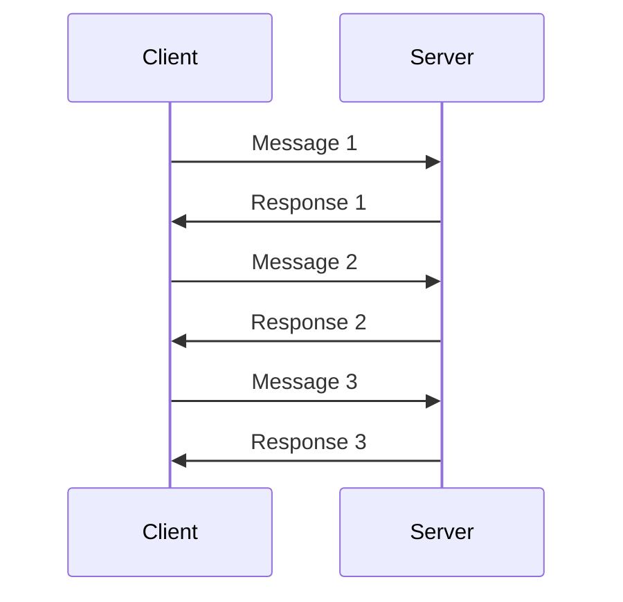
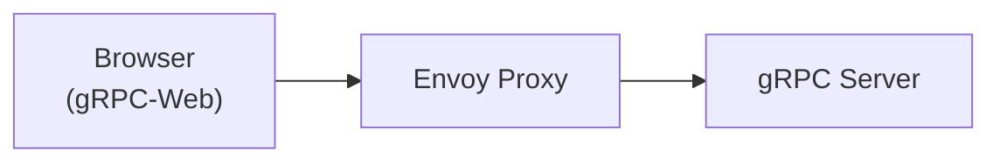

# gRPC

High-performance, cross-platform RPC framework using Protocol Buffers.

---

## What is gRPC?



gRPC = **g**oogle **R**emote **P**rocedure **C**all

---

## Why gRPC?

| Feature | REST | gRPC |
|---------|------|------|
| **Protocol** | HTTP/1.1 (usually) | HTTP/2 |
| **Payload** | JSON (text) | Protobuf (binary) |
| **Streaming** | Limited | Bidirectional |
| **Code Gen** | Optional | Built-in |
| **Type Safety** | Runtime | Compile-time |
| **Performance** | Baseline | 2-10x faster |

---

## Protocol Buffers (Protobuf)

### Basic .proto File

```protobuf
syntax = "proto3";

package user;

option go_package = "github.com/myorg/user";

// Service definition
service UserService {
  rpc GetUser(GetUserRequest) returns (User);
  rpc CreateUser(CreateUserRequest) returns (User);
  rpc ListUsers(ListUsersRequest) returns (stream User);
  rpc Chat(stream ChatMessage) returns (stream ChatMessage);
}

// Messages
message User {
  int64 id = 1;
  string name = 2;
  string email = 3;
  UserStatus status = 4;
  repeated string roles = 5;
  optional string phone = 6;
  map<string, string> metadata = 7;
  google.protobuf.Timestamp created_at = 8;
}

message GetUserRequest {
  int64 id = 1;
}

message CreateUserRequest {
  string name = 1;
  string email = 2;
}

message ListUsersRequest {
  int32 page_size = 1;
  string page_token = 2;
}

message ChatMessage {
  string user_id = 1;
  string content = 2;
}

enum UserStatus {
  USER_STATUS_UNSPECIFIED = 0;
  USER_STATUS_ACTIVE = 1;
  USER_STATUS_INACTIVE = 2;
}
```

### Scalar Types

| Proto Type | Python | Go | Java | Default |
|------------|--------|----|----- |---------|
| `double` | float | float64 | double | 0 |
| `float` | float | float32 | float | 0 |
| `int32` | int | int32 | int | 0 |
| `int64` | int | int64 | long | 0 |
| `bool` | bool | bool | boolean | false |
| `string` | str | string | String | "" |
| `bytes` | bytes | []byte | ByteString | empty |

---

## RPC Types

### 1. Unary RPC

Single request, single response.

```protobuf
rpc GetUser(GetUserRequest) returns (User);
```



### 2. Server Streaming

Single request, stream of responses.

```protobuf
rpc ListUsers(ListUsersRequest) returns (stream User);
```



### 3. Client Streaming

Stream of requests, single response.

```protobuf
rpc UploadFile(stream FileChunk) returns (UploadResponse);
```



### 4. Bidirectional Streaming

Stream of requests and responses.

```protobuf
rpc Chat(stream ChatMessage) returns (stream ChatMessage);
```



---

## Python Implementation

### Generate Code

```bash
# Install tools
pip install grpcio grpcio-tools

# Generate Python code from .proto
python -m grpc_tools.protoc \
    -I./protos \
    --python_out=./generated \
    --grpc_python_out=./generated \
    protos/user.proto
```

### Server

```python
import grpc
from concurrent import futures
import user_pb2
import user_pb2_grpc

class UserService(user_pb2_grpc.UserServiceServicer):
    def __init__(self):
        self.users = {}
    
    def GetUser(self, request, context):
        user_id = request.id
        if user_id not in self.users:
            context.set_code(grpc.StatusCode.NOT_FOUND)
            context.set_details(f"User {user_id} not found")
            return user_pb2.User()
        return self.users[user_id]
    
    def CreateUser(self, request, context):
        user_id = len(self.users) + 1
        user = user_pb2.User(
            id=user_id,
            name=request.name,
            email=request.email,
            status=user_pb2.USER_STATUS_ACTIVE
        )
        self.users[user_id] = user
        return user
    
    def ListUsers(self, request, context):
        # Server streaming
        for user in self.users.values():
            yield user
    
    def Chat(self, request_iterator, context):
        # Bidirectional streaming
        for message in request_iterator:
            response = user_pb2.ChatMessage(
                user_id="server",
                content=f"Echo: {message.content}"
            )
            yield response

def serve():
    server = grpc.server(futures.ThreadPoolExecutor(max_workers=10))
    user_pb2_grpc.add_UserServiceServicer_to_server(UserService(), server)
    server.add_insecure_port('[::]:50051')
    server.start()
    print("Server started on port 50051")
    server.wait_for_termination()

if __name__ == '__main__':
    serve()
```

### Client

```python
import grpc
import user_pb2
import user_pb2_grpc

def run():
    with grpc.insecure_channel('localhost:50051') as channel:
        stub = user_pb2_grpc.UserServiceStub(channel)
        
        # Unary call
        user = stub.CreateUser(user_pb2.CreateUserRequest(
            name="John Doe",
            email="john@example.com"
        ))
        print(f"Created user: {user.id}")
        
        # Server streaming
        print("Listing users:")
        for user in stub.ListUsers(user_pb2.ListUsersRequest()):
            print(f"  - {user.name}")
        
        # Bidirectional streaming
        def generate_messages():
            messages = ["Hello", "How are you?", "Goodbye"]
            for msg in messages:
                yield user_pb2.ChatMessage(user_id="client", content=msg)
        
        responses = stub.Chat(generate_messages())
        for response in responses:
            print(f"Server: {response.content}")

if __name__ == '__main__':
    run()
```

---

## Error Handling

### Status Codes

| Code | Name | Use Case |
|------|------|----------|
| 0 | OK | Success |
| 1 | CANCELLED | Client cancelled |
| 2 | UNKNOWN | Unknown error |
| 3 | INVALID_ARGUMENT | Bad input |
| 4 | DEADLINE_EXCEEDED | Timeout |
| 5 | NOT_FOUND | Resource missing |
| 6 | ALREADY_EXISTS | Duplicate |
| 7 | PERMISSION_DENIED | No permission |
| 8 | RESOURCE_EXHAUSTED | Quota exceeded |
| 13 | INTERNAL | Server error |
| 14 | UNAVAILABLE | Service down |
| 16 | UNAUTHENTICATED | Not authenticated |

### Python Error Handling

```python
# Server side
def GetUser(self, request, context):
    if not self.validate(request):
        context.abort(
            grpc.StatusCode.INVALID_ARGUMENT,
            "Invalid user ID"
        )
    # ...

# Client side
try:
    user = stub.GetUser(request)
except grpc.RpcError as e:
    if e.code() == grpc.StatusCode.NOT_FOUND:
        print("User not found")
    elif e.code() == grpc.StatusCode.DEADLINE_EXCEEDED:
        print("Request timed out")
    else:
        print(f"Error: {e.details()}")
```

---

## Deadlines & Timeouts

```python
# Set deadline (absolute time)
from datetime import datetime, timedelta

deadline = datetime.now() + timedelta(seconds=5)
response = stub.GetUser(request, timeout=5)  # 5 seconds

# Check remaining time on server
def GetUser(self, request, context):
    remaining = context.time_remaining()
    if remaining < 1:
        context.abort(grpc.StatusCode.DEADLINE_EXCEEDED, "Not enough time")
```

---

## Metadata (Headers)

```python
# Client: Send metadata
metadata = [('authorization', 'Bearer token123')]
response = stub.GetUser(request, metadata=metadata)

# Server: Read metadata
def GetUser(self, request, context):
    metadata = dict(context.invocation_metadata())
    token = metadata.get('authorization')
```

---

## Interceptors (Middleware)

### Client Interceptor

```python
class LoggingInterceptor(grpc.UnaryUnaryClientInterceptor):
    def intercept_unary_unary(self, continuation, client_call_details, request):
        print(f"Calling: {client_call_details.method}")
        start = time.time()
        response = continuation(client_call_details, request)
        print(f"Completed in {time.time() - start:.2f}s")
        return response

# Use interceptor
channel = grpc.insecure_channel('localhost:50051')
channel = grpc.intercept_channel(channel, LoggingInterceptor())
```

### Server Interceptor

```python
class AuthInterceptor(grpc.ServerInterceptor):
    def intercept_service(self, continuation, handler_call_details):
        metadata = dict(handler_call_details.invocation_metadata)
        if 'authorization' not in metadata:
            return grpc.unary_unary_rpc_method_handler(
                lambda req, ctx: ctx.abort(grpc.StatusCode.UNAUTHENTICATED, "No token")
            )
        return continuation(handler_call_details)

server = grpc.server(
    futures.ThreadPoolExecutor(),
    interceptors=[AuthInterceptor()]
)
```

---

## Load Balancing

```python
# Client-side load balancing
import grpc

channel = grpc.insecure_channel(
    'dns:///my-service.example.com:50051',
    options=[
        ('grpc.lb_policy_name', 'round_robin'),
    ]
)
```

---

## Health Checking

```protobuf
// health.proto
syntax = "proto3";

package grpc.health.v1;

service Health {
  rpc Check(HealthCheckRequest) returns (HealthCheckResponse);
  rpc Watch(HealthCheckRequest) returns (stream HealthCheckResponse);
}

message HealthCheckRequest {
  string service = 1;
}

message HealthCheckResponse {
  enum ServingStatus {
    UNKNOWN = 0;
    SERVING = 1;
    NOT_SERVING = 2;
  }
  ServingStatus status = 1;
}
```

```python
from grpc_health.v1 import health, health_pb2, health_pb2_grpc

# Add health service
health_servicer = health.HealthServicer()
health_pb2_grpc.add_HealthServicer_to_server(health_servicer, server)
health_servicer.set("UserService", health_pb2.HealthCheckResponse.SERVING)
```

---

## gRPC-Web (Browser Support)



```javascript
// JavaScript client
import { UserServiceClient } from './generated/user_grpc_web_pb';

const client = new UserServiceClient('http://localhost:8080');

const request = new GetUserRequest();
request.setId(123);

client.getUser(request, {}, (err, response) => {
  console.log(response.getName());
});
```

---

## Best Practices

1. **Use deadlines** - Always set timeouts
2. **Handle errors** - Check status codes
3. **Use streaming wisely** - For large data or real-time
4. **Version your protos** - Never break backwards compat
5. **Use field numbers carefully** - Never reuse deleted ones
6. **Enable reflection** - For debugging
7. **Implement health checks** - For load balancers

---

## Next Steps

- **[GraphQL](03_graphql.md)** - Flexible data queries
