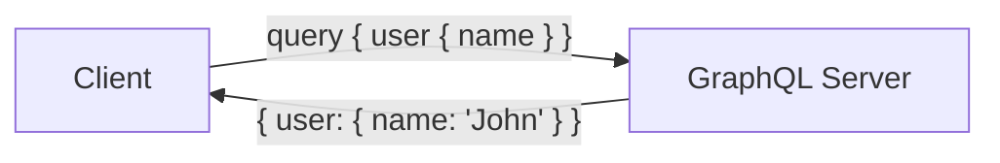

# GraphQL

Query language for APIs - fetch exactly what you need.

---

## What is GraphQL?



GraphQL lets clients request exactly the data they need - no more, no less.

---

## GraphQL vs REST

```
REST: Multiple endpoints, fixed responses
────────────────────────────────────────────
GET /users/123           → Full user object
GET /users/123/posts     → All posts
GET /users/123/friends   → All friends

GraphQL: Single endpoint, flexible responses
────────────────────────────────────────────
POST /graphql
{
  user(id: 123) {
    name
    posts(first: 5) { title }
    friends { name }
  }
}
```

---

## Schema Definition Language (SDL)

### Types

```graphql
# Scalar types
type User {
  id: ID!                    # Non-nullable unique ID
  name: String!              # Non-nullable string
  email: String              # Nullable string
  age: Int                   # Integer
  rating: Float              # Floating point
  isActive: Boolean!         # Boolean
}

# Object types
type Post {
  id: ID!
  title: String!
  content: String!
  author: User!              # Relationship
  comments: [Comment!]!      # List of non-null items
  createdAt: DateTime!       # Custom scalar
}

type Comment {
  id: ID!
  text: String!
  author: User!
}

# Enum
enum PostStatus {
  DRAFT
  PUBLISHED
  ARCHIVED
}

# Input types (for mutations)
input CreatePostInput {
  title: String!
  content: String!
}

# Interface
interface Node {
  id: ID!
}

type User implements Node {
  id: ID!
  name: String!
}

# Union
union SearchResult = User | Post | Comment
```

### Root Types

```graphql
type Query {
  # Read operations
  user(id: ID!): User
  users(first: Int, after: String): UserConnection!
  post(id: ID!): Post
  search(query: String!): [SearchResult!]!
}

type Mutation {
  # Write operations
  createUser(input: CreateUserInput!): User!
  updateUser(id: ID!, input: UpdateUserInput!): User!
  deleteUser(id: ID!): Boolean!
  createPost(input: CreatePostInput!): Post!
}

type Subscription {
  # Real-time updates
  postCreated: Post!
  userStatusChanged(userId: ID!): User!
}
```

---

## Queries

### Basic Query

```graphql
query GetUser {
  user(id: "123") {
    id
    name
    email
  }
}
```

Response:

```json
{
  "data": {
    "user": {
      "id": "123",
      "name": "John Doe",
      "email": "john@example.com"
    }
  }
}
```

### Nested Query

```graphql
query GetUserWithPosts {
  user(id: "123") {
    name
    posts {
      title
      comments {
        text
        author {
          name
        }
      }
    }
  }
}
```

### Variables

```graphql
query GetUser($userId: ID!) {
  user(id: $userId) {
    name
    email
  }
}
```

Variables:

```json
{
  "userId": "123"
}
```

### Aliases

```graphql
query GetTwoUsers {
  john: user(id: "123") {
    name
  }
  jane: user(id: "456") {
    name
  }
}
```

### Fragments

```graphql
fragment UserFields on User {
  id
  name
  email
}

query GetUsers {
  user1: user(id: "123") {
    ...UserFields
  }
  user2: user(id: "456") {
    ...UserFields
  }
}
```

### Directives

```graphql
query GetUser($includeEmail: Boolean!) {
  user(id: "123") {
    name
    email @include(if: $includeEmail)
    phone @skip(if: true)
  }
}
```

---

## Mutations

```graphql
mutation CreateUser($input: CreateUserInput!) {
  createUser(input: $input) {
    id
    name
    email
  }
}
```

Variables:

```json
{
  "input": {
    "name": "Jane Doe",
    "email": "jane@example.com"
  }
}
```

---

## Subscriptions

```graphql
subscription OnPostCreated {
  postCreated {
    id
    title
    author {
      name
    }
  }
}
```

---

## Python Implementation

### Using Strawberry

```python
import strawberry
from typing import List, Optional

# Types
@strawberry.type
class User:
    id: strawberry.ID
    name: str
    email: str

@strawberry.type
class Post:
    id: strawberry.ID
    title: str
    content: str
    author: User

# Input types
@strawberry.input
class CreateUserInput:
    name: str
    email: str

# Resolvers
users_db = {}
posts_db = {}

@strawberry.type
class Query:
    @strawberry.field
    def user(self, id: strawberry.ID) -> Optional[User]:
        return users_db.get(id)
    
    @strawberry.field
    def users(self) -> List[User]:
        return list(users_db.values())
    
    @strawberry.field
    def post(self, id: strawberry.ID) -> Optional[Post]:
        return posts_db.get(id)

@strawberry.type
class Mutation:
    @strawberry.mutation
    def create_user(self, input: CreateUserInput) -> User:
        user_id = str(len(users_db) + 1)
        user = User(id=user_id, name=input.name, email=input.email)
        users_db[user_id] = user
        return user

# Schema
schema = strawberry.Schema(query=Query, mutation=Mutation)

# FastAPI integration
from fastapi import FastAPI
from strawberry.fastapi import GraphQLRouter

app = FastAPI()
graphql_app = GraphQLRouter(schema)
app.include_router(graphql_app, prefix="/graphql")
```

### Running

```bash
pip install strawberry-graphql[fastapi] uvicorn
uvicorn main:app --reload

# Access GraphiQL at http://localhost:8000/graphql
```

---

## N+1 Problem

### The Problem

```graphql
query GetPosts {
  posts {        # 1 query
    title
    author {     # N queries (one per post)
      name
    }
  }
}
```

### Solution: DataLoader

```python
from strawberry.dataloader import DataLoader

async def load_users(user_ids: List[str]) -> List[User]:
    # Single batch query
    return await db.get_users_by_ids(user_ids)

user_loader = DataLoader(load_fn=load_users)

@strawberry.type
class Post:
    id: strawberry.ID
    title: str
    author_id: strawberry.Private[str]
    
    @strawberry.field
    async def author(self) -> User:
        return await user_loader.load(self.author_id)
```

---

## Pagination

### Offset Pagination

```graphql
type Query {
  posts(offset: Int, limit: Int): [Post!]!
}

query {
  posts(offset: 20, limit: 10) {
    title
  }
}
```

### Cursor Pagination (Relay-style)

```graphql
type Query {
  posts(first: Int, after: String, last: Int, before: String): PostConnection!
}

type PostConnection {
  edges: [PostEdge!]!
  pageInfo: PageInfo!
}

type PostEdge {
  cursor: String!
  node: Post!
}

type PageInfo {
  hasNextPage: Boolean!
  hasPreviousPage: Boolean!
  startCursor: String
  endCursor: String
}
```

```graphql
query {
  posts(first: 10, after: "cursor123") {
    edges {
      cursor
      node {
        title
      }
    }
    pageInfo {
      hasNextPage
      endCursor
    }
  }
}
```

---

## Authentication

```python
from strawberry.types import Info

@strawberry.type
class Query:
    @strawberry.field
    def me(self, info: Info) -> User:
        # Get user from context
        user = info.context.get("user")
        if not user:
            raise Exception("Not authenticated")
        return user

# In FastAPI
@app.middleware("http")
async def auth_middleware(request, call_next):
    token = request.headers.get("Authorization")
    user = verify_token(token)
    request.state.user = user
    return await call_next(request)

async def get_context(request):
    return {"user": request.state.user}

graphql_app = GraphQLRouter(schema, context_getter=get_context)
```

---

## Error Handling

```python
@strawberry.type
class Mutation:
    @strawberry.mutation
    def create_user(self, input: CreateUserInput) -> User:
        if not validate_email(input.email):
            raise ValueError("Invalid email format")
        # ...
```

Response:

```json
{
  "data": null,
  "errors": [
    {
      "message": "Invalid email format",
      "locations": [{"line": 2, "column": 3}],
      "path": ["createUser"]
    }
  ]
}
```

---

## Introspection

```graphql
# Get all types
query {
  __schema {
    types {
      name
      kind
    }
  }
}

# Get type details
query {
  __type(name: "User") {
    name
    fields {
      name
      type {
        name
      }
    }
  }
}
```

---

## Best Practices

### Do's ✓

1. **Use meaningful names** - `createUser`, not `addUser`
2. **Use input types** for mutations
3. **Implement pagination** for lists
4. **Use DataLoader** to avoid N+1
5. **Version with @deprecated**
6. **Document with descriptions**

### Don'ts ✗

1. **Don't expose internal IDs** - Use opaque IDs
2. **Don't return too much data** - Set depth limits
3. **Don't skip authentication** - Check on every resolver
4. **Don't allow unlimited queries** - Set complexity limits

---

## Performance

### Query Complexity Limits

```python
from strawberry.extensions import QueryDepthLimiter

schema = strawberry.Schema(
    query=Query,
    extensions=[
        QueryDepthLimiter(max_depth=10),
    ]
)
```

### Persisted Queries

```python
# Store approved queries by hash
ALLOWED_QUERIES = {
    "abc123": "query GetUser($id: ID!) { user(id: $id) { name } }"
}

# Client sends hash instead of full query
POST /graphql
{
  "extensions": {
    "persistedQuery": {
      "sha256Hash": "abc123"
    }
  },
  "variables": {"id": "123"}
}
```

---

## Next Steps

- **[AMQP/RabbitMQ](04_amqp_rabbitmq.md)** - Message queuing
