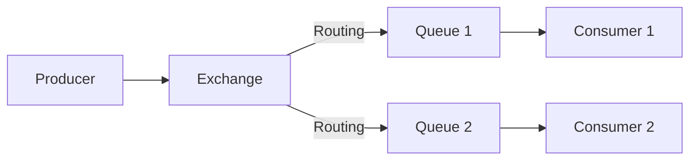
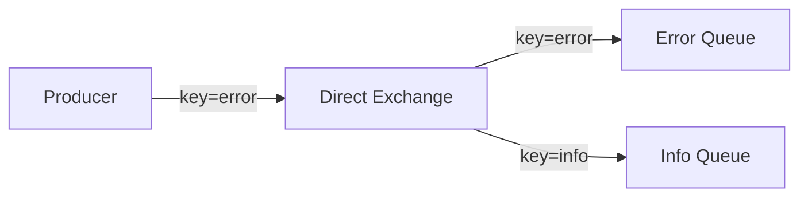
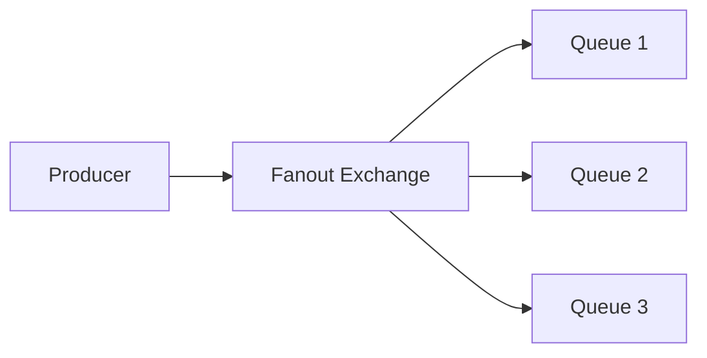
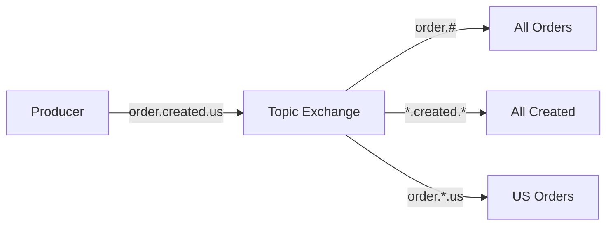
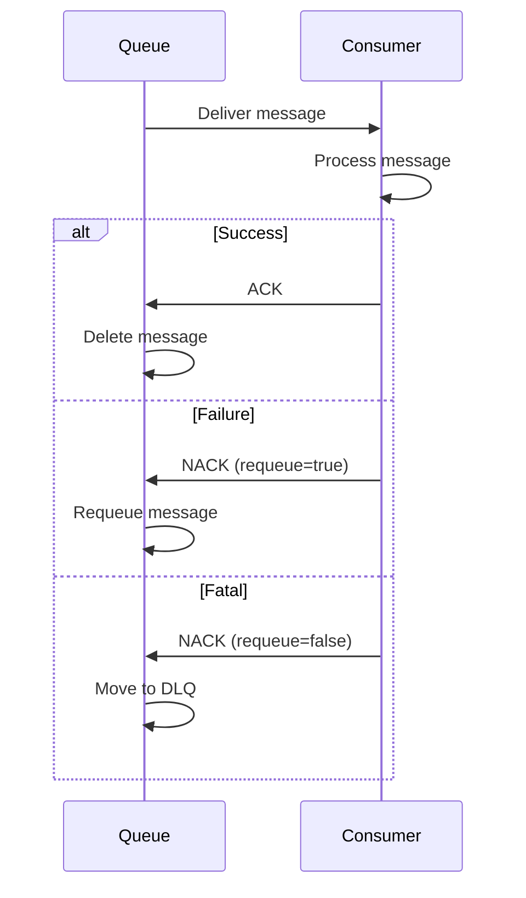
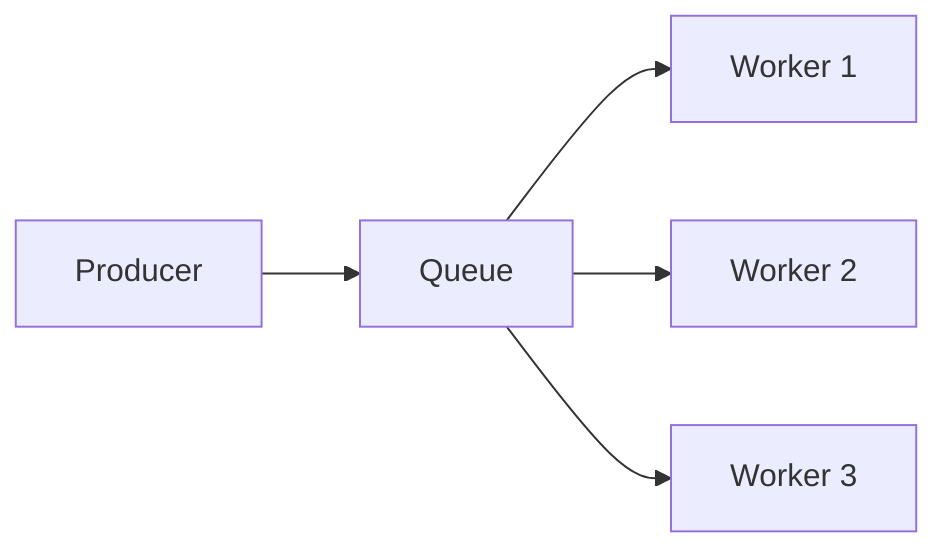

# AMQP & RabbitMQ

Advanced Message Queuing Protocol for reliable enterprise messaging.

---

## What is AMQP?



AMQP is a wire-level protocol for message-oriented middleware. RabbitMQ is the most popular AMQP broker.

---

## Core Concepts

| Concept | Description |
|---------|-------------|
| **Producer** | Sends messages to exchanges |
| **Consumer** | Receives messages from queues |
| **Exchange** | Routes messages to queues |
| **Queue** | Stores messages |
| **Binding** | Links exchange to queue |
| **Routing Key** | Message address |
| **Virtual Host** | Namespace isolation |

---

## Exchange Types

### 1. Direct Exchange

Routes to queue with matching routing key.



```python
# Declare direct exchange
channel.exchange_declare(exchange='logs', exchange_type='direct')

# Bind queue with routing key
channel.queue_bind(exchange='logs', queue='error_logs', routing_key='error')

# Publish with routing key
channel.basic_publish(
    exchange='logs',
    routing_key='error',
    body='Error message'
)
```

### 2. Fanout Exchange

Broadcasts to all bound queues (ignores routing key).



```python
channel.exchange_declare(exchange='notifications', exchange_type='fanout')

# Routing key ignored for fanout
channel.basic_publish(
    exchange='notifications',
    routing_key='',
    body='Broadcast message'
)
```

### 3. Topic Exchange

Routes based on routing key patterns.



**Wildcards:**

- `*` matches exactly one word
- `#` matches zero or more words

```python
channel.exchange_declare(exchange='orders', exchange_type='topic')

# Bind with patterns
channel.queue_bind(exchange='orders', queue='all_orders', routing_key='order.#')
channel.queue_bind(exchange='orders', queue='us_orders', routing_key='order.*.us')

# Publish
channel.basic_publish(
    exchange='orders',
    routing_key='order.created.us',
    body='New US order'
)
```

### 4. Headers Exchange

Routes based on message headers.

```python
channel.exchange_declare(exchange='reports', exchange_type='headers')

# Bind with headers
channel.queue_bind(
    exchange='reports',
    queue='pdf_reports',
    arguments={'x-match': 'all', 'format': 'pdf', 'type': 'report'}
)

# Publish with headers
properties = pika.BasicProperties(
    headers={'format': 'pdf', 'type': 'report'}
)
channel.basic_publish(
    exchange='reports',
    routing_key='',
    body='PDF report',
    properties=properties
)
```

---

## Python Implementation

### Setup

```bash
# Install RabbitMQ (Docker)
docker run -d --name rabbitmq -p 5672:5672 -p 15672:15672 rabbitmq:3-management

# Install pika
pip install pika
```

### Producer

```python
import pika
import json

def publish_message(message: dict, routing_key: str):
    # Connect
    connection = pika.BlockingConnection(
        pika.ConnectionParameters(
            host='localhost',
            credentials=pika.PlainCredentials('guest', 'guest')
        )
    )
    channel = connection.channel()
    
    # Declare exchange (idempotent)
    channel.exchange_declare(
        exchange='orders',
        exchange_type='topic',
        durable=True
    )
    
    # Publish message
    channel.basic_publish(
        exchange='orders',
        routing_key=routing_key,
        body=json.dumps(message),
        properties=pika.BasicProperties(
            delivery_mode=2,  # Persistent
            content_type='application/json'
        )
    )
    
    print(f"Sent: {message}")
    connection.close()

# Usage
publish_message(
    {'order_id': 123, 'total': 99.99},
    'order.created.us'
)
```

### Consumer

```python
import pika
import json

def callback(ch, method, properties, body):
    message = json.loads(body)
    print(f"Received: {message}")
    
    try:
        process_order(message)
        ch.basic_ack(delivery_tag=method.delivery_tag)
    except Exception as e:
        print(f"Error: {e}")
        ch.basic_nack(delivery_tag=method.delivery_tag, requeue=False)

def consume():
    connection = pika.BlockingConnection(
        pika.ConnectionParameters('localhost')
    )
    channel = connection.channel()
    
    # Declare queue
    channel.queue_declare(queue='order_processor', durable=True)
    
    # Bind to exchange
    channel.queue_bind(
        exchange='orders',
        queue='order_processor',
        routing_key='order.created.*'
    )
    
    # Set prefetch (process one at a time)
    channel.basic_qos(prefetch_count=1)
    
    # Start consuming
    channel.basic_consume(
        queue='order_processor',
        on_message_callback=callback,
        auto_ack=False  # Manual acknowledgment
    )
    
    print("Waiting for messages...")
    channel.start_consuming()

if __name__ == '__main__':
    consume()
```

---

## Message Acknowledgment



```python
# Manual acknowledgment
def callback(ch, method, properties, body):
    try:
        process(body)
        ch.basic_ack(delivery_tag=method.delivery_tag)
    except RecoverableError:
        ch.basic_nack(delivery_tag=method.delivery_tag, requeue=True)
    except FatalError:
        ch.basic_nack(delivery_tag=method.delivery_tag, requeue=False)
```

---

## Dead Letter Queue (DLQ)

Handle failed messages.

```python
# Declare DLQ
channel.queue_declare(queue='orders_dlq', durable=True)

# Main queue with DLQ
channel.queue_declare(
    queue='orders',
    durable=True,
    arguments={
        'x-dead-letter-exchange': '',
        'x-dead-letter-routing-key': 'orders_dlq',
        'x-message-ttl': 60000  # Optional: 60 second TTL
    }
)
```

---

## Message TTL and Expiration

```python
# Queue-level TTL
channel.queue_declare(
    queue='temp_queue',
    arguments={'x-message-ttl': 60000}  # 60 seconds
)

# Per-message TTL
channel.basic_publish(
    exchange='',
    routing_key='temp_queue',
    body='Temporary message',
    properties=pika.BasicProperties(expiration='60000')
)
```

---

## Pub/Sub Pattern

```python
# Publisher
channel.exchange_declare(exchange='events', exchange_type='fanout')
channel.basic_publish(exchange='events', routing_key='', body='Event!')

# Subscriber (each gets own queue)
result = channel.queue_declare(queue='', exclusive=True)
queue_name = result.method.queue
channel.queue_bind(exchange='events', queue=queue_name)
channel.basic_consume(queue=queue_name, on_message_callback=callback, auto_ack=True)
```

---

## Work Queue Pattern



```python
# Workers with fair dispatch
channel.basic_qos(prefetch_count=1)

# Each message goes to one worker (round-robin)
channel.basic_consume(queue='tasks', on_message_callback=callback)
```

---

## Request-Reply Pattern

```python
import uuid

class RpcClient:
    def __init__(self):
        self.connection = pika.BlockingConnection(...)
        self.channel = self.connection.channel()
        
        # Callback queue
        result = self.channel.queue_declare(queue='', exclusive=True)
        self.callback_queue = result.method.queue
        
        self.channel.basic_consume(
            queue=self.callback_queue,
            on_message_callback=self.on_response,
            auto_ack=True
        )
        
        self.response = None
        self.corr_id = None
    
    def on_response(self, ch, method, props, body):
        if self.corr_id == props.correlation_id:
            self.response = body
    
    def call(self, message):
        self.response = None
        self.corr_id = str(uuid.uuid4())
        
        self.channel.basic_publish(
            exchange='',
            routing_key='rpc_queue',
            properties=pika.BasicProperties(
                reply_to=self.callback_queue,
                correlation_id=self.corr_id,
            ),
            body=message
        )
        
        while self.response is None:
            self.connection.process_data_events()
        
        return self.response
```

---

## High Availability

### Quorum Queues

```python
channel.queue_declare(
    queue='ha_queue',
    durable=True,
    arguments={'x-queue-type': 'quorum'}
)
```

### Cluster Setup

```bash
# Docker Compose for cluster
docker-compose up -d
# Nodes: rabbit1, rabbit2, rabbit3
```

---

## Best Practices

1. **Use durable queues** for important messages
2. **Enable persistence** (delivery_mode=2)
3. **Set prefetch_count** for fair dispatch
4. **Use DLQ** for failed messages
5. **Acknowledge manually** for reliability
6. **Use connection pooling** in production
7. **Monitor queue depth**

---

## Next Steps

- **[Apache Kafka](05_kafka.md)** - High-throughput event streaming
